# SPEAR3 RF System — Legacy System Architecture

**Document ID**: Doc L  
**Version**: 2.7  
**Date**: April 9, 2026  
**Status**: DRAFT  
**Location**: Designs/L_LEGACY_SYSTEM_ARCHITECTURE.md  
**Author**: Faya Wang, with AI-assisted analysis  
**Tier**: 2 — Legacy System and Operational Reference

---

## Revision History

| Version | Date | Description |
|---------|------|-------------|
| 2.7 | 2026-04-10 | Added Part IV introductory overview paragraph — summarizes the five-actor multi-layer protection architecture (Fast IC <1 μs, RF MPS PLC ~10 ms, SLC-500 HVPS PLC ~10–20 ms, SNL state machine ~1 s, PPS dual-chain) and adds cross-reference to `Designs/I_INTERLOCK_ARCHITECTURE.md` [Doc I] for full signal flow diagrams, per-actor input/output tables, fault timeline examples, compliance analysis, and fault data access procedures. |
| 2.6 | 2026-04-10 | Added §13.6 — complete dual-PPS-chain interaction and roles: Chain 1 (HV vacuum contactor, fail-safe open) vs Chain 2 (Ross grounding switch, fail-safe closed/grounded), operational shutdown/restore sequences, fail-safe direction analysis, and compliance comparison table (Chain 1 has hardware PPS series fail-safe at OX8 relay input; Chain 2 does not). Added note on Ross switch spring-return as partial Chain 2 fail-safe. Added §18.5 — Fault Data Availability and Analysis: four data sources (EPICS Channel Archiver, SNL `/dat/FAULT*_N` files, AIM hardware history buffer, B118 four-channel oscilloscope), storage locations, access procedures, key PVs, brief fault categorization guide. Cross-reference added to `I_INTERLOCK_ARCHITECTURE.md` §10 for detailed step-by-step analysis procedure. |
| 2.5 | 2026-04-09 | §2.1 top-level block diagram completely redrawn: replaced flat/incorrect node layout with accurate two-column architecture showing AB DH+ bus as a shared serial link (VXI slot-1 AB6008 master) connecting three nodes — SLC-500 (HVPS, B118), ControlLogix 1756 MPS (B132), and Stepper Chassis 340-315 (B132); added full tuner chain (1746-HSTP1 → SS2000MD4 translators → SLO-SYN motors → tuner plungers) with Aug 2025 Galil note; added Fast Interlock Chassis I/O detail (fiber-optic arc sensors, SCR ENABLE/CROWBAR outputs to B514); added SLC-500 PPS relay chain (K4/MX/RR → Ross HQ3 contactor; Ross grounding switch); added RF signal path (RFP → Drive Amp → Klystron → Circulator → Magic-Tees → 4 cavities) with IQA measurement taps and arc sensor fiber paths; added new §2.1.1 Major Block Descriptions table with description for each of 13 blocks |
| 2.4 | 2026-04-07 | Cross-checked against Dusatko SP3_writeup_V1d2 (SPEAR 3 LLRF System Description v1.2): corrected LO frequency (471.1 MHz -> 471.187 MHz = RF x 92/93); corrected IF frequency (5.215 MHz -> 5.122 MHz = RF/93); corrected Figure 5-1 caption LO value; corrected RFP section IF value; corrected §5.5 AIM fault-file channel names (Cf2I/Cf2Q -> CmbI/CmbQ, correct order); added 6 AIM control signal names and RF_FAULT backplane description; added IQA ripple-link description; corrected ripple loop status (active in SPEAR3 for amplitude/phase regulation; HVPS ripple removal feature not implemented); added new §5.8 CLK module section with VXI crate ASCII layout, system timing parameters table (SPEAR3 vs PEP-II), CLK I/O block diagram, architecture block diagram, PLL details, and SPEAR3 adaptation table |
| 2.3 | 2026-04-07 | Deep cross-check against source documents: corrected fault file channel names (Cf2I/Cf2Q -> CmbI/CmbQ — SPEAR3 uses #else branch of #ifdef CF2; Iqa3Amp is last channel, not 9th); corrected IQA-2/3 slot descriptions (all 4 cavities via channel-select mux, not "cavities A & B"); corrected drive amplifier text (removed inconsistent input power figures, both §6.2 and Figure 6-3); confirmed VXI slots, HVPS parameters, SNL program line counts, state machine states, and Enerpro board model/serial numbers against source code and technical notes |
| 2.2 | 2026-04-07 | Removed all photo placeholders; corrected “warm spare” language (SPEAR1/SPEAR2 swap roles during scheduled downtime — both fully operational); fixed blank-line formatting between all image tags and captions; final accuracy review of all 35 figure captions |
| 2.1 | 2026-04-07 | Added 5 new photographs: HVPS annotated circuit schematic (Figure 9-A), HVPS2 main oil tank exterior (Figure 9-3), HVPS2 B514 outdoor view (Figure 9-4), HVPS2 oil tank top-view documentation (Figure 9-5), Cavity Tuner Motor Driver front panel (Figure 17-2); fixed Figure 9-2 filename (HVPS1→HVPS2, off-duty unit photographed 2026); fixed Figure 3-2 file extension (.png→.jpg); updated Populated Figures list |
| 2.0 | 2026-03-24 | Major revision: adopted Doc P numbered reference system [Rn]; added internet research citations (SLAC publications, PEP-II conference papers, OSTI records); restructured all inline Source/See-also blocks into numbered references; added Appendix B (Source Document Reference Index) with 5 categories; added Appendix C (Symbol and Notation Conventions); fixed TOC anchor formatting |
| 1.0 | 2026-03-24 | Initial draft, assembled from exhaustive review of all original source documents and AI-generated technical notes |

---

## Table of Contents

#### Part I — System Overview

1. [Introduction and Purpose](#1-introduction-and-purpose)
2. [System Architecture Overview](#2-system-architecture-overview)
3. [Physical Layout and Locations](#3-physical-layout-and-locations)
4. [Key System Parameters](#4-key-system-parameters)

#### Part II — RF Signal Chain

5. [LLRF Controller (VXI System)](#5-llrf-controller-vxi-system)
2. [Klystron and Drive System](#6-klystron-and-drive-system)
3. [Waveguide Distribution Network](#7-waveguide-distribution-network)
4. [RF Cavities and Tuner Assemblies](#8-rf-cavities-and-tuner-assemblies)

#### Part III — Power Systems

9. [High-Voltage Power Supply — Power Section](#9-high-voltage-power-supply--power-section)
2. [HVPS Control System — Hoffman Box (B118)](#10-hvps-control-system--hoffman-box-b118)
3. [Enerpro SCR Firing System](#11-enerpro-scr-firing-system)
4. [Arc Protection and Crowbar System](#12-arc-protection-and-crowbar-system)

#### Part IV — Protection and Safety Systems

13. [Personnel Protection System (PPS) Interface](#13-personnel-protection-system-pps-interface)
2. [RF Machine Protection System (MPS)](#14-rf-machine-protection-system-mps)
3. [Interlock Architecture and Signal Chain](#15-interlock-architecture-and-signal-chain)

#### Part V — Control Software and Instrumentation

16. [EPICS IOC and SNL Software Architecture](#16-epics-ioc-and-snl-software-architecture)
2. [Tuner Control System](#17-tuner-control-system)
3. [Diagnostics, Calibration and Monitoring](#18-diagnostics-calibration-and-monitoring)

#### Part VI — Integration and Legacy Considerations

19. [Cabling and Interconnections](#19-cabling-and-interconnections)
2. [Known Issues, Limitations and Legacy Debt](#20-known-issues-limitations-and-legacy-debt)

#### Appendices

- [Appendix A — Source Document Reference Index](#appendix-a--source-document-reference-index)
- [Appendix B — Symbol and Notation Conventions](#appendix-b--symbol-and-notation-conventions)

---

## Document Scope and Provenance

### Purpose

This document is the **Tier 2 legacy system reference** for the SPEAR3 RF system. It describes the complete RF system **as currently installed and operating** — the "legacy" configuration prior to the LLRF Upgrade Project. It covers every major subsystem from design concepts through real-world implementation: physical hardware, control electronics, software, protection systems, cabling, calibration data, and known limitations.

Doc L serves three critical functions:

1. **Upgrade baseline** — Provides the complete "as-built" reference against which upgrade designs (U1–U10) are specified
2. **Knowledge preservation** — Captures institutional knowledge about a system designed in 1997 (PEP-II era) before key personnel retire and obsolete hardware is removed
3. **Operational reference** — Consolidates scattered documentation into a single navigable resource

### Provenance Statement

All technical content in this document is derived from **original source documents** as defined in the Documentation Architecture Proposal (v6.0, §2.1). These include:

- Original engineering schematics, wiring diagrams, and drawings (PDFs from SLAC/PEP-II project)
- Human-authored design notes and operational procedures (docx files by J. Sebek, R. Cassel, et al.)
- Measurement and calibration data (xlsx files from actual hardware)
- The complete legacy source code (2,293 files in `spear-rf-code-legacy/`)
- Published SLAC technical papers and conference proceedings
- Vendor documentation (Enerpro, Galil, Superior Electric, Ross Engineering)

Where AI-generated technical notes from the repository have been consulted during preparation, they are cited parenthetically as *"preliminary analysis (AI-generated, see [filename], unreviewed)"* per the provenance rules in the Documentation Architecture Proposal §2.4.

External references obtained through web research are cited with full bibliographic information in Appendix A.

### Relationship to Other Documents

| Document | Relationship |
|----------|-------------|
| Doc 0 (System Design Report) | Doc 0 describes the *upgrade* architecture. Doc L describes the *legacy* system that Doc 0's upgrade replaces |
| Doc I (Legacy Interlock Architecture) | Doc I is the Tier 2 interlock deep-dive companion to Doc L. Where Doc L (§13–§15) summarizes the protection subsystems, Doc I provides the complete signal flow diagrams, per-actor input/output tables, PPS compliance analysis, fault timeline examples, and step-by-step fault data access procedures. |
| Doc P (RF Physics and Plant) | Doc P covers physics and control theory independent of hardware. Doc L covers the specific hardware implementation |
| Doc D (Operational Data Catalog) | Doc D will contain measured data and calibrations. Doc L explains the system that produced that data |
| U1–U10 (Upgrade Documents) | Each U-document references the relevant Doc L sections for the legacy baseline of its subsystem |

### What This Document Contains

- Physical hardware descriptions with part numbers, serial numbers, and specifications
- Control system architecture and PLC configurations
- Software architecture for 6 SNL programs (7,112 lines total)
- Protection and safety system signal chains
- Complete cabling and interconnection references
- Known issues and legacy debt catalog

### What This Document Does NOT Contain

- RF physics or control theory derivations (see Doc P)
- Upgrade design specifications (see U1–U10)
- Measured calibration data tables (see Doc D)
- Source code listings (see `spear-rf-code-legacy/`)
- Detailed interlock signal analysis, fault timeline examples, and fault data access procedures (see Doc I)

### Reference Tag Format

- **[Rn]** — Numbered references to original source documents, published papers, and repository files
- **[Rnt]** — Transcription of the corresponding [Rn] source
- **[Wn]** — External web references with URLs

All references are cataloged in [Appendix A](#appendix-a--source-document-reference-index).

## Figures

All figures are from the SPEAR3 RF system photograph set (`spear3RF_overview_2003_images/`) assembled during the 2003 commissioning period and the 2025-2026 documentation campaign.

**Complete figure inventory (35 figures, v2.2):**

| Figure | Subject | Section |
|--------|---------|--------|
| 1-1 | Legacy System Architecture | §1 |
| 2-1 | LLRF control electronics, Room 101, B132 | §2 |
| 3-1 | Building B514 — HVPS substation exterior | §3 |
| 3-2 | HVPS grounding/termination tank near B132 | §3 |
| 3-3 | RF cavities in tunnel — inward view | §3 |
| 3-4 | Building B132 (klystron + LLRF control) exterior | §3 |
| 5-1 | VXI crate (VxWorks IOC), B132 | §5 |
| 5-2 | Rear of LLRF VXI crate — fiber optic and coax cabling | §5 |
| 6-1 | Marconi klystron, B132 | §6 |
| 6-2 | Klystron filament control chassis | §6 |
| 6-3 | RF drive amplifier (KAW2051M12), B132 rack | §6 |
| 7-1 | AFT circulator in waveguide distribution | §7 |
| 7-2 | Magic-tee and bellows network on tunnel roof | §7 |
| 7-3 | Waveguide network from klystron to cavities | §7 |
| 7-4 | Water-cooled waveguide load | §7 |
| 7-5 | HCW cooling station behind booster | §7 |
| 8-1 | PEP-II bare RF cavity prior to assembly | §8 |
| 8-2 | RF cavity assembly — assembled view | §8 |
| 8-3 | RF cavity assembly with component labels | §8 |
| 8-4 | Movable tuner plunger assembly below cavity | §8 |
| 8-5 | HOM load at E-plane mitre bend | §8 |
| 8-6 | HOM load at H-plane mitre bend | §8 |
| 8-7 | Water-cooled HOM load plate | §8 |
| 8-8 | Four RF cavities in tunnel — outward view (tunner side) | §8 |
| 9-A | PEP-II Klystron HVPS — annotated circuit schematic | §9 |
| 9-1 | HVPS cable switch tank at B514 | §9 |
| 9-2 | SCR thyristor stacks inside HVPS2 phase tank | §9 |
| 9-3 | HVPS2 main oil tank exterior, B514 | §9 |
| 9-4 | HVPS2 installation — B514 outdoor view | §9 |
| 9-5 | HVPS2 oil tank top-view, stack assembly tank maintanence during April down 2026  | §9 |
| 10-1 | HVPS Hoffman Box SPEAR1 — closed front view | §10 |
| 10-2 | HVPS Hoffman Box SPEAR1 — interior view | §10 |
| 10-3 | HVPS Hoffman Box SPEAR2 — closed front view | §10 |
| 15-1 | Fast Interlock Chassis 340-308, B132 | §15 |
| 17-1 | Cavity Tuner Motor Driver — chassis interior (AB modules) | §17 |
| 17-2 | Cavity Tuner Motor Driver — front panel | §17 |

---

# PART I — SYSTEM OVERVIEW

---

## 1. Introduction and Purpose

### 1.1 PEP-II Heritage

The SPEAR3 RF system is a direct adaptation of a PEP-II B-Factory High Energy Ring (HER) RF station. PEP-II was an asymmetric electron-positron collider at SLAC that operated from 1999 to 2008 with up to 10 RF stations. When SPEAR was upgraded to SPEAR3 (a 3rd-generation synchrotron light source) in 2003, a complete PEP-II HER station — klystron, four RF cavities, HVPS, waveguide distribution, and LLRF electronics — was installed as the SPEAR3 RF system [R1] [R2] [R3].

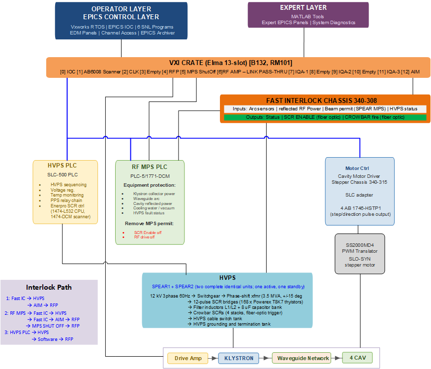

*Figure 1-1: LLRF control architeture*

---

## 2. System Architecture Overview

### 2.1 Top-Level System Block Diagram

The legacy SPEAR3 RF system consists of the following major elements:

```
 SPEAR3 RF STATION — LEGACY SYSTEM ARCHITECTURE
 (pre-LLRF upgrade  ·  Buildings: B132=klystron/ctrl · B118=HVPS ctrl · B514=HVPS power)

                  ┌────────────────────────────────────────────────────────┐
                  │              EPICS CONTROL LAYER  [B132]               │
                  │  VxWorks RTOS · EPICS IOC · 6 SNL programs             │
                  │  EDM operator panels  ·  Channel Access  ·  Archiver   │
                  └──────────────────────────┬─────────────────────────────┘
                                             │ VXIbus P2 backplane
  ┌──────────────────────────────────────────┴────────────────────────────────────────┐
  │                      VXI CRATE  (Elma 13-slot)  [B132, rm 101]                    │
  │  [0]IOC  [1]AB6008  [2]CLK  [4]RFP  [5]MPSShtf  [6]LinkPassthru                   │
  │  [7]IQA-1  ···  [9]IQA-2  ···  [11]IQA-3  ···  [12]AIM                            │
  └───┬───────────────────────────────────────────────────────────────────────────────┘
      │
  ════╪════════════ AB Data Highway+ (DH+) serial link ═══════════════════════════════
      │     VXI slot 1: AB6008 scanner (DH+ master) · ~1 Hz · 8×16-bit words/node
      │     Single bus connecting VXI to all three external PLC-type nodes
      ├──────────────────────────────┬────────────────────────────────────────────┐
      │                              │                                            │
 ┌────┴──────────────┐  ┌────────────┴──────────────────────┐  ┌──────────────────┴──────────────┐
 │  SLC-500 PLC      │  │  ControlLogix 1771-DCM            │  │  STEPPER CHASSIS 340-315        │
 │  [B118]           │  │  RF MPS  [B132]                   │  │  [B132]                         │
 │                   │  │                                   │  │  SLC adapter +                  │
 │  HVPS sequencing  │  │                                   │  │  4× AB 1746-HSTP1               │
 │  Voltage reg.     │  │  Equipment protection:            │  │  (step/direction pulse output)  │
 │  Temp monitoring  │  │  · klystron collector power       │  └──────────────────┬──────────────┘
 │  PPS relay chain  │  │  · waveguide arc detection        │                     │ step/dir pulses
 │  Enerpro SCR ctrl │  │  · cavity reflected power         │                     ▼
 │  (1747-L532 CPU   │  │  · cooling water / vacuum         │  ┌─────────────────────────────────┐
 │   1747-DCM scan.) │  │  · HVPS fault status              │  │  SS2000MD4 PWM TRANSLATORS × 4  │
 └──────┬────────────┘  │  Removes MPS permit →             │  │  [B132]                         │
        │               │   SCR ENABLE off + RF drive off   │  │  step/dir → bipolar motor I     │
        │               └──────────────┬────────────────────┘  └──────────────────┬──────────────┘
        │                              │ hardwired I/O                            │ motor cables
        │                              │ (permits/interlocks)                     │ (to tunnel)
        │                              ▼                                          │
        │           ┌──────────────────────────────────────┐                      │
        │           │  FAST INTERLOCK CHASSIS 340-308      │                      │
        │           │  [B132]                              │                      │
        │           │  Inputs:                             │                      │
        │           │   · arc sensors (fiber in, tunnel)   │                      │
        │           │   · reflected power RF detectors     │                      │
        │           │   · beam permit (SPEAR MPS)          │                      │
        │           │   · HVPS status (fiber in, B514)     │                      │
        │           │  ──────────────────────────────────  │                      │
        │           │  Status ────────────────────────────────► VXI AIM (slot 12) │
        │           │  SCR ENABLE (fiber optic) ──────────────► B514  (<1 μs)     │
        │           │  CROWBAR fire (fiber optic) ─────────────► B514  (<1 μs)    │
        │           └──────────────────────────────────────┘                      │
        │                                                                         │
        │  PPS relay chain (via PLC ladder):                                      ▼  (tunnel)
        │   Slot5-OX8 → K4/MX/RR relays → Ross HQ3 Vacuum Contactor (12.47 kV, B514)
        │   Slot2-IO8 → Ross Grounding Switch (Termination Tank, B132)
        │
        │  SCR ENABLE / CROWBAR / STATUS  (fiber optic → B514, ≤1 μs supervisory path)
        ▼
 ┌───────────────────────────────────────────────────────────────────────────────────┐
 │                            HVPS POWER SECTION  [B514]                             │
 │  SPEAR1 + SPEAR2  (two complete identical units; one active, one standby;         │
 │  roles exchanged during scheduled downtime to equalize run-time)                  │
 │                                                                                   │
 │  12.47 kV 3φ 60 Hz  →  Switchgear  →  Phase-shift xfmr T0 (3.5 MVA, ±15°)         │
 │                      →  12-pulse SCR bridges (168 × Powerex T8K7 thyristors)      │
 │                      →  Filter inductors L1/L2 + 8 μF capacitor bank              │
 │                      →  Crowbar SCRs (4 stacks, ≤1 μs, fiber-optic trigger)       │
 │                      →  Cable termination inductors L3/L4  →  −77 kV DC           │
 └──────────────────────────────┬────────────────────────────────────────────────────┘
                                │ −77 kV DC · ~22 A (HV cable via Termination Tank, B132)
 ───────────────────────────────│──────────── RF SIGNAL PATH  [B132] ──────────────────────
                                │
             VXI RFP module     ▼              ~29 W
              (476.3 MHz) ──► DRIVE AMP ──────────────────────► KLYSTRON ◄─── −77 kV (HVPS)
                               KAW2051M12                        [B132]  ◄─── Solenoid PSU
                               [B132]                          476.3 MHz ◄─── Filament (AIM)
                                                               ~800 kW
                                                                   │
 ───────────────────────────────────────────────────────── TUNNEL ─│───────────────────────
                                                                   ▼
                                                           ┌───────────────┐
                                                           │  CIRCULATOR   │──► WG Load (dump)
                                                           └───────┬───────┘
                                                                   │
                                                           ┌───────┴───────┐
                                                           │  MAGIC-TEE 1  │──► WG Load
                                                           └──────┬────────┘
                                                                  │
                                                        ┌─────────┴─────────┐
                                                        │                   │
                                                 ┌──────┴──┐         ┌──────┴──┐
                                                 │ MT-2    │         │ MT-3    │
                                                 └──┬───┬──┘         └──┬───┬──┘
                                                    │   │               │   │
                                                  Cav-A Cav-B         Cav-C Cav-D
                                            (4 PEP-II HOM-damped copper cavities)
                                            (476.3 MHz · ~712 kV gap voltage each)
                                                  │                       │
                                   Probe ────────► IQA-2 (refl.)        Arc sensors (fiber optic)
                                   Probe ────────► IQA-3 (cav.)         ──────────────────────────►
                                   Fwd/Refl ─────► IQA-1 (klystron)      Fast Interlock Chassis
                                                  │
                                          Tuner plunger ◄── SLO-SYN M093-FC11 stepper motor ◄── SS2000MD4 translator ◄── STEPPER CHASSIS (above)
                                                             (one per cavity, lin. pot. feedback)
                                                             
```

> **Note**: The original legacy path — `rf_tuner_loop.st` (SNL) → DH+ → Stepper Chassis 340-315 (1746-HSTP1) → SS2000MD4 translators → SLO-SYN motors — remains the documented legacy architecture. The 1746-HSTP1/SS2000MD4 chain will be placed by a Galil DMC-4143 4-axis Ethernet controller and a customoized chassis for the LLRF upgrade; the SLO-SYN motors and linear potentiometers will be retained.

### 2.1.1 Major Block Descriptions

| Block | Location | Description |
|-------|----------|-------------|
| **EPICS Control Layer** | B132 | VxWorks RTOS on VXI slot-0 PowerPC (350 MHz). Hosts 6 SNL state-machine programs (`rf_states`, `rf_hvps_loop`, `rf_tuner_loop`×4, `rf_dac_loop`, `rf_calib`, `rf_msgs`) plus ~78 EPICS process-variable database files. Provides ~1 Hz supervisory control; all fast feedback is in hardware below this layer. |
| **VXI Crate** (Elma 13-slot) | B132, rm 101 | The master intelligence of the RF station. Slot 1 (AB6008) is the DH+ master linking to all PLCs. Slot 2 (CLK) generates the 471.187 MHz LO and all system clocks. Slot 4 (RFP) implements the analog RF feedback loop. Slots 7/9/11 (IQA×3) measure forward power, reflected power, and cavity probes. Slot 12 (AIM) manages arc detection, fault capture, and direct hardware interlock I/O. |
| **AB Data Highway+ (DH+) serial link** | B132 backbone | Allen-Bradley proprietary serial bus. VXI slot-1 AB6008 scanner is the DH+ master. Three nodes are on the same physical bus: SLC-500 (HVPS, B118), ControlLogix/PLC-5 (RF MPS, B132), and the Stepper Chassis (B132). ~1 Hz update rate; 8×16-bit input and output data words per node. All supervisory setpoints, enables, and readbacks between the VXI IOC and the external PLCs/stepper chassis travel on this link. |
| **SLC-500 PLC** (AB-1747-L532) | B118, Hoffman Box | HVPS controller. Communicates with VXI via DH+ (1747-DCM scanner). Functions: HVPS power-up/down sequencing, analog voltage regulation (D/A → Enerpro SIG HI → SCR firing angle), 8-channel thermocouple monitoring, PPS relay chain (K4/MX/RR relays → Ross HQ3 contactor and Ross Grounding Switch), supervisory fiber-optic SCR ENABLE/CROWBAR outputs to B514. **Note**: legacy PPS compliance issue — both PPS chains pass through PLC ladder logic. |
| **RF MPS AB PLC-5** | B132 | RF Machine Protection System. Allen-Bradley PLC-5/1771-DCM; DH+ node. Monitors klystron collector power (cathode power minus RF output), cavity reflected power, waveguide arc conditions, cooling water flow, klystron vacuum, and HVPS fault conditions. On any trip: removes MPS permit → HVPS SCR ENABLE removed + RF drive inhibited. Hardwired to Fast Interlock Chassis for permit exchange. |
| **Stepper Chassis 340-315** | B132 | SLAC chassis (SN08) with SLC bus adapter and 4× AB 1746-HSTP1 high-speed stepper controller modules. One 1746-HSTP1 per cavity. DH+ node, commanded by `rf_tuner_loop.st` SNL program. Outputs step-pulse and direction signals to the SS2000MD4 translators. *Replaced by Galil DMC-4143 in Aug 2025; chassis retained.* |
| **SS2000MD4 PWM Motor Translators** | B132 | Superior Electric SLO-SYN SS2000MD4-M bipolar PWM step drive translators, one per motor. Convert the step/direction digital pulse train from the 1746-HSTP1 (or Galil) into bipolar phase current to drive the two-phase stepper motor windings. |
| **Fast Interlock Chassis 340-308** | B132 | Hardware interlock hub at sub-microsecond speed. Inputs: arc sensor fiber optics from the 4 cavity waveguide windows, RF power detector signals for reflected-power limits, SPEAR beam permit, orbit interlock, and HVPS status (fiber optic from B514). Outputs: SCR ENABLE removal (fiber → B514, <1 μs) and CROWBAR firing (fiber → B514, <1 μs). Summarized status word is reported to the VXI AIM module (slot 12). The MPS ControlLogix exchanges hardwired I/O permits with this chassis. |
| **HVPS Power Section** (SPEAR1 + SPEAR2) | B514 | Two complete, identical 12-pulse thyristor phase-controlled rectifier units. At any time one is active and one is in standby; units are swapped during scheduled downtime to equalize run-time. Input: 12.47 kV 3-phase AC from substation 507. Conversion chain: phase-shift transformer T0 (3.5 MVA, ±15°) → 12-pulse SCR bridges (168× Powerex T8K7) → LC filter (8 μF) → crowbar (4 SCR stacks, fiber-optic trigger, ≤1 μs) → cable term. inductors L3/L4 → −77 kV DC at ~22 A. |
| **Drive Amplifier KAW2051M12** | B132 | Broadband RF power amplifier. Amplifies the VXI RFP module baseband-modulated RF output to ~29 W (44.6 dBm) at 476.3 MHz, which drives the klystron input waveguide. |
| **Klystron** | B132 | SLAC 476 MHz CW klystron, rated ~1.5 MW. Cathode at −77 kV DC; solenoid focused; non-full-power collector (collector dissipation must be monitored by MPS). Operating point: ~800 kW RF output, ~19.4 A, ~72.1 kV. Filament controlled by VXI AIM module. |
| **Circulator + Waveguide Network** | B132/Tunnel | AFT ferrite circulator routes klystron reflected power to a water-cooled load, protecting the klystron. WR-1800 rectangular waveguide then divides power through a 2-stage magic-tee network: Magic-Tee 1 → Magic-Tees 2 and 3 → each feeds a pair of RF cavities. Three water-cooled waveguide loads absorb difference-port (reflected) power. |
| **RF Cavities × 4** | Tunnel | Four single-cell HOM-damped copper cavities (PEP-II HER design). Each at 476.3 MHz, ~712 kV gap voltage (operating), 3 HOM dampers, ceramic RF window, internal probe, and movable tuner plunger. Arc detection sensors at cavity waveguide windows send fiber-optic fault signals to the Fast Interlock Chassis. |
| **SLO-SYN M093-FC11 Stepper Motors × 4** | Tunnel | Superior Electric NEMA 34D stepper motors. Each drives a movable plunger in its RF cavity; plunger depth shifts the cavity resonant frequency. Linear potentiometer on each assembly provides position feedback. The SNL `rf_tuner_loop.st` program closes a phase-based slow loop: IQA cavity phase reading → compute resonance error → command motor steps. |


*Figure 2-1: LLRF control electronics in Room 101, Building B132 — the primary control location for the SPEAR3 RF station, housing the VXI crate, drive amplifier, and associated electronics racks*

### 2.2 Subsystem Summary

| Subsystem | Location | Primary Hardware | Legacy Control | Function |
|-----------|----------|-----------------|----------------|----------|
| LLRF Controller | B132 | VXI crate (RFP, IQA×3, CLK, AIM) | SNL/EPICS on VxWorks | RF feedback and station control |
| HVPS Power Section | B514 | Transformer, thyristor bridges, crowbar | — (power electronics) | −77 kV DC to klystron cathode |
| HVPS Controller | B118 | SLC-500 PLC, analog regulator, Enerpro boards | PLC ladder logic + SNL | Voltage regulation and sequencing |
| RF MPS | B132 | PLC-5 → ControlLogix 1756 | PLC ladder logic | Equipment protection |
| PPS Interface | B118/Switchgear | Hoffman box, relay chain, Ross switch | Hardwired + PLC | Personnel safety |
| Tuner Motors | Tunnel | SLO-SYN M093-FC11 × 4 | AB 1746-HSTP1 via SNL | Cavity frequency tuning |
| Interlock System | B132 | Fast Interlock Chassis, Local Control Chassis | Analog + PLC | Fault detection and trip chains |
| Klystron + Drive | B132 | SLAC klystron, KAW2051M12 drive amp | VXI (RF output) | RF power amplification |
| Waveguide + Cavities | B132/Tunnel | WR-1800 waveguide, 4 PEP-II cavities | — (passive) | RF power distribution and acceleration |

> **Sources**: [R5] §2.1; [R9]; [R10], [R11]; preliminary analysis (AI-generated, see `hvps/architecture/technical-notes/00-spear3-hvps-legacy-system-design.md`, unreviewed).

---

## 3. Physical Layout and Locations

The SPEAR3 RF station is distributed across multiple buildings at SSRL. Understanding the physical geography is essential for understanding cable runs, signal latency, and maintenance access.

| Location | Equipment | Distance from B132 |
|----------|-----------|-------------------|
| **Building B132** (room 101) | Klystron, drive amplifier, VXI crate (LLRF controller), RF MPS PLC, Fast Interlock Chassis, Local Control Chassis, stepper motor controllers | — (primary location) |
| **Building B118** (Power Supply Room) | HVPS Controller (Hoffman NEMA enclosure), SLC-500 PLC, Enerpro firing boards, analog regulator card, monitoring oscilloscope | ~100 m cable run to B514 |
| **Building B514** (HVPS Substation) | HVPS Main Tank (transformer, rectifier, inductor, filter caps), Phase Tank (12 thyristor stacks), Crowbar Tank (4 thyristor stacks, output voltage divider) | - |
| **Contactor Disconnect Panel** (Switchgear) | Vacuum contactor (Ross HQ3), contactor controller (Ross HCA-1-A), K4/MX/RR/L1 relays, S5 auxiliary contact | B514 |
| **Termination Tank** (B132, rm101) | HV cable termination, Ross Engineering HV grounding switch, Danfysik DC-CT, Pearson CT-110 current transformer | Near klystron |
| **Switch-over Tank** | HV cable connections between SPEAR1/SPEAR2 HVPS and klystron | Adjacent to B514 |
| **SPEAR3 Storage Ring Tunnel** | 4 RF cavities, waveguide distribution network (circulator, magic-tees, waveguide loads), tuner motor assemblies, arc detection sensor mounting points | Radiation area, restricted access |

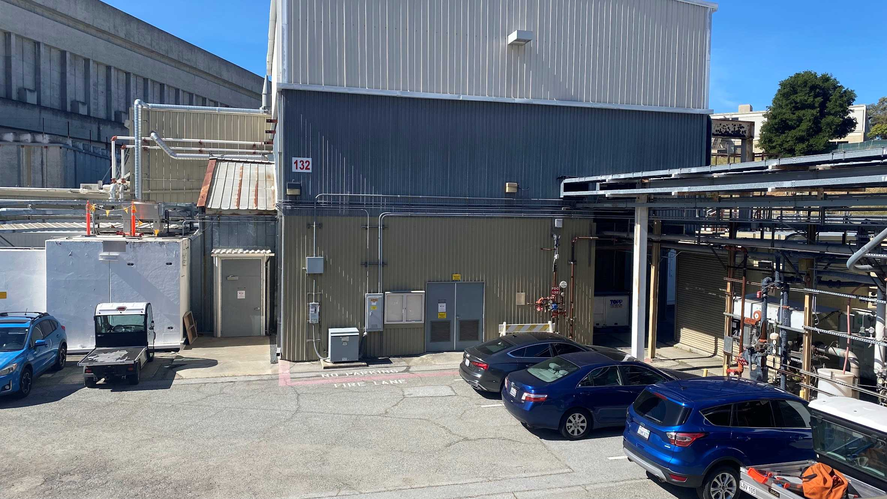

*Figure 3-4: Building B132 — the klystron building housing the LLRF control electronics, drive amplifier, and RF MPS; the "132" building number is visible on the metal-clad corrugated exterior, with utility pipe runs, electrical panels, and the RF area access road in the foreground*

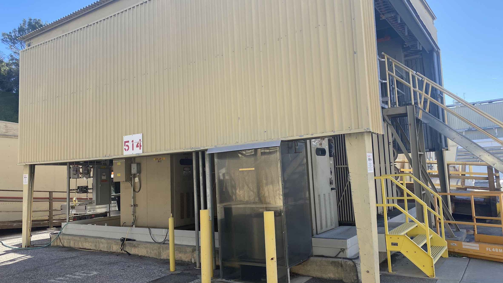

*Figure 3-1: Building B514 — the high-voltage power supply substation housing the main transformer/rectifier tank, phase tank, and crowbar tank*


*Figure 3-2: HVPS grounding and termination tank located near Building B132 — cylindrical stainless/aluminum vessel with two high-voltage cable entries through flexible metallic conduit at the top; contains the Ross Engineering HV grounding switch, Danfysik DC-CT, and Pearson CT-110 current transformer for the klystron cathode −77 kV cable*


*Figure 3-3: RF cavities installed in the SPEAR3 storage ring tunnel (inward view) — showing the waveguide connections and cavity arrangement in the radiation enclosure*

> **Sources**: [R5] §3; [R25]; [R14]; preliminary analysis (see `pps/diagrams/00_SYSTEM_OVERVIEW.md`).

---

## 4. Key System Parameters

### 4.1 RF System Parameters

| Parameter | Value | Notes |
|-----------|-------|-------|
| RF Frequency | 476.315 MHz | Harmonic 372 of revolution frequency |
| Revolution Frequency | 1.2804 MHz | f_rf/h = 476.315 MHz / 372; Circumference = 234.137 m |
| Beam Energy | 3.0 GeV | |
| Design Beam Current | 500 mA | Top-off mode |
| Fill Pattern | 276 bunches in 4 groups + 1 camshaft | |
| Number of Cavities | 4 | Single-cell, HOM-damped copper (PEP-II type) |
| Cavity Shunt Impedance (R_s) | 3.8 MΩ | Per cavity |
| Cavity Unloaded Q (Q_0) | 33,500 | |
| Cavity Loaded Q (Q_L) | 6,700 | β = 4.0 (coupling factor) |
| Gap Voltage per Cavity | ~712 kV | Operating point (design: 800 kV) |
| Total Accelerating Voltage | ~2.85 MV | Sum of 4 cavities |
| Klystron Output Power | ~800 kW | Operating (rated: ~1.5 MW) |
| Drive Power | ~29 W | At klystron input |
| IF Frequency | 5.122 MHz | = RF/93 = 476.3/93; LO = RF × 92/93 = 471.187 MHz; IF = RF − LO (Note: 4.907 MHz is the PEP-II value per Dusatko [R7] Table 1) |
| LO Frequency | 471.187 MHz | Generated by CLK module PLL471 (= RF × 92/93); distributed to IQAs at +14.0 dBm on PKZ front-panel connectors |

### 4.2 HVPS Parameters - Current Operation

| Parameter | Value | Notes |
|-----------|-------|-------|
| Input Power | 12.47 kV RMS, 3-phase, 60 Hz | Substation 507, Breaker 160 |
| Output Voltage (rated) | −90 kV DC max | Negative polarity for klystron cathode |
| Output Voltage (operating) | ~−74.7 kV | At 500 mA beam current |
| Output Current (operating) | ~19.4 A | Measured June 2020 |
| Power (operating) | ~1.4 MW | |
| Topology | 12-pulse thyristor phase-controlled rectifier | Star point controller configuration |
| Voltage Regulation | ±0.5% | At voltages >65 kV |
| Ripple | <1% peak-to-peak, <0.2% RMS | |
| Configuration | 2-unit (SPEAR1 and SPEAR2 — both fully operational, one active at a time; units are swapped during scheduled accelerator downtime) | |

### 4.3 Measured Operating Point (June 2020)

| Parameter | Measured | Calculated | Error |
|-----------|----------|-----------|-------|
| Output Voltage | 72.08 kV | 72.08 kV (input) | — |
| Output Current | 19.4 A | 19.2 A (from perveance) | 1.0% |
| Power | 1.398 MW | 1.384 MW | 1.0% |
| Firing Angle | SIG HI = 4.40 V | α ≈ 36.8° | Consistent |
| Voltage Sense | 7.183 V | 7.19 V (÷10,035) | 0.1% |

---

# PART II — RF SIGNAL CHAIN

---

## 5. LLRF Controller (VXI System)

### 5.1 Overview

The LLRF controller is a VXI-based system located in Building B132 that provides the fast RF feedback, station state management, and measurement functions for the RF station. It was designed for PEP-II by P. Corredoura, S. Allison, R. Sass, R. Tighe, and R. Claus at SLAC (1996–1997).

The VXI crate hosts a Kinetics Systems IOC running VxWorks RTOS, which serves as the primary intelligence for the entire RF system. All communication with external PLCs (HVPS, MPS, stepper motors) passes through the VXI crate via an Allen-Bradley DCM serial communication module.


*Figure 5-1: VXI crate running VxWorks RTOS in Building B132 — slot 0: EPICS IOC host (350 MHz MPC 750 PowerPC, VxWorks); slot 1: AB6008 scanner (DCM serial link); slot 2: CLK/RF distribution (clock and 471.187 MHz LO, requires ≥9 dBm RF input); slot 3: empty (GVF not installed); slot 4: RFP (RF Processor, direct feedback loop); slot 5: MPS Shutoff; slot 6: Link Passthru (also routes ripple-link backplane signal between IQA-1 and RFP); slot 7: IQA-1 (forward/reflected power, ripple-link source); slot 8: empty; slot 9: IQA-2 (cavity reflected); slot 10: empty; slot 11: IQA-3 (cavity probe); slot 12: AIM (arc/interlock)*

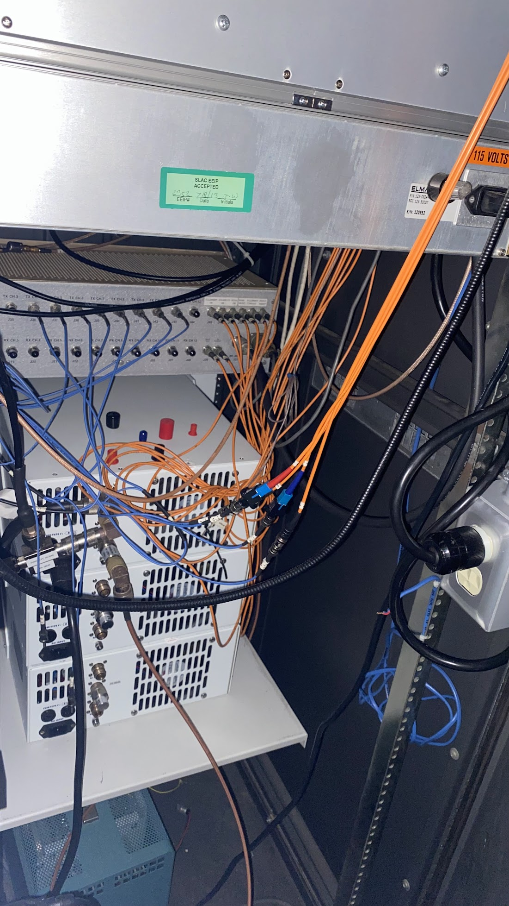
*Figure 5-2: Rear of the LLRF VXI crate (Elma chassis, SLAC EEIP accepted 2019) in Building B132 — showing the dense cable plant of orange fiber optic cables (SCR ENABLE/CROWBAR/STATUS runs to B514), blue coaxial signal cables (IQA measurement inputs), and multi-conductor control wiring interconnecting the VXI modules*

### 5.2 VXI Module Inventory

| Slot | Module | Function | SPEAR3 Status |
|------|--------|----------|---------------|
| 0 | B132-IOCRF (Slot 0 μProcessor) | VXI bus controller, EPICS IOC host (VxWorks RTOS, Kinetics Systems) | **Active** |
| 1 | AB Scanner | Allen-Bradley DCM serial communication module (PLC interface) | **Active** |
| 2 | CLK/RF Distribution | Master clock, LO generation (471.187 MHz = RF × 92/93), RF reference fanout (+14.0 dBm); CLK40/20/10 timing signals; TSYNC synchronization pulse | **Active** |
| 3 | *(empty)* | GVF slot from PEP-II — not installed in SPEAR3 | ⚠️ **Not installed** |
| 4 | RFP (RF Processor) | Central feedback processing — IQ demod, vector sum, direct loop, baseband modulator | **Active** |
| 5 | MPS Shutoff | CF2 slot from PEP-II, repurposed for MPS Shutoff in SPEAR3 | **Active** |
| 6 | Link Passthru | RF amplifier Link passthrough module | **Active** |
| 7 | IQA-1 | Forward power — klystron output forward and reflected power | **Active** |
| 8 | *(empty)* | — | — |
| 9 | IQA-2 | Reflected power — all-cavity reflected power measurement (4 cavities via channel mux) | **Active** |
| 10 | *(empty)* | — | — |
| 11 | IQA-3 | Cavity probe — all-cavity probe signal measurement (4 cavities via channel mux) | **Active** |
| 12 | ARC/Interlock Module (AIM) | Arc detection, interlock management, fault history | **Active** |

> **Authoritative source**: `rfApp/DbIoc/srf1.substitutions,v` (lines 103–104), which instantiates the `crat_vxi_13slot.db` template for the SRF1 station VXI crate (Elma, B132-101-11-24).

> **Sources**: [R7] (RF System Description); [R10], [R11] (block diagrams); [R2] Fig. 1 (VXI crate topology); preliminary analysis (AI-generated, see `llrf/documentation/legacyArchitecture/technical-notes/02_VXI_HARDWARE_MODULE_REFERENCE.md`, unreviewed).

### 5.3 RFP (RF Processor) Module — Heart of the LLRF

The RFP module is the central signal processing module in the VXI crate. It performs:

**Analog Signal Processing**:

- IQ demodulation of 4 cavity probe signals (476 MHz → 5.122 MHz IF → baseband I/Q)
- Vector summing of 4 cavity I/Q signals
- Direct loop error amplifier comparing vector sum against IQ reference
- Lead and integral compensation networks for loop stability
- Baseband modulator (4 × Gilbert-cell multipliers in 2×2 matrix for I→I, I→Q, Q→I, Q→Q correction)
- IQ RF modulator (baseband → 476 MHz upconversion for klystron drive)

**Digital Control Interface**:

- Octal DACs (12-bit, ±2048 counts) for: tune mode IQ setpoints, operate mode IQ offsets, klystron modulator matrix coefficients, ripple loop coefficients
- Mode control: TUNE / OPERATE switching
- RF switch: enable/disable RF output to klystron
- Built-in history buffer (circular buffer, freeze on fault for post-mortem analysis)

**Key PVs** (from `rf_dac_loop_pvs.h`, `rf_states.st`, and `rfp.db`):

```
{STN}:STN:TUNE:IQ.A           — Tune mode IQ setpoint magnitude (counts)
{STN}:STN:TUNE:CTRL           — Tune loop control
{STN}:STNDIRECT:LOOP:PHASE    — Direct loop phase setpoint
{STN}:STNDIRECT:LOOP:COUNTS   — Direct loop amplitude setpoint (counts)
{STN}:STN:RFP:RFENABLE        — RF output enable/disable (from rf_states.st)
{STN}:STN:RFP:RUNMODE         — TUNE/OPERATE mode select (from rfp.db)
{STN}:STN:RFP:MODU.DLE        — Direct loop enable (RFP module register)
```

> **Sources**: [R7]; [R16]; preliminary analysis (AI-generated, see `llrf/documentation/legacyArchitecture/technical-notes/02_VXI_HARDWARE_MODULE_REFERENCE.md` §2.1, unreviewed).

### 5.4 IQA (IQ/Amplitude Detector) Modules

Three IQA modules provide precision digital measurement of RF signals. Each module performs digital IQ demodulation using a custom SLAC ASIC, producing:

- I component (in-phase), Q component (quadrature)
- Amplitude = √(I² + Q²)
- Phase = arctan(Q/I)

**Channel allocation** (SPEAR3 configuration, from `srf1.substitutions` and `03-vxi-device-support.md`):

- IQA-1 (Slot 7): Forward power — klystron output forward and reflected power measurement; also sources the **ripple link** — one downconverted/sampled channel sent to the RFP via the VXIbus backplane for use in the ripple loop [R7] §2.7
- IQA-2 (Slot 9): Reflected power — all-cavity reflected power measurement (all 4 cavities, channel select mux)
- IQA-3 (Slot 11): Cavity probe — all-cavity probe signal measurement (all 4 cavities, channel select mux)

Each IQA muxes 8 RF input channels through a single ADC in round-robin fashion, downconverting from 476.3 MHz to 5.122 MHz IF (using the 471.187 MHz LO from the CLK module) before quadrature sampling at 20.486 MHz. The 8 channels also have amplitude threshold comparators that assert `RF_FAULT` on the VXIbus backplane if any channel exceeds its programmed limit.

> **Sources**: [R3] (IQA module description); [R7] §2.7; Ziomek, C. and Corredoura, P., "Digital I/Q Demodulator," PAC 1995 [R41].

### 5.5 ARC/Interlock Module (AIM)

The AIM module provides the interface between the VXI crate and the external interlock system:

- Beam abort force/reset interface
- Filament control signals
- HVPS permissive signals
- Fault history buffers — two independent systems:
  - **System A** (12-ch AIM only): 512 KB on-module hardware ring buffer (`HISBUF` register at A24 offset `0x0038`); Fast IC fast ADC continuously samples arc-channel voltages + HVPS voltage; freezes on fault. Controlled by `ADCMUX` and `ADCCTL` bits in FICTRL. Read back via `ARCVOL` sequential register.
  - **System B** (both AIM versions): SNL `ss rf_statesFF` in `rf_states.st` captures 11 RF/IQA signal channels to `/dat/FAULT*_N` files at ≈1 s after fault. These are RF/IQA signals — distinct from the arc voltage data in System A.
- Station fault word monitoring (AIM reads `FISTAT` A16 register from Fast IC)
- Arc voltage comparator threshold configuration: AIM EPICS writes **TRIPLVL** registers (A24 offset `0x0020`) which are applied directly to the Fast IC analog comparators (range 10–255). This is the primary mechanism for setting arc detection sensitivity.

**Six AIM FICTRL control output signals** [R7] §2.8 (sent via optical fibers from AIM directly to external equipment — signals go to multiple destinations, not through a single relay):

| Signal | FICTRL bit | Destination |
|--------|-----------|-------------|
| `Solenoid_On` | 0 | Solenoid power supply |
| `HVPS_On` | 1 | B514 HVPS SCR enable hardware |
| `Filament_On` | 2 | Klystron filament heater supply |
| `Filament_Timeout` | 3 | Fast IC filament logic (FILTMOOVRD) |
| `Forced_Fault` | 4 | Fast IC test input (FRCDFLT) |
| `Fault_Reset` | 5 | Fast IC arc latch reset (FLTRESET) |
| `Beam_Abort` | 6 | SPEAR3 Machine MPS |

**`RF_FAULT` backplane line**: Open-collector line shared by CLK, RFP, and AIM. Any module asserting `RF_FAULT` is monitored by AIM (which takes interlock action) and by RFP (which immediately cuts the RF drive to the klystron). AIM can also independently assert `RF_FAULT` based on arc detection or threshold violations.

**Fault file capture (System B)** (from `rf_states.st`, M. Laznovsky addition, 2003):
On entering a fault state, 11 RF/IQA signal channels are captured to `/dat/FAULT<channel>_<n>` files by SNL `ss rf_statesFF`. Channel order (per `rf_states.st` `faultroot[]` array, `#else` branch of `#ifdef CF2` since SPEAR3 has no CF2 module): RfpSI, RfpSQ, RfpCI, RfpCQ, **CmbI, CmbQ**, Iqa1Amp, Iqa2Amp, Gvf, Aim, Iqa3Amp. `NUMFFILES=11` is the channel count (not a buffer depth). These are RF/IQA signals — distinct from the arc voltage data captured in System A (12-ch AIM hardware HISBUF).

> **Sources**: [R7] §2.8; [R16] (fault file handling code); [R20] (AIM status monitoring). For complete AIM/Fast IC architecture and signal details, see `Designs/I_INTERLOCK_ARCHITECTURE.md` §2–§3.

### 5.6 Feedback Loop Architecture

The legacy LLRF system implements multiple feedback loops, some inherited from PEP-II and some SPEAR3-specific:

**Active in SPEAR3**:

1. **Direct (Wideband) RF Feedback Loop** — Reduces effective cavity impedance by ~40 dB (factor of 100), suppressing Robinson instability. Analog feedback at baseband. Bandwidth: ~800 kHz. Critical for beam stability.
2. **Tuner Loop** — EPICS-based slow loop controlling stepper motors to maintain cavity resonant frequency. Implemented in `rf_tuner_loop.st`.
3. **HVPS Voltage Regulation Loop** — Regulates klystron cathode voltage via PLC-controlled SCR firing angle. Implemented across `rf_hvps_loop.st` (SNL) and PLC ladder logic.
4. **DAC Control Loop** — Manages drive power and gap voltage setpoints through RFP octal DACs. Implemented in `rf_dac_loop.st`.

**NOT active in SPEAR3** (PEP-II only, hardware present but unused):

- Comb (Narrowband) RF Feedback Loop — for multi-bunch stabilization at revolution harmonics
- Gap Voltage Feed-Forward (GVF) — PEP-II cavity field stabilization with LFB interface

**Active in SPEAR3 (partial implementation)**:
5. **Ripple Loop** — Implemented in the RFP using an AGERE DSP1610 DSP IC [R7] §2.4. The loop regulates constant phase and amplitude. **Note**: The HVPS power-supply ripple cancellation feature (the loop's original PEP-II purpose) is *not* implemented in SPEAR3 — per Dusatko: "This ripple remove feature is not implemented." The DSP1610 hardware is present and the loop runs, but only for general amplitude/phase regulation.

> **Sources**: [R2] (complete loop architecture); [R8] (feedback loop description); [R42] Fox et al. operational review; preliminary analysis (AI-generated, see `llrf/documentation/legacyArchitecture/technical-notes/01_FEEDBACK_LOOP_ARCHITECTURE.md`, unreviewed).

### 5.7 Communication Architecture

The VXI crate communicates with all external controllers via a single Allen-Bradley DCM (Direct Communication Module) serial link:

```
VXI IOC (VxWorks)
    │
    ├── AB DCM Serial Link ──► SLC-500 PLC (HVPS, B118)
    │                      ──► PLC-5/ControlLogix (RF MPS, B132)
    │                      ──► 1746-HSTP1 × 4 (Stepper motors)
    │
    ├── RF Signals ──► RFP module (476 MHz drive output)
    │             ◄── Cavity probes × 4 (476 MHz)
    │
    └── Interlocks ──► AIM module ◄── Fast Interlock Chassis
```

The serial link provides ~1 Hz supervisory communication (setpoints, readbacks, status). Fast feedback (the direct RF loop) operates entirely within the RFP module at analog speeds.

> **Sources**: [R5] §2.1; [R20].

### 5.8 CLK (Clock and RF Reference Distribution) Module

The Clock module in VXI slot 2 is the master timing and RF reference source for the entire LLRF system. It was originally designed for PEP-II and modified for SPEAR3 frequencies. [R7] §§2.3, 3.0

#### 5.8.1 VXI Crate Physical Layout

The 13-slot VXI crate (Elma chassis, SLAC EEIP accepted 2019, label B132-101-11-24) is laid out as follows (per `srf1.substitutions,v` head revision). Note: the Dusatko 2004 reference [R7] describes the original 2-IQA SPEAR3 layout with slots 5=RF-AMP and 6=MPS-INTLK; the current installed configuration differs in slots 5–6 and adds a third IQA in slot 11.

#### 5.8.2 System Timing Parameters

From [R7] §3.0, Table 1 (Dusatko v1.2). SPEAR3 and PEP-II values for comparison:

| Parameter | SPEAR3 | PEP-II |
|-----------|--------|--------|
| Storage Ring RF | 476.309 MHz | 476.000 MHz |
| RF Tuning Range | ±200 PPM | ±100 PPM |
| Ring Circumference | 234.126 m | 2199.33 m |
| Number of RF Buckets (h) | 372 | 3492 |
| Fiducial Rate (f_RF / h) | 1.28040 MHz | 136.312 kHz |
| LO Frequency (RF × 92/93) | 471.187 MHz | 471.093 MHz |
| CLK40 (32 × fiducial) | 40.9728 MHz | 39.2579 MHz |
| CLK20 (16 × fiducial) | 20.4864 MHz | 19.6289 MHz |
| CLK10 (8 × fiducial) | 10.2432 MHz | 9.8145 MHz |
| PLL40 Ref Clock (RF/93) | 5.1216 MHz | 4.9072 MHz |
| **IF (= RF − LO = RF/93)** | **5.1216 MHz** | **4.9072 MHz** |

> **Note on RF frequency**: The timing-derived nominal is 476.309 MHz (= 1.28040 MHz × 372). The §4.1 operating value of 476.315 MHz is the system's nominal operating setpoint; the 6 PPM difference is well within the ±200 PPM tuning range.

#### 5.8.3 Clock Module Signals (Top-Level I/O)

```
                              ┌─────────────────────────────────────┐
                              │          VXI Clock Module           │
From SPEAR3  476.3 MHz RF ────┼──► 476.3 MHz RF FANOUT ──────────────►  To RFP (3 copies)
Timing       Bunch0           │  ► 471.187 MHz LO OUT ───────────────►  To IQAs (4 copies)
System       FIDUCIAL ────────┼──► CLK40 (40.972 MHz) ───────────────►  To RFP / IQAs / AIM
                              │  ► CLK20 (20.486 MHz) ───────────────►  To IQAs
                              │  ► CLK10 (10.243 MHz) ───────────────►  To RFP & IQAs
                              │  ► TCLK (1.280 MHz turn clock) ──────►  Not used (retained)
                              │  ► TSYNC (programmable sync pulse) ──►  To IQAs (TTLTRG3)
                              │  ► RF_FAULT ─────────────────────────►  To AIM / RFP
VXIbus backplane ─────────────┤                                     │
                              └─────────────────────────────────────┘
```

**Signal descriptions** [R7] §§2.3, 3.0:

- **476.3 MHz RF FANOUT** — Input from SPEAR3 timing system (minimum +9.0 dBm required); amplified to +14.0 dBm and fanned out to RFP and other modules; PKZ impedance-controlled connectors
- **471.187 MHz LO** — Phase-locked local oscillator (= RF × 92/93); 4 copies at +14.0 dBm on front-panel PKZ connectors distributed to all three IQA modules for downconversion to 5.122 MHz IF
- **CLK40** — 40.972 MHz system clock; output on VXIbus backplane ECLTRG0 (bussed to all modules via P2); runs RFP and IQA digital logic; a delay vernier adjusts backplane timing skew
- **CLK20** — 20.486 MHz; output on ECLTRG1; drives IQA ADC quadrature sampling
- **CLK10** — 10.243 MHz; output on TTLTRG0; runs AIM fault/control logic and is also the reference for PLL471
- **TCLK** — 1.280 MHz turn clock (50% duty cycle); generated by ÷372 ECL counter locked to fiducial; output on TTLTRG1; not used by any SPEAR3 module (GAP module absent) but retained for diagnostics
- **TSYNC** — Programmable synchronization pulse derived from fiducial; width and delay are software-controlled via VXI registers; used by IQA and other modules to synchronize internal state machines; output on TTLTRG3
- **RF_FAULT** — Open-collector backplane fault line; asserted by clock when RF input is lost or PLL loses lock; monitored by AIM and RFP

#### 5.8.4 Clock Module Architecture

```
476.3 MHz ──► RF Splitter ──────────────────────────────────────►  476.3 MHz RF Fanout
Storage Ring    and Amps
RF input                 │
                         ├──► PLL40 Ref Pre-Scaler (÷93) ──► 5.1215 MHz
                         │                                         │
                         │                                    PLL40 (×8)          CLK40 (40.972 MHz) ──►
                         │                               Q3236 PLL IC + VCXO ────► ÷2 ─────────────────► CLK20 (20.486 MHz)
                         │                               HV51-400P VCXO             └── ÷4 ──────────────► CLK10 (10.243 MHz)
                         │                               Loop BW: 10 kHz
                         │
1.28 MHz ─────────────►  Sync Generator ──► ASYNC ──────────────────►  (resets PLL40 prescaler & dividers)
Bunch0 Fiducial          (ESYNC, ASYNC)
                         │
                         ├──► Turn Counter (÷372 ECL) ──► 1.2804 MHz ──► Fiducial Error Detector ──► TCLK
                         │                                                (compares vs. fiducial edge)
                         │
                         └──► (not connected)            PLL471 (×46 = ÷2 ext. + ÷23 Q3236)
                                                          VCO: Z-COMM V418MEM1, 30 MHz range
                                                          Reference: CLK10, Loop BW: 5 kHz
                                                                    │
                                                         RF Splitter and Amps
                                                                    │
                                                         471.187 MHz LO Fanout (4 copies) ──►
```

Both PLLs and the RF input/fanout circuitry are housed in an **ovenized thermal enclosure** on the PCB to minimize phase noise, jitter, and frequency drift.

#### 5.8.5 Changes Made to Adapt Clock for SPEAR3

From [R7] §3.1 and W. Ross, "PEP-II/SPEAR3 LLRF System Clock Module Revision 2," September 1, 2001 [R3]:

| Item | Change for SPEAR3 |
|------|-------------------|
| PLL40 Ref prescaler | Division ratio changed to ÷93 |
| PLL40 VCXO | Changed to Connor-Winfield HV51-400P (40.972 MHz center, ±200 PPM, TTL output — level-shift circuitry added to produce pseudo-ECL) |
| PLL471 feedback divider | Changed to ÷23 (external ÷2 + Q3236 internal ÷23; effective ratio 92/93 from 476.3 MHz) |
| Turn Counter | Division ratio changed to ÷372 |
| Configuration ID | DIP switch changed to indicate SPEAR3 model; IOC software verifies Config ID at boot |

> **Sources**: [R7] (Dusatko, "The SPEAR 3 Low Level RF System Description," v1.2, May 4, 2004; updated 1-29-2016); [R3] (W. Ross, "PEP-II/SPEAR3 LLRF System Clock Module Revision 2," September 1, 2001).

---

## 6. Klystron and Drive System

### 6.1 Klystron

The SPEAR3 klystron is a SLAC-designed 476 MHz CW klystron located in Building B132. It is a single-beam tube with a non-full-power collector, meaning collector power must be actively managed to avoid thermal damage.

| Parameter | Value |
|-----------|-------|
| Frequency | 476.315 MHz |
| Rated Output Power | ~1.5 MW |
| Operating Output Power | ~800 kW |
| Cathode Voltage | −74.7 kV (operating) to −90 kV (max) |
| Cathode Current | ~19.4 A (at 72 kV) |
| Drive Power | ~29 W |
| Gain | ~44.4 dB |
| Collector type | Non-full-power (requires collector power protection) |

**Collector Power Protection**: Because the klystron has a non-full-power collector, the collector dissipation (cathode power minus RF output power) must be monitored. In the legacy system, this is implemented through:

1. Software monitoring in `rf_hvps_loop.st` comparing `klystron_forward_power` vs `max_klystron_forward_power`
2. MPS hardware limit using an RF detector module in the Fast Interlock Chassis that couples klystron forward power
3. The AB controller monitors HVPS V and I and computes collector power, removing the MPS permit if limits are exceeded

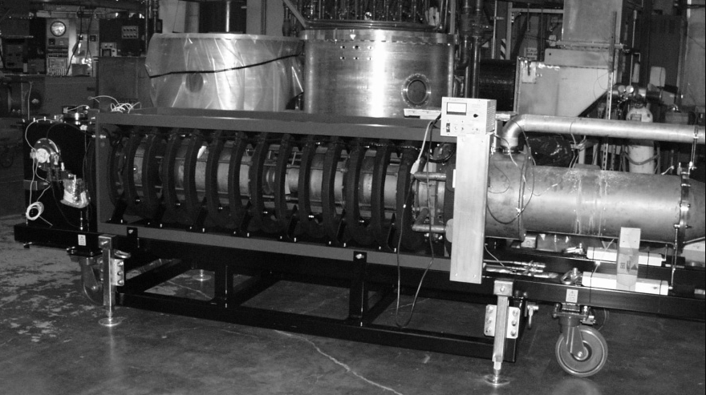
*Figure 6-1: Marconi klystron installed in Building B132 — 476 MHz CW klystron rated ~1.5 MW, showing the input waveguide, output waveguide, collector cooling, and solenoid focusing magnets*


*Figure 6-2: Klystron filament control chassis — manages the klystron heater/filament power and sequencing during startup and shutdown*

> **Sources**: [R5] §4.1, §4.5; [R17]; [R43] (klystron prototype); [R44] (1.2 MW production klystron).

### 6.2 Drive Amplifier

The drive amplifier (KAW2051M12) boosts the LLRF drive signal to ~29 W (44.6 dBm) at 476.315 MHz to drive the klystron input.


*Figure 6-3: RF drive amplifier (KAW2051M12) in the B132 electronics rack — amplifies the LLRF drive signal to ~29 W (44.6 dBm) at 476.315 MHz to drive the klystron input*

> **Sources**: [R32] (drive amplifier datasheet); [R5] §4.4.

---

## 7. Waveguide Distribution Network

### 7.1 Network Topology

The klystron output feeds a waveguide network that distributes RF power equally to 4 cavities:

```
Klystron Output
    │
    ▼
[CIRCULATOR] ──► Circulator Load (absorbs reflected power)
    │
    ▼
[MAGIC-TEE 1] ──► (P4) WG Load 1
    │         │
    ▼         ▼
[MAGIC-TEE 2]  [MAGIC-TEE 3]
    │    │         │    │
    ▼    ▼         ▼    ▼
 Cav A  Cav B   Cav C  Cav D
    │    │         │    │
   (P4)  (P4)     (P4)  (P4)
  WG Load 2      WG Load 3
```

Each magic-tee splits power equally between two outputs (P2 and P3 ports). The P4 port (difference port) receives the sum of equal reflected power from the two cavities and directs it to a waveguide load.

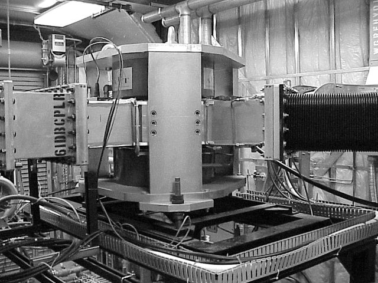

*Figure 7-1: AFT circulator — positioned between the klystron output and the magic-tee splitter network; routes reflected power from the load network away from the klystron to protect it from reflected energy*


*Figure 7-2: Magic-tee power splitter and bellows network on the SPEAR3 tunnel roof — the two-stage magic-tee arrangement divides RF power equally among all four cavities; flexible bellows sections accommodate thermal expansion in the waveguide runs*

### 7.2 Monitored RF Signals

The system monitors 24 RF signals at various points in the waveguide network. Key signals include:

- Klystron forward and reflected power (signals 1, 2)
- Each cavity's forward power, reflected power, and probe signal (signals 9–14, 17–22)
- Waveguide load powers (signals 7–8, 15–16, 23–24)
- Station reference and klystron drive (signals 5, 6)

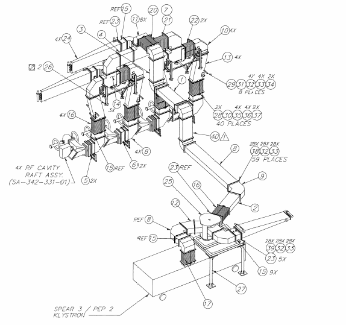

*Figure 7-3: Waveguide distribution network routing RF power from the klystron output through the circulator, magic-tee splitters, and into the tunnel toward the four RF cavities*

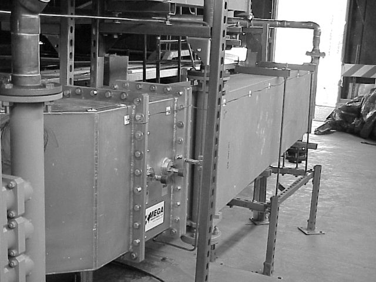

*Figure 7-4: Water-cooled waveguide load — absorbs circulator dump power and magic-tee difference-port reflected power; water cooling carries away dissipated RF energy*

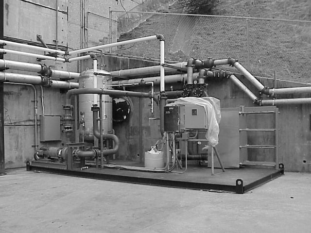

*Figure 7-5: High-conductivity water (HCW) cooling station behind the booster — supplies cooling water to the waveguide loads, absorbing reflected and dump power from the RF distribution network*

> **Sources**: [R5] §4.2, §4.6 (complete 24-signal table); [R33].

---

## 8. RF Cavities and Tuner Assemblies

### 8.1 Cavity Specifications

Four single-cell, HOM-damped copper cavities (PEP-II type) are installed in the SPEAR3 storage ring tunnel. Each cavity provides:

- Accelerating gap voltage: ~712 kV (operating)
- Resonant frequency: 476.315 MHz (tuner-adjustable)
- 3 HOM (Higher-Order Mode) loads per cavity for beam stability
- Ceramic window for RF power transmission
- Internal probe for field amplitude and phase monitoring

Each cavity has waveguide window viewports on either side of the ceramic window, providing mounting points for arc detection sensors.


*Figure 8-1: PEP-II bare single-cell RF cavity — copper cavity body prior to installation of HOM dampers, tuner assembly, and waveguide couplers; the SPEAR3 cavities are of this same design*


*Figure 8-2: RF cavity assembly — cavity body with waveguide coupler, HOM damper waveguide stubs, and tuner plunger installed*


*Figure 8-3: Labeled RF cavity assembly — identifying the accelerating cell, input coupler, HOM damper ports, movable tuner plunger, probe port, and ceramic RF window*


*Figure 8-4: Movable tuner plunger assembly mounted below an RF cavity — the SLO-SYN stepper motor drives the plunger in/out to shift cavity resonant frequency and maintain it at 476.3 MHz under varying beam loading*


*Figure 8-5: HOM (Higher-Order Mode) load at an E-plane mitre bend in the waveguide stub — absorbs parasitic cavity modes that would otherwise cause beam instability*


*Figure 8-6: HOM load at an H-plane mitre bend — the three HOM loads per cavity (E-mitre, H-mitre, and plate) together damp all significant parasitic resonances above the fundamental accelerating mode*


*Figure 8-7: Water-cooled HOM load plate — dissipates HOM power as heat, carried away by the high-conductivity water cooling system; each cavity has one of these plates in addition to the E- and H-mitre loads*


*Figure 8-8: Four RF cavities installed in the SPEAR3 storage ring tunnel (outward view) — showing the complete cavity row with waveguide distribution network and interconnecting bellows runs visible*

### 8.2 Tuner Mechanical Assembly

Each cavity has an individual stepper motor tuner that adjusts the cavity resonant frequency by varying the insertion depth of a mechanical plunger:

| Component | Specification |
|-----------|--------------|
| Motor | Superior Electric SLO-SYN M093-FC11 (NEMA 34D) |
| Motor Driver (legacy) | Superior Electric SLO-SYN SS2000MD4-M PWM translators (obsolete) |
| Motor Controller (legacy) | Allen-Bradley 1746-HSTP1 stepper modules |
| Motor Controller (current) | Galil DMC-4143 Rev 1.3h 4-axis controller (commissioned Aug 2025) |
| Position Feedback | Linear potentiometer on each tuner |
| Tuning Range | Adjustable to compensate for beam loading detuning |

---

# PART III — POWER SYSTEMS

---

## 9. High-Voltage Power Supply — Power Section

### 9.1 Architecture Overview

The HVPS is a 12-pulse thyristor phase-controlled rectifier based on the PEP-II design (SLAC, 1997). It delivers negative-polarity DC high voltage to the klystron cathode. The power section is located in Building B514; the control system is in Building B118.

Two complete, fully operational HVPS units exist: **SPEAR1** and **SPEAR2**. Both are maintained in operating condition and connect to the klystron through a switch-over tank. During normal SPEAR3 operation one unit is active and the other is fully powered off; the units are swapped during scheduled accelerator downtime (including the annual April maintenance period) to equalize run-time and allow maintenance access.

### 9.2 Power Conversion Chain

```
Substation 507, Breaker 160 (12.47 kV RMS 3φ 60 Hz)
    │
    ▼
┌─────────────────────┐
│ SWITCHGEAR          │  Disconnect switch, 3×50A fuses, vacuum contactor
│ (Contactor Panel)   │  Ross HQ3 contactor + HCA-1-A controller
└─────────┬───────────┘
          │
┌─────────▼───────────┐
│ PHASE-SHIFT XFMR T0 │  3.5 MVA, oil-immersed
│ Extended Delta       │  Primary: 12.47 kV delta
│                      │  Secondary: Dual wye ±15° phase shift
└─────┬─────────┬──────┘
      │         │
┌─────▼────┐ ┌──▼────────┐
│ T1 (+15°)│ │ T2 (−15°) │  Rectifier transformers, 1.5 MVA each
│ Open wye │ │ Open wye  │  Secondary: dual wye, center-tapped
└─────┬────┘ └──┬────────┘
      │         │
┌─────▼─────────▼────────┐
│ 12-PULSE SCR BRIDGES   │  12 stacks × 14 Powerex T8K7 SCRs each
│ Star point controller  │  Phase angle control: 0°–180°
│ Enerpro FCOG1200       │  Firing board generates 12 gate pulses
└─────────┬──────────────┘
          │
┌─────────▼──────────────┐
│ FILTER INDUCTORS       │  L1, L2: 0.3H, 85A rated, air core
│ (Primary side)         │  1,084 J stored energy each
└─────────┬──────────────┘
          │
┌─────────▼──────────────┐
│ SECONDARY RECTIFIERS   │  4 diode bridges in series (D1-D24)
│ + FILTER               │  Main: 30 kV, 30 A; Filter: 30 kV, 3 A
│                        │  Cap bank: 8 μF; Isolation resistors: 500Ω
│                        │  Voltage divider: 1000:1
└─────────┬──────────────┘
          │
┌─────────▼──────────────┐
│ CROWBAR PROTECTION     │  4 SCR stacks in series (SCR13-16)
│                        │  100 kV, 80 A each
│                        │  Fiber-optic trigger (~1 μs response)
└─────────┬──────────────┘
          │
┌─────────▼──────────────┐
│ CABLE TERM. INDUCTORS  │  L3, L4: 200 μH
│ (Layer 4 protection)   │  Limits cable discharge current to klystron
└─────────┬──────────────┘
          │
          ▼
   −77 kV DC @ 22 A → Klystron Cathode
```

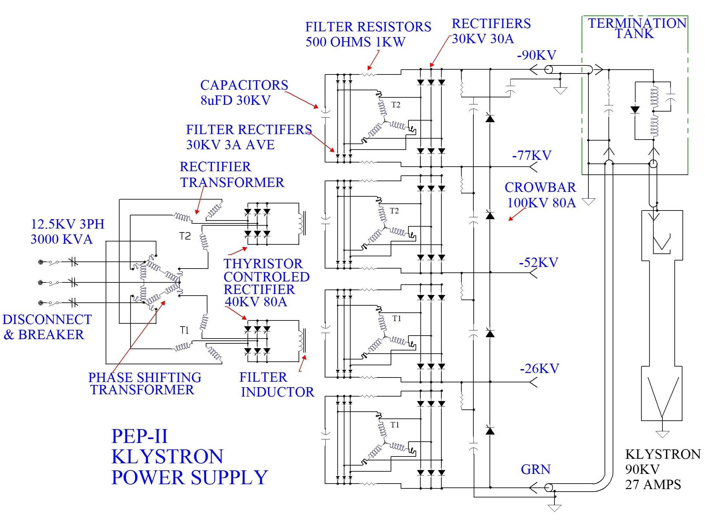

*Figure 9-A: PEP-II Klystron Power Supply — annotated circuit schematic showing the complete power conversion chain from the 12.5 kV 3-phase input through the disconnect/breaker, phase-shifting transformer (T0), thyristor-controlled rectifier bridges (40 kV, 80 A), filter inductors, secondary rectifier stages, 8 µF/30 kV filter capacitors, 500 Ω/1 kW filter resistors, 30 kV/30 A rectifiers, Crowbar (100 kV, 80 A), and Termination Tank to the Klystron (90 kV, 27 A); intermediate DC bus voltage levels (−26 kV, −52 kV, −77 kV, −90 kV) are labeled on the power stage outputs; the SPEAR3 HVPS is directly derived from this PEP-II design*

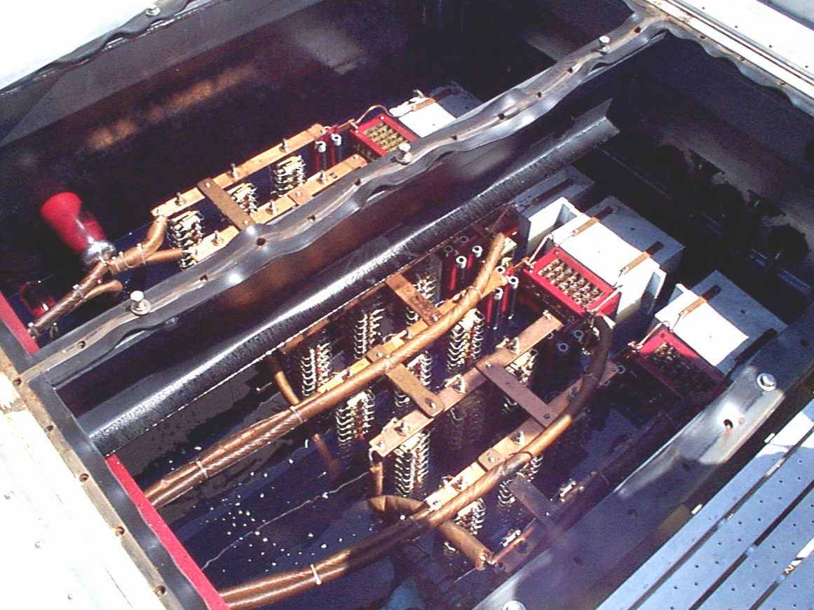

*Figure 9-3: HVPS2 main oil tank at Building B514 — this large oil-immersed enclosure houses the 3.5 MVA phase-shift transformer (T0), rectifier transformers (T1, T2), and 12-pulse SCR bridge assemblies; SPEAR1 is an identical installation*

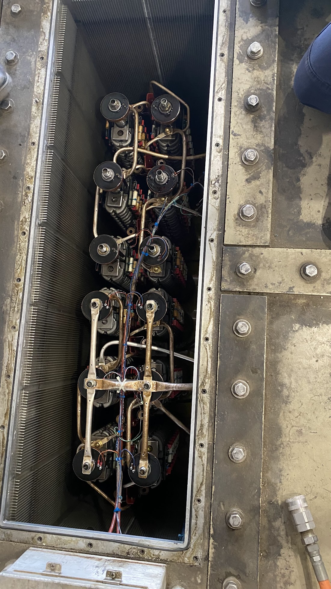

*Figure 9-2: Thyristor stack assemblies inside the HVPS2 phase tank, viewed into the side access opening with the cover removed — showing columns of Powerex T8K7 SCR thyristor discs (flat black cylinders) paired on copper bus bar assemblies with gate driver signal wiring; this photo was taken with SPEAR2 drained and accessed during the April 2026 scheduled downtime; SPEAR1 contains identical hardware*


*Figure 9-1: HVPS cable switch tank at Building B514 — provides the switchover connection between the SPEAR1 and SPEAR2 HVPS units and the klystron HV cable; allows the active unit to be changed without disconnecting the klystron high-voltage cable*

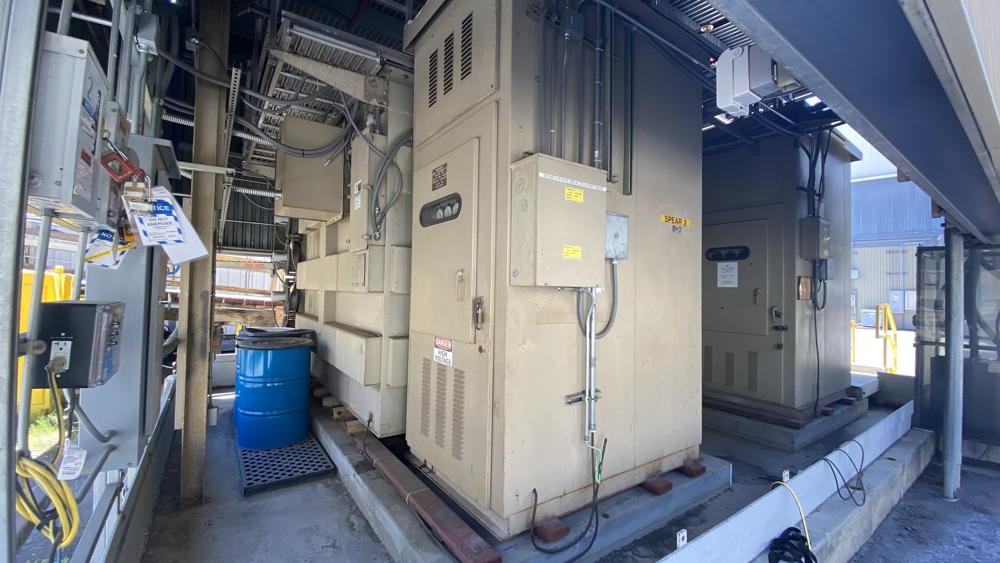

*Figure 9-4: HVPS2 installation at Building B514 — outdoor view from the switchgear area showing the large beige oil-filled power supply enclosures, "SPEAR 2" identification label, and "DANGER HIGH VOLTAGE" placard on the panel door; the cable trays, conduit runs, and grounding conductors are visible overhead; a "DO NOT ENERGIZE" lock-and-tag notice is visible at left (SPEAR2 is the off-duty unit during this April 2026 downtime); SPEAR1 forms an identical installation beside this*

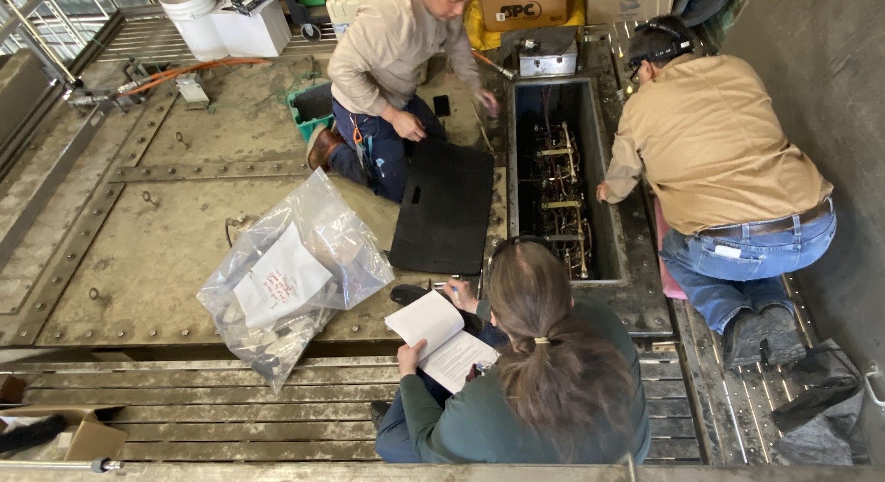

*Figure 9-5: HVPS2 main oil tank being accessed from the top during the 2026 HVPS documentation and inspection campaign — a rectangular access hatch in the ribbed/bolted steel tank top plate is open, revealing the internal copper bus bar assembly and SCR bridge structures below; three personnel are visible (two engineers working at the access opening, one documenting with a notebook); the orange fiber optic conduit visible at upper left routes the SCR ENABLE, CROWBAR, and STATUS fiber signals to the B118 Hoffman Box*

### 9.3 Key Component Specifications

| Component | Specification | Drawing Reference |
|-----------|--------------|-------------------|
| Phase-shift transformer T0 | 3.5 MVA, 12.47 kV delta / dual wye ±15° | `sd7307900101.pdf` |
| Rectifier transformers T1, T2 | 1.5 MVA each, open wye / dual wye CT | `sd7307900101.pdf` |
| SCR stacks (phase control) | 12 × Powerex T8K7 (8 kV, 700 A), 14/stack | `sd7307930304.pdf`, `sd7307930402.pdf` |
| Filter inductors L1, L2 | 0.3 H, 85 A, air core | `sd7307930702.pdf` |
| Secondary rectifiers D1-D24 | 4 bridges in series, 30 kV, 30 A | `sd7307930801.pdf` |
| Filter capacitors | 8 μF total, ~24 kJ at full voltage | `sd7307931203.pdf` |
| Crowbar SCRs (SCR13-16) | 4 stacks in series, 100 kV, 80 A each | `sd7307931301.pdf` |
| Cable termination inductors L3, L4 | 200 μH | `sd7307940400.pdf` |
| Voltage divider | 1000:1 ratio | `sd2372301200.pdf` |
| Regulator card | PC-237-230 (SD-237-230-14-C1) | `sd2372301401.pdf` |

> **Sources**: All schematic PDFs in `hvps/documentation/schematics/` [R9]; [R6] (PEP-II HVPS architecture); [R22] (power supply specification); preliminary analysis (AI-generated, see `hvps/architecture/technical-notes/00-spear3-hvps-legacy-system-design.md` and `hvps/documentation/schematics/technical_notes/`, unreviewed).

### 9.4 Monitoring Signals (B514 → B118)

Four analog monitoring signals are sent from the HVPS power section to the B118 control room:

| Signal | Purpose |
|--------|---------|
| HVPS Output Voltage | DC voltage monitoring via 1000:1 divider |
| HVPS Output Current | DC current monitoring via Danfysik DC-CT |
| Inductor 2 Voltage | T2 firing circuit timing verification |
| Transformer 1 Phase Current | T1 firing circuit health monitoring |

> **Sources**: [R23]; [R9].

---

## 10. HVPS Control System — Hoffman Box (B118)

### 10.1 Overview

The HVPS control system is housed in a Hoffman NEMA enclosure (the "Hoffman Box") located in Building B118. It contains the PLC, analog regulation electronics, Enerpro SCR firing boards, power supplies, terminal strips, and fiber optic interfaces.

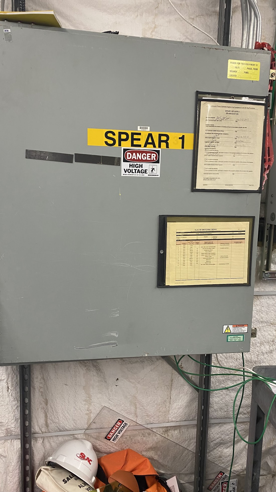
*Figure 10-1: HVPS controller Hoffman enclosure (SPEAR1, active unit) in Building B118 — closed front view showing the "SPEAR 1" identification label, DANGER HIGH VOLTAGE warning placard, lock-and-tag procedure form, and SLAC HV Switching Order mounted on the door*

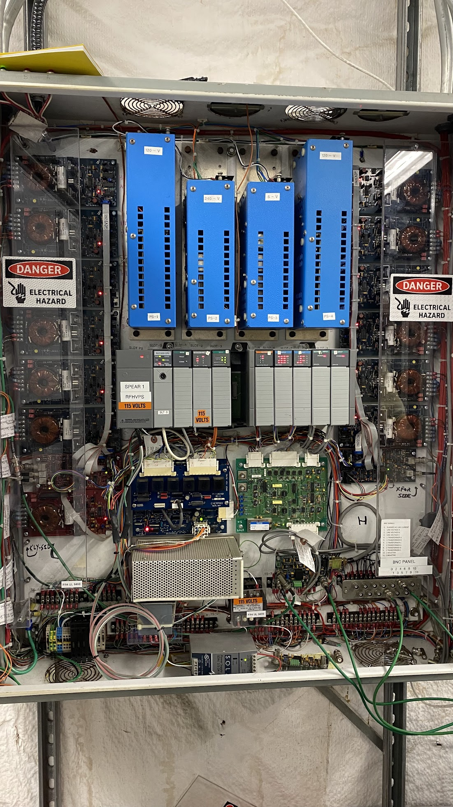
*Figure 10-2: HVPS controller Hoffman Box interior (SPEAR1) — showing the SLC-500 PLC rack (center, with CPU and I/O modules in slots 0 through 9+, labeled "SPEAR 1 RFHVPS"), four blue switching power supplies PS-1 through PS-4 (providing 120V×2, 240V, and 5V rails), Enerpro FCOG6100 SCR firing board (dark blue PCB, lower center), analog regulation board (green PCB), and terminal strips (TS-1 through TS-6) in the lower section; the BNC monitoring output panel is visible at lower right*

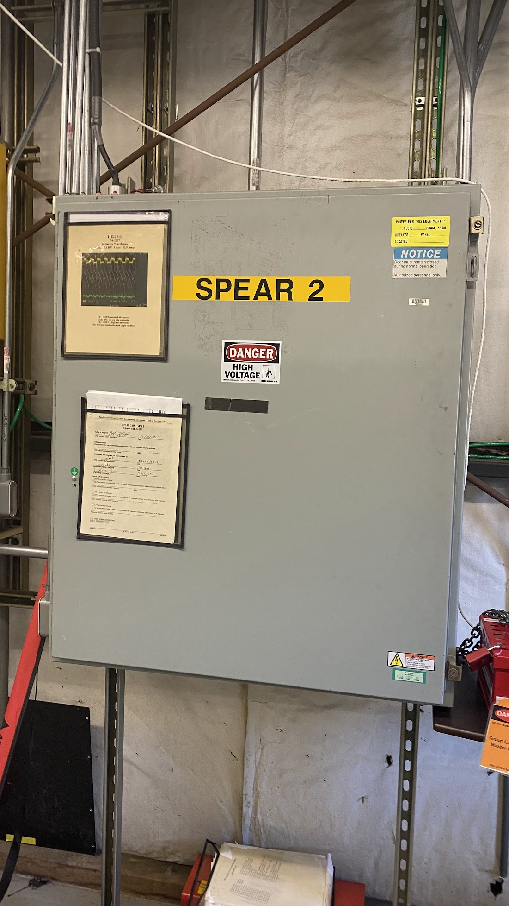
*Figure 10-3: HVPS controller Hoffman Box for SPEAR2 in Building B118 — closed front view showing the "SPEAR 2" identification label, lock-and-tag documentation, and an oscilloscope waveform printout (showing 12-pulse thyristor firing waveforms from HER B-2, circa 2007) posted on the door for reference; SPEAR2 contains identical hardware to SPEAR1 and is fully operational; one unit is active while the other is switched off, with roles exchanged during scheduled downtime*

### 10.2 SLC-500 PLC Hardware Configuration

| Slot | Module | Function |
|------|--------|----------|
| 0 | SLC-500 CPU (AB-1747-L532) | Main processor |
| 1 | 1747-DCM (DCM-FULL) | Direct Communication Module — VXI/EPICS interface |
| 2 | 1746-IO8 | 8-point digital I/O (12 kV, 240V power, grounding switch relay) |
| 3 | Thermocouple Module | 8-channel temperature sensing (4 channels actively scaled) |
| 4 | (empty) | Unused slot |
| 5 | 1746-OX8 | 8-point relay output (SCR enable, contactor, crowbar, fast inhibit) |
| 6 | 1746-IB16 | 16-point 24V DC digital input (fiber optic signals, oil levels, PPS) |
| 7 | 1746-IV16 | 16-point 24V DC digital input (contactor status, transformer interlocks) |
| 8 | AB-1746-NIO4V | 4-channel analog I/O (voltage reference output, phase angle readback) |
| 9 | AB-1746-NI4 | 4-channel analog input (AC current, voltage monitors, DC current) |
| 10 | Input module | Additional inputs (12 channels) |
| 11 | Input module | Additional inputs |
| 13 | Output module | Additional outputs (4 channels) |

### 10.3 Control Functions

The PLC implements the following control functions in ladder logic:

1. **Power-up/power-down sequencing** — Orderly startup of contactors, SCR drives, and HVPS output
2. **Voltage reference generation** — Converts EPICS setpoint (via VXI → DCM) to analog reference for the Enerpro firing board
3. **Phase angle calculation** — Computes approximate SIG HI value for feedforward to Enerpro board
4. **Safety interlock monitoring** — Monitors oil levels, temperatures, PPS status, fiber optic signals
5. **Crowbar management** — Arms/disarms crowbar protection, handles crowbar events
6. **Communication** — Exchanges 8×16-bit input and output words with VXI crate via DCM

**Key PLC Registers**:

| Register | Purpose |
|----------|---------|
| N7:10 | Voltage reference output (to analog regulator) |
| N7:11 | Phase angle / SIG HI feedforward |
| N7:100–N7:107 | Thermocouple raw readings |
| N7:110–N7:113 | Scaled temperature values |
| I:1/O:1 | DCM communication words (VXI interface) |

> **Sources**: [R26] (PLC ladder logic); [R27] (PLC symbol database); [R37]; [R38]; [R39]; preliminary analysis (AI-generated, see `hvps/documentation/plc/technical-notes/`, unreviewed).

### 10.4 Analog Regulation

The voltage regulation loop is split between the PLC (digital setpoint, sequencing) and an analog regulator card:

```
EPICS Setpoint → VXI/DCM → PLC (N7:10) → DAC → Analog Regulator → Enerpro SIG HI → SCR Firing Angle
                                                        ▲
                                          HVPS Voltage ─┘ (1000:1 divider feedback)
```

The analog regulator card (PC-237-230, drawing SD-237-230-14-C1) compares the voltage reference with the HVPS output voltage feedback (from the 1000:1 divider) and generates the SIG HI control signal for the Enerpro firing board.

> **Sources**: [R12] (regulator card schematic); [R13] (voltage divider schematic); preliminary analysis (AI-generated, see `hvps/architecture/technical-notes/04-regulator-board-design.md`, unreviewed).

### 10.5 Terminal Strips and External Connections

The Hoffman Box connects to external equipment via 6 terminal strips:

| Terminal Strip | Connection | Cable Type |
|---------------|-----------|-----------|
| TS-3 | PPS status LEDs | Internal |
| TS-5 | Contactor controls (B118 → Switchgear) | Belden 83715 (15C #16 Teflon) |
| TS-6 | Grounding tank (B118 → Termination Tank) | Belden 83709 (9C #16 Teflon) + Belden 83715 |

> **Sources**: [R25]; [R15]; preliminary analysis (AI-generated, see `pps/diagrams/04_wd7307900206_hoffman_box_wiring.md`, unreviewed).

---

## 11. Enerpro SCR Firing System

### 11.1 Overview

The Enerpro FCOG1200 (or FCOG6100) is a 12-pulse SCR gate driver board that generates precisely timed gate pulses for the 12 thyristor stacks. It receives a control voltage (SIG HI) from the analog regulator and converts it to a firing angle, synchronized to the AC line frequency via phase reference signals from the transformer monitor windings.

### 11.2 Current Hardware

| Board | Model | Revision | Serial Numbers |
|-------|-------|----------|----------------|
| Main firing boards | Enerpro FCOG6100 | Rev. K | 41506, 50470, 30045 |
| Auxiliary firing boards | Enerpro FCOAUX60 | Rev D | 03198, 03813, 1694 |

### 11.3 Phase Reference Adapter

A custom Phase Reference Adapter board interfaces between the transformer monitor windings and the Enerpro board's J7 phase reference input. It uses 3×2MΩ resistors to scale the high-voltage phase reference signals down to the Enerpro input requirements.

> **Sources**: [R28] (12 Enerpro PDFs); [R40]; preliminary analysis (AI-generated, see `hvps/controls/enerpro/technical-notes/`, unreviewed).

---

## 12. Arc Protection and Crowbar System

### 12.1 Four-Layer Protection Architecture

The HVPS implements a 4-layer arc protection system to protect the klystron from destructive energy discharge during arcs:

| Layer | Protection | Response Time | Mechanism |
|-------|-----------|---------------|-----------|
| 1 | SCR firing inhibit | <1 μs | Fiber-optic SCR ENABLE signal removed; thyristors stop conducting at next AC zero-crossing |
| 2 | Crowbar firing | <1 μs | Fiber-optic CROWBAR signal fires 4 series-connected crowbar SCRs, shorting the HVPS output |
| 3 | Filter capacitor isolation | Passive | 500Ω isolation resistors (PEP-II innovation) limit capacitor discharge current during arc |
| 4 | Cable termination inductors | Passive | L3, L4 (200 μH) limit rate of current rise from cable discharge into klystron |

The first two layers are actively controlled: the Interface Chassis (or in legacy, the VXI AIM module and PLC) can assert SCR ENABLE removal and CROWBAR firing via fiber optic signals. Layers 3 and 4 are passive protection inherent in the circuit design.

> **Sources**: [R6] (PEP-II HVPS architecture — describes 4-layer protection philosophy); HVPS schematics [R9].

---

# PART IV — PROTECTION AND SAFETY SYSTEMS

The SPEAR3 RF station employs a multi-layer protection architecture in which five distinct actors operate in parallel, each addressing a different threat class at a different speed. At the fastest level, the **Fast Interlock Chassis 340-308** (B132) provides microsecond-speed hardware protection against arc breakdown and RF reflected power excursions — with no CPU or firmware in the trip path. The **RF MPS PLC** (AB 1771-DCM, B132) provides equipment protection on a ~10 ms timescale, monitoring klystron collector power, cavity reflected power, vacuum, and cooling. The **SLC-500 HVPS PLC** (B118) monitors the HVPS internals (oil, crowbar, transformer arc, overvoltage) and drives the supervisory SCR enable relay on a ~10–20 ms cycle. Sitting above all hardware protection, the **SNL state machine** (`rf_states.st`) provides orderly shutdown sequencing, fault recording, and operator state management at the ~1 s timescale. Personnel safety is enforced by two complementary PPS chains — both interfaced through the SLC-500 PLC — that control the HV vacuum contactor and the Ross grounding switch respectively.

This part of Doc L summarizes the three protection subsystems (PPS, RF MPS, and Fast IC / interlock chain). For the complete interlock architecture — including full signal flow diagrams, per-actor input/output tables, fault timeline examples, compliance analysis, and detailed fault data access procedures — see Doc I (`Designs/I_INTERLOCK_ARCHITECTURE.md`).

---

## 13. Personnel Protection System (PPS) Interface

### 13.1 Overview

The PPS interface controls two critical safety functions: the HV vacuum contactor (which connects 12.47 kV AC power to the HVPS) and the Ross grounding switch (which grounds the HVPS output for safe access).

**⚠️ KEY COMPLIANCE ISSUE**: In the legacy system, both PPS chains pass through the SLC-500 PLC inside the Hoffman Box. This places a programmable logic controller in the personnel safety chain — a design that does not meet modern PPS standards.

### 13.2 Legacy PPS Chain 1: HV Contactor

```
PPS 1 Enable (GOB12-88PNE Pin E→F)
    → SLC-500 PLC Slot-6 IB16 Input 14
    → PLC Rung 0017 (Contactor Enable logic)
    → Slot-5 OX8 OUT2
    → TS-5 → Belden 83715 cable → Switchgear
    → K4 Relay (PPS Control) → MX Relay → L1 Holding Coil → Contactor energized

Readback: S5 auxiliary contact (NC) → TS-5 pins 14,15 → GOB12-88PNE Readback A-B
```

### 13.3 Legacy PPS Chain 2: Ross Grounding Switch

```
PPS 2 Enable (GOB12-88PNE Pin G→H)
    → SLC-500 PLC Slot-6 IB16 Input 15
    → PLC Rung 0016 (Ross switch enable)
    → Slot-2 IO8 OUT3 (120 VAC)
    → TS-6 → Belden 83709 cable → Termination Tank
    → Ross Grounding Switch coil

Readback: Ross Switch NC Aux → TS-6 pins 11,12 → GOB12-88PNE Readback C-D
```

### 13.4 Identified Issues

| Issue | Severity | Details |
|-------|----------|---------|
| PLC in PPS chain | Critical | Both PPS chains route through SLC-500 PLC ladder logic |
| PPS wiring exposed | High | PPS wires terminate on TS-5 and TS-6 inside the HVPS controller enclosure |
| Ross switch PLC dependency | High | Ross switch controlled by PLC 120 VAC output (Slot-2), not direct PPS |
| K4/RR relay label swap | Medium | Drawing labels K4 and RR relay functions incorrectly (corrected in AI analysis) |
| Hardware obsolescence | High | SLC-500 and 1746 modules are end-of-life |

### 13.5 Relay Chain Details (Contactor Disconnect Panel)

| Component | Function | Type |
|-----------|----------|------|
| K4 | PPS Control Relay — energized only when PPS enable present | Relay |
| MX | External Control — provides operational enable from non-PPS sources | Relay |
| RR | Reset — latching reset relay for post-trip recovery | Relay |
| L1 | Holding Coil — maintains vacuum contactor energized | Coil |
| S5 | Auxiliary Contact — provides PPS readback (NC contact) | Contact |
| Vacuum Contactor | Ross Eng. Model HQ3 — connects 12.47 kV AC to HVPS | HV contactor |
| Controller | Ross Eng. HCA-1-A — contactor controller logic | Controller |

> **Sources**: [R25] (detailed wiring); [R14]; [R15]; switchgear schematics; preliminary analysis (AI-generated, see `pps/diagrams/`, unreviewed).

### 13.6 PPS Dual-Chain Interaction and Roles

The two PPS chains are **not redundant** — they perform complementary safety functions that must operate in the correct sequence:

| | **Chain 1 — HV Vacuum Contactor** | **Chain 2 — Ross Grounding Switch** |
|---|---|---|
| **Safety function** | Disconnect 12.47 kV AC primary power from HVPS | Ground the HVPS HV bus (−77 kV) for safe personnel access |
| **Operating state** | Coil energized → contactor **CLOSED** (12.47 kV connected) | Coil energized → switch held **OPEN** (HV bus not grounded) |
| **Safe-access state** | PPS 1 removed → K4 drops → L1 drops → contactor **spring-opens** → 12.47 kV disconnected | PPS 2 removed → 120 VAC removed → switch **spring-closes** → HV bus grounded |
| **Readback** | S5 NC auxiliary contact closed = contactor OPEN = 12.47 kV removed | Ross switch NC auxiliary contact closed = switch GROUNDED = HV bus grounded |
| **Fail-safe direction** | Lose power → contactor opens → safe | Lose power → switch closes to ground → safe |

**Operational Sequence for Safe Access**:

Personnel access to the HVPS area requires **both** chains to be in their safe state, in the correct order:

1. PPS 1 removed → Rung 0017 drops → contactor opens → 12.47 kV disconnected
2. HVPS residual energy dissipates (capacitor bank discharges through load circuits)
3. PPS 2 removed → Rung 0016 drops → Ross switch closes → HV bus grounded
4. PPS readbacks A-B and C-D loop complete → machine PPS confirms both chains safe
5. Personnel entry permitted

Restore sequence reverses the above (grounding switch opens before contactor closes).

> **Critical**: Closing the grounding switch (Chain 2) onto a live HV bus (Chain 1 still closed) would produce a catastrophic high-energy arc fault. The machine PPS system enforces the correct sequencing through its permitting logic.

**Compliance Comparison**:

| | **Chain 1** | **Chain 2** |
|---|---|---|
| PLC dependency | PPS 1 routes through SLC-500 Rung 0017 | PPS 2 routes through SLC-500 Rung 0016 |
| Hardware fail-safe | **Present** — OX8 relay input side wired to PPS 1 (24VDC). K4 cannot energize without PPS 1 even if PLC closes relay contact. | **Absent** — IO8 OUT3 drives 120 VAC to Ross coil. PLC failure energized could hold switch open without PPS 2. |
| Primary compliance risk | Low (hardware series PPS voltage provides physical enforcement) | **Higher** — PLC failure-energized scenario leaves HV bus ungrounded |

Chain 2's spring-return (fail-safe toward grounded) mitigates total PPS loss, but a PLC output staying energized despite PPS removal is not protected against by any hardware means. This is the primary driver for the planned upgrade to direct PPS control through the Interface Chassis. See `pps/diagrams/00_SYSTEM_OVERVIEW.md` for the upgrade architecture.

For the complete signal-chain details, compliance assessment, and all relay/wiring details, see `Designs/I_INTERLOCK_ARCHITECTURE.md` §6.8.

> **Sources**: [R25]; `pps/diagrams/00_SYSTEM_OVERVIEW.md`; `pps/diagrams/07_PLC_CODE_AND_LOGIC.md`; `pps/diagrams/08_CORRECTED_HAND_DRAWING.md`.

---

## 14. RF Machine Protection System (MPS)

### 14.1 Overview

The RF MPS provides equipment/machine protection — distinct from the personnel-safety PPS. It monitors klystron operating parameters and RF station conditions, removing permits to protect equipment from damage.

### 14.2 Hardware Evolution

| Era | Platform | Status |
|-----|----------|--------|
| Original | Allen-Bradley PLC-5 (1771 series) | Obsolete, to be replaced |
| To be upgraded | Allen-Bradley ControlLogix 1756 | Hardware assembled, software written, tested without RF power |

### 14.3 Protection Functions

The RF MPS monitors and protects against:

- Excessive klystron collector power (cathode power minus RF output)
- Excessive reflected power at any cavity
- Waveguide arc conditions (via interlock chassis inputs)
- Loss of cooling water
- Klystron vacuum excursion
- HVPS fault conditions

When any protection condition is triggered, the MPS removes its permit signal (Path B of the three-path interlock architecture), which:

1. Removes DH+ (cuts the modulated RF drive signal to the klystron)
2. Opens the RF drive gate

> **Note**: SCR ENABLE removal and crowbar firing are performed by the **Fast Interlock Chassis** (Path A) independently — hardware-only, no software in the loop, faster than any PLC response. The RF MPS PLC (Path B) and SLC-500 HVPS PLC (Path C) are parallel, independent trip paths that complement the Fast IC protection. See `Designs/I_INTERLOCK_ARCHITECTURE.md` §1.1–§1.2 for the three-path architecture.

### 14.4 MPS Wiring

33 MPS wiring diagrams (wd3403300200 through wd3403303400) describe the complete MPS signal chain from multiple trip sources to HVPS and crowbar outputs.

> **Sources**: MPS wiring diagrams [R21]; [R5] §7; preliminary analysis (AI-generated, see `spear-rf-code-legacy/codeReviewTechnicalNotes/06-plc-stepper-motors.md`, unreviewed).

---

## 15. Interlock Architecture and Signal Chain

### 15.1 Overview

The interlock system spans multiple hardware layers, from fast analog hardware interlocks to slow PLC-monitored conditions:

| Layer | Speed | Hardware | Function |
|-------|-------|----------|----------|
| Fast analog | <1 μs | Fast Interlock Chassis | Arc detection, reflected power limits |
| PLC hardware | ~10 ms | RF MPS ControlLogix | Equipment protection calculations |
| PLC software | ~100 ms | SLC-500 (HVPS) | HVPS sequencing and monitoring |
| EPICS supervisory | ~1 s | VXI IOC / SNL | State machine, operator interface |

### 15.2 Interlock Chassis

The Fast Interlock Chassis (also called Local Control Chassis) in B132 receives and summarizes hardware interlock signals:

- Arc detection inputs from waveguide fiber optic sensors
- Reflected power monitor inputs
- External permits (SPEAR MPS beam permit, orbit interlock)
- HVPS status fiber optic signals — the B514 power section STATUS fiber goes directly to the Fast IC (populating `HVPSON` bit in `FISTAT` A16 register) and to B118 SLC-500 Slot 6 IB16. This signal is **informational only**: `HVPSON=0` gates arc voltage history buffer readback in `devP2RfAim.c` but does **NOT** cause a Fast IC hardware trip.

It reports summarized interlock status to the VXI crate through the ARC/Interlock Module (AIM). See `Designs/I_INTERLOCK_ARCHITECTURE.md` §1.2 for the complete signal flow diagram.

### 15.3 Complete Trip Chain

```
Fault detected (arc, reflected power, vacuum, etc.)
    │
    ├── Path A — Fast Interlock Chassis (analog, <1 μs)
    │       │     [hardware-only, no software in loop]
    │       ├── SCR ENABLE removed (fiber optic → B514 HVPS)
    │       ├── CROWBAR fired (fiber optic → B514)
    │       └── AIM FISTAT fault word → VXI IOC
    │
    ├── Path B — RF MPS ControlLogix PLC (digital, ~10 ms)
    │       │     [equipment protection: power, arc, vacuum]
    │       ├── DH+ removed (cuts RF drive to klystron)
    │       └── MPS status → VXI IOC
    │
    ├── Path C — SLC-500 HVPS PLC (parallel, ~100 ms)
    │       │     [HVPS sequencing; independent of MPS]
    │       ├── SCR firing angle → zero (ramp HVPS down)
    │       └── HVPS status → VXI IOC
    │
    └── EPICS / rf_states.st (supervisory, ~1 s)
            │     [monitoring only, no fast trip authority]
            ├── Fault file capture (/dat/FAULT*_N)
            ├── Station state → OFF
            └── Operator alarm/notification
```

For complete fault timeline examples and three-path architecture details, see `Designs/I_INTERLOCK_ARCHITECTURE.md` §8.

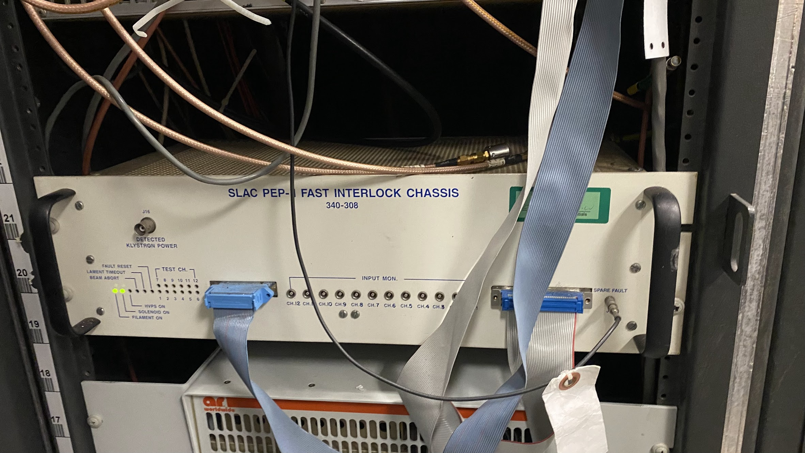
*Figure 15-1: SLAC PEP-II Fast Interlock Chassis 340-308 in the B132 electronics rack — front panel showing FAULT RESET, LAMENT TIMEOUT, and BEAM ABORT controls (left cluster); 12-channel test port (TEST CH.); CH.1–CH.12 INPUT MONITOR test points (center); HVPS ON, SOLENOID ON, and FILAMENT ON status indicators; and J16 DETECTED KLYSTRON POWER coaxial input; the chassis provides sub-microsecond hardware protection by monitoring RF detector inputs and asserting SCR ENABLE removal and CROWBAR firing via fiber optic to the B514 HVPS on fault conditions*

> **Sources**: [R5] §17; [R16].

---

# PART V — CONTROL SOFTWARE AND INSTRUMENTATION

---

## 16. EPICS IOC and SNL Software Architecture

### 16.1 IOC Platform

The VXI crate Slot 0 processor runs VxWorks RTOS with an EPICS IOC. The IOC hosts 6 SNL (State Notation Language) programs compiled into a single `rfSeq` library:

| Program | Lines | Instances | Authors | Function |
|---------|-------|-----------|---------|----------|
| `rf_states.st` | 2,227 | 1 | R.C. Sass, M. Laznovsky, S. Allison | Master station state machine |
| `rf_calib.st` | 3,345 | 1 | R. Claus | Calibration sequences |
| `rf_tuner_loop.st` | 555 | 4 (per cavity) | — | Cavity tuner motor control |
| `rf_hvps_loop.st` | 343 | 1 | — | HVPS supervisory control |
| `rf_dac_loop.st` | 290 | 1 | S. Allison | Drive/gap voltage DAC control |
| `rf_msgs.st` | 352 | 1 | — | Message logging, TAXI monitoring |

Plus 11 header/macro files (1,111 lines) defining PV names, status codes, and control macros.

> **Sources**: Legacy source code in `spear-rf-code-legacy/rfApp/src/seq/` [R16]–[R20]; preliminary analysis (AI-generated, see `spear-rf-code-legacy/codeReviewTechnicalNotes/`, unreviewed).

### 16.2 rf_states.st — Master Station State Machine

**Primary States**: OFF (0) → PARK (1) → TUNE (2) → ON_FM (3) → ON_CW (4)

**State architecture**: 3 concurrent state sets:

1. **`ss rf_states`** — Main state machine with 5 primary states + 17 transition states
2. **`ss rf_statesLP`** — Loop protection (concurrent monitoring)
3. **`ss rf_statesFF`** — Fault file capture (asynchronous)

**Total**: 23 states across 3 concurrent state sets.

**State transitions**:

- OFF → PARK: Operator command; initializes VXI modules, loads DSP firmware
- PARK → TUNE: Operator command; enables drive power, engages direct feedback loop
- TUNE → ON_FM: Enables comb and ripple loops (PEP-II modes)
- TUNE → ON_CW (direct): Bypasses ON_FM, goes straight to full power
- Any → OFF: Fault or operator shutdown; orderly disengagement of all loops

### 16.3 rf_hvps_loop.st — HVPS Supervisory Control

States: `init` → `off` → `proc` (processing/conditioning) → `on`

**Processing mode** carefully ramps HVPS voltage while monitoring cavity vacuum. If vacuum exceeds limits, voltage is reduced. This is used during cavity conditioning and post-trip recovery.

**16 status codes** (from source): The HVPS reports status via integer codes that the SNL program interprets for operator display and automated responses.

### 16.4 rf_tuner_loop.st — Cavity Tuner Control

Runs as 4 instances (one per cavity) via `CAV` macro substitution. Implements a slow feedback loop that maintains cavity resonant frequency by:

1. Reading cavity phase angle (from IQA module)
2. Comparing against setpoint (optimal detuning for current beam current)
3. Commanding stepper motor moves via AB 1746-HSTP1 controller

**5 SNL states**, 2 control algorithms (phase-feedback-based position tuning for resonance maintenance, and position homing for park/on transitions) plus a loop-off monitoring state.

### 16.5 rf_dac_loop.st — Drive/Gap Voltage DAC Control

Manages the RFP module's octal DACs that control drive power and gap voltage setpoints. The loop operates differently depending on whether the direct feedback loop is on or off, and transitions between TUNE and OPERATE modes.

**⚠️ ELIMINATED IN UPGRADE**: This program is entirely replaced by the LLRF9 internal vector modulator control.

### 16.6 rf_calib.st — Calibration Sequences

The largest SNL program (3,345 lines) implements 28 calibration measurement states including:

- IQA module amplitude/phase calibration
- Klystron gain measurement
- Cavity tuner characterization
- Feedback loop gain optimization

### 16.7 rf_msgs.st — Message Logging

Monitors CAMAC TAXI communication errors, VXI module health, and system messages. Reports status to EPICS archiver.

---

## 17. Tuner Control System

### 17.1 Legacy Configuration (Pre-2026)

| Component | Detail |
|-----------|--------|
| Controllers | Allen-Bradley 1746-HSTP1 stepper modules (4 units) |
| Drivers | Superior Electric SLO-SYN SS2000MD4-M PWM step drive translators |
| Motors | Superior Electric SLO-SYN M093-FC11 (NEMA 34D, 4 units) |
| Communication | Via AB DCM serial link from VXI crate |
| Software | `rf_tuner_loop.st` (SNL, 4 instances) |

### 17.2 Future Upgrade Configuration ( in progress)

| Component | Detail |
|-----------|--------|
| Controller | Galil DMC-4143 Rev 1.3h 4-axis motion controller + Customized chassis |
| Motors | Same SLO-SYN M093-FC11 (retained) |
| Communication | Ethernet (with heartbeat monitoring) |
| Position Feedback | Linear potentiometers on each tuner (retained) |

> **Sources**: [R29]; [R30]; [R31]; [R34]; [R35]; [R36]; preliminary analysis (AI-generated, see `spear-rf-code-legacy/codeReviewTechnicalNotes/08-signal-processing.md` §tuner, unreviewed).

> **Sources**: [R34]; [R35]; [R36]; [R5] §10.

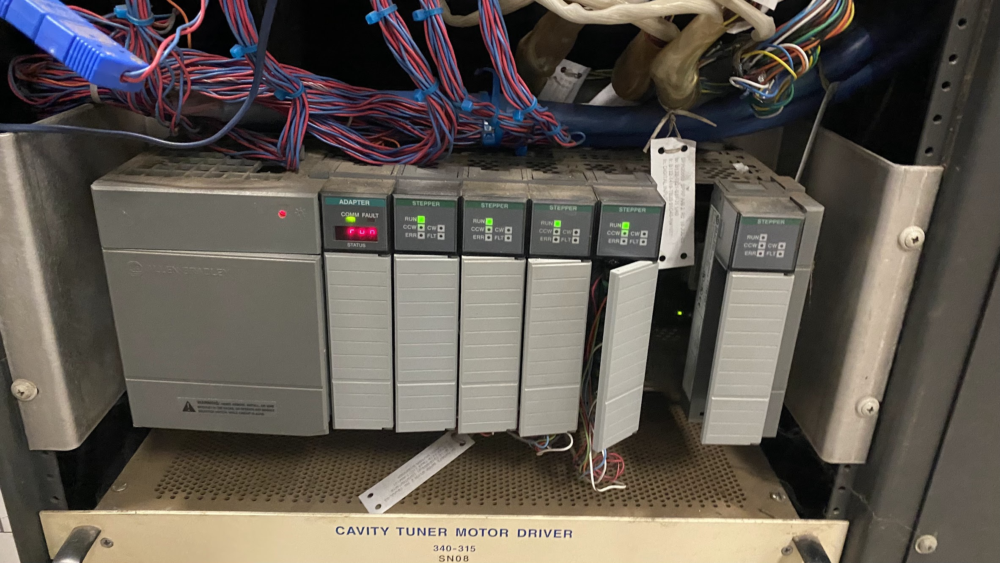
*Figure 17-1: Legacy Allen-Bradley Cavity Tuner Motor Driver chassis (SLAC 340-315, SN08) in the B132 electronics rack — showing the SLC adapter module (leftmost, with COMM FAULT indicator and STATUS showing RUN/fault) followed by four AB 1746-HSTP1 STEPPER modules (each with RUN, CCW, CW, ERR, FLT indicators; green RUN lights confirm active communication), plus one additional STEPPER module at far right; this chassis was the original motion controller for all four cavity tuners, and will be replaced by the Galil DMC-4143 with the LLRF upgrade project (expected in Aug. 2026)*

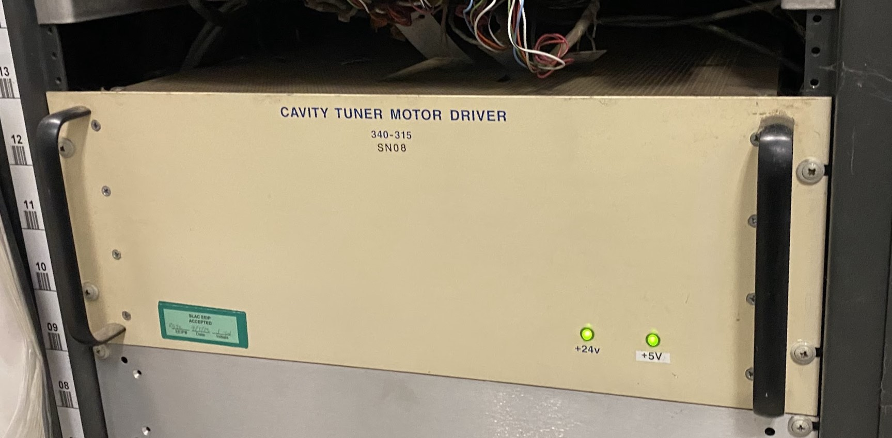
*Figure 17-2: Legacy Allen-Bradley Cavity Tuner Motor Driver chassis (SLAC 340-315, SN08) — closed front panel view showing the rack-mounted chassis faceplate with designation label, SLAC EEIP Accepted sticker, and two green power-health LEDs (+24V and +5V both illuminated); the chassis occupies approximately four rack units; slot position labels 08–13 from the adjacent rack frame are visible; the interior modules (SLC adapter and four 1746-HSTP1 stepper controllers) are shown in Figure 17-1*

---

## 18. Diagnostics, Calibration and Monitoring

### 18.1 RF Signal Monitoring

24 RF signals are monitored across the waveguide network (see §7.2 for complete table). In the legacy system, these are measured by the VXI IQA modules. In the upgrade, they will be distributed across LLRF9 units and the Waveform Buffer System.

### 18.2 HVPS Monitoring

4 analog monitoring signals from B514 to B118 (see §9.4). Additionally, the PLC monitors:

- 8 thermocouple channels (4 actively scaled to engineering units)
- Oil level switches (main tank, phase tank, crowbar tank)
- Contactor and grounding switch status
- All fiber optic signal states

### 18.3 Fault Recording

**Legacy fault file system**: On any fault triggering a station trip, the VXI IOC captures 11 signal channels to `/dat/FAULT<channel>_<n>` files (channels in capture order: RfpSI, RfpSQ, RfpCI, RfpCQ, CmbI, CmbQ, Iqa1Amp, Iqa2Amp, Gvf, Aim, Iqa3Amp). `NUMFFILES=11` in `rf_states.st` is the channel count; for SPEAR3 the CF2 module is not installed so the `#else` branch of `#ifdef CF2` applies, giving CmbI/CmbQ (comb filter channels) in place of Cf2I/Cf2Q. These files preserve pre-fault waveforms for post-mortem analysis.

### 18.4 Calibration Data

Calibration sequences are implemented in `rf_calib.st` (28 measurement states). Key calibrations include:

- RF signal amplitude and phase calibration against known references
- Klystron gain curve measurement
- Cavity detuning characterization
- Tuner motor step-to-frequency conversion factors

> **Sources**: [R19]; [R24]; [R18].

### 18.5 Fault Data Availability and Analysis

Four data sources capture fault event information at different time scales. Full access procedures and a step-by-step analysis guide are provided in `Designs/I_INTERLOCK_ARCHITECTURE.md` Part X (§10.1–10.6). Summary:

| Source | What It Captures | Storage Location | Access |
|--------|-----------------|------------------|--------|
| **AIM Hardware History Buffer** | 12 arc channel voltage waveforms + HVPS voltage; continuous ADC ring buffer, freezes on fault | VXI AIM on-board memory; exported to IOC `/dat/aimHist.dat` | Read `{STN}:STN:AIM:ARCLTDSTT` PV for latched arc channel bits; see Doc I §10.2 |
| **SNL Fault Files** (`/dat/FAULT*_N`) | 11 RF/IQA channels: RFP I/Q, cavity I/Q, IQA amplitude waveforms, AIM status snapshot | VxWorks `/dat/` directory on B132 VXI IOC; 15 slots circular buffer | Check `{STN}:STN:NFAULT` PV for current slot; transfer via NFS/FTP; see Doc I §10.3 |
| **B118 Oscilloscope (4 channels)** | CH1: HVPS DC voltage; CH2: HVPS DC current; CH3: Inductor T2 sawtooth voltage; CH4: Transformer T1 AC phase current | Standalone oscilloscope in B118 Hoffman Box area — not connected to EPICS | Direct field observation; single-shot trigger or freeze at fault; export via USB or photograph screen; EPICS scalar readback at 1 Hz via `{STN}:HVPS:VOLT` and `{STN}:HVPS:CURR` (DH+ AI records); see Doc I §10.4 |
| **EPICS Channel Archiver** | All EPICS PVs at ~1 Hz, multi-year rolling history | EPICS archiver server (SLAC controls group) | Strip Chart GUI, web interface, or Python Archiver Appliance REST API |

**Key PVs to check after any fault event** (see Doc I Appendix A for full list):

| PV | Significance |
|----|-------------|
| `{STN}:STN:AIM:ARCLTDSTT` | Which arc channels fired? (bits 0–3 = cavities, bit 4 = klystron, bit 5 = circulator; all zeros = non-arc fault) |
| `{STN}:HVPSXFORM:ARC:LTCH` | HV transformer internal arc |
| `{STN}:HVPS:CROWBAR:LTCH` | Crowbar fired |
| `{STN}:STN:MPS:LTCH` | RF MPS PLC trip |
| `{STN}:HVPSSTN:SUMY:LTCH` | Aggregated HVPS fault summary |
| `{STN}:STN:NFAULT` | Fault file slot number |

> **Sources**: `Designs/I_INTERLOCK_ARCHITECTURE.md` Part X (§10.1–10.6); §18.2; `rfApp/Db/rf_hvps.db` (HVPS scalar PV definitions).

---

# PART VI — INTEGRATION AND LEGACY CONSIDERATIONS

---

## 19. Cabling and Interconnections

### 19.1 Major Cable Runs

| Cable Run | Cable Type | Conductors | Route |
|-----------|-----------|------------|-------|
| B118 → Switchgear (Contactor) | Belden 83715 | 15C #16 Teflon | TS-5 to contactor controller |
| B118 → Termination Tank (Grounding) | Belden 83709 + Belden 83715 | 9C + 15C #16 Teflon | TS-6 to grounding tank |
| B118 → B514 (SCR triggers) | Electrical cable pairs | 12 pairs | Controller to Phase Tank thyristor stacks |
| B118 → B514 (Fiber optic) | Fiber optic | SCR ENABLE, CROWBAR, STATUS | Controller to HVPS power section |
| B132 → Tunnel (RF signals) | Coax cables | Forward, reflected, probe per cavity | LLRF inputs from cavities |
| B132 → Tunnel (Motor) | Multi-conductor | Motor power + encoder per cavity | To tuner assemblies |

### 19.2 Connector Types

| Interface | Connector | Notes |
|-----------|-----------|-------|
| PPS | GOB12-88PNE | Lockable, military-grade |
| RF signals | SMA/N-type | 50Ω coaxial |
| Fiber optic | HFBR series | Avago/Broadcom |
| PLC communication | AB DCM | Proprietary serial |
| Galil Ethernet | RJ-45 | Standard Ethernet |

> **Sources**: [R14]; [R15]; [R5] §3.

---

## 20. Known Issues, Limitations and Legacy Debt

### 20.1 Critical Issues

| Issue | Category | Impact | Details |
|-------|----------|--------|---------|
| PPS compliance | Safety | **Critical** | PLC in PPS chain; PPS wires exposed in HVPS controller enclosure |
| VXI crate obsolescence | Hardware | **Critical** | Custom SLAC modules (RFP, IQA, CLK, AIM) — no replacements available |
| SLC-500 PLC end-of-life | Hardware | **High** | Allen-Bradley discontinued; no vendor support |
| PLC-5 MPS platform | Hardware | **High** | Allen-Bradley discontinued; no vendor support |
| SLO-SYN driver obsolescence | Hardware | **Medium** | SS2000MD4-M discontinued |
| VxWorks/SNL software | Software | **High** | PEP-II era code (1997); unsupported OS; no modern development tools |

### 20.2 Documentation Gaps

| Gap | Impact | Notes |
|-----|--------|-------|
| K4/RR relay label error | Medium | Corrected in AI analysis; as-built drawings may still show incorrect labels |
| Manual grounding switch contact type | Low | Inconsistency between WD-730-794-06-C0 (NO) and SD-730-790-05-C1 (NC); field verification required |
| MPS trip logic completeness | Medium | 33 MPS wiring diagrams exist but a consolidated trip logic truth table has not been assembled |
| Operational setpoints and limits | High | Alarm limits, tuner deadbands, safe operating envelopes not systematically captured |

### 20.3 Operational Workarounds

Several operational workarounds are in place due to legacy limitations:

- Manual operator intervention required for some fault recovery sequences that could be automated
- Cavity processing (conditioning) requires careful manual voltage ramping due to limited automation in legacy SNL code
- PEP-II hardware modules (comb filter, GVF) occupy VXI slots but are non-functional in SPEAR3 configuration

---

---

## Appendix A — Source Document Reference Index

All references cited in this document, organized by reference number.

### A.1 Published Papers and Conference Proceedings

| Ref | Citation |
|-----|---------|
| [R1] | McIntosh, P. et al., "The SPEAR3 RF System," SLAC-PUB-10983 (also cited as SLAC-PUB-11017), presented at EPAC 2004, Lucerne, Switzerland. DOI: 10.2172/839730 |
| [R2] | Corredoura, P., "Architecture and Performance of the PEP-II Low-Level RF System," SLAC-PUB-8498, PAC 1999. DOI: 10.1109/PAC.1999.795726 |
| [R3] | Corredoura, P. et al., "Experience with the PEP-II RF System at High Beam Currents," arXiv:physics/0007029, EPAC 2000 |
| [R6] | Cassel, R. and Nguyen, M.N., "A Unique Power Supply for the PEP II Klystron at SLAC," SLAC-PUB-7591, PAC 1997. IEEE doi: 10.1109/PAC.1997.753249 |
| [R41] | Ziomek, C. and Corredoura, P., "Digital I/Q Demodulator," Proc. PAC 1995 |
| [R42] | Fox, J. et al., "Longitudinal Feedback System for PEP-II," Phys. Rev. ST Accel. Beams 13, 052802 (2010) |
| [R43] | Fowkes, W.R. et al., "PEP-II Prototype Klystron," SLAC-PUB-6093, April 1993 |
| [R44] | Fowkes, W.R. et al., "1.2 MW Klystron for Asymmetric Storage Ring B Factory," SLAC-PUB-6778, March 1995 |
| [R45] | Rimmer, R.A., "RF Cavity Development for the PEP-II B Factory," LBL-33360, November 1992 |
| [R46] | Rimmer, R.A. et al., "High-Power Testing of the First PEP-II RF Cavity," SLAC-PUB-7210 / LBNL-38147, June 1996 |
| [R47] | Robinson, K.W., "Stability of Beam in Radiofrequency System," CEA Report CEAL-1010, February 1964. DOI: 10.2172/4075988 |
| [R48] | Boussard, D., "Control of Cavities with High Beam Loading," IEEE Trans. Nucl. Sci. NS-32, PAC 1985 |
| [R49] | McIntosh, P., "An Automated 476 MHz RF Cavity Processing Facility at SLAC," SLAC-PUB-10083, July 2003. DOI: 10.2172/815601 |

### A.2 Textbooks and General References

| Ref | Citation |
|-----|---------|
| [R50] | Wiedemann, H., *Particle Accelerator Physics*, 4th ed., Springer, 2015 |
| [R51] | Dimtel, Inc., "LLRF9 Product Page," <https://www.dimtel.com/products/llrf9> |
| [R52] | Dimtel, Inc., "LLRF9/500 Specifications," <https://www.dimtel.com/products/specs/llrf9_500> |

### A.3 Original Engineering Documents in Repository

| Ref | Document | Repository Path |
|-----|----------|----------------|
| [R4] | LLRF9 Commissioning Tests (J. Sebek, 2021) | `llrf/tests/llrf9Tests.pdf` |
| [R5] | SPEAR3 LLRF System Design Report (PDR R1) | `Designs/0_SYSTEM_DESIGN_REPORT.md` and `Designs/docx/SPEAR3_LLRF_PDR_R1.docx` |
| [R7] | PEP-II RF System Description (Schwarz, PS-340-330-51-R0) | `llrf/documentation/legacyArchitecture/ps3403305100.pdf` |
| [R7t] | Transcription of [R7] | `llrf/documentation/legacyArchitecture/legacy-pdf-transcriptions/design-specifications/PS-340-330-51_RF_System_Description.md` |
| [R8] | LLRF Feedback Loop Description (Schwarz, PS-340-330-52-R0) | `llrf/documentation/legacyArchitecture/ps3403305200.pdf` (= `feedbackLoopDescriptionps3403305200.pdf`) |
| [R8t] | Transcription of [R8] | `llrf/documentation/legacyArchitecture/legacy-pdf-transcriptions/design-specifications/PS-340-330-52_LLRF_Feedback_Loop_Description.md` |
| [R9] | HVPS System Schematic (top-level) | `hvps/documentation/schematics/sd7307900101.pdf` |
| [R10] | LLRF Block Diagram (HER configuration) | `llrf/documentation/legacyArchitecture/bd3403300000.pdf` |
| [R11] | LLRF Block Diagram (alternative view) | `llrf/documentation/legacyArchitecture/bd3403300100.pdf` |
| [R12] | Analog Regulator Card Schematic | `hvps/documentation/schematics/sd2372301401.pdf` |
| [R13] | Voltage Divider Network Schematic | `hvps/documentation/schematics/sd2372301200.pdf` |
| [R14] | Interconnection: B118 ↔ Contactor ↔ Termination Tank | `hvps/documentation/wiringDiagrams/wd7307900103.pdf` |
| [R15] | Hoffman Box Internal Wiring | `hvps/documentation/wiringDiagrams/wd7307900206.pdf` |
| [R16] | Legacy SNL: rf_states.st (master state machine) | `spear-rf-code-legacy/rfApp/src/seq/rf_states.st` |
| [R17] | Legacy SNL: rf_hvps_loop.st (HVPS control) | `spear-rf-code-legacy/rfApp/src/seq/rf_hvps_loop.st` |
| [R18] | Legacy SNL: rf_tuner_loop.st (tuner control) | `spear-rf-code-legacy/rfApp/src/seq/rf_tuner_loop.st` |
| [R19] | Legacy SNL: rf_calib.st (calibration sequences) | `spear-rf-code-legacy/rfApp/src/seq/rf_calib.st` |
| [R20] | Legacy SNL: rf_msgs.st (message logging) | `spear-rf-code-legacy/rfApp/src/seq/rf_msgs.st` |
| [R21] | MPS Wiring Diagrams (33 drawings) | `llrf/documentation/mpsWiringDiagrams/wd3403300200.pdf` through `wd3403303400.pdf` |
| [R22] | PEP-II HVPS Technical Specification (PS-341-360-01-R2) | `hvps/architecture/originalDocuments/ps3413600102.pdf` |
| [R22t] | Transcription of [R22] | `hvps/architecture/originalDocuments/transcriptions/ps3413600102_transcription.md` |
| [R23] | HVPS Monitor Connections | `hvps/documentation/wiringDiagrams/hvpsMonitorConnections.xlsx` |
| [R24] | HVPS Measurements (March 2022) | `hvps/documentation/plc/hvpsMeasurements20220314.xlsx` |
| [R25] | PPS Wiring in Hoffman Box (J. Sebek) | `pps/HoffmanBoxPPSWiring.docx` |
| [R26] | PLC Ladder Logic Printout (Cassel) | `hvps/documentation/plc/CasselPLCCode.pdf` |
| [R27] | PLC Symbol/Label Database (Cassel) | `hvps/documentation/plc/CasselSymbolDatabase.pdf` |
| [R28] | Enerpro Schematics and Manuals (12 PDFs) | `hvps/controls/enerpro/enerproDocuments/` |
| [R29] | SLO-SYN Stepper Drive Manual | `llrf/tuners/SLO-SYN_SS2000MD4M_Step_Drive_Translator_Manual.pdf` |
| [R30] | SLO-SYN Motor Specifications | `llrf/tuners/SLO-SYN.pdf` |
| [R31] | Galil DMC-4103 Manual | `llrf/tuners/galil/dmc-4103-r13h-manual.pdf` |
| [R32] | Drive Amplifier Datasheet (KAW2051M12) | `llrf/driveAmp/KAW2051M12 (7-98-907-012A).pdf` |
| [R33] | Coaxial Cable Interconnection Diagram | `llrf/documentation/coaxCables/sd3403300100.pdf` |
| [R34] | Galil Commissioning Log (Aug 2025) | `llrf/tuners/galil/functioningGalil20250825SwapABToManual.txt` |
| [R35] | Galil Commissioning Documentation | `llrf/tuners/galil/GalilCommissioning.docx` |
| [R36] | Cavity Tuner Inspections (June 2023) | `llrf/tuners/cavityTunerInspections20230613.docx` |
| [R37] | PLC Operation Notes | `hvps/documentation/plc/plcNotesR1.docx` |
| [R38] | PLC Software Discussion | `hvps/documentation/plc/PLC software discusion 1.docx` |
| [R39] | PLC Label Database | `hvps/documentation/plc/hvpsPlcLabels.xlsx` |
| [R40] | Enerpro Board Integration Notes | `hvps/controls/enerpro/enerproBoardHvps.docx` |

### A.4 AI-Generated Analysis Products (Consulted, Unreviewed)

The following AI-generated technical notes were consulted during preparation of this document as preliminary analysis aids. They are **not cited as authoritative sources** per the Documentation Architecture Proposal §2.4.

| Directory | Files | Coverage |
|-----------|-------|----------|
| `hvps/architecture/technical-notes/` | 8 + notebook | HVPS system design, PEP-II heritage, schematics, regulator, integration |
| `hvps/documentation/plc/technical-notes/` | 9 | PLC hardware, I/O config, ladder logic, algorithms, safety |
| `hvps/documentation/schematics/technical_notes/` | 14 | Individual schematic analyses |
| `hvps/controls/enerpro/technical-notes/` | 9 | Enerpro system, hardware, circuits, control theory |
| `llrf/documentation/legacyArchitecture/technical-notes/` | 6 | PEP-II/SPEAR3 reference, feedback loops, VXI hardware |
| `pps/diagrams/` | 11 | PPS system, contactor, Ross switch, Hoffman box, PLC code |
| `spear-rf-code-legacy/codeReviewTechnicalNotes/` | 9 | Executive summary, architecture, VXI, DSP, SNL, PLC |

**Total AI-generated analysis**: ~100 markdown files, ~24,000+ lines

**⚠️ PROVENANCE WARNING**: All files in the directories above are AI-generated analysis products. They were created by analyzing original source documents and are in reviewing process. Always verify against original source documents.

### A.5 External Web References

| Ref | URL | Content |
|-----|-----|---------|
| [W1] | <https://inspirehep.net/files/945e7ff73cc428af4c018fd1bdb6afa7> | McIntosh et al. EPAC04 full text |
| [W2] | <https://www.osti.gov/biblio/839730> | OSTI record for SLAC-PUB-10983 (SPEAR3 RF System) |
| [W3] | <https://digital.library.unt.edu/ark:/67531/metadc619632/> | Corredoura, PEP-II LLRF Architecture (UNT Digital Library) |
| [W4] | <https://www.osti.gov/biblio/10204> | OSTI record for Corredoura PAC99 |
| [W5] | <https://arxiv.org/pdf/physics/0007029> | Corredoura et al., PEP-II RF at High Beam Currents |
| [W6] | <https://ieeexplore.ieee.org/document/753249/> | Cassel & Nguyen, PEP-II Klystron Power Supply (IEEE) |
| [W7] | <https://www.osti.gov/servlets/purl/7066243> | Rimmer, RF Cavity Development for PEP-II (LBL-33360) |
| [W8] | <https://www.osti.gov/servlets/purl/505666> | Rimmer et al., High-Power Testing PEP-II RF Cavity |
| [W9] | <https://www.osti.gov/biblio/4075988> | Robinson, Stability of Beam in RF System (CEAL-1010) |
| [W10] | <https://proceedings.jacow.org/p85/PDF/PAC1985_1852.PDF> | Boussard, Control of Cavities with High Beam Loading |
| [W11] | <https://www.dimtel.com/products/llrf9> | Dimtel LLRF9 product page |
| [W12] | <https://www.dimtel.com/products/specs/llrf9_500> | LLRF9/500 specifications |
| [W13] | <https://inspirehep.net/files/dd3ac6684a603446924fb193fcd7faf0> | Fowkes et al., 1.2 MW Klystron (SLAC-PUB-6778) |
| [W14] | <https://s3.cern.ch/inspire-prod-files-e/ede001caff380d3448f21bc3b1d5e371> | Fowkes et al., PEP-II Prototype Klystron (SLAC-PUB-6093) |
| [W15] | <https://slac.stanford.edu/pubs/slacpubs/10000/slac-pub-10083.pdf> | McIntosh, 476 MHz Cavity Processing (SLAC-PUB-10083) |
| [W16] | <https://www.osti.gov/biblio/815601> | OSTI record for SLAC-PUB-10083 |
| [W17] | <https://inspirehep.net/literature/1102529> | INSPIRE record for Robinson 1964 |
| [W18] | <https://www.desy.de/~branlard/papers/LINAC14/WEIOA06.pdf> | Branlard, "Low Level RF for SRF Accelerators," LINAC14 |

---

## Appendix B — Symbol and Notation Conventions

### B.1 Frequently Used Symbols

| Symbol | Definition | Typical Unit |
|--------|-----------|-------------|
| f₀, ω₀ | Cavity resonant frequency | MHz, rad/s |
| f_RF, ω_RF | RF operating frequency (476.315 MHz) | MHz, rad/s |
| f_rev, ω_rev | Revolution frequency (1.2804 MHz) | MHz, rad/s |
| f_s, ω_s | Synchrotron frequency (~9.4 kHz) | kHz, rad/s |
| Q₀ | Unloaded quality factor (33,500) | dimensionless |
| Q_L | Loaded quality factor (6,700) | dimensionless |
| β | Coupling coefficient = Q₀/Q_ext (4.0) | dimensionless |
| R_s | Shunt impedance (3.8 MΩ) | MΩ |
| V_gap | Gap voltage per cavity (~712 kV operating) | kV |
| I_b | DC beam current (500 mA design) | mA or A |
| V_HV | HVPS output voltage (−74.7 kV operating) | kV |
| I_HV | HVPS output current (19.4 A operating) | A |
| α | SCR firing angle | degrees |
| SIG HI | Enerpro control voltage (proportional to α) | V |

### B.2 Abbreviations

| Abbreviation | Definition |
|-------------|-----------|
| AIM | Arc/Interlock Module (VXI) |
| CLK | Clock/RF Distribution module (VXI) |
| DCM | Direct Communication Module (Allen-Bradley) |
| GVF | Gap Voltage Feed-Forward (PEP-II only) |
| HER | High Energy Ring (PEP-II) |
| HOM | Higher-Order Mode |
| HVPS | High-Voltage Power Supply |
| IQA | IQ/Amplitude detector module (VXI) |
| LLRF | Low-Level RF |
| MPS | Machine Protection System |
| PPS | Personnel Protection System |
| RFP | RF Processor module (VXI) |
| SCR | Silicon Controlled Rectifier (thyristor) |
| SNL | State Notation Language (EPICS) |

### B.3 Conventions

1. **Shunt impedance convention**: This document uses the **linac convention** (R_s = V²/2P) unless explicitly stated otherwise. The accelerator convention (R_s = V²/P) gives values exactly 2× larger.

2. **Phase convention**: Positive phase angles represent phase advance. The synchronous phase φ_s is measured from the zero-crossing of the RF voltage.

3. **Frequency detuning**: Δf = f₀ − f_RF. Negative detuning (Δf < 0) means the cavity resonant frequency is below the RF frequency — the normal operating condition for beam loading compensation above transition.

4. **Reference tag format**: [Rn] for numbered references, [Rnt] for transcription of the same source, [Wn] for web references.

5. **Voltage polarity**: HVPS voltages are reported as positive magnitudes unless preceded by a minus sign. The actual cathode polarity is negative (−77 kV).

---

*End of Document*

**Document Control**:

- This document is the Tier 2 legacy system reference for the SPEAR3 RF system.
- The definitive version is `Designs/L_LEGACY_SYSTEM_ARCHITECTURE.md` in the `spearlegacyLLRF` repository.
- **Provenance**: AI-ASSISTED — structure and content proposed by AI based on exhaustive review of original source documents, published papers, and web research. Subject to human review and approval by a named engineer.
- **Review status**: In the reviewing process.
