# Project Timeline

> **Reference**: SPEAR3-LLRF-PDR-001 (March 2026)
> **Status legend**: ✅ Complete | 🔄 In Progress | ⬜ Not Started

---

## Hardware Readiness Summary

| Subsystem | Hardware | Status |
|-----------|----------|--------|
| LLRF9 (Dimtel LLRF9/476) | 4 units received | ✅ |
| Klystron MPS PLC (ControlLogix 1756) | Assembled; standalone-tested (no RF power) | ✅ |
| HVPS PLC modules (CompactLogix) | Received — HVPS1, HVPS2, B44 test stand | ✅ |
| Galil DMC-4143 Motion Controller | Commissioned and operational | ✅ Aug 2025 |
| Enerpro FCOG1200 SCR Gate Driver boards | 5 boards required | ⬜ Needed |
| Arc Detection (Microstep-MIS) | 10 sensors + 5 process chassis + spares | ⬜ Needed |
| Waveform Buffer System | Design complete; PCB not yet fabricated | 🔄 |
| Interface Chassis | Specification in progress | 🔄 |
| Heater SCR Controller | Not started | ⬜ Needed |
| PPS Interface Box | Not started | ⬜ Needed |
| Control Software (Python/EPICS Coordinator) | Not started — **critical risk** | ⬜ Needed |

---

## Project Path Overview

Every step in the project is shown below — all Phase 1 standalone tracks, their IC integration tests, the incremental TS18 sub-integration spine, the three cavity-dependent tracks merging at SPEAR3, and final commissioning. The PPS Interface Box is an independent safety-approval track.

**Reading the diagram:**
- Each Phase 1 hardware track going to TS18 (HVPS, Heater, Kly MPS, WFB) ends with a **SW Integration Test** node — validating its Python interface module against live hardware before entering TS18. Arc Detection and PPS are excluded.
- Each Phase 1 track also ends with an **IC Integration Test** node (where listed in the per-subsystem timeline).
- The ⚠️ Interface Chassis standalone test (IC5) is a gate: no subsystem can do its IC integration test until IC5 passes.
- Software Stream 1 (SWA2) provides the interface modules. Each module is then tested against its live hardware subsystem; all four tests feed back into the SW gate node (SWA3) before the SW streams merge.
- TS18 (Phase 2A) builds up the integrated sub-system one subsystem at a time. Each step depends on that subsystem's SW **and** IC integration tests passing.
- SPEAR3 (Phase 2B) adds the three cavity-dependent subsystems to the TS18 output.

```mermaid
flowchart LR

    %% ════════════════════════════════════════════════════════════════
    %% PHASE 1 — Standalone Development
    %% Each subsystem ends at its IC Integration Test (where applicable)
    %% ════════════════════════════════════════════════════════════════

    subgraph hw1["HVPS — Stream 1: CompactLogix PLC"]
        direction LR
        HA1("✅ PLC HW\nReceived") --> HA2("PLC Online\nB44 Test Stand") --> HA3("EPICS Dev\nSRF1:HVPS: PVs") --> HA4("SW Integration\nTest: HVPS\nmodule vs live\nCompactLogix")
    end

    subgraph hw2["HVPS — Stream 2: SCR Gate Driver + Regulator Board"]
        direction LR
        HB1("Procure\nFCOG1200 ×5") --> HB2("Regulator\nBoard Design") --> HB3("Regulator\nBoard Fab") --> HB4("Standalone\nTest on TS18")
    end

    subgraph htr["Heater Controller (SCR-based)"]
        direction LR
        HTR1("Design\nSCR + Filter\n+ RMS Monitor") --> HTR2("Fabrication") --> HTR3("Bench\nTest") --> HTR4("SW Integration\nTest: Heater\nmodule vs live\nSCR controller")
    end

    subgraph mps["Klystron MPS PLC (ControlLogix 1756)"]
        direction LR
        MPS1("✅ HW Assembled\nStandalone Tested\nno RF power") --> MPS2("EPICS IOC Dev\nSRF1:MPS: PVs\npermit/fault/reset") --> MSW("SW Integration\nTest: MPS EPICS\nmodule vs live\nControlLogix") --> MPS3("Mock Test\nvs Simulated\nIC I/O") --> MPS4("IC Integration\nTest: fault status\nword, heartbeat,\nreset sequencing")
    end

    subgraph wfb["Waveform Buffer System"]
        direction LR
        WFB1("✅ System\nDesign Complete") --> WFB2("PCB Design\nADC + comparators\n+ EPICS") --> WFB3("Fabrication\n+ Assembly") --> WFB4("Standalone Test\ncirc. buffers,\ncomparators,\nEPICS waveforms") --> WSW("SW Integration\nTest: WFB EPICS\nmodule vs live\nPCB hardware") --> WFB5("IC Integration\nTest: comparator\ntrips → IC\npermit logic")
    end

    subgraph ic["⚠️ Interface Chassis — CRITICAL PATH"]
        direction LR
        IC1("🔄 Eng Spec\nFinalize I/O\nSignal List") --> IC2("Logic Design\nAND-gate\nFirst-fault\nFiber I/O") --> IC3("PCB + Mech\nDesign") --> IC4("Fabrication\n+ Assembly") --> IC5("Standalone Test\ninterlock logic,\nfiber I/O,\nhbt watchdog")
    end

    subgraph sw["⚠️ Control Software (Python/EPICS) — CRITICAL, Start Now"]
        direction LR
        SWA1("Arch Design\n+ PV Naming\nConventions") --> SWA2("HW Interface\nModules\n+ Mock Interfaces\nper subsystem")
        SWA3("All HW Iface\nModules live-\ntested: HVPS,\nHeater, MPS, WFB")
        SWB1("State Machine\nOFF→PARK→\nTUNE→ON_CW\n→FAULT") --> SWB2("HVPS Loop\n+ Tuner Mgr\n+ Load Angle") --> SWB3("Fault Mgr\n+ Auto-Recovery\n+ Logging\n+ EDM Panels")
        SWA3 & SWB3 --> SWMRG("SW Streams\nMerged\nAll modules\ntested vs\nreal HW")
    end

    subgraph llrf["LLRF9 — Units 1 & 2 (cavity-dependent)"]
        direction LR
        L1("✅ 4 Units\nReceived") --> L2("Install B132\n+ Connect\n24 RF Cables") --> L3("EPICS IOC\nVerify PVs\nLLRF1: LLRF2:") --> L4("Standalone RF\nTest: vector sum\nfeedback, tuner\nphase at 10 Hz") --> L5("IC Integration\nTest: enable\nsignal, interlock\ndaisy-chain")
    end

    subgraph arc["Arc Detection System (cavity-dependent)"]
        direction LR
        ARC1("Procure\n10 Sensors\n5 Process\nChassis + spares") --> ARC2("Mech Mounting\nAdapters for\nCF Flange\nViewports") --> ARC3("Chassis Design\nHW OR-gate\n5-bit Latch\nfor fault ID") --> ARC4("Chassis\nFabrication") --> ARC5("Standalone Test\nfast permit OR\n+ 5-bit ID latch") --> ARC6("IC Integration\nTest: fast permit\n+ 5-bit fault ID\ninto IC reg")
    end

    subgraph gal["Galil DMC-4143 Motion Controller (cavity-dependent)"]
        direction LR
        GAL1("✅ Operational\nAug 2025\nSPEAR3 installed") --> GAL2("Booster Cavity\nTest — validate\nbefore storage\nring") --> GAL3("SPEAR3 Cavity\nTest — tuner\nsteps, pot\nreadback") --> GAL4("EPICS Motor\nRecord integ.\n+ LLRF9\nphase feedback") --> GAL5("IC Integration\nTest: EPICS\nmotor cmds +\ntuner loop via IC")
    end

    subgraph pps["PPS Interface Box — Independent Safety Approval Track"]
        direction LR
        PPS1("Design\n4-relay board\nLEDs, lockable\nper SLAC std") --> PPS2("SLAC AD Safety\nDiv Review\n+ Approval") --> PPS3("Fabrication") --> PPS4("Test with\nHoffman Box\nK4 + Ross sw") --> PPS5("Commission")
    end

    %% ════════════════════════════════════════════════════════════════
    %% PHASE 2A — TS18 Sub-Integration (Klystron + Load · No Cavity)
    %%   Each step adds one subsystem that has passed its IC integ. test
    %% ════════════════════════════════════════════════════════════════

    subgraph ts18["Phase 2A — TS18 Sub-Integration  (Klystron + Dummy Load · No RF Cavity)"]
        direction LR
        TS1["① HVPS Combined\nPLC + SCR Gate\nDriver + Regulator\nClosed-loop HV\nregulation"] -->
        TS2["② + Heater Ctrl\nWarm-up / cool-down\nsequences · HVPS–\nHeater coordination\ninterlock"] -->
        TS3["③ + Interface Chassis\nHardware interlock\nloop · Fiber links:\nSCR ENABLE,\nCROWBAR, STATUS"] -->
        TS4["④ + Kly MPS PLC\nPermit / heartbeat /\nreset round-trip ·\nFirst-fault latch\nvalidation"] -->
        TS5["⑤ + Waveform Buffer\nHVPS ch: V, I,\ninductor voltages ·\nKly fwd/refl RF ch ·\nCollector power algo\nDC–RF = Pcollector"] -->
        TS6["⑥ + Software\nFull stack live:\nstate machine,\nHVPS loop, heater\nseq, fault mgr, EDM"] -->
        TS7["⑦ Incremental\nRF Power Ramp\ninto dummy load ·\nControl loop tests ·\nProtection chain\nvalidation"]
    end

    %% ════════════════════════════════════════════════════════════════
    %% PHASE 2B — SPEAR3 Full Integration
    %%   TS18 output + cavity-dependent tracks (each after IC integ. test)
    %% ════════════════════════════════════════════════════════════════

    subgraph spear["Phase 2B — SPEAR3 Full Integration  (Live Cavities · Full RF Chain)"]
        direction LR
        SP1["① + LLRF9 ×2\nRF fast feedback\n270 ns loop · IC\nenable chain ·\nwaveform capture"] -->
        SP2["② + Galil\nCavity tuner\nEPICS loop ·\nLoad angle\noffset ctrl"] -->
        SP3["③ + Arc Detection\nFast permit to IC\n(OR of 5 sensors) ·\n5-bit fault ID\nlatch in IC"] -->
        SP4["④ End-to-End\nInterlock Verify ·\nFault injection\nall protection\nlayers"]
    end

    %% ════════════════════════════════════════════════════════════════
    %% PHASE 3 & 4 — Final Commissioning
    %% ════════════════════════════════════════════════════════════════

    subgraph final["Phase 3 & 4 — Final Commissioning on SPEAR3"]
        direction LR
        FC1["+ PPS Box\nConnected\n(K4 + Ross sw\nvia dedicated box)"] -->
        FC2["SW Full\nValidation\nvs complete\nhardware"] -->
        FC3["RF Power\nRamp on\nSPEAR3\nwith cavities"] -->
        FC4["Performance\nValidation\n(stability, diag,\nsuccess criteria)"] -->
        FC5["Op Training\n+ Commissioning\nDocs"] -->
        FC6(["✅ OPERATION"])
    end

    %% ════════════════════════════════════════════════════════════════
    %% DEPENDENCY EDGES
    %%
    %% Rule: IC5 (standalone) gates ALL per-subsystem IC integration tests.
    %% Each subsystem's IC integ. test node then gates its TS18/SPEAR3 step.
    %% ════════════════════════════════════════════════════════════════

    %% -- HVPS streams → TS18-① (IC joins at TS18-③, so HVPS first tested without IC)
    HA4  -->|"Stream 1 +\nSW test passed"| TS1
    HB4  -->|"Stream 2\nready"| TS1

    %% -- Heater bench + SW test → TS18-②
    HTR4 -->|"Bench + SW\ntest passed"| TS2

    %% -- Software module ready → enables per-subsystem SW integration tests
    SWA2 -->|"SW module\nready"| HA4
    SWA2 -->|"SW module\nready"| HTR4
    SWA2 -->|"SW module\nready"| MSW
    SWA2 -->|"SW module\nready"| WSW

    %% -- Per-subsystem SW integration tests → SW merge gate (SWA3)
    HA4  -->|"HVPS SW\ntested"| SWA3
    HTR4 -->|"Heater SW\ntested"| SWA3
    MSW  -->|"MPS SW\ntested"| SWA3
    WSW  -->|"WFB SW\ntested"| SWA3

    %% -- IC standalone → IC joins HVPS+Heater at TS18-③
    IC5  -->|"IC ready"| TS3

    %% -- IC standalone → enables each subsystem's IC integration test
    IC5  -->|"IC ready\nfor integ."| MPS4
    IC5  -->|"IC ready\nfor integ."| WFB5
    IC5  -->|"IC ready\nfor integ."| L5
    IC5  -->|"IC ready\nfor integ."| GAL5
    IC5  -->|"IC ready\nfor integ."| ARC6

    %% -- Per-subsystem IC integ. tests → TS18 build-up steps
    MPS4 -->|"IC integ.\npassed"| TS4
    WFB5 -->|"IC integ.\npassed"| TS5

    %% -- Software: mock → test vs real HW → merge → TS18-⑥
    SWMRG -->|"SW merged +\nall HW tested"| TS6

    %% -- TS18 complete + cavity-dependent IC integ. tests → SPEAR3 steps
    TS7  -->|"TS18\ncomplete"| SP1
    L5   -->|"IC integ.\npassed"| SP1
    GAL5 -->|"IC integ.\npassed"| SP2
    ARC6 -->|"IC integ.\npassed"| SP3

    %% -- SPEAR3 + PPS → Final Commissioning
    SP4  --> FC1
    PPS5 -->|"Safety approval\ngranted"| FC1

    %% ════════════════════════════════════════════════════════════════
    %% STYLES
    %% ════════════════════════════════════════════════════════════════
    style ic    fill:#fff8e1,stroke:#f9a825,stroke-width:2px
    style sw    fill:#fff8e1,stroke:#f9a825,stroke-width:2px
    style ts18  fill:#fff3e0,stroke:#ef6c00,stroke-width:2px
    style spear fill:#e8f5e9,stroke:#2e7d32,stroke-width:2px
    style final fill:#e3f2fd,stroke:#1565c0,stroke-width:2px
    style pps   fill:#fce4ec,stroke:#c62828,stroke-width:1px
```

---

## Phase 1 — Maximum Standalone Development

All subsystems are developed and tested independently before integration. Work proceeds in parallel across all subsystems.

---

### PPS Interface Box

> Dedicated Bud enclosure (4 relays, status LEDs, PPS-lockable connector) per SLAC standard design.
> Architecturally independent from the Interface Chassis — handles personnel safety only (K4 relay + Ross grounding switch).
> Requires SLAC AD Safety Division review and approval before commissioning.

| Step | Description |
|------|-------------|
| 1 | Design (4-relay board, status LEDs, lockable connector — per approved SLAC PPS standard) |
| 2 | Review and approval by SLAC AD Safety Division |
| 3 | Fabrication |
| 4 | Test with existing HVPS Hoffman Box (K4 relay + Ross grounding switch) |
| 5 | Commissioning |
| 6 | Operation |

---

### Tuner / Motion Controller (Galil DMC-4143)

> Galil DMC-4143 4-axis controller replaced the legacy AB 1746-HSTP1 + Slo-Syn system and was commissioned in August 2025. Remaining work is SPEAR cavity validation, EPICS integration, and Interface Chassis integration.

| Step | Description | Status |
|------|-------------|--------|
| 1 | Commission Galil on SPEAR3 (replaced AB stepper system) | ✅ Aug 2025 |
| 2 | Test Galil with Booster RF cavity (validate before SPEAR3 storage ring) | 🔄 |
| 3 | Test with SPEAR3 cavity | ⬜ |
| 4 | EPICS motor record integration; test with LLRF9 phase feedback | ⬜ |
| 5 | Integration test with Interface Chassis | ⬜ |

---

### Heater Controller (SCR-based)

> Replaces legacy motor-driven variac with solid-state SCR zero-crossing control. Provides automated warm-up/cool-down sequences via EPICS.
> Must coordinate with HVPS: heater must reach operating temperature before HVPS enable; HVPS must be off before heater cooldown.

| Step | Description |
|------|-------------|
| 1 | Design (SCR zero-crossing switching, LC low-pass filter ~159 Hz, true RMS monitoring) |
| 2 | Fabrication |
| 3 | Standalone bench test |
| 4 | Software integration test — validate Python Heater interface module against live SCR controller (warm-up/cool-down EPICS sequences) |
| 5 | Test on klystron in TS18 |
| 6 | Integration test with HVPS controller on TS18 |

---

### HVPS Controller

> Replaces SLC-500 PLC with CompactLogix. PLC hardware received. SCR gate driver boards (Enerpro FCOG1200) and redesigned regulator board still needed.
> PLC is **removed from the PPS safety chain** in the upgraded design — safety handled by the dedicated PPS Interface Box.
> After TS18 tests, joins Interface Chassis for final SPEAR 3 commissioning.

Two parallel work streams that merge at Step 4:

**Stream 1 — CompactLogix PLC & EPICS**

| Step | Description | Status |
|------|-------------|--------|
| 1 | CompactLogix PLC modules received | ✅ |
| 2 | PLC online (HVPS1 + B44 test stand) | 🔄 |
| 3 | EPICS interface development and test (`SRF1:HVPS:` PVs) | ⬜ |
| 4 | Software integration test — validate Python HVPS interface module against live CompactLogix (`SRF1:HVPS:` setpoints, readbacks, interlock status) | ⬜ |
| 5 | Integrate with Stream 2 — full HVPS controller test on TS18 | ⬜ |
| 6 | Integrate with Heater Controller — joint test on TS18 | ⬜ |
| 7 | Join Interface Chassis for final commissioning on SPEAR 3 | ⬜ |

**Stream 2 — SCR Gate Driver & Redesigned Regulator Board**

| Step | Description | Status |
|------|-------------|--------|
| 1 | Procure 5× Enerpro FCOG1200 SCR gate driver boards | ⬜ |
| 2 | Redesigned analog regulator board — design | ⬜ |
| 3 | Redesigned analog regulator board — fabrication | ⬜ |
| 4 | Standalone test on TS18 | ⬜ |
| 5 | *(Merge into Stream 1, Step 4)* | — |

---

### Klystron MPS (ControlLogix 1756)

> Hardware assembled and standalone-tested (no RF power). EPICS IOC not yet developed.
> The Kly MPS provides permit, heartbeat, and reset signals to the Interface Chassis — it does **not** directly drive LLRF9 or HVPS hardware (that is done by the Interface Chassis).

| Step | Description | Status |
|------|-------------|--------|
| 1 | Hardware assembled; standalone software test (no RF power) | ✅ |
| 2 | EPICS IOC development (`SRF1:MPS:` PVs — permit, faults, first-fault ID, reset) | ⬜ |
| 3 | Software integration test — validate Python MPS interface module against live ControlLogix EPICS IOC (`SRF1:MPS:` PVs) | ⬜ |
| 4 | Standalone mock integration test (simulated Interface Chassis I/O) | ⬜ |
| 5 | Integration test with Interface Chassis (fault status word, heartbeat, reset sequencing) | ⬜ |

---

### LLRF9 (Units 1 & 2)

> Hardware received (4 units: 2 active, 2 spare). Unit 1 = Field Control + Tuner Loops; Unit 2 = Monitoring + Interlocks.
> LLRF9 has a built-in Linux EPICS IOC. Units are interlock-daisy-chained (Unit 2 reflected power trip disables Unit 1 drive).

| Step | Description | Status |
|------|-------------|--------|
| 1 | Hardware received and inventoried (4 units) | ✅ |
| 2 | Install in B132; connect RF signal cables (24 RF channels across 2 units) | ⬜ |
| 3 | EPICS IOC verification and PV mapping (`LLRF1:`, `LLRF2:` prefixes) | ⬜ |
| 4 | Standalone test with real RF signals (vector sum, fast feedback, tuner phase readout) | ⬜ |
| 5 | Integration test with Interface Chassis (enable signal, interlock daisy-chain) | ⬜ |

---

### Waveform Buffer System

> New subsystem. System design complete; PCB design in progress. 8 RF channels + 4 HVPS channels with circular buffers.
> Key feature: enhanced klystron collector power protection (calculates DC Power − RF Power directly, vs. legacy forward-power proxy).

| Step | Description | Status |
|------|-------------|--------|
| 1 | System-level design (8 RF + 4 HVPS channel assignments, conditioning, collector power algorithm) | ✅ |
| 2 | PCB design (ADCs, hardware comparators, circular buffers, EPICS interface) | 🔄 |
| 3 | Fabrication and assembly | ⬜ |
| 4 | Standalone test (comparator thresholds, circular buffer capture, EPICS waveform readout) | ⬜ |
| 5 | Software integration test — validate Python WFB interface module against live PCB hardware (waveform readout, threshold setpoints via EPICS) | ⬜ |
| 6 | Integration test with Interface Chassis (comparator trip outputs → permit logic) | ⬜ |

---

### Arc Detection System (Microstep-MIS)

> New subsystem — 5 sensors total (4 cavity windows + 1 klystron window).
> The Arc Detection Chassis routes two paths to the Interface Chassis: one fast trip permit wire (OR of all 5 sensors) and five individual latched status bits for diagnostic identification.

| Step | Description | Status |
|------|-------------|--------|
| 1 | Procure Microstep-MIS sensors (10 sensors + 5 process chassis + spares) | ⬜ |
| 2 | Design mechanical mounting adapters for CF flange viewport sensors | ⬜ |
| 3 | Design Arc Detection Chassis (hardware OR-gate for fast trip + 5-bit latching register for fault ID) | ⬜ |
| 4 | Fabricate and assemble Arc Detection Chassis | ⬜ |
| 5 | Standalone test (sensor → chassis: verify fast permit output and 5-bit identification latch) | ⬜ |
| 6 | Integration test with Interface Chassis | ⬜ |

---

### Interface Chassis ⚠️ Critical Path

> **Central hub for all hardware interlocks.** New subsystem — specification in progress, design not started.
> Implements first-fault detection, hardware AND-gate (<1 μs), optocoupler isolation, and fiber-optic HVPS control.
> Required before any system integration can proceed — all other subsystems feed into it.

| Step | Description | Status |
|------|-------------|--------|
| 1 | Engineering specification (finalize all I/O signal list; resolve open interface questions) | 🔄 |
| 2 | Logic design (first-fault detection, AND-gate, fiber I/O, optocoupler isolation, fail-safe outputs) | ⬜ |
| 3 | PCB and chassis mechanical design | ⬜ |
| 4 | Fabrication and assembly | ⬜ |
| 5 | Standalone test (interlock logic, fiber I/O, first-fault latching, MPS heartbeat watchdog) | ⬜ |

---

### Control Software (Python/EPICS Coordinator) ⚠️ Critical — Start Immediately

> Replaces all legacy SNL/VxWorks code. Supervisory layer only (~1 Hz) — **not** in the fast safety path.
> Largest untouched scope in the project. Delays directly block Phase 3 and Phase 4.
> Begin framework and mock-interface development immediately, before hardware is ready.

Two parallel development streams that merge before final commissioning:

**Stream 1 — Hardware Subsystem Interfaces**

| Step | Description | Status |
|------|-------------|--------|
| 1 | Architecture design; define PV naming conventions and module API | ⬜ |
| 2 | Interface modules for each subsystem (LLRF9, HVPS, Kly MPS, Motor Ctrl, Heater, Waveform Buffer) with mock interfaces | ⬜ |
| 3 | Test each module against corresponding live hardware | ⬜ |
| 4 | Integrate with Stream 2 | ⬜ |

**Stream 2 — Control Loops & Operator Interface**

| Step | Description | Status |
|------|-------------|--------|
| 1 | State machine design (OFF → PARK → TUNE → ON_CW → FAULT; turn-on/down sequences) | ⬜ |
| 2 | HVPS supervisory loop (`hvps_controller.py`) | ⬜ |
| 3 | Tuner manager (`tuner_manager.py`) + load angle offset controller | ⬜ |
| 4 | Fault manager + auto-recovery sequences + structured event logging | ⬜ |
| 5 | EDM operator panel development | ⬜ |
| 6 | Integrate with Stream 1 | ⬜ |

---

## Phase 2A — TS18 Sub-Integration System

> **TS18 configuration**: Klystron + dummy load. **No RF cavities, no tuners, no arc detection sensors.**
> Goal: assemble a near-final integrated sub-system at TS18 that exercises every subsystem and software module that does *not* require cavities. This enables full hardware interlock validation, software commissioning, and incremental klystron RF power ramp testing well before SPEAR3 downtime is needed.

### What TS18 Can Test

| Capability | Notes |
|------------|-------|
| HVPS voltage regulation (CompactLogix + SCR gate driver + regulator) | Full closed-loop control |
| Heater Controller warm-up / standby / cool-down sequences | EPICS-driven automated sequences |
| HVPS + Heater coordination (heater ready before HVPS enable; HVPS off before cooldown) | Critical interlock logic |
| Interface Chassis hardware interlock logic (first-fault detection, fiber I/O, optocoupler ISO) | All non-cavity permits exercised |
| Kly MPS permit / heartbeat / reset round-trip with Interface Chassis | Full fault aggregation loop |
| Waveform Buffer — HVPS channels (V, I, inductor voltages) + klystron forward/reflected RF channels | Circular buffer capture on fault |
| Collector power protection algorithm: DC Power − RF Power (direct calculation) | Validates upgrade vs. legacy forward-power proxy |
| Software state machine (OFF → STANDBY → ON_CW into load → FAULT → recovery) | Full turn-on / shutdown sequences |
| Software HVPS supervisory loop, fault manager, EDM operator panels | End-to-end software commissioning |
| Incremental klystron RF power ramp into dummy load | De-risks the final SPEAR3 power ramp |

### What TS18 Cannot Test (no cavity)

| Capability | Required for |
|------------|-------------|
| LLRF9 vector-sum fast feedback (270 ns loop) | Needs live cavities |
| Cavity tuner control + load angle offset loop | Needs cavity probes + mechanical tuners |
| Arc detection on cavity windows | Needs cavity viewport sensors |
| Full 24-channel RF signal monitoring | Cavity forward / reflected / probe signals |

### TS18 Integration Steps

| Step | Description | Dependencies |
|------|-------------|--------------|
| 1 | HVPS PLC (Stream 1) + SCR Gate Driver + Regulator (Stream 2) — combined HVPS test | HVPS Streams 1 & 2 complete; HVPS SW integration test complete |
| 2 | Add Heater Controller — joint HVPS + Heater coordination test | Heater standalone + SW integration test complete |
| 3 | Add Interface Chassis — hardware interlock loop with HVPS + Heater (fiber links: SCR ENABLE, CROWBAR, STATUS) | IC standalone test complete |
| 4 | Add Kly MPS — permit / heartbeat / reset round-trip with Interface Chassis; first-fault latch validation | MPS EPICS IOC + SW integration + mock test complete |
| 5 | Add Waveform Buffer — HVPS channels + klystron RF channels; comparator trip into Interface Chassis; collector power algorithm | WFB standalone + SW integration test complete |
| 6 | Integrate Software — state machine, HVPS loop, heater sequences, fault manager, EDM panels — tested against live TS18 hardware | SW Streams 1 & 2 merged |
| 7 | Incremental klystron RF power ramp — validate protection chain, collector power limit, waveform capture, fault recovery | All above steps passing |

---

## Phase 2B — SPEAR3 Full Integration

> TS18 output (HVPS + Heater + Kly MPS + Waveform Buffer + Interface Chassis + Software) moves to SPEAR3 and is joined by the three cavity-dependent subsystems: LLRF9, Arc Detection, and Galil tuner controller.

### SPEAR3 Integration Steps

| Step | Subsystem Added | Dependencies |
|------|-----------------|--------------|
| 1 | LLRF9 Units 1 & 2 — RF feedback, interlock enable chain, waveform capture | LLRF9 standalone RF test complete; IC from TS18 |
| 2 | Galil Motion Controller — cavity tuner EPICS loop; load angle offset controller | Galil SPEAR3 cavity test complete |
| 3 | Arc Detection System — fast permit + 5-bit fault ID wired to Interface Chassis | Arc Detection standalone test complete |
| 4 | End-to-end interlock chain verification — fault injection for every protection layer | All subsystems integrated |

---

## Phase 3 & 4 — Final Commissioning on SPEAR 3

| Step | Description | Dependencies |
|------|-------------|--------------|
| 1 | PPS Interface Box connected to system | Safety Division approval + PPS commissioning complete |
| 2 | Full software integration validation with complete SPEAR3 hardware | Phase 2B all subsystems integrated |
| 3 | Incremental RF power ramp on SPEAR3 — cavity feedback, tuner control, arc detection live | End-to-end interlock verified (Phase 2B Step 4) |
| 4 | Performance validation against success criteria (amplitude stability, phase stability, diagnostics) | Full power ramp complete |
| 5 | Operator training; commissioning report finalized | Performance validated |
| 6 | Operation | All systems verified |
