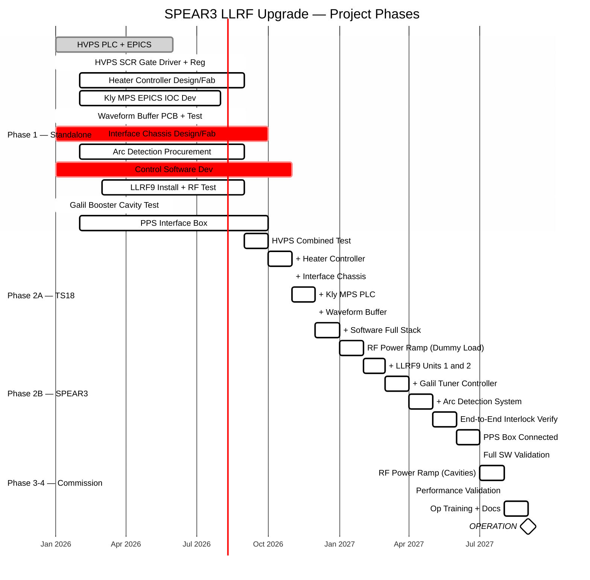
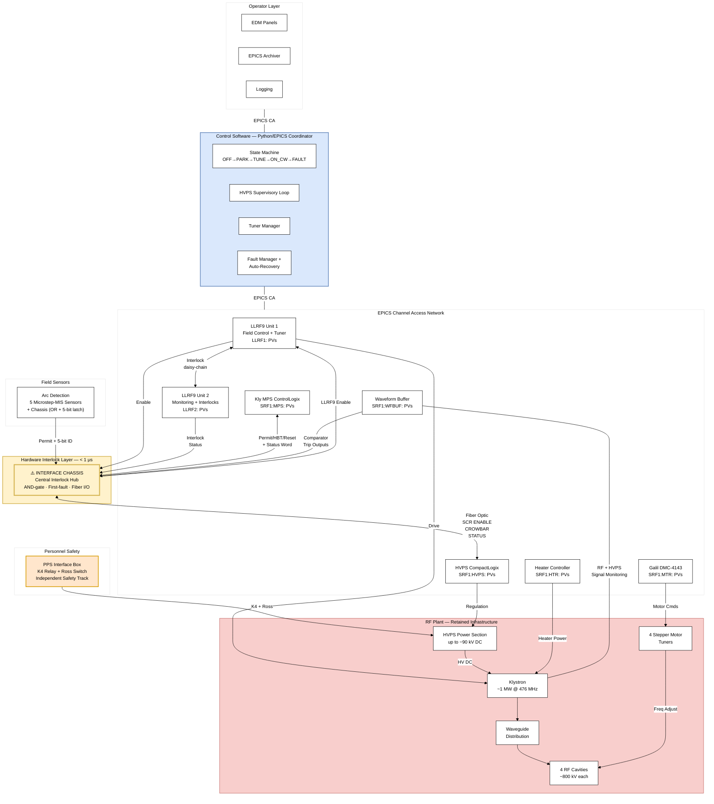
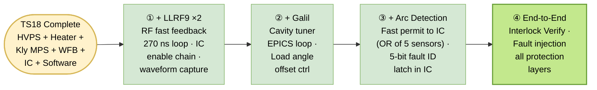
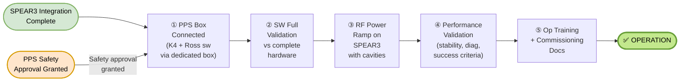
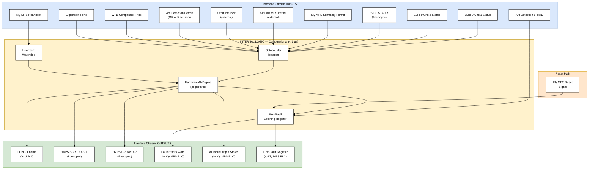
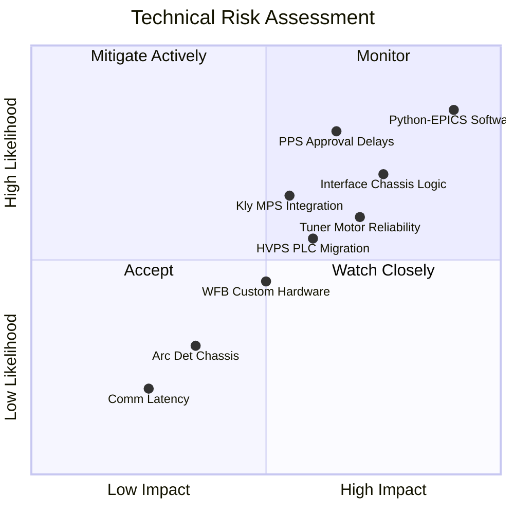

# SPEAR3 LLRF Upgrade — Project Path Diagrams

> **Reference**: SPEAR3-LLRF-PDR-001 (March 2026)
> **Source Documents**: `Designs/ProjectPath.md`, `Designs/0_PHYSICAL_DESIGN_REPORT.md`

This document provides a set of visual diagrams covering the SPEAR3 LLRF Upgrade project path — from high-level phase overview down to detailed dependency flows and protection architecture.

**Status Legend**: ✅ Complete | 🔄 In Progress | ⬜ Not Started | ⚠️ Critical Path

---

## 1. High-Level Project Phase Timeline

The project is organized into four phases, progressing from standalone development through incremental integration to full commissioning.



---

## 2. System Architecture — 10 Subsystems

Shows the upgraded system's 10 subsystems and their primary interconnections.



---

## 3. Protection Chain Architecture — Four Layers

The system implements defense-in-depth with four protection layers, each at a different response time scale.

```mermaid
%%{init: {'theme':'base', 'themeVariables': {'fontSize': '14px', 'fontFamily': 'arial', 'primaryColor': '#ffffff', 'primaryTextColor': '#000000', 'primaryBorderColor': '#000000', 'lineColor': '#000000'}}}%%
flowchart LR
    subgraph L1["Layer 1 — LLRF9 FPGA < 1 μs"]
        direction TB
        L1A["RF Overvoltage<br/>Interlocks"]
        L1B["Baseband Window<br/>Comparators"]
        L1C["DAC Zeroing +<br/>RF Switch"]
    end

    subgraph L2["Layer 2 — Interface Chassis < 1 μs"]
        direction TB
        L2A["Hardware AND-gate<br/>(all permits)"]
        L2B["First-Fault<br/>Latching Register"]
        L2C["Fiber Optic<br/>HVPS Control"]
        L2D["LLRF9 Enable<br/>Output"]
    end

    subgraph L3["Layer 3 — Kly MPS PLC ~ms"]
        direction TB
        L3A["Fault Aggregation<br/>from IC Status Word"]
        L3B["Permit Management<br/>+ Heartbeat Watchdog"]
        L3C["Reset Coordination<br/>+ Event Logging"]
    end

    subgraph L4["Layer 4 — Python Coordinator ~1 Hz"]
        direction TB
        L4A["State Machine<br/>OFF→PARK→TUNE→ON_CW"]
        L4B["Supervisory Control<br/>HVPS Loop, Tuner Mgr"]
        L4C["Auto-Recovery<br/>+ Operator Interface"]
    end

    L1 -->|"Interlock<br/>Status"| L2
    L2 -->|"Digital Status<br/>Word"| L3
    L3 -->|"EPICS PVs"| L4

    L4 -->|"Setpoints +<br/>Commands"| L3
    L3 -->|"Summary Permit<br/>+ Heartbeat"| L2
    L2 -->|"Enable<br/>Signal"| L1

    style L1 fill:#ffcccc,stroke:#cc0000,stroke-width:2px,color:#000000
    style L2 fill:#fff2cc,stroke:#d6b656,stroke-width:2px,color:#000000
    style L3 fill:#d5e8d4,stroke:#82b366,stroke-width:2px,color:#000000
    style L4 fill:#dae8fc,stroke:#6c8ebf,stroke-width:2px,color:#000000
```



### Failure Mode Safety

| Failure | Response | Layer |
|---------|----------|-------|
| LLRF9 reflected power trip | Unit 2 disables Unit 1 drive instantly | L1 |
| Any IC input permit lost | IC removes LLRF9 Enable + HVPS SCR ENABLE | L2 |
| Arc detected (any sensor) | Fast permit → IC removes all outputs | L2 |
| WFB comparator trip | Trip output → IC removes all outputs | L2 |
| MPS heartbeat lost | IC removes all output permits | L2 |
| MPS PLC failure | Heartbeat stops → IC removes permits | L2→L3 |
| Python coordinator crash | No safety effect — hardware protection continues | L4 |
| Ethernet failure | No safety effect — hardware protection continues | L4 |

---

## 4. Phase 1 — Standalone Development Streams

All 10 subsystems develop and test independently before integration. This diagram shows the parallel work streams.

```mermaid
flowchart LR
    subgraph hw1["HVPS — Stream 1: CompactLogix PLC"]
        direction LR
        HA1("✅ PLC HW<br/>Received") --> HA2("PLC Online<br/>B44 Test Stand") --> HA3("EPICS Dev<br/>SRF1:HVPS: PVs") --> HA4("SW Integration<br/>Test: HVPS<br/>module vs live<br/>CompactLogix")
    end

    subgraph hw2["HVPS — Stream 2: SCR Gate Driver + Regulator Board"]
        direction LR
        HB1("Procure<br/>FCOG1200 ×5") --> HB2("Regulator<br/>Board Design") --> HB3("Regulator<br/>Board Fab") --> HB4("Standalone<br/>Test on TS18")
    end

    subgraph htr["Heater Controller (SCR-based)"]
        direction LR
        HTR1("Design<br/>SCR + Filter<br/>+ RMS Monitor") --> HTR2("Fabrication") --> HTR3("Bench<br/>Test") --> HTR4("SW Integration<br/>Test: Heater<br/>module vs live<br/>SCR controller")
    end

    subgraph mps["Klystron MPS PLC (ControlLogix 1756)"]
        direction LR
        MPS1("✅ HW Assembled<br/>Standalone Tested<br/>no RF power") --> MPS2("EPICS IOC Dev<br/>SRF1:MPS: PVs<br/>permit/fault/reset") --> MSW("SW Integration<br/>Test: MPS EPICS<br/>module vs live<br/>ControlLogix") --> MPS3("Mock Test<br/>vs Simulated<br/>IC I/O") --> MPS4("IC Integration<br/>Test: fault status<br/>word, heartbeat,<br/>reset sequencing")
    end

    subgraph wfb["Waveform Buffer System"]
        direction LR
        WFB1("✅ System<br/>Design Complete") --> WFB2("PCB Design<br/>ADC + comparators<br/>+ EPICS") --> WFB3("Fabrication<br/>+ Assembly") --> WFB4("Standalone Test<br/>circ. buffers,<br/>comparators,<br/>EPICS waveforms") --> WSW("SW Integration<br/>Test: WFB EPICS<br/>module vs live<br/>PCB hardware") --> WFB5("IC Integration<br/>Test: comparator<br/>trips → IC<br/>permit logic")
    end

    subgraph ic["⚠️ Interface Chassis — CRITICAL PATH"]
        direction LR
        IC1("🔄 Eng Spec<br/>Finalize I/O<br/>Signal List") --> IC2("Logic Design<br/>AND-gate<br/>First-fault<br/>Fiber I/O") --> IC3("PCB + Mech<br/>Design") --> IC4("Fabrication<br/>+ Assembly") --> IC5("Standalone Test<br/>interlock logic,<br/>fiber I/O,<br/>hbt watchdog")
    end

    subgraph sw["⚠️ Control Software (Python/EPICS) — CRITICAL, Start Now"]
        direction LR
        SWA1("Arch Design<br/>+ PV Naming<br/>Conventions") --> SWA2("HW Interface<br/>Modules<br/>+ Mock Interfaces<br/>per subsystem")
        SWA3("All HW Iface<br/>Modules live-<br/>tested: HVPS,<br/>Heater, MPS, WFB")
        SWB1("State Machine<br/>OFF→PARK→<br/>TUNE→ON_CW<br/>→FAULT") --> SWB2("HVPS Loop<br/>+ Tuner Mgr<br/>+ Load Angle") --> SWB3("Fault Mgr<br/>+ Auto-Recovery<br/>+ Logging<br/>+ EDM Panels")
        SWA3 & SWB3 --> SWMRG("SW Streams<br/>Merged<br/>All modules<br/>tested vs<br/>real HW")
    end

    subgraph llrf["LLRF9 — Units 1 and 2 (cavity-dependent)"]
        direction LR
        L1("✅ 4 Units<br/>Received") --> L2("Install B132<br/>+ Connect<br/>24 RF Cables") --> L3("EPICS IOC<br/>Verify PVs<br/>LLRF1: LLRF2:") --> L4("Standalone RF<br/>Test: vector sum<br/>feedback, tuner<br/>phase at 10 Hz") --> L5("IC Integration<br/>Test: enable<br/>signal, interlock<br/>daisy-chain")
    end

    subgraph arc_det["Arc Detection System (cavity-dependent)"]
        direction LR
        ARC1("Procure<br/>10 Sensors<br/>5 Process<br/>Chassis + spares") --> ARC2("Mech Mounting<br/>Adapters for<br/>CF Flange<br/>Viewports") --> ARC3("Chassis Design<br/>HW OR-gate<br/>5-bit Latch<br/>for fault ID") --> ARC4("Chassis<br/>Fabrication") --> ARC5("Standalone Test<br/>fast permit OR<br/>+ 5-bit ID latch") --> ARC6("IC Integration<br/>Test: fast permit<br/>+ 5-bit fault ID<br/>into IC reg")
    end

    subgraph gal["Galil DMC-4143 Motion Controller (cavity-dependent)"]
        direction LR
        GAL1("✅ Operational<br/>Aug 2025<br/>SPEAR3 installed") --> GAL2("Booster Cavity<br/>Test — validate<br/>before storage<br/>ring") --> GAL3("SPEAR3 Cavity<br/>Test — tuner<br/>steps, pot<br/>readback") --> GAL4("EPICS Motor<br/>Record integ.<br/>+ LLRF9<br/>phase feedback") --> GAL5("IC Integration<br/>Test: EPICS<br/>motor cmds +<br/>tuner loop via IC")
    end

    subgraph pps_track["PPS Interface Box — Independent Safety Approval Track"]
        direction LR
        PPS1("Design<br/>4-relay board<br/>LEDs, lockable<br/>per SLAC std") --> PPS2("SLAC AD Safety<br/>Div Review<br/>+ Approval") --> PPS3("Fabrication") --> PPS4("Test with<br/>Hoffman Box<br/>K4 + Ross sw") --> PPS5("Commission")
    end

    style ic fill:#fff2cc,stroke:#d6b656,stroke-width:2px,color:#000000
    style sw fill:#fff2cc,stroke:#d6b656,stroke-width:2px,color:#000000
    style pps_track fill:#ffe6cc,stroke:#d79b00,stroke-width:1px,color:#000000
```



---

## 5. Phase 2A — TS18 Sub-Integration Build-Up

TS18 configuration: Klystron + dummy load. **No RF cavities, no tuners, no arc detection.** Each step incrementally adds one subsystem that has passed its standalone + IC integration tests.

```mermaid
flowchart LR
    TS1["① HVPS Combined<br/>PLC + SCR Gate<br/>Driver + Regulator<br/>Closed-loop HV<br/>regulation"]
    TS2["② + Heater Ctrl<br/>Warm-up / cool-down<br/>sequences · HVPS–<br/>Heater coordination<br/>interlock"]
    TS3["③ + Interface Chassis<br/>Hardware interlock<br/>loop · Fiber links:<br/>SCR ENABLE,<br/>CROWBAR, STATUS"]
    TS4["④ + Kly MPS PLC<br/>Permit / heartbeat /<br/>reset round-trip ·<br/>First-fault latch<br/>validation"]
    TS5["⑤ + Waveform Buffer<br/>HVPS ch: V, I,<br/>inductor voltages ·<br/>Kly fwd/refl RF ch ·<br/>Collector power algo<br/>DC−RF = Pcollector"]
    TS6["⑥ + Software<br/>Full stack live:<br/>state machine,<br/>HVPS loop, heater<br/>seq, fault mgr, EDM"]
    TS7["⑦ Incremental<br/>RF Power Ramp<br/>into dummy load ·<br/>Control loop tests ·<br/>Protection chain<br/>validation"]

    TS1 --> TS2 --> TS3 --> TS4 --> TS5 --> TS6 --> TS7

    style TS1 fill:#dae8fc,stroke:#6c8ebf,color:#000000
    style TS2 fill:#dae8fc,stroke:#6c8ebf,color:#000000
    style TS3 fill:#fff2cc,stroke:#d6b656,stroke-width:2px,color:#000000
    style TS4 fill:#dae8fc,stroke:#6c8ebf,color:#000000
    style TS5 fill:#dae8fc,stroke:#6c8ebf,color:#000000
    style TS6 fill:#fff2cc,stroke:#d6b656,stroke-width:2px,color:#000000
    style TS7 fill:#d5e8d4,stroke:#82b366,stroke-width:2px,color:#000000
```



### TS18 Test Capabilities vs. Limitations

| ✅ Can Test at TS18 | ❌ Cannot Test (needs cavity) |
|---------------------|-------------------------------|
| HVPS voltage regulation (closed-loop) | LLRF9 vector-sum fast feedback (270 ns loop) |
| Heater warm-up/cool-down sequences | Cavity tuner control + load angle loop |
| HVPS + Heater coordination interlocks | Arc detection on cavity windows |
| Interface Chassis full interlock logic | Full 24-channel RF signal monitoring |
| Kly MPS permit/heartbeat/reset | — |
| Waveform Buffer (HVPS + klystron RF ch) | — |
| Collector power protection (DC−RF) | — |
| Software state machine + EDM panels | — |
| Incremental RF power ramp into load | — |

---

## 6. Phase 2B — SPEAR3 Full Integration

TS18 output moves to SPEAR3 and is joined by three cavity-dependent subsystems.



---

## 7. Phase 3 & 4 — Final Commissioning



### Success Criteria

| Metric | Legacy Performance | Target |
|--------|-------------------|--------|
| Amplitude stability | < 0.1% | Same or better |
| Phase stability | < 0.1° | Same or better |
| Tuner resolution | ~0.002–0.003 mm/microstep | Improved (up to 256 microsteps/step) |
| Control loop response | ~1 second | Same or better |
| Uptime | > 99% | Same or better |
| Fault diagnostics | Limited fault file capture | 16k-sample waveform + circular buffer + first-fault |

---

## 8. Master Dependency Network — Full Project Flow

This is the comprehensive dependency diagram showing all Phase 1 standalone tracks, their IC integration tests, the incremental TS18 sub-integration spine, the three cavity-dependent tracks merging at SPEAR3, and final commissioning.

**Reading the diagram:**
- Each Phase 1 hardware track going to TS18 ends with a **SW Integration Test** node — validating its Python interface module against live hardware before entering TS18
- The ⚠️ Interface Chassis standalone test (IC5) is a gate: no subsystem can do its IC integration test until IC5 passes
- Software Stream 1 (SWA2) provides the interface modules; each module is then tested against its live hardware subsystem
- TS18 (Phase 2A) builds up the integrated sub-system one subsystem at a time
- SPEAR3 (Phase 2B) adds the three cavity-dependent subsystems to the TS18 output

```mermaid
%%{init: {'theme':'base', 'themeVariables': {'fontSize': '12px', 'fontFamily': 'arial', 'primaryColor': '#ffffff', 'primaryTextColor': '#000000', 'primaryBorderColor': '#000000', 'lineColor': '#000000'}}}%%
flowchart LR
    %% ─── PHASE 1 ─── Standalone Development ───
    subgraph hw1["HVPS — Stream 1: CompactLogix PLC"]
        direction LR
        HA1("✅ PLC HW<br/>Received") --> HA2("PLC Online<br/>B44 Test Stand") --> HA3("EPICS Dev<br/>SRF1:HVPS: PVs") --> HA4("SW Integration<br/>Test: HVPS")
    end

    subgraph hw2["HVPS — Stream 2: SCR + Regulator"]
        direction LR
        HB1("Procure<br/>FCOG1200 ×5") --> HB2("Regulator<br/>Board Design") --> HB3("Regulator<br/>Board Fab") --> HB4("Standalone<br/>Test on TS18")
    end

    subgraph htr["Heater Controller"]
        direction LR
        HTR1("Design") --> HTR2("Fabrication") --> HTR3("Bench Test") --> HTR4("SW Integration<br/>Test: Heater")
    end

    subgraph mps["Kly MPS PLC"]
        direction LR
        MPS1("✅ HW Ready") --> MPS2("EPICS IOC Dev") --> MSW("SW Integ Test") --> MPS3("Mock IC Test") --> MPS4("IC Integ Test")
    end

    subgraph wfb["Waveform Buffer System"]
        direction LR
        WFB1("✅ Design Done") --> WFB2("PCB Design") --> WFB3("Fab + Assy") --> WFB4("Standalone Test") --> WSW("SW Integ Test") --> WFB5("IC Integ Test")
    end

    subgraph ic["⚠️ Interface Chassis — CRITICAL PATH"]
        direction LR
        IC1("🔄 Eng Spec") --> IC2("Logic Design") --> IC3("PCB + Mech") --> IC4("Fab + Assy") --> IC5("Standalone Test")
    end

    subgraph sw["⚠️ Control Software — CRITICAL"]
        direction LR
        SWA1("Arch Design") --> SWA2("HW Interface<br/>Modules + Mocks")
        SWA3("All HW Iface<br/>Modules Tested")
        SWB1("State Machine") --> SWB2("HVPS Loop +<br/>Tuner + Load") --> SWB3("Fault Mgr +<br/>Recovery + EDM")
        SWA3 & SWB3 --> SWMRG("SW Streams<br/>Merged")
    end

    subgraph llrf["LLRF9 Units 1 & 2"]
        direction LR
        L1_node("✅ Received") --> L2_node("Install B132") --> L3_node("EPICS IOC") --> L4_node("RF Test") --> L5_node("IC Integ Test")
    end

    subgraph arc_det["Arc Detection"]
        direction LR
        ARC1("Procure") --> ARC2("Mount Adapt") --> ARC3("Chassis Design") --> ARC4("Fab") --> ARC5("Standalone Test") --> ARC6("IC Integ Test")
    end

    subgraph gal["Galil Tuner Controller"]
        direction LR
        GAL1("✅ Aug 2025") --> GAL2("Booster Test") --> GAL3("SPEAR3 Test") --> GAL4("EPICS Motor") --> GAL5("IC Integ Test")
    end

    subgraph pps_track["PPS Interface Box"]
        direction LR
        PPS1("Design") --> PPS2("Safety Review") --> PPS3("Fab") --> PPS4("Test") --> PPS5("Commission")
    end

    %% ─── PHASE 2A ─── TS18 Sub-Integration ───
    subgraph ts18["Phase 2A — TS18 Sub-Integration (Klystron + Dummy Load)"]
        direction LR
        TS1["① HVPS<br/>Combined"] --> TS2["② + Heater"] --> TS3["③ + Interface<br/>Chassis"] --> TS4["④ + Kly MPS"] --> TS5["⑤ + Waveform<br/>Buffer"] --> TS6["⑥ + Software"] --> TS7["⑦ RF Power<br/>Ramp"]
    end

    %% ─── PHASE 2B ─── SPEAR3 Full Integration ───
    subgraph spear["Phase 2B — SPEAR3 Full Integration (Live Cavities)"]
        direction LR
        SP1["① + LLRF9 ×2"] --> SP2["② + Galil"] --> SP3["③ + Arc Det"] --> SP4["④ End-to-End<br/>Verify"]
    end

    %% ─── PHASE 3 & 4 ─── Final Commissioning ───
    subgraph final["Phase 3 & 4 — Final Commissioning"]
        direction LR
        FC1["+ PPS Box"] --> FC2["SW Validation"] --> FC3["RF Ramp<br/>on SPEAR3"] --> FC4["Performance<br/>Validation"] --> FC5["Op Training"] --> FC6(["✅ OPERATION"])
    end

    %% ─── DEPENDENCY EDGES ───

    %% HVPS streams → TS18-①
    HA4 -->|"Stream 1 +<br/>SW tested"| TS1
    HB4 -->|"Stream 2<br/>ready"| TS1

    %% Heater → TS18-②
    HTR4 -->|"Bench + SW<br/>tested"| TS2

    %% Software modules ready → enables per-subsystem SW integration tests
    SWA2 -->|"SW module"| HA4
    SWA2 -->|"SW module"| HTR4
    SWA2 -->|"SW module"| MSW
    SWA2 -->|"SW module"| WSW

    %% Per-subsystem SW integration tests → SW merge gate
    HA4 -->|"HVPS tested"| SWA3
    HTR4 -->|"Heater tested"| SWA3
    MSW -->|"MPS tested"| SWA3
    WSW -->|"WFB tested"| SWA3

    %% IC standalone → IC joins at TS18-③
    IC5 -->|"IC ready"| TS3

    %% IC standalone → enables each subsystem's IC integration test
    IC5 -->|"IC ready"| MPS4
    IC5 -->|"IC ready"| WFB5
    IC5 -->|"IC ready"| L5_node
    IC5 -->|"IC ready"| GAL5
    IC5 -->|"IC ready"| ARC6

    %% Per-subsystem IC integ tests → TS18 steps
    MPS4 -->|"IC integ<br/>passed"| TS4
    WFB5 -->|"IC integ<br/>passed"| TS5

    %% Software merged → TS18-⑥
    SWMRG -->|"SW merged"| TS6

    %% TS18 complete + cavity-dependent IC integ → SPEAR3
    TS7 -->|"TS18<br/>complete"| SP1
    L5_node -->|"IC integ<br/>passed"| SP1
    GAL5 -->|"IC integ<br/>passed"| SP2
    ARC6 -->|"IC integ<br/>passed"| SP3

    %% SPEAR3 + PPS → Final Commissioning
    SP4 --> FC1
    PPS5 -->|"Safety approval"| FC1

    %% ─── STYLES ───
    style ic fill:#fff2cc,stroke:#d6b656,stroke-width:2px,color:#000000
    style sw fill:#fff2cc,stroke:#d6b656,stroke-width:2px,color:#000000
    style ts18 fill:#fff2cc,stroke:#d6b656,stroke-width:2px,color:#000000
    style spear fill:#d5e8d4,stroke:#82b366,stroke-width:2px,color:#000000
    style final fill:#dae8fc,stroke:#6c8ebf,stroke-width:2px,color:#000000
    style pps_track fill:#ffe6cc,stroke:#d79b00,stroke-width:1px,color:#000000
```



---

## 9. Interface Chassis — Signal Flow Detail

The Interface Chassis is the central interlock hub. This diagram shows all inputs, outputs, and internal logic.



---

## 10. Hardware Readiness Summary

| Subsystem | Hardware | Status |
|-----------|----------|--------|
| LLRF9 (Dimtel LLRF9/476) | 4 units received | ✅ |
| Klystron MPS PLC (ControlLogix 1756) | Assembled; standalone-tested (no RF power) | ✅ |
| HVPS PLC modules (CompactLogix) | Received — HVPS1, HVPS2, B44 test stand | ✅ |
| Galil DMC-4143 Motion Controller | Commissioned and operational | ✅ Aug 2025 |
| Enerpro FCOG1200 SCR Gate Driver boards | 5 boards required | ⬜ Needed |
| Arc Detection (Microstep-MIS) | 10 sensors + 5 process chassis + spares | ⬜ Needed |
| Waveform Buffer System | Design complete; PCB not yet fabricated | 🔄 |
| Interface Chassis | Specification in progress | 🔄 |
| Heater SCR Controller | Not started | ⬜ Needed |
| PPS Interface Box | Not started | ⬜ Needed |
| Control Software (Python/EPICS Coordinator) | Not started — **critical risk** | ⬜ Needed |

---

## 11. Key Technical Risks



| Risk | Severity | Mitigation |
|------|----------|------------|
| **Python/EPICS Coordinator** | **Critical** | Largest untouched scope; begin framework + mock interfaces immediately |
| Interface Chassis logic | High | Design and simulate before fabrication; careful LLRF9/HVPS feedback loop sequencing |
| PPS Interface approval | High | Engage SLAC AD Safety Division early; use proven gallery system design |
| Tuner motor controller | High | Test Galil on booster tuners before committing to storage ring |
| HVPS PLC code migration | High | Reverse-engineer legacy SLC-500 code; validate on B44 test stand |
| Kly MPS PLC integration | High | Start IOC development with simulated IC I/O; define fault status bits early |
| Waveform Buffer System | Medium | Staged development: PCB → assembly → test → integration |
| Arc Detection Chassis | Low | Straightforward combinational logic + latches |
| Communication latency | Low | Proven in LLRF9 prototype commissioning |

---

## 12. EPICS PV Namespace Map

```mermaid
flowchart TB
    subgraph epics_root["SPEAR3 LLRF EPICS PV Namespace"]
        direction TB
        
        subgraph llrf1_group["LLRF1: (Unit 1 - Field Control)"]
            LLRF1_FC["Field Control"]
            LLRF1_TP["Tuner Phase"]
            LLRF1_VS["Vector Sum"]
            LLRF1_WF["Waveforms"]
        end
        
        subgraph llrf2_group["LLRF2: (Unit 2 - Monitoring)"]
            LLRF2_MON["Monitoring"]
            LLRF2_RP["Reflected Power"]
            LLRF2_INT["Interlocks"]
        end
        
        subgraph hvps_group["SRF1:HVPS: (High Voltage Power Supply)"]
            HVPS_VSR["Voltage Setpoint/Readback"]
            HVPS_CC["Contactor Control"]
            HVPS_IS["Interlock Status"]
            HVPS_TEMP["Temperature"]
        end
        
        subgraph mps_group["SRF1:MPS: (Machine Protection System)"]
            MPS_PS["Permit Status"]
            MPS_FA["Fault Active"]
            MPS_FF["First-Fault ID"]
            MPS_EC["Event Count"]
        end
        
        subgraph mtr_group["SRF1:MTR: (Motor/Tuner Control)"]
            MTR_MP["Motor Position"]
            MTR_TS["Tuner Steps"]
            MTR_POT["Potentiometer"]
        end
        
        subgraph wfbuf_group["SRF1:WFBUF: (Waveform Buffer)"]
            WFBUF_RF["RF Waveforms"]
            WFBUF_HVPS["HVPS Channels"]
            WFBUF_CT["Comparator Thresholds"]
            WFBUF_CP["Collector Power"]
        end
        
        subgraph htr_group["SRF1:HTR: (Heater Controller)"]
            HTR_HV["Heater Voltage"]
            HTR_CR["Current RMS"]
            HTR_WS["Warm-up Sequence"]
            HTR_RS["Ready Status"]
        end
    end
    
    style epics_root fill:#f9f9f9,stroke:#333,stroke-width:2px,color:#000000
    style llrf1_group fill:#e1f5fe,stroke:#0277bd,stroke-width:2px,color:#000000
    style llrf2_group fill:#e8f5e8,stroke:#2e7d32,stroke-width:2px,color:#000000
    style hvps_group fill:#fff3e0,stroke:#ef6c00,stroke-width:2px,color:#000000
    style mps_group fill:#fce4ec,stroke:#c2185b,stroke-width:2px,color:#000000
    style mtr_group fill:#f3e5f5,stroke:#7b1fa2,stroke-width:2px,color:#000000
    style wfbuf_group fill:#e0f2f1,stroke:#00695c,stroke-width:2px,color:#000000
    style htr_group fill:#fff8e1,stroke:#f57f17,stroke-width:2px,color:#000000

---

> **Document generated from**: `Designs/ProjectPath.md` and `Designs/0_PHYSICAL_DESIGN_REPORT.md`
> **SPEAR3-LLRF-PDR-001** · RF Department, SSRL/Accelerator
