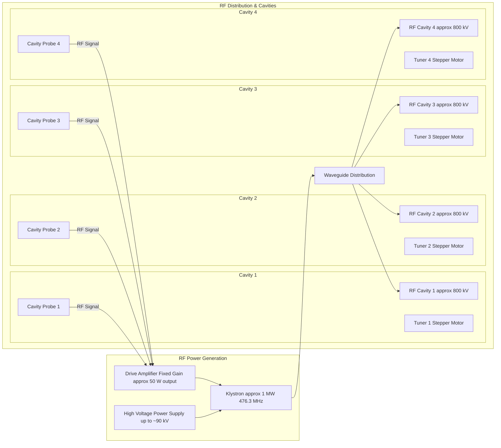
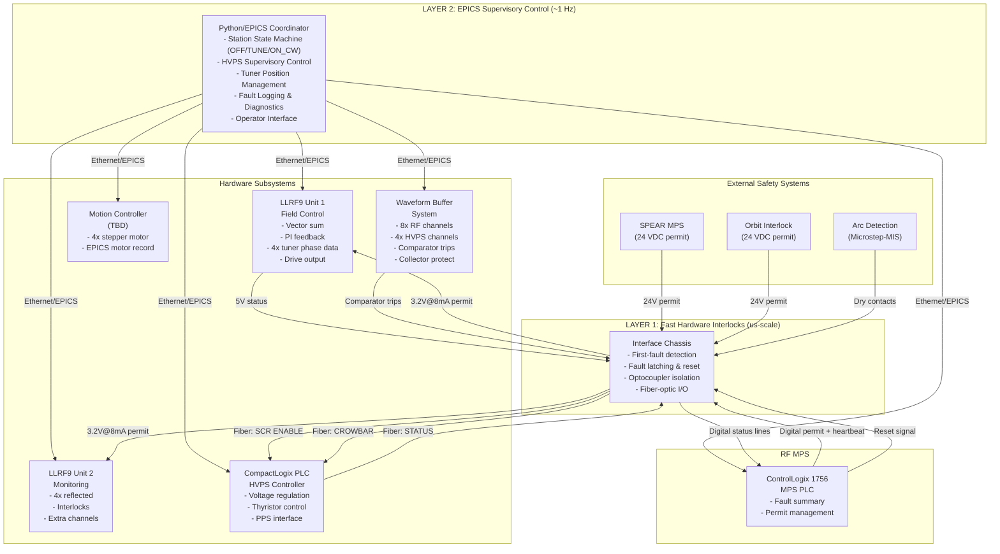
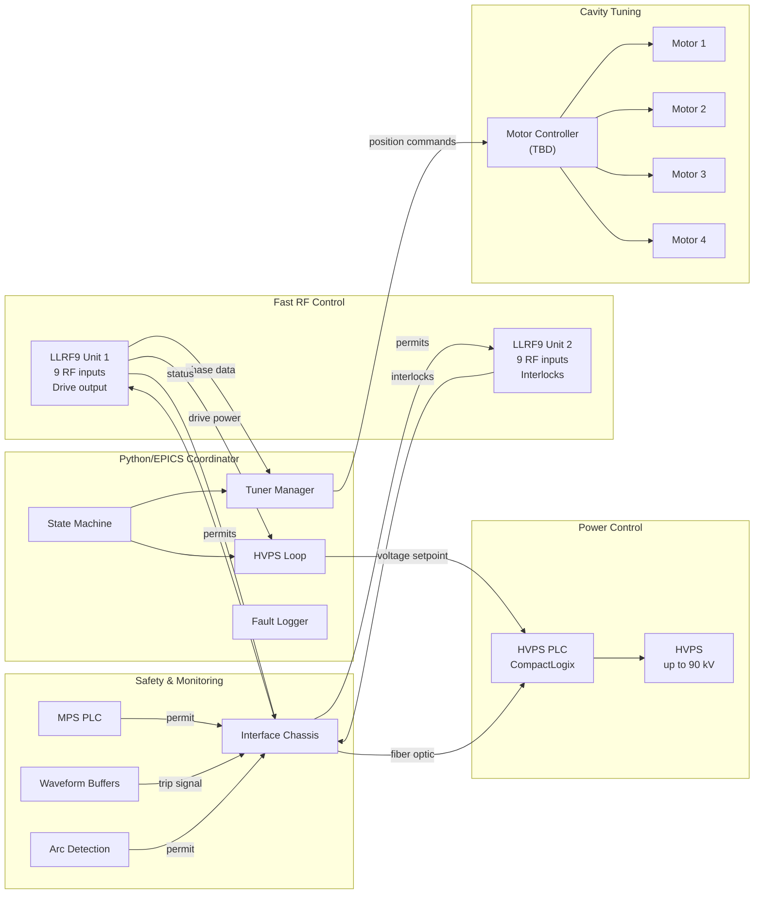

# SPEAR3 LLRF Control System --- Comprehensive Analysis
## Legacy System Review & Upgrade Project Scope with Dimtel LLRF9

*Based on detailed analysis of legacy SNL code, Jim's operational documentation, LLRF9 technical manual, Waveform Buffer design document, Interface Chassis specification, and LLRF Upgrade Task List Rev3*

**Document Version**: 4.0  
**Last Updated**: 2026-02-27  
**Includes**: Full upgrade project scope, LLRF9 integration, Waveform Buffer system, Interface Chassis specification, and legacy-to-upgrade comparison

---

## Table of Contents

1. [Executive Summary](#1-executive-summary)
2. [Legacy System vs. Upgraded System --- At a Glance](#2-legacy-system-vs-upgraded-system--at-a-glance)
3. [LLRF9 Controller --- The Heart of the Upgrade](#3-llrf9-controller--the-heart-of-the-upgrade)
4. [Full Upgrade Project Scope](#4-full-upgrade-project-scope)
5. [SPEAR3 RF System Overview (Physical System)](#5-spear3-rf-system-overview-physical-system)
6. [Legacy Control System Architecture](#6-legacy-control-system-architecture)
7. [Legacy Control Loop Analysis](#7-legacy-control-loop-analysis)
8. [Legacy Operational Modes & State Machine](#8-legacy-operational-modes--state-machine)
9. [Legacy Tuner Control System](#9-legacy-tuner-control-system)
10. [Legacy Calibration & Fault Management](#10-legacy-calibration--fault-management)
11. [Legacy Code Structure & Design Patterns](#11-legacy-code-structure--design-patterns)
12. [Upgraded System Integration Architecture](#12-upgraded-system-integration-architecture)
13. [Implementation Plan & Risk Mitigation](#13-implementation-plan--risk-mitigation)

---

## 1. Executive Summary

The SPEAR3 LLRF (Low-Level RF) control system is a sophisticated multi-loop feedback system that maintains stable RF power for the SPEAR3 storage ring at SSRL. The system controls **one klystron** driving **four RF cavities** at **476 MHz**, with individual **stepper motor tuners** for each cavity.

The LLRF upgrade project replaces the entire control electronics chain --- not just the low-level RF controller, but also the machine protection system, HVPS controller, tuner motor controllers, and supporting subsystems. **Two Dimtel LLRF9 units** form the core of the new system, with four units purchased to provide a complete set of spares.

> **Historical Note**: The legacy control software was originally written for the **PEP-II B-Factory** project (circa 1997) and was later adapted for SPEAR3. This heritage explains the presence of operational modes (ON_FM, PARK) and hardware references (VXI, CAMAC) that are no longer used at SPEAR3.

### Key System Parameters
| Parameter | Value | Notes |
|-----------|-------|-------|
| **RF Frequency** | ~476 MHz | Determined by beam orbit; frequency synthesizer sets the exact value. LLRF9/476 variant supports 476 +/- 2.5 MHz |
| **Total Gap Voltage** | ~3.2 MV | Sum of 4 cavity gap voltages |
| **Klystron Power** | ~1 MW | Single klystron drives all 4 cavities |
| **HVPS Voltage** | up to ~90 kV | Klystron cathode voltage. Turn-on voltage is ~50 kV (`SRF1:HVPS:VOLT:MIN`) |
| **Drive Power** | ~50 W nominal | Input to klystron from drive amplifier |
| **Number of Cavities** | 4 | Single-cell cavities with individual tuners |
| **Cavity Gap Voltage** | ~800 kV each | Individual cavity contribution |

---

## 2. Legacy System vs. Upgraded System --- At a Glance

This section provides a clear, side-by-side comparison of the current (legacy) system and the planned upgraded system across every major subsystem.

### 2.1 System-Level Comparison

| Aspect | Legacy System | Upgraded System |
|--------|---------------|-----------------|
| **LLRF Controller** | Custom PEP-II analog RF Processor (RFP) module in VXI chassis | **Dimtel LLRF9** (x2 units) --- digital FPGA-based, integrated EPICS IOC |
| **Control Software** | SNL (State Notation Language) on VxWorks RTOS | **Python/PyEPICS** + LLRF9 internal EPICS IOC |
| **Fast Feedback** | Analog I/Q processing, ~kHz bandwidth | Digital vector sum + PI loops, **270 ns direct loop delay** |
| **Machine Protection** | PLC-5 (Allen-Bradley 1771) | **ControlLogix 1756** (Allen-Bradley) |
| **HVPS Controller** | SLC-500 PLC + original Enerpro gate driver | **CompactLogix PLC** + upgraded Enerpro boards |
| **Tuner Motor Controller** | Allen-Bradley 1746-HSTP1 + Slo-Syn PWM driver | **Modern motion controller** (under investigation --- Galil, Domenico/Dunning design, or Danh's design) |
| **Tuner Motor Driver** | Superior Electric SS2000MD4-M (obsolete) | Modern stepper driver with microstepping |
| **RF Signal Monitoring (fast)** | VXI-based analog modules (RFP, GVF, CFM), 24 channels | LLRF9 9-channel digital acquisition (x2 units = 18 channels) |
| **RF/HVPS Signal Monitoring (extended)** | Same VXI system | **Waveform Buffer System** (new chassis): 8 RF + 4 HVPS channels with circular buffers and hardware trip |
| **Arc Detection** | Non-functional existing system | **Microstep-MIS optical arc detectors** (new) |
| **Interlocks** | Distributed across analog modules | LLRF9 integrated interlocks (9 RF + 8 baseband per unit) + MPS PLC + **Interface Chassis** |
| **Interlock Coordination** | Direct wiring between subsystems | **Interface Chassis** --- new central hub with first-fault detection, optocoupler isolation, fiber-optic I/O |
| **Diagnostics** | Limited; fault file capture from VXI modules | LLRF9 waveform capture (16k samples/ch), network/spectrum analyzer, Waveform Buffer circular buffers |
| **Communication** | VXI backplane, CAMAC, field bus | **Ethernet/EPICS Channel Access** throughout |

### 2.2 Control Loop Comparison

| Control Loop | Legacy Implementation | Upgraded Implementation |
|--------------|----------------------|------------------------|
| **Fast RF Feedback (Direct Loop)** | Analog I/Q in RFP module | LLRF9 FPGA: digital proportional + integral, 270 ns latency |
| **DAC Control Loop** (~1 Hz) | SNL `rf_dac_loop.st` on VxWorks | LLRF9 vector sum + setpoint control; Python/EPICS for supervisory |
| **HVPS Control Loop** (~1 Hz) | SNL `rf_hvps_loop.st` on VxWorks | **Python/EPICS** --- still required; HVPS remains external to LLRF9 |
| **Tuner Control Loops** (x4) | SNL `rf_tuner_loop.st` on VxWorks | **LLRF9 phase measurement** -> Python/EPICS -> Motor controller |
| **Station State Machine** | SNL `rf_states.st` on VxWorks | **Python/EPICS** supervisory layer |
| **Calibration** | SNL `rf_calib.st` (2800+ lines, ~20 min) | **LLRF9 built-in digital calibration** --- eliminates analog drift |
| **Ripple Rejection** | Analog ripple loop in legacy hardware | LLRF9 digital feedback --- inherently rejects power-line ripple |
| **Comb/GFF Loops** | Dedicated analog modules (CFM, GVF) | **Eliminated** --- replaced by LLRF9 digital feedback |
| **Klystron Collector Protection** | Not present | **Waveform Buffer System** computes DC power minus RF power; trips on excess |

### 2.3 What Stays, What Changes, What's New

#### Retained (same physical hardware)
- **Klystron** and its RF output
- **4 RF Cavities** and their waveguide distribution (circulator, magic-tees, waveguide loads)
- **Stepper motors** (same M093-FC11 or equivalent) and mechanical tuner assemblies
- **Linear potentiometers** on tuners (position indication, not used in closed-loop)
- **HVPS power electronics** (transformer, rectifier, oil system) --- controller upgraded, power stage unchanged

#### Replaced / Upgraded
- **LLRF Controller**: Analog RFP module -> Dimtel LLRF9 (x2)
- **MPS System**: PLC-5 1771 -> ControlLogix 1756
- **HVPS Controller**: SLC-500 -> CompactLogix + new Enerpro boards + redesigned analog regulator
- **Tuner Motor Controllers**: Allen-Bradley HSTP1 + Slo-Syn driver -> modern motion controller (TBD)
- **Control Software**: SNL/VxWorks -> Python/EPICS + LLRF9 IOC
- **Operator Interface**: Legacy EDM panels -> modernized panels

#### New Subsystems
- **Interface Chassis**: Central interlock coordination hub connecting LLRF9, MPS, HVPS, and external safety systems with first-fault detection, optocoupler/fiber-optic isolation
- **Waveform Buffer System**: 8 RF + 4 HVPS channel signal conditioning chassis with circular waveform buffers, analog comparator trips, and klystron collector power protection
- **Arc Detection**: Microstep-MIS optical sensors on cavity windows and klystron
- **Waveform Diagnostics**: LLRF9 network/spectrum analyzer, 16k-sample waveform capture with hardware interlock trigger

---

## 3. LLRF9 Controller --- The Heart of the Upgrade

### 3.1 Overview

The Dimtel LLRF9 is a 9-channel low-level RF controller specifically designed for lepton storage rings. SPEAR3 requires the **LLRF9/476 variant** (476 +/- 2.5 MHz). **Two LLRF9 units** are required for the 4-cavity configuration; four units have been purchased to provide a complete set of spares.

The LLRF9 replaces the legacy analog RFP module and its associated VXI-based signal processing with a fully digital, FPGA-based system that includes its own Linux-based EPICS IOC.

### 3.2 Hardware Architecture

Each LLRF9 contains:
- **3 x LLRF4.6 boards**: Each with 4 high-speed ADC channels + 2 DAC channels, powered by a Xilinx Spartan-6 FPGA
- **LO/Interconnect module**: Local oscillator synthesis (divide-and-mix topology for low phase noise), RF reference distribution, output amplification/filtering, interlock logic
- **Linux SBC**: mini-ITX form factor, runs the built-in EPICS IOC
- **Thermal stabilization**: Aluminum cold plate with 3 TEC (thermoelectric cooler) modules under PID control --- critical for phase stability
- **Interlock subsystem**: 9 RF input interlocks + 8 baseband ADC interlocks, hardware daisy-chain

**RF Channel Architecture per LLRF4.6 Board**: Each LLRF4.6 board has 4 ADC inputs. One of the four channels on each board is dedicated to the **RF reference signal**; the remaining 3 channels are used for RF measurements. All phase measurements on the 3 measurement channels are made relative to the reference channel on that board. This reference-per-board approach rejects phase drifts in LO and sampling clock generation. Across 3 boards, this gives 3 reference + 6 measurement channels, but the reference channels are logically shared, so the system is described as having **9 RF input channels** (3 reference + 6 measurement, or equivalently, 9 channels with 3 dedicated to reference).

**LO Signal Generation** (LLRF9/476):
| Signal | Ratio to f_rf | Frequency (MHz) |
|--------|--------------|--------------------|
| Reference (f_rf) | 1 | 476.000 |
| IF | 1/12 | 39.667 |
| Local Oscillator | 11/12 | 436.333 |
| ADC Clock | 11/48 | 109.083 |
| DAC Clock | 11/24 | 218.167 |

### 3.3 SPEAR3 Configuration: Two LLRF9 Units

Per the LLRF9 manual Section 8.4 ("One station, four cavities, single power source"), this configuration requires **two LLRF9 units**:

**Unit 1 --- Field Control & Tuner Loops:**
- Runs the field control feedback loop (vector sum of two cavity probes on a single LLRF4.6 board)
- All four tuner loops use 10 Hz synchronized phase data (probe vs. forward)
- Connected to: 4 cavity probe signals + 4 cavity forward signals + 1 klystron forward power = 9 channels
- Outputs: Klystron drive signal (via thermally stabilized output chain on LLRF4.6 boards 1 or 2)

**Unit 2 --- Monitoring & Interlocks:**
- Monitors 4 cavity reflected signals (critical for fast interlock protection against arcs, beam aborts, and transient mismatch)
- Monitors additional signals: circulator load forward/reflected, klystron reflected, station reference, etc.
- Provides interlock chain: a reflected power event detected here will turn off the drive output on Unit 1 via the daisy-chained interlock
- No drive output required

**Important constraint**: Only LLRF4.6 modules 1 and 2 on each unit are equipped with thermally stabilized output filtering, interlock, and amplification chains. Module 3's output is available only on the rear panel without these features. Therefore, drive outputs must come from boards 1 or 2.

**Communication**: Both units connect via Ethernet to the Python/EPICS coordinator. Each LLRF9's built-in EPICS IOC publishes all PVs on the control network.

### 3.4 Key Capabilities

| Capability | Specification | Replaces Legacy... |
|------------|---------------|-------------------|
| **Vector sum** | 2-channel digital combining (on single LLRF4.6 board) | Analog RFP I/Q summation |
| **Direct loop delay** | 270 ns | Analog direct loop (~us) |
| **Feedback loops** | Proportional + Integral | Analog P+I in RFP |
| **Phase measurement** | 10 Hz, synchronized across all 9 channels, +/-17.4 ns timestamp | VXI-based phase detection |
| **Setpoint profiles** | 512 points, 70 us -- 37 ms per step (total ramp: 70 us to 18.9 s) | Not available in legacy |
| **Waveform capture** | 16,384 samples/channel, hardware trigger with adjustable pre/post-trigger | Limited fault file dumps |
| **Network analyzer** | Built-in swept measurement, +/-25 kHz around RF, 1024 points | External test equipment |
| **Spectrum analyzer** | Zero-excitation mode of network analyzer | External test equipment |
| **Interlocks** | 9 RF input (overvoltage) + 8 baseband (window comparator), timestamped to +/-35 ns, daisy-chain I/O | Distributed analog interlocks |
| **Tuner interface** | EPICS motor record, RS-485 or Ethernet to motor controllers; supports dual tuners per cavity | Allen-Bradley HSTP1 |
| **Calibration** | Digital --- no analog drift; factory EEPROM for hardware-specific + installation-specific parameters | rf_calib.st (2800 lines, ~20 min) |
| **Slow ADC** | 8 channels, 12-bit, +/-10V/+/-5V/0-10V/0-5V, opto-isolated, interlockable via window comparator | External monitoring |
| **RF output interlock** | Dual redundancy: FPGA zeros DAC output AND physical RF switch provides >=40 dB isolation | Single analog disable |
| **Housekeeping** | Voltage/current monitoring, 10 temperature sensors, 4 fan speed sensors, 3 TEC coolers | Manual checks |

### 3.5 What LLRF9 Replaces vs. What Remains External

#### LLRF9 Replaces:
- Analog RF Processor (RFP) module --- all fast I/Q processing
- Gap Voltage Feed-forward (GVF) module
- Cavity Field Monitor (CFM) module
- Complex calibration system (`rf_calib.st`)
- Comb loop, direct loop, GFF loop analog processing
- Phase detection for tuner feedback
- RF interlock processing
- Ripple loop (digital feedback inherently rejects power-line ripple)

#### Still Required in Python/EPICS Layer:
- **Station state machine** (OFF/TUNE/ON_CW) --- high-level coordination
- **HVPS supervisory control** --- HVPS remains controlled by external CompactLogix PLC; Python sends voltage setpoints at <=1 Hz
- **Tuner position management** --- LLRF9 provides phase error at 10 Hz; Python coordinates motor motion via EPICS motor records
- **Load angle offset loop** --- for Robinson-stable detuning and balancing gap voltage across 4 cavities
- **MPS coordination** --- system-level fault handling via Interface Chassis
- **Extended monitoring** --- Waveform Buffer System for RF/HVPS signals beyond LLRF9's 18 inputs
- **Operator interface** --- EDM panels and logging

---

## 4. Full Upgrade Project Scope

This section covers the **complete** upgrade project scope as defined in the LLRF Upgrade Task List (Rev 3, July 2025). The upgrade is far more than an LLRF controller swap --- it modernizes the entire RF control electronics chain.

### 4.1 Subsystem Overview

```
+--------------------------------------------------------------------------+
|                       SPEAR3 RF Upgrade Scope                            |
+------------------+-----------------------+-----------------------+-------+
| LLRF System      | MPS System            | HVPS Control          | Suppt |
| (Dimtel LLRF9x2) | (PLC-5->ControlLogix) | (SLC-500->CompactLgx) | Systs |
+------------------+-----------------------+-----------------------+-------+
| Procured    [x]  | Built           [x]   | 75% designed          | - Arc |
| Commissioned     | Tested          [x]   |                       | - Wfm |
| on SPEAR3        | (no RF power)         |                       | - Intf|
|                  |                       |                       | - Tunr|
|                  |                       |                       | - SW  |
+------------------+-----------------------+-----------------------+-------+
```

### 4.2 LLRF System (Dimtel LLRF9)

**Status**: Procurement complete. Prototype commissioned on SPEAR3 before full procurement.

- 2 LLRF9 units for operation + 2 spares = 4 total
- Dimtel offers one week of commissioning assistance
- Built-in EPICS IOC for direct integration
- Complete documentation from Dimtel

### 4.3 Machine Protection System (MPS)

**Status**: Hardware assembled, software written, tested on SPEAR3 without RF power.

**Upgrade**: Migrate from legacy PLC-5 (1771 I/O) to ControlLogix (1756 I/O) using Rockwell Automation conversion kit.

**Inputs** (from Interface Chassis):
- One electrical input from LLRF9 (optocoupler)
- One fiber optic input from HVPS controller (STATUS)
- One electrical input from Waveform Buffer System comparator trips (optocoupler)
- One electrical input from Microstep-MIS arc detectors (optocoupler)
- One 24 VDC input from SPEAR3 MPS (optocoupler)
- One 24 VDC input from SPEAR3 orbit interlock (optocoupler)
- Two spare inputs

**Outputs** (via Interface Chassis):
- One electrical output to LLRF9 (disable RF output)
- One fiber optic output to HVPS (SCR ENABLE --- enable phase control thyristors)
- One fiber optic output to HVPS (KLYSTRON CROWBAR --- prevent crowbar firing)

### 4.4 HVPS Controller

**Status**: 75% specified based on existing system. All CompactLogix PLC modules in house.

**Upgrade Tasks**:
- Reverse-engineer and rewrite PLC code (SLC-500 -> CompactLogix)
- Redesign analog regulator board with modern components
- Specify new Enerpro gate firing boards (~$4k for 5 boards)
- Modify PPS (Personnel Protection System) interface to current standards
- Build and test on Test Stand 18 before SPEAR3 installation
- Troubleshoot and repair three broken windings in HVPS1

**Interfaces**:
- Software: CompactLogix <-> EPICS (report analog data, digital status; receive contactor control, voltage setpoint at <=1 Hz)
- Hardware: Fiber optic permits to/from Interface Chassis (no direct LLRF9 <-> HVPS hardware link)
- Fiber optic inputs: SCR ENABLE (permits phase control thyristors) and KLYSTRON CROWBAR (prevents crowbar firing)
- Fiber optic output: STATUS (ready indicator)

### 4.5 Arc Detection (New)

**Status**: Concept exists; no detailed design yet.

**Components**: Microstep-MIS optical arc detection sensors
- 2 sensors per cavity (air-side and vacuum-side of each window) = 8 sensors
- Additional sensors on circulator and klystron window
- Each sensor connects to a receiver that handles two sensors
- Estimated ~$20k total (sensors ~$4.7k, receivers ~$3.2k, cables ~$0.9k, adapters ~$7k, DB25 cables ~$0.2k)

### 4.6 Waveform Buffer System (New)

**Status**: Design document complete (J. Sebek, January 2026). No fabrication started.

This is a **distinct subsystem** --- separate from the LLRF9 --- that provides extended signal monitoring, waveform capture, and hardware trip capability for RF and HVPS signals not covered by the LLRF9's 18 channels.

**RF Signal Monitoring (8 channels)**:

The legacy system monitors 24 RF signals. The LLRF9 (2 units x 9 channels) covers the 18 most important. The remaining 6, plus 2 additional for redundancy, are:

| Signal | Notes |
|--------|-------|
| Klystron Output Forward Power | |
| Klystron Output Reflected Power | |
| Circulator Load Forward Power | Appreciable power at low beam current |
| Circulator Load Reflected Power | |
| Waveguide Load 1 Forward Power | Sum of reflected from all 4 cavities |
| Waveguide Load 1 Reflected Power | |
| Waveguide Load 2 Forward Power | Sum of reflected from Cavities A and B |
| Waveguide Load 2 Reflected Power | |

- Signal conditioning: RF detectors (Mini-Circuits ZX47-40LN+, output 0.5-2.0V into 50 ohm) with possible op-amp conditioning
- Digitizers: 12-bit resolution is sufficient; ~1 MHz sampling rate
- Circular buffers: kilosample depth, frozen on fault trigger
- Analog comparator circuits with latched fault outputs feed into Interface Chassis

**HVPS Signal Monitoring (4 channels)**:

| Signal | Purpose |
|--------|---------|
| HVPS Output Voltage | Diagnose HVPS-caused beam dumps |
| HVPS Output Current | Diagnose HVPS-caused beam dumps |
| Transformer 1 Voltage | Detect thyristor firing circuit faults |
| Transformer 2 Voltage (or Phase Current) | Detect thyristor firing circuit faults |

- Longer buffer requirement: ~100 ms of data (HVPS failures can precede system trip by ~100 ms)
- Reduced sampling rate acceptable (averaging by ~4 to reduce buffer to ~16k samples)
- Signal conditioning: voltage dividers to reduce large HVPS signals to digitizer input range

**Klystron Collector Power Protection**:

The Waveform Buffer System provides a critical safety function: protecting the klystron collector from excessive power dissipation. The klystron collector absorbs the difference between the DC input power (HVPS voltage x current) and the RF output power. Since these are not "full power collector" tubes, the collector cannot absorb the full DC beam power.

- Uses HVPS voltage and current channels to compute DC power
- Uses one RF channel to measure klystron output RF power
- Calculates: Collector Power = DC Power - RF Power
- Trips the system if collector power exceeds safe limits
- Buffered signals also sent to MPS PLC for redundant calculation

**Normal Operation**: Averaged signals made available for archival at ~1 Hz update rate.

### 4.7 Interface Chassis (New)

**Status**: Interfaces fully specified (J. Sebek). No chassis design started.

The Interface Chassis is the **integration hub** that connects the LLRF9, MPS, HVPS controller, and external safety systems. It provides proper electrical isolation, signal conditioning, first-fault detection, and fast interlock coordination.

**Design Requirements**:
1. **First-fault circuit** on all inputs to identify the initiating fault when multiple faults cascade
2. **Fault latching** --- all inputs latch when they fault
3. **External reset** --- digital reset from MPS to simultaneously clear all latched faults
4. **Status reporting** --- all input and output states plus first-fault status reported to MPS via digital control lines
5. **Electrical isolation** --- all external signals electrically isolated from chassis digital ground using optocouplers
6. **Processing delay** --- microsecond-scale (standard electronic and electro-optical components)

**Signal Summary**:

| Direction | Signal | Type | Source/Destination |
|-----------|--------|------|-------------------|
| **Input** | LLRF9 Status | 5 VDC, up to 60 mA | LLRF9 rear panel |
| **Input** | HVPS STATUS | Fiber-optic (HFBR-1412 receiver) | HVPS Controller |
| **Input** | MPS Summary Permit | Digital | RF MPS PLC |
| **Input** | MPS Heartbeat | Digital | RF MPS PLC |
| **Input** | Power Signal Permit | Digital (optocoupler) | Waveform Buffer System comparators |
| **Input** | SPEAR MPS Permit | 24 VDC (optocoupler) | SPEAR MPS |
| **Input** | Orbit Interlock Permit | 24 VDC (optocoupler) | SPEAR orbit interlock |
| **Input** | Arc Interlock Permit(s) | Dry contacts or permit (optocoupler) | Microstep-MIS arc detectors |
| **Input** | Expansion Port 1-2 | TTL (optocoupler) | External systems |
| **Input** | Expansion Port 3-4 | 24 VDC (optocoupler) | External systems |
| **Input** | MPS Reset | Digital | RF MPS PLC |
| **Output** | LLRF9 Enable | 3.2 VDC @ >=8 mA (optocoupler) | LLRF9 interlock input |
| **Output** | HVPS SCR ENABLE | Fiber-optic (HFBR-2412 driver) | HVPS Controller |
| **Output** | HVPS KLYSTRON CROWBAR | Fiber-optic (HFBR-2412 driver) | HVPS Controller (keep illuminated) |
| **Output** | Digital Status Lines | Multi-conductor cable | RF MPS PLC |

**Key Signal Flow Detail**:

When the Interface Chassis receives an LLRF9 Status = OFF (indicating the LLRF9 has detected a fault and zeroed its drive output), the chassis must:
1. Pass this information to the HVPS via the SCR ENABLE fiber-optic signal to turn off the HVPS
2. Report the status to the MPS

When any input permit is removed, the chassis must:
1. Remove the LLRF9 Enable (causing LLRF9 to zero its drive and open its RF switch)
2. Remove the HVPS SCR ENABLE
3. Latch the fault and record it in the first-fault register

**Isolation Components**: Broadcom ACSL-6xx0 family optocouplers (max input forward voltage 1.8 VDC, recommended ON current 8 mA, max 15 mA). Broadcom HFBR-2412/HFBR-1412 for fiber-optic signals.

**Logic Coordination Issue**: When the chassis removes the LLRF9 Enable, the LLRF9 Status will also go OFF (since the external interlock input is OR-ed with 17 internal interlock sources). The system must be designed so that once the HVPS is confirmed off, the enable can be restored to the LLRF9. This may require coordinating with the HVPS controller to ensure that it removes its STATUS when SCR ENABLE is removed.

### 4.8 Stepper Motor Controls for Cavity Tuners

**Status**: Conceptual design complete. Production chassis built and used as prototypes.

**Current hardware (all obsolete)**:
- Allen-Bradley 1746-HSTP1 controller module
- Superior Electric Slo-Syn SS2000MD4-M bipolar PWM driver
- Superior Electric Slo-Syn M093-FC11 stepper motor (NEMA 34D, 200 steps/rev)

**Candidate replacements**:
- Motion control solutions developed by Domenico/Mike Dunning
- Galil DMC-4143 four-axis motion controller
- Danh's design
- MDrive Plus controllers (from Schneider Electric) --- supported by LLRF9 EPICS driver with analog readback for potentiometer

**Requirements**:
- Robust system with reliable 1 Hz update rate
- Small step sizes (modern controllers can have 256 microsteps per step)
- Proper motion profiles (acceleration/deceleration)
- Graceful handling of power loss and communication failure
- EPICS motor record interface accepting Channel Access commands
- Must work reliably --- previous attempts with candidate controllers have had reliability issues

### 4.9 Software

**Status**: Conceptual design only --- nothing fleshed out.

**Scope**: Reproduce existing functionality using a combination of:
- Dimtel LLRF9 internal EPICS IOC (fast feedback, phase measurement, interlocks, diagnostics)
- Python/PyEPICS (station state machine, HVPS supervisory control, tuner coordination, logging)
- CompactLogix PLC code (HVPS regulation, MPS logic)
## 5. SPEAR3 RF System Overview (Physical System)

### 5.1 Physical System Layout



### 5.2 Energy Balance & Control Purpose

The fundamental purpose of the RF system is **energy replacement**:

1. **Energy Loss**: Electrons lose energy each turn due to synchrotron radiation
2. **Energy Replacement**: 4 cavities provide ~3.2 MV total gap voltage
3. **Stability Requirements**: 
   - Amplitude stability < 0.1% for constant beam energy
   - Phase stability < 0.1° for synchronous acceleration
   - Individual cavity tuning to maintain resonance at the beam-determined RF frequency

### 5.3 Control Chain

The RF system is controlled by a chain of feedback loops at different speeds:

1. **Fastest (~µs)**: LLRF fast feedback — stabilizes cavity field amplitude and phase
2. **Medium (~1 Hz)**: DAC loop — adjusts drive amplitude to maintain gap voltage
3. **Medium (~1 Hz)**: HVPS loop — adjusts klystron voltage to maintain drive power
4. **Slow (~1 Hz)**: Tuner loops — move mechanical tuners to maintain cavity resonance
5. **Supervisory (seconds)**: State machine — coordinates startup, shutdown, fault recovery

---

## 6. Legacy Control System Architecture

> **Note**: This section documents the legacy system for reference. See Sections 2–4 for the upgraded system.

### 6.1 Three-Level Control Hierarchy

The legacy system implements a three-level control hierarchy:

**Level 3 — Station Control (seconds timescale)**:
- Master state machine (`rf_states.st`) — coordinates all operations
- Manages station states: OFF, PARK, TUNE, ON_FM, ON_CW
- Handles fault detection, auto-reset, and fault file capture

**Level 2 — Slow Digital Control (~1 Hz timescale)**:
- DAC Control Loop (`rf_dac_loop.st`) — gap voltage regulation via DAC counts
- HVPS Control Loop (`rf_hvps_loop.st`) — drive power regulation via HVPS voltage
- Tuner Control Loops (`rf_tuner_loop.st`, ×4) — cavity resonance via stepper motors
- All implemented as SNL (State Notation Language) state machines on VxWorks

**Level 1 — Fast Analog Control (~kHz timescale)**:
- RF Processor (RFP) module — analog I/Q decomposition and reconstruction
- Direct loop feedback with analog integrator
- Comb loop and GFF processing via dedicated modules (CFM, GVF)

### 6.2 Control Loop Interactions

The three main control loops work together in a coordinated fashion:

```
Normal Operation Cycle (~1 Hz):

Gap voltage drops below setpoint
  → DAC loop increases SRF1:STN:ON:IQ (DAC counts)
    → Drive power increases
      → HVPS loop detects drive power above its setpoint
        → HVPS loop increases SRF1:HVPS:VOLT:CTRL
          → Klystron gain increases → drive power drops back to setpoint

Meanwhile:
Cavity temperature drifts → resonant frequency shifts
  → Tuner loop detects phase error between forward and probe
    → Tuner loop moves stepper motor to correct position
      → Cavity resonance restored
```

### 6.3 Hardware Platform

- **IOC**: VxWorks on VXI-based controller
- **Build System**: EPICS R3.14.x with SNL compiler
- **Module Communication**: VXI backplane + CAMAC
- **Operator Interface**: EDM (Extensible Display Manager) panels
- **Process Variables**: Standard EPICS Channel Access

---

## 7. Legacy Control Loop Analysis

### 7.1 DAC Control Loop (`rf_dac_loop.st`)

**Purpose**: Maintains total gap voltage by controlling the amplitude of the RF Processor output.

**Key Process Variables**:
- **Control Output**: `SRF1:STN:ON:IQ` (DAC counts, 0–2047)
- **Measurement**: Sum of 4 cavity gap voltages
- **Setpoint**: Total gap voltage (~3.2 MV)
- **Maximum update interval**: 10.0 seconds (`DAC_LOOP_MAX_INTERVAL`)
- **Minimum delta**: 0.5 counts (`DAC_LOOP_MIN_DELTA_COUNTS`)

**Operating States**:
1. **`loop_off`**: Station OFF, PARK, or ON_FM — no gap voltage control
2. **`loop_tune`**: Station TUNE — adjust drive power for cavity processing
3. **`loop_on`**: Station ON_CW — **complex 4-way branching logic** (see below)

**Critical 4-Way Branching in ON_CW Mode** (`rf_dac_loop.st` lines 200–290):

| Direct Loop | GVF Module | Control Strategy |
|-------------|------------|-----------------|
| OFF | Available | Adjust **drive power** via GFF counts |
| OFF | Unavailable | Adjust **drive power** via RFP DAC (fallback) |
| ON | Available | Adjust **gap voltage** via GFF counts |
| ON | Unavailable | Adjust **gap voltage** via RFP DAC (fallback) |

**GVF Module Fault Detection**: `LOOP_INVALID_SEVERITY(pvSeverity(gvf_module_sevr))`

> **Upgrade Note**: The LLRF9 vector sum + setpoint control subsumes most of this logic. The 4-way branching and GVF fallback are artifacts of legacy hardware modularity that the LLRF9's integrated digital processing eliminates.

**Ripple Loop Integration**: The DAC loop includes ripple loop amplitude tracking as a sub-process:
- Uses `ripple_loop_ready_ef` event flag for slower update rate
- Only updates when `ripple_loop_ampl` severity is valid
- Operates in all active DAC loop states

### 7.2 HVPS Control Loop (`rf_hvps_loop.st`)

**Purpose**: Maintains optimal klystron drive power by adjusting the high voltage power supply.

**Key Process Variables**:
- **Control Output**: `SRF1:HVPS:VOLT:CTRL` (kV)
- **Measurement**: `SRF1:KLYSDRIVFRWD:POWER` (drive power)
- **Setpoint**: `SRF1:KLYSDRIVFRWD:POWER:ON` or `HIGH`

**Three Operating Modes**:

1. **OFF** (`HVPS_LOOP_CONTROL_OFF = 0`):
   - No voltage control; used when station is OFF or PARK

2. **PROCESS** (`HVPS_LOOP_CONTROL_PROC = 1`):
   - Vacuum processing/conditioning mode
   - Used after cavity maintenance to remove particles
   - **Decrease voltage** if: klystron forward power > max, gap voltage > setpoint, or **cavity vacuum too high**
   - **Increase voltage** if all conditions good
   - Slowly ramps while vacuum system removes particles

3. **ON** (`HVPS_LOOP_CONTROL_ON = 2`):
   - Normal regulation mode; maintains drive power setpoint
   - As DAC loop increases RF amplitude → drive power increases
   - HVPS loop increases klystron voltage → higher gain → drive power returns to setpoint
   - **Dual algorithm**: ON_CW + Direct Loop ON uses drive power; TUNE or Direct Loop OFF uses gap voltage error

**Status Codes** (16 distinct values in `rf_hvps_loop_defs.h`):
`UNKNOWN`, `GOOD`, `RFP_BAD`, `CAVV_LIM`, `OFF`, `VACM_BAD`, `POWR_BAD`, `GAPV_BAD`, `GAPV_TOL`, `VOLT_LIM`, `STN_OFF`, `VOLT_TOL`, `VOLT_BAD`, `DRIV_BAD`, `ON_FM`, `DRIV_TOL`

> **Upgrade Note**: The HVPS control loop **must be reimplemented** in the Python/EPICS layer because the HVPS is external to the LLRF9. The CompactLogix PLC handles low-level HVPS regulation; the Python layer provides supervisory control and setpoint management.

### 7.3 Tuner Control Loops (×4, `rf_tuner_loop.st`)

**Purpose**: Maintain each cavity at resonance by controlling stepper motor position based on phase measurement.

**Key Process Variables** (per cavity):
- **Control Output**: Stepper motor position commands
- **Measurement**: Phase difference between forward power and cavity field (from LLRF9 in upgrade)
- **Setpoint**: Desired phase angle

**Algorithm Features**:
1. **Home Position**: Establishes reference position using potentiometer reading
2. **Power Interlock**: Disables tuning if cavity power below threshold (`klys_frwd_pwr < klys_frwd_pwr_min`)
3. **Deadband**: Prevents chattering with small corrections
4. **Motion Monitoring**: Detects stalled motors (`SM_DONE_MOVING` checks)
5. **"Stop and Init"**: Realigns step counter with potentiometer reading without moving tuner
6. **Phase Offset Processing**: Includes load angle offset for cavity balancing

**Dual Feedback Loops** (from Jim's document):
- **Primary**: Phase control — maintains cavity resonance based on forward-vs-probe phase
- **Secondary**: Load angle offset — balances gap voltage across 4 cavities by adjusting phase setpoints. Each cavity's strength fraction is set via `SRF1:CAV1:STRENGTH:CTRL`

**Tuner Mechanical Specifications**:
- **Stepper Motor**: Superior Electric Slo-Syn M093-FC11 (NEMA 34D), 200 steps/rev
- **Microsteps**: 2 per step = 400 microsteps/rev (legacy controller). Modern controllers support 256 microsteps/step.
- **Gear Ratio**: Reduction gear requires 2 motor turns per 1 leadscrew turn
- **Lead Screw Pitch**: Jim's operational document states 20 turns per inch (0.05"/turn = 1.27 mm/turn). Drawing SA-341-392-61 references a 1/2-10 Acme thread (10 TPI = 0.1"/turn = 2.54 mm/turn). **This discrepancy needs to be resolved by verifying the actual hardware.**
- **Resolution (assuming 20 TPI)**: 1.27 mm / (2 x 400) = 0.0016 mm per microstep
- **Resolution (assuming 10 TPI)**: 2.54 mm / (2 x 400) = 0.0032 mm per microstep
- **Deadband**: 5 microsteps (`RDBD`)
- **Typical Startup Motion**: ~2.5 mm; Normal operation: ~0.2 mm

> **Upgrade Note**: The LLRF9 provides 10 Hz synchronized phase measurements for all cavities. The Python/EPICS layer coordinates motor commands via EPICS motor records to the new motion controller. The load angle offset loop is best suited for the Python/EPICS layer rather than the LLRF9 internal IOC.

---

## 8. Legacy Operational Modes & State Machine

### 8.1 Station States (`rf_states.st`)

The master state machine defines the legal state transitions:

```
From \ To →  OFF    PARK   TUNE   ON_FM  ON_CW
OFF           -      Y      Y      Y      Y
PARK         Y       -
TUNE         Y                             Y
ON_FM        Y              Y
ON_CW        Y              Y
```

**State Descriptions**:
- **OFF**: All loops disabled, HVPS off, RF off, HVPS voltage zeroed. Used for: Normal shutdown, maintenance, fault recovery.
- **PARK**: Designed for PEP-II when station was down. **Not used at SPEAR3.**
- **TUNE**: Low-power testing mode. DAC loop controls drive power (few watts). HVPS loop should be off. Tuner loop may be active. Used for controlled system bring-up after hardware changes.
- **ON_FM**: PEP-II legacy feature for Cavity vacuum processing mode. **Not used at SPEAR3** (Jim's doc: "We have had one incident... we could successfully process the cavity by varying the gap voltage in the ON_CW mode. We did not need the ON_FM mode.")
- **ON_CW**: Full power operation. All loops active. Direct loop engaged. DAC loop controls gap voltage (~3.2 MV). HVPS maintains drive power (~50W). Normal operating state.

### 8.2 Turn-On Sequence (ON_CW)

Based on Jim's operational document and `rf_states.st` analysis:

1. **Initial Setup**:
   - Tuners move to "TUNE/ON Home" position (`SRF1:CAV1TUNR:POSN:ONHOME`)
   - HVPS programmed to turn-on voltage (`SRF1:HVPS:VOLT:MIN`)
   - DAC set to initial value (`SRF1:STN:ONFAST:INIT`, ~100 counts)

2. **Low Power State**:
   - RF output enabled — a few watts drive power, a few hundred kV gap voltage
   - Sufficient signal for phase measurement → tuner loop can start

3. **Direct Loop Closure**:
   - Analog switch closed, adding integrator to feedback
   - Causes controlled power transient (~45 W before settling to ~10 W)
   - Done at low HVPS voltage to limit klystron output to ~50 kW (safe level)

4. **Ramp to Full Power** (10–20 seconds):
   - DAC counts increased to ~200
   - HVPS voltage ramped up
   - Both DAC and HVPS feedback loops become active
   - System converges on: ~50 W drive, ~3.2 MV gap voltage, ~1 MW klystron output

**Fast Turn-On**: A separate state set (`ss rf_statesFAST`) provides faster startup by jumping to predetermined "safe" values rather than gradual ramping. Requires careful calibration of fast-on values.

### 8.3 Critical Control Parameters

| Parameter | PV Name | Purpose |
|-----------|---------|---------|
| Direct Loop Gain | `SRF1:STNDIRECT:LOOP:COUNTS.A` | Feedback loop stability |
| Direct Loop Phase | `SRF1:STNDIRECT:LOOP:PHASE.C` | Phase compensation (must be adjusted if klystron is replaced) |
| Fast On Counts (TUNE) | `SRF1:STN:TUNEFAST:INIT` | Fast turn-on for TUNE mode |
| Fast On Counts (ON_CW) | `SRF1:STN:ONFAST:INIT` | Fast turn-on for ON_CW mode |
| Turn-On Voltage | `SRF1:HVPS:VOLT:MIN` | Initial HVPS voltage |
| Drive Power Setpoint | `SRF1:KLYSDRIVFRWD:POWER:ON` | Normal operation target |
| Max GV Wait Time | `MAX_GV_UP_WAIT` | Gap voltage ramp timeout |

### 8.4 Auto-Reset Logic

The state machine includes automatic recovery from transient faults:
- **Conditions**: Auto-reset enabled AND fault cleared AND contactor status OK
- **Limits**: Maximum retry count (configurable)
- **Timing**: Configurable delay between attempts
- **Exclusion**: No auto-reset if contactor fault (hardware safety issue)

---

## 9. Legacy Tuner Control System

### 9.1 Tuner Mechanical Assembly

Based on Jim's documentation and drawing SA-341-392-61:

**Drive Train**: Stepper motor → 15-groove pulley → timing belt → 30-groove pulley → lead screw → cylindrical tuner

**Calculations**:
- Gear ratio: 2 motor revolutions = 1 leadscrew revolution
- Lead screw pitch: **See note below** --- sources conflict on whether 10 TPI or 20 TPI
- Motor: 200 steps/rev x 2 microsteps = 400 microsteps/rev (legacy); modern controllers support up to 256 microsteps/step
- Per Jim's document (20 TPI): linear resolution = 1.27 mm / (2 x 400) = 0.0016 mm/microstep
- Per drawing (10 TPI): linear resolution = 2.54 mm / (2 x 400) = 0.0032 mm/microstep

> **Discrepancy Note**: Jim's operational document states the lead screw has "a pitch of 20 turns per inch" (0.05"/turn = 1.27 mm/turn), while the current analysis references a "1/2-10 Acme thread" (10 TPI = 0.1"/turn = 2.54 mm/turn). This should be verified against the actual mechanical hardware before finalizing the upgraded tuner controller parameters.

**Position Sensing**: Linear potentiometers provide position indication but are **not** part of any feedback loop. The step counter in the controller tracks commanded position.

### 9.2 Control Algorithm Details

**From `rf_tuner_loop.st`**:

**States**: `loop_init` → `loop_unknown` → `loop_off` / `loop_on` / `loop_reset`

**Key Algorithm (in `loop_on` state)**:
1. Wait for `loop_ready_ef` or `LOOP_MAX_DELAY` timeout
2. Check if `loop_ctrl == LOOP_CONTROL_OFF` → report OFF status
3. Check if `meas_count == 0` → report PHASMISS (no phase measurement available)
4. Check if stepper motor stalled → report SM_MOVE status after threshold
5. Get `posn_delta` (phase-derived position correction)
6. Calculate `posn_new = sm_posn + posn_delta`
7. Check drive limits (`sm_drvh`, `sm_drvl`) → clamp and report DRV_LIMT
8. Check load angle limits
9. Issue `posn_ctrl = posn_new` → `pvPut(posn_ctrl)` to move motor

**Reset Procedure**: Iteratively moves tuner to home position using potentiometer feedback:
1. Read desired home position (`posn_on_home` or `posn_park_home`)
2. Get potentiometer reading (`posn`)
3. Calculate delta = home - current
4. If delta < tolerance (MDEL × RESET_TOLS): done
5. Otherwise: command new stepper position = sm_posn + delta
6. Wait for motion complete; repeat up to `LOOP_RESET_COUNT` times

### 9.3 Upgrade Requirements for Tuner System

From Jim's document and task list, the upgraded tuner system must:

1. **Accept LLRF9 commands**: The LLRF9 provides phase error data; the EPICS driver must accept Channel Access commands
2. **Enforce step limits**: Driver must prevent excessive motion that could cause mechanical wear
3. **Support "stop and init"**: Ability to realign counter with potentiometer without motion
4. **Define home positions**: Establish and move to home on startup
5. **Disable below threshold**: No tuning when cavity power is too low
6. **Implement motion profiles**: Acceleration/deceleration (the legacy system only used uniform pulse rates)
7. **Handle communication loss**: Graceful behavior if connection to control system is lost
8. **Coordinate with LLRF9**: In worst case (communication failure + cavity far out of tune), may need to signal LLRF9 to shut down station

---

## 10. Legacy Calibration & Fault Management

### 10.1 Calibration System (`rf_calib.st`)

The calibration system is the **largest legacy file** at ~2800 lines (112,931 bytes).

**Purpose**: Null out DC offsets and calibrate gain coefficients for all analog processing stages in the RFP module.

**Calibration Categories**:
- **Octal DAC Offset Nulling**: 8 channels for klystron I/Q, compensation, comb loop, RF modulator (iterative convergence, MAX_ATTEMPTS=50, MARGIN=1 count)
- **Demodulator Coefficients**: 2×2 matrix (II, IQ, QI, QQ) for cavity demodulation
- **Difference Node Offsets**: Error signal processing stages
- **Klystron Demodulator Offsets**: Forward/reflected power demodulation

**Procedure**: Station OFF → disable all loops → apply known test signals → iteratively adjust DAC offsets → calculate transformation matrices → verify response → store in EPICS autosave

> **Upgrade Note**: The LLRF9's digital processing **eliminates the need** for this entire calibration system. Digital signal processing does not suffer from analog drift, DC offsets, or temperature-dependent gain changes. The LLRF9 has factory calibration stored in EEPROM, with installation-specific parameters configured during commissioning.

### 10.2 Fault File Writing System (`rf_statesFF`)

**Purpose**: Automatically capture diagnostic data when the station faults to OFF state.

**Implementation** (`rf_states.st` lines 2088–2226):
- Dedicated state set `rf_statesFF` runs independently from main state machine
- Triggered by `ffwrite_ef` event flag
- Puts RFP, CFM, GVF modules into LOAD state for data capture
- Rotating fault file numbering (1 to `NUMFAULTS`)
- Timestamped fault data with timeout handling
- Restores normal filenames/sizes after capture

> **Upgrade Note**: Replaced by LLRF9's 16k-sample waveform capture with hardware interlock trigger. The LLRF9 can capture pre/post-trigger data automatically, providing far more detailed fault diagnostics.

### 10.3 Message Logging System (`rf_msgs.st`)

**Event Categories**:
- **Station Events**: Trip resets, online/offline transitions
- **Filament Events**: Bypass/on/off with automatic contactor opening on fault
- **HVPS Faults**: Conditional logging (12KV, ENERFAST, ENERSLOW, SUPPLY, SCR1, SCR2) — only logged when no other station faults present
- **TAXI Error Detection** (`rf_msgsTAXI` state set): Monitors GVF module CAMAC taxi overflow errors; performs automatic LFB resync with randomized delay to prevent IOC collision

### 10.4 Event Flag Coordination System

The legacy system uses EPICS event flags (`efSet`, `efTest`, `efClear`) as the core inter-loop communication mechanism.

**Key Event Flags**:
- **Control Loop**: `directlp_ef`, `comblp_ef`, `gfflp_ef`, `lfblp_ef`, `leadcomp_ef`, `intcomp_ef`
- **Timing**: `ripple_loop_ready_ef`, `dac_loop_ready_ef`, `hvps_loop_ready_ef`
- **Fault/Diagnostic**: `ffwrite_ef`, station trip coordination

**Usage Patterns**:
1. **Simple Trigger**: Producer sets flag → Consumer tests/clears and acts
2. **Multi-Consumer Broadcast**: One flag set → multiple loops respond independently
3. **Synchronization Barrier**: Wait for multiple flags before proceeding
4. **Rate Limiting**: Slower loops use dedicated "ready" flags

> **Upgrade Note**: Python/EPICS replaces event flags with Python `asyncio` events for intra-process coordination and EPICS Channel Access monitors for inter-process communication.

---

## 11. Legacy Code Structure & Design Patterns

### 11.1 File Organization

```
legacyLLRF/
├── Makefile              # EPICS build configuration
├── rfSeq.dbd             # Database definition (registrar functions)
├── rf_loop_defs.h        # Shared: station states, LOOP_CONTROL_ON/OFF
├── rf_loop_macs.h        # Shared: alarm severity macros
│
├── rf_states.st          # Master state machine (2227 lines)
│   └── State sets: rf_states, rf_statesFAST, rf_statesFF
│
├── rf_dac_loop.st        # DAC control loop (290 lines)
├── rf_dac_loop_defs.h    # DAC loop constants and status codes
├── rf_dac_loop_macs.h    # DAC loop algorithm macros
├── rf_dac_loop_pvs.h     # DAC loop process variable declarations
│
├── rf_hvps_loop.st       # HVPS control loop (343 lines)
├── rf_hvps_loop_defs.h   # HVPS loop constants and status codes
├── rf_hvps_loop_macs.h   # HVPS loop algorithm macros
├── rf_hvps_loop_pvs.h    # HVPS loop process variable declarations
│
├── rf_tuner_loop.st      # Tuner control loop (555 lines)
├── rf_tuner_loop_defs.h  # Tuner loop constants
├── rf_tuner_loop_macs.h  # Tuner loop algorithm macros
├── rf_tuner_loop_pvs.h   # Tuner loop process variable declarations
│
├── rf_calib.st           # Calibration system (2800+ lines)
└── rf_msgs.st            # Message logging (352 lines)
```

### 11.2 Key Design Patterns

**Pattern 1: Event-Driven + Heartbeat**
```c
// All loops use this pattern for timing
when (efTestAndClear(ready_ef) || delay(MAX_INTERVAL))
{
    // Control algorithm executes on event or timeout
}
```

**Pattern 2: Priority Safety Checks**
```c
// Common pattern: check hardware health before applying control
if (LOOP_INVALID_SEVERITY(pvSeverity(module))) return STATUS_BAD;
if (LOOP_MAJOR_SEVERITY(pvSeverity(measurement))) return STATUS_BAD;
// Only then apply control action
```

**Pattern 3: Status Machine**
```c
// Each loop maintains human-readable and machine-readable status
int    status_code;      // For automation
string status_string;    // For operators
int    previous_status;  // For change detection — log only on transitions
```

**Pattern 4: Consistent Header Organization**
- `*_defs.h` — Constants, status codes, status strings
- `*_pvs.h` — Process variable declarations (assign, monitor, evflag, sync)
- `*_macs.h` — Algorithm macros (control logic, status checking)
- `*.st` — State machine (states, transitions, logic flow)

---

---

## 12. Upgraded System Integration Architecture

The upgraded SPEAR3 LLRF system operates on **two parallel communication layers**: a fast hardware interlock system (microsecond-scale) for safety and performance, and a slower EPICS supervisory layer (~1 Hz) for command and monitoring. The **Interface Chassis** serves as the critical coordination hub between all subsystems.

### 12.1 Dual-Layer System Architecture



### 12.2 System Integration Overview

The upgraded system distributes control responsibility across multiple specialized subsystems, each communicating through well-defined interfaces:



### 12.3 Interface Chassis Signal Flow (Layer 1 Detail)

The Interface Chassis manages all fast hardware interlocks. The key design consideration is the logic coordination between the LLRF9 status output and the chassis enable input:

**Normal Operation**:
1. All input permits are active
2. Interface Chassis asserts LLRF9 Enable and HVPS SCR ENABLE
3. LLRF9 drives the klystron; HVPS provides high voltage

**Fault from LLRF9** (e.g., reflected power interlock):
1. LLRF9 zeros its DAC output and opens its RF switch (dual redundancy)
2. LLRF9 Status output goes LOW (5V -> 0V)
3. Interface Chassis detects LLRF9 Status = OFF
4. Interface Chassis removes HVPS SCR ENABLE (fiber optic) to protect klystron collector
5. Interface Chassis reports fault to MPS via digital status lines
6. First-fault register records LLRF9 as the initiating source

**Fault from External System** (e.g., SPEAR MPS removes 24V permit):
1. Interface Chassis detects permit loss, latches fault, records in first-fault register
2. Interface Chassis removes LLRF9 Enable (3.2V -> 0V)
3. LLRF9 sees external interlock trip, zeros DAC, opens RF switch
4. LLRF9 Status goes LOW (this is a consequence, not the initiating fault)
5. Interface Chassis simultaneously removes HVPS SCR ENABLE
6. MPS is notified via digital status lines

**Recovery Sequence**:
1. MPS sends external reset signal to Interface Chassis
2. All latched faults are cleared simultaneously
3. System verifies HVPS STATUS is OFF before re-enabling
4. LLRF9 Enable is restored; HVPS SCR ENABLE is restored
5. Python/EPICS coordinator manages the station state transition back to operation

### 12.4 Communication Interfaces

#### 12.4.1 Layer 1: Fast Hardware Interlocks

**Interface Chassis <-> LLRF9** (Electrical):
- Interface Chassis -> LLRF9: Permit (3.2 VDC @ >=8 mA, opto-isolated input on LLRF9)
- LLRF9 -> Interface Chassis: Status (5 VDC @ up to 60 mA, non-isolated output; this is the logical OR of 17 internal interlocks + 1 external permit)

**Interface Chassis <-> HVPS** (Fiber-optic):
- Interface Chassis -> HVPS: SCR ENABLE (fast hardware permit for phase control thyristors)
- HVPS -> Interface Chassis: STATUS (ready indicator --- active when controller is powered and no crowbar trigger)
- Interface Chassis -> HVPS: KLYSTRON CROWBAR (must remain illuminated to prevent crowbar thyristors from firing)

**Safety Systems -> Interface Chassis**:
- MPS: Digital permit + heartbeat
- SPEAR MPS: 24 VDC permit (opto-isolated)
- Orbit Interlock: 24 VDC permit (opto-isolated)
- Arc Detection: Dry contacts (opto-isolated)
- Waveform Buffer System: Comparator trip permit (opto-isolated)
- Expansion Ports: 2x TTL + 2x 24 VDC (opto-isolated)

#### 12.4.2 Layer 2: EPICS Supervisory Control (~1 Hz)

**Python/EPICS <-> LLRF9 Units (x2)**:
- Reads: cavity amplitudes, phases (10 Hz), interlock status, waveforms (16k samples on trigger)
- Writes: amplitude/phase setpoints, feedback gain/enable, setpoint profiles, configuration parameters

**Python/EPICS <-> HVPS Controller**:
- Reads: voltage/current measurements, digital status, fault conditions
- Writes: contactor open/close, voltage setpoint (<=1 Hz update rate)

**Python/EPICS <-> MPS System**:
- Reads: safety permit status, interlock states, fault history, Interface Chassis status (all inputs/outputs and first-fault)
- Writes: system enable/disable commands, configuration parameters

**Python/EPICS <-> Motion Controller**:
- Reads: motor positions, motion status, limit switch states, potentiometer readings
- Writes: position commands via EPICS motor record, motion profiles, enable/disable

**Python/EPICS <-> Waveform Buffer System**:
- Reads: 8x RF power readings, 4x HVPS signals, trip status, frozen waveform data on fault
- Writes: trip level setpoints (if remotely adjustable), enable/disable, trigger configuration
- Normal operation: ~1 Hz averaged values for archival

### 12.5 Software Architecture

```
spear_llrf/
+-- src/
|   +-- control/
|   |   +-- state_machine.py     # Station state machine (OFF/TUNE/ON_CW)
|   |   +-- hvps_loop.py         # HVPS supervisory control
|   |   +-- tuner_manager.py     # 4-cavity tuner coordination
|   |   +-- load_angle.py        # Load angle offset loop
|   |   +-- interlock_coordinator.py # Interface chassis coordination
|   +-- hardware/
|   |   +-- llrf9_interface.py   # LLRF9 EPICS PV interface (x2 units)
|   |   +-- hvps_interface.py    # HVPS CompactLogix PLC interface
|   |   +-- mps_interface.py     # MPS ControlLogix PLC interface
|   |   +-- motor_interface.py   # Motion controller interface
|   |   +-- waveform_buffer.py   # Waveform Buffer System interface
|   |   +-- interface_chassis.py # Interface Chassis status monitoring
|   +-- safety/
|   |   +-- interlock_monitor.py # System-wide interlock monitoring
|   |   +-- fault_handler.py     # Fault detection and recovery
|   |   +-- arc_detection.py     # Arc detection system interface
|   |   +-- first_fault.py       # First-fault analysis and reporting
|   |   +-- collector_protection.py # Klystron collector power monitoring
|   +-- diagnostics/
|   |   +-- logging.py           # Structured event logging
|   |   +-- waveform_capture.py  # LLRF9 + Waveform Buffer waveform readout
|   |   +-- performance_monitor.py # System performance metrics
|   +-- main.py                  # Application entry point
+-- config/
|   +-- rf_station.yaml          # Station parameters
|   +-- tuner_params.yaml        # Tuner mechanical parameters
|   +-- safety_limits.yaml       # Safety interlock thresholds
|   +-- interface_chassis.yaml   # Interface chassis configuration
|   +-- waveform_buffer.yaml     # Waveform Buffer System configuration
|   +-- arc_detection.yaml       # Arc detection system configuration
+-- tests/
|   +-- unit/                    # Unit tests for each module
|   +-- integration/             # Integration tests
|   +-- hardware/                # Hardware-in-loop tests
|   +-- safety/                  # Safety system validation tests
+-- docs/
    +-- api/                     # API documentation
    +-- operations/              # Operations manual
    +-- commissioning/           # Commissioning procedures
    +-- safety/                  # Safety system documentation
```

### 12.6 Control Loop Mapping: Legacy -> Upgraded

| Legacy Function | Legacy File | Upgraded Location | Notes |
|----------------|-------------|-------------------|-------|
| Fast RF feedback | RFP analog module | LLRF9 FPGA | 270 ns loop delay; dual redundancy on output disable |
| DAC control loop | `rf_dac_loop.st` | LLRF9 setpoint control + Python supervisory | LLRF9 closes fast loop; Python sets amplitude setpoint. 4-way branching and GVF fallback eliminated. |
| HVPS control loop | `rf_hvps_loop.st` | Python `hvps_loop.py` + CompactLogix PLC | PLC handles low-level regulation; Python provides supervisory setpoint management. Hardware safety via Interface Chassis. |
| Tuner control | `rf_tuner_loop.st` | LLRF9 phase data + Python `tuner_manager.py` + motor controller | LLRF9 provides 10 Hz synchronized phase measurements; Python coordinates motor commands via EPICS motor records |
| Load angle offset | `rf_tuner_loop.st` | Python `load_angle.py` | Balances gap voltage across 4 cavities by adjusting tuner phase setpoints |
| State machine | `rf_states.st` | Python `state_machine.py` | Hardware safety delegated to Interface Chassis; Python handles sequencing and coordination |
| Fast turn-on | `rf_statesFAST` | LLRF9 setpoint profiles (512 pts, 70 us-37 ms/step) + Python | LLRF9 native ramp capability replaces manual fast-on value management |
| Calibration | `rf_calib.st` | LLRF9 internal digital calibration | 2800 lines of analog calibration code eliminated; LLRF9 EEPROM stores factory + installation calibration |
| Fault files | `rf_statesFF` | LLRF9 waveform capture + Waveform Buffer System | Hardware-triggered, 16k samples/ch (LLRF9) + kilosample circular buffers (Waveform Buffer). Pre/post-trigger adjustable. |
| Message logging | `rf_msgs.st` | Python `logging.py` + Interface Chassis first-fault | Structured logging replaces SNL string-based logging; first-fault detection is now in hardware |
| TAXI monitoring | `rf_msgsTAXI` | Eliminated | CAMAC no longer used |
| Ripple loop | Analog hardware | LLRF9 digital feedback | LLRF9's digital feedback loop inherently rejects power-line ripple |
| Comb/GFF loops | CFM/GVF analog modules | LLRF9 digital feedback | All cavity field stabilization handled by LLRF9 FPGA |
| **NEW**: Interface coordination | N/A | Interface Chassis hardware + Python monitoring | Central hub for all hardware interlocks with first-fault detection |
| **NEW**: Extended RF/HVPS monitoring | N/A | Waveform Buffer System | 8x RF + 4x HVPS channels with circular buffers, comparator trips, collector protection |
| **NEW**: Arc detection | N/A | Microstep-MIS sensors -> Interface Chassis -> MPS | Optical sensors on cavity windows and klystron; hardware interlocks |
| **NEW**: Collector protection | N/A | Waveform Buffer System + MPS PLC | Redundant calculation of klystron collector power; hardware trip on excess |

---

## 13. Implementation Plan & Risk Mitigation

### 13.1 Implementation Phases

**Phase 1: Foundation** --- IOC and database setup, Python framework, LLRF9 PV interface

**Phase 2: Core Control** --- State machine, HVPS loop, DAC supervisory control. Parallel testing with legacy.

**Phase 3: Tuner System** --- Motor controller installation, EPICS motor record configuration, tuner manager with load angle offset loop.

**Phase 4: Integration** --- MPS commissioning, Interface Chassis fabrication, arc detection installation, Waveform Buffer System fabrication and integration.

**Phase 5: Validation** --- Performance tuning, documentation, operator training.

### 13.2 Success Criteria

| Metric | Legacy Performance | Target |
|--------|-------------------|--------|
| Amplitude stability | < 0.1% | Same or better |
| Phase stability | < 0.1 deg | Same or better |
| Tuner resolution | ~0.002-0.003 mm/microstep (legacy) | Improved with modern controller (up to 256 microsteps/step) |
| Control loop response | ~1 second | Same or better |
| Uptime | > 99.5% | Same or better |
| Fault diagnostics | Limited fault file capture | 16k-sample waveform capture (LLRF9) + kilosample circular buffers (Waveform Buffer) with hardware trigger |
| First-fault identification | Manual analysis | Hardware first-fault detection in Interface Chassis |

### 13.3 Risk Mitigation

**Technical Risks**:
1. **Tuner motor reliability**: Hardest-to-prove subsystem. Previous attempts with candidate controllers have had reliability issues. Test on booster tuners first. Consider MDrive Plus (supported by LLRF9 driver) or Domenico/Dunning design.
2. **HVPS PLC code migration**: Reverse engineering of SLC-500 code required. Build test stand (Test Stand 18) before SPEAR3 installation.
3. **Communication latency**: Ethernet/EPICS must be sufficient for ~1 Hz control. Proven in prototype commissioning.
4. **Interface Chassis logic coordination**: The LLRF9 status/enable feedback loop must be carefully designed to allow system recovery after faults. Requires coordination with HVPS STATUS signal behavior.
5. **Waveform Buffer System integration**: New custom hardware --- requires design, fabrication, and testing of PCBs, analog signal conditioning, and digitizer integration.

**Operational Risks**:
1. **Rollback plan**: Ability to return to legacy system if needed during commissioning
2. **Parallel operation**: Run new system alongside legacy for validation
3. **Incremental deployment**: Phase-by-phase to minimize risk at each step

**Procurement Status** (from Task List, July 2025):
- LLRF9: Complete (4 units)
- MPS PLC modules: Complete
- HVPS PLC modules: Complete (for HVPS1, HVPS2, and B44 Test Stand)
- Enerpro boards: Needed (~$4k for 5 boards)
- Arc detection: Needed (~$20k total)
- Waveform Buffer System: Needed (RF detectors ~$1.7k + chassis fabrication)
- Interface Chassis: Needed (design + fabrication)
- Remaining items: Mostly small (<$50k total, fundable from operational budget)

---

## Appendix: Source Material References

| Source | Content | Key Information |
|--------|---------|-----------------|
| `Docs/llrf9_manual_print.pdf` | Dimtel LLRF9 Technical Manual v1.5 (Nov 2022) | Hardware specs, feedback architecture, interlock system, configurations, connector pinouts |
| `Docs/LLRFOperation_jims.docx` | Jim's SPEAR3 RF Station Operation Guide | Control hierarchy, tuner mechanics, turn-on sequences, EDM panels, tuner gear ratios |
| `Docs/LLRFUpgradeTaskListRev3.docx` | LLRF Upgrade Task List Rev 3 (July 2025) | Full project scope, procurement status, interface specifications, cost estimates |
| `Docs/WaveformBuffersforLLRFUpgrade.docx` | Waveform Buffer System Design (J. Sebek, Jan 2026) | RF/HVPS signal monitoring, circular buffers, comparator trips, klystron collector protection |
| `Docs/llrfInterfaceChassis.docx` | Interface Chassis Specification (J. Sebek) | Signal routing, optocoupler/fiber-optic isolation, first-fault detection, LLRF9/HVPS interface details |
| `legacyLLRF/rf_states.st` | Master state machine (2227 lines) | Station states, turn-on, fault handling, auto-reset, fault files |
| `legacyLLRF/rf_dac_loop.st` | DAC control loop (290 lines) | Gap voltage regulation, 4-way branching, ripple loop |
| `legacyLLRF/rf_hvps_loop.st` | HVPS control loop (343 lines) | Drive power regulation, 3-mode operation, vacuum processing |
| `legacyLLRF/rf_tuner_loop.st` | Tuner control loop (555 lines) | Phase-based tuning, home reset, motion monitoring |
| `legacyLLRF/rf_calib.st` | Calibration system (2800+ lines) | Analog offset nulling, coefficient calibration |
| `legacyLLRF/rf_msgs.st` | Message logging (352 lines) | Event logging, HVPS faults, TAXI error detection |
| `legacyLLRF/*_defs.h` | Status codes and constants | DAC loop: 15 status codes; HVPS loop: 16 status codes |
| `legacyLLRF/*_macs.h` | Algorithm macros | Control logic, voltage setting, status checking |
| `legacyLLRF/*_pvs.h` | PV declarations | All process variables with assign/monitor/sync |
