# SPEAR3 LLRF Control System — Comprehensive Analysis
## Legacy System Review for Python/EPICS Upgrade

*Based on detailed analysis of legacy SNL code and Jim's operational documentation*

## Table of Contents

1. [Executive Summary](#1-executive-summary)
2. [SPEAR3 RF System Overview](#2-spear3-rf-system-overview)
3. [Control System Architecture](#3-control-system-architecture)
4. [Control Loop Analysis](#4-control-loop-analysis)
5. [Hardware Interface Details](#5-hardware-interface-details)
6. [Operational Modes & State Machine](#6-operational-modes--state-machine)
7. [Tuner Control System](#7-tuner-control-system)
8. [Legacy Code Structure](#8-legacy-code-structure)
9. [Python/EPICS Migration Strategy](#9-pythonepics-migration-strategy)
10. [Implementation Recommendations](#10-implementation-recommendations)

---

## 1. Executive Summary

The SPEAR3 LLRF (Low-Level RF) control system is a sophisticated multi-loop feedback system that maintains stable RF power for the SPEAR3 storage ring at SSRL. The system controls **one klystron** driving **four RF cavities** at **476.3 MHz**, with individual **stepper motor tuners** for each cavity.

### Key System Parameters
| Parameter | Value | Purpose |
|-----------|-------|---------|
| **RF Frequency** | 476.3 MHz | Accelerating frequency |
| **Total Gap Voltage** | ~3.2 MV | Energy replacement for beam |
| **Klystron Power** | ~1 MW | RF power source |
| **HVPS Voltage** | -50 kV to -90 kV | Klystron cathode voltage |
| **Drive Power** | ~50 W nominal | Input to klystron |
| **Number of Cavities** | 4 | Power distribution |
| **Cavity Gap Voltage** | ~800 kV each | Individual cavity contribution |

### Control System Hierarchy

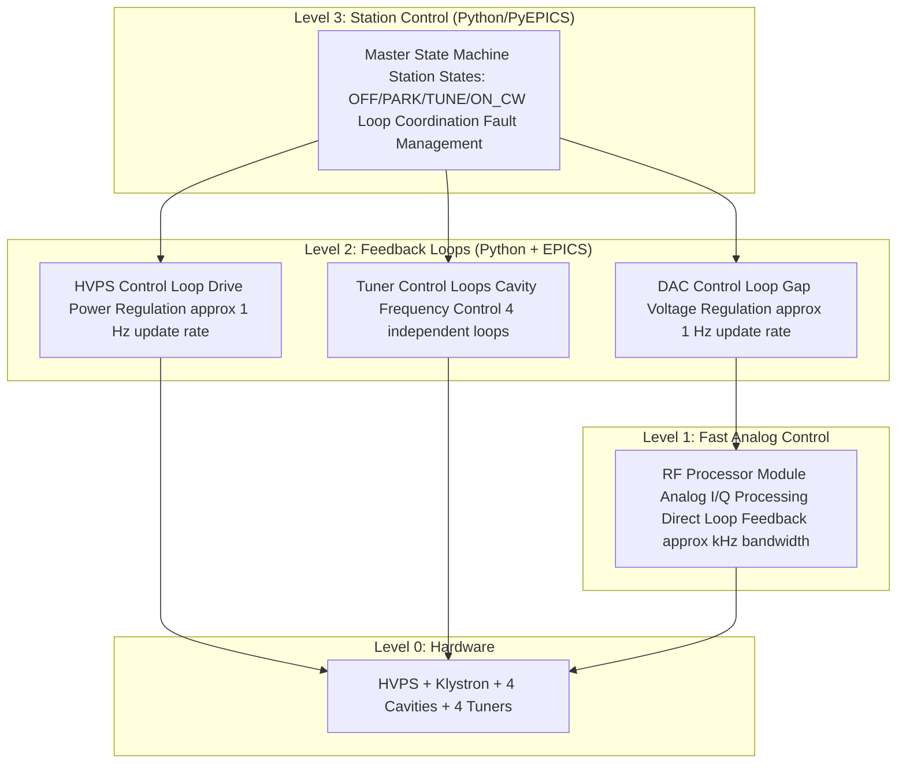

---

## 2. SPEAR3 RF System Overview

## Physical System Layout

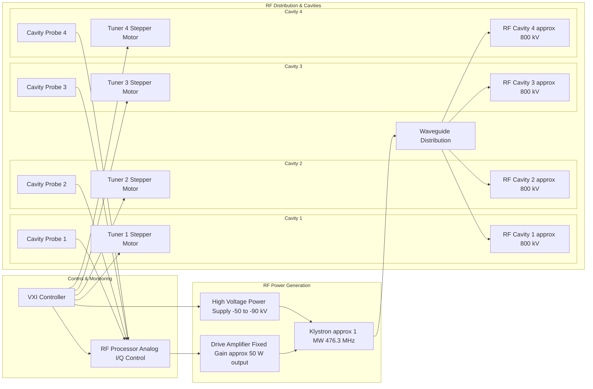

### Energy Balance & Control Purpose

The fundamental purpose of the RF system is **energy replacement**:

1. **Energy Loss**: Electrons lose ~500 keV per turn due to synchrotron radiation
2. **Energy Replacement**: 4 cavities provide ~3.2 MV total to replace lost energy
3. **Stability Requirements**: 
   - Amplitude stability < 0.1% for constant beam energy
   - Phase stability < 0.1° for synchronous acceleration
   - Individual cavity tuning to maintain 476.3 MHz resonance

---

## 3. Control System Architecture

### Three-Level Control Hierarchy

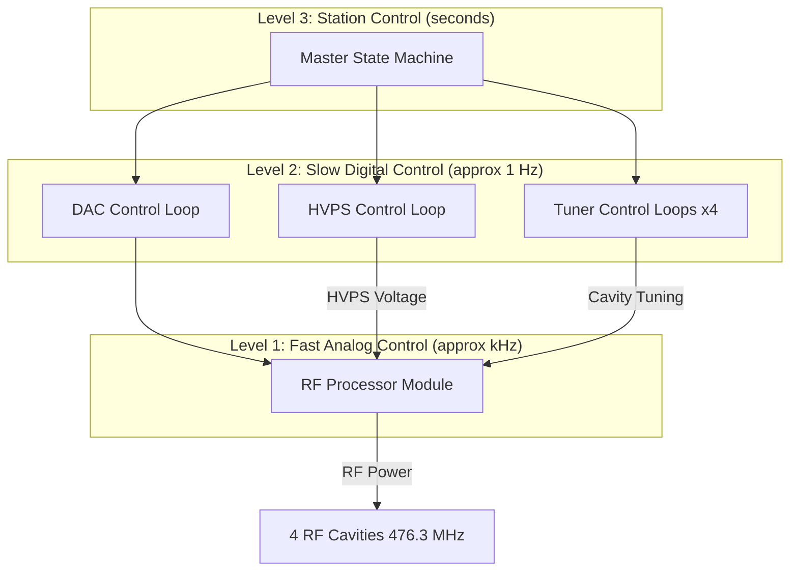

## Control Loop Interactions

The three main control loops work together in a coordinated fashion:

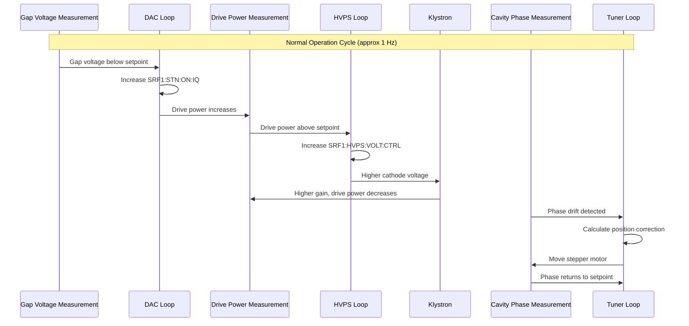


---

## 4. Control Loop Analysis

## 4.1 DAC Control Loop

**Purpose**: Maintains total gap voltage by controlling the amplitude of the RF Processor output.

**Key Process Variables**:
- **Control Output**: `SRF1:STN:ON:IQ` (DAC counts, 0-2047)
- **Measurement**: Sum of 4 cavity gap voltages
- **Setpoint**: Total gap voltage (~3.2 MV)

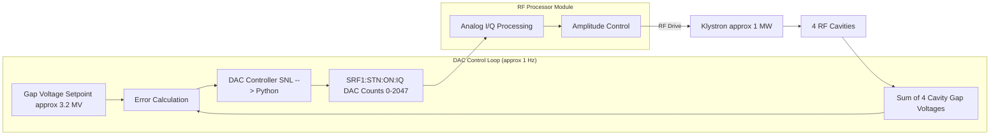

**Algorithm (from `rf_dac_loop.st`)**:
```python
# Pseudocode for Python implementation
def dac_control_loop():
    gap_voltage_total = sum([cav1_gap, cav2_gap, cav3_gap, cav4_gap])
    error = gap_voltage_setpoint - gap_voltage_total
    
    # Get delta from EPICS calculation record
    delta_counts = epics.caget('SRF1:STNVOLT:DAC:DELTA')
    
    current_counts = epics.caget('SRF1:STN:ON:IQ.A')
    new_counts = current_counts + delta_counts
    
    # Apply limits and deadband
    new_counts = max(0, min(2047, new_counts))
    if abs(delta_counts) > 0.5:  # Deadband
        epics.caput('SRF1:STN:ON:IQ.A', new_counts)
```

## 4.2 HVPS Control Loop

**Purpose**: Maintains optimal klystron drive power by adjusting the high voltage power supply.

**Key Process Variables**:
- **Control Output**: `SRF1:HVPS:VOLT:CTRL` (kV)
- **Measurement**: `SRF1:KLYSDRIVFRWD:POWER` (drive power)
- **Setpoint**: `SRF1:KLYSDRIVFRWD:POWER:ON` or `HIGH`

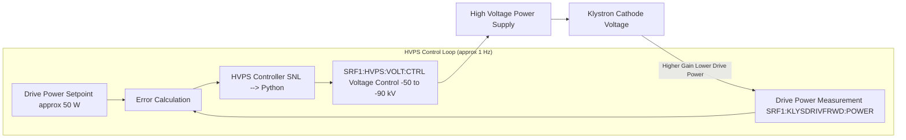

**Control Strategy**:
- As DAC loop increases RF amplitude → drive power increases
- HVPS loop detects drive power above setpoint
- Increases klystron cathode voltage → higher klystron gain
- Drive power returns to setpoint with higher RF output

### 4.3 Tuner Control Loops (×4)

**Purpose**: Maintain each cavity at 476.3 MHz resonance by controlling stepper motor position.

**Key Process Variables** (per cavity):
- **Control Output**: Stepper motor position commands
- **Measurement**: Phase difference between forward power and cavity field
- **Setpoint**: Desired phase angle (cavity on resonance)

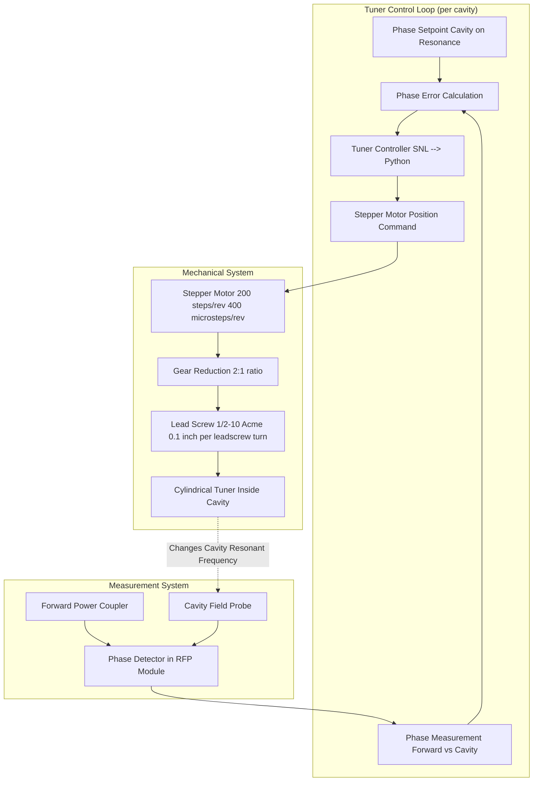

**Tuner Mechanical Specifications** (from Jim's document):
- **Stepper Motor**: Superior Electric Slo-Syn M093-FC11 (NEMA 34D)
- **Steps per Revolution**: 200 (standard)
- **Microsteps**: 400 per revolution (2 microsteps per step)
- **Gear Ratio**: 2:1 (2 motor turns = 1 leadscrew turn)
- **Lead Screw**: 1/2-10 Acme thread (0.1" per leadscrew turn, 0.05" per motor revolution)
- **Resolution**: 1.27 mm per motor revolution
- **Total Steps per mm**: 400 microsteps / 1.27 mm ≈ 315 microsteps/mm

---

## 5. Hardware Interface Details

## 5.1 RF Processor Module (RFP)

The RFP is the heart of the fast analog control system:

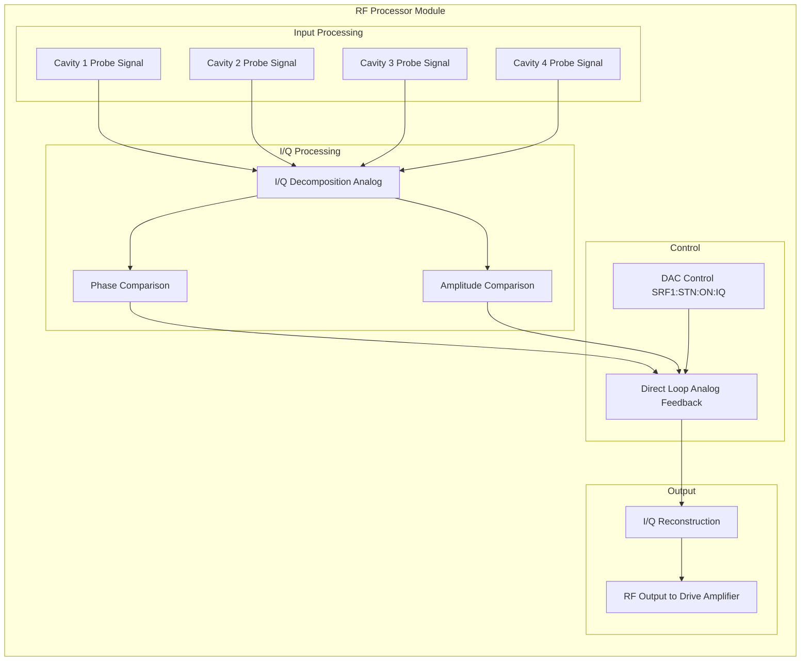

**Key RFP Process Variables**:
- `SRF1:STN:ON:IQ.A` - Main amplitude control (DAC counts)
- `SRF1:STNDIRECT:LOOP:COUNTS.A` - Direct loop gain
- `SRF1:STNDIRECT:LOOP:PHASE.C` - Direct loop phase
- `SRF1:STN:RFP:DIRECTLOOP` - Direct loop enable/disable

### 5.2 Stepper Motor Control System

**Current System** (to be replaced):
- Allen-Bradley 1746-HSTP1 controller module
- Superior Electric Slo-Syn SS2000MD4-M PWM driver
- No encoders, only linear potentiometers for position indication

**Proposed Upgrade**:
- Galil DMC-4143 four-axis motion controller
- Modern stepper drivers with microstepping
- Integrated with EPICS motor record

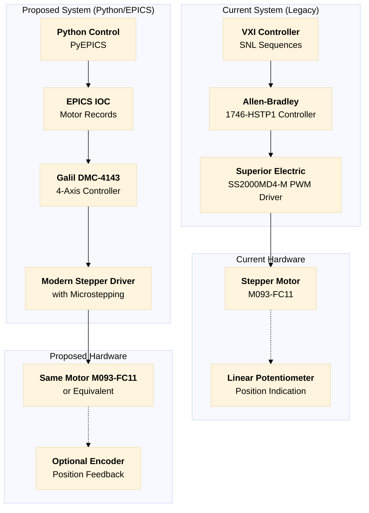

---

## 6. Operational Modes & State Machine

### 6.1 Station States

The master state machine coordinates all control loops through four main states:

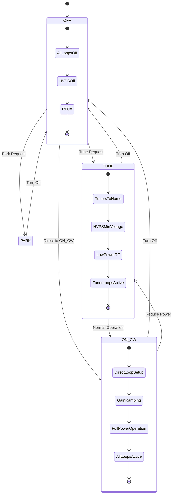

## 6.2 Station Turn-On Sequence (ON_CW Mode)

Based on Jim's documentation, the turn-on sequence is carefully orchestrated:

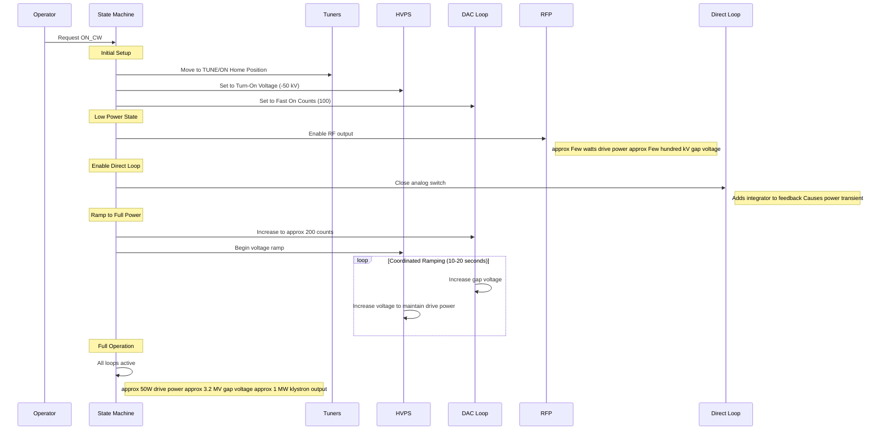

### 6.3 Critical Control Parameters

From the operational document and code analysis:

| Parameter | PV Name | Value | Purpose |
|-----------|---------|-------|---------|
| **Direct Loop Gain** | `SRF1:STNDIRECT:LOOP:COUNTS.A` | Tunable | Feedback loop stability |
| **Direct Loop Phase** | `SRF1:STNDIRECT:LOOP:PHASE.C` | Tunable | Phase compensation |
| **Fast On Counts** | `SRF1:STN:ONFAST:INIT` | 100 | Initial DAC setting |
| **Turn-On Voltage** | `SRF1:HVPS:VOLT:MIN` | -50 kV | Initial HVPS voltage |
| **Drive Power Setpoint** | `SRF1:KLYSDRIVFRWD:POWER:ON` | ~50 W | Normal operation |
| **Gap Voltage Setpoint** | Total of 4 cavities | ~3.2 MV | Energy replacement |


---

## 7. Tuner Control System

### 7.1 Tuner Mechanical Assembly

Based on Jim's detailed documentation and drawing SA-341-392-61:

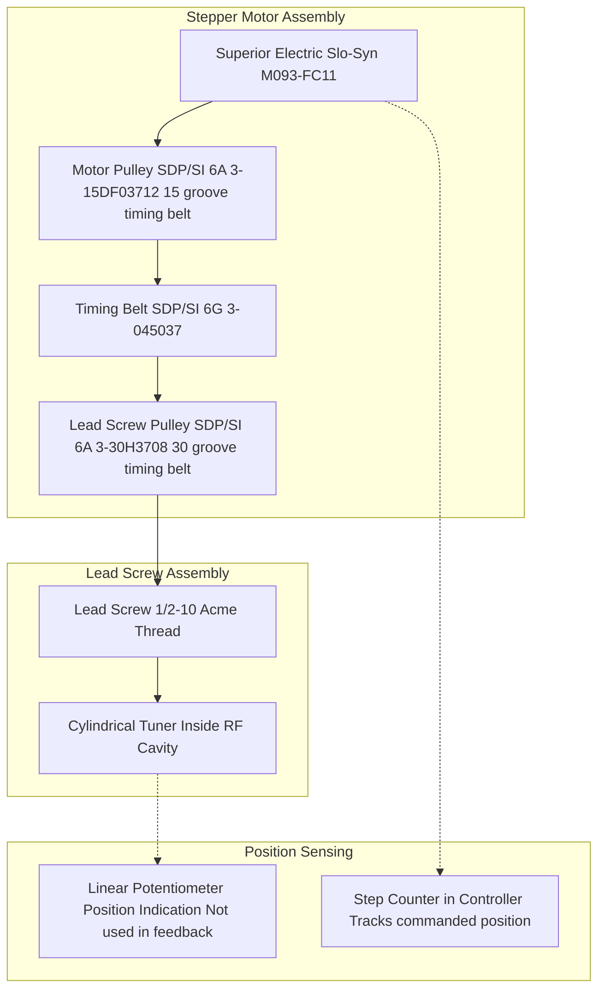

**Mechanical Calculations**:
- **Gear Ratio**: 15:30 = 1:2 (2 motor turns = 1 leadscrew turn)
- **Lead Screw Pitch**: 1/2-10 Acme = 0.1" per turn = 2.54 mm per turn
- **Motor Resolution**: 200 steps/rev × 2 microsteps/step = 400 microsteps/rev
- **Linear Resolution**: 2.54 mm ÷ (2 × 400) = 0.003175 mm per microstep
- **Total Range**: ~2.5 mm typical motion during startup, ~0.2 mm during operation

## 7.2 Tuner Control Algorithm

The tuner control system implements two feedback loops:

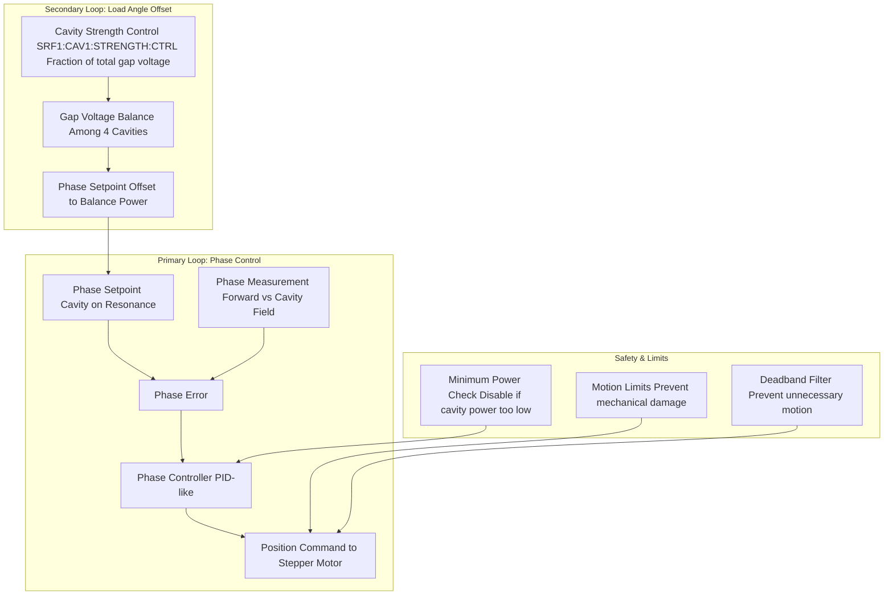

**Algorithm Features** (from `rf_tuner_loop.st`):
1. **Home Position**: Establishes reference position using potentiometer reading
2. **Power Interlock**: Disables tuning if cavity power below threshold
3. **Motion Profiles**: Acceleration/deceleration for smooth motion
4. **Deadband**: Prevents chattering with small corrections
5. **Fault Recovery**: "Stop and Init" feature realigns step counter with potentiometer

### 7.3 Proposed Tuner Upgrade

**Hardware Upgrade**:
- Replace Allen-Bradley + Superior Electric with Galil DMC-4143
- Add optional encoders for position feedback
- Implement modern motion profiles

**Software Architecture**:

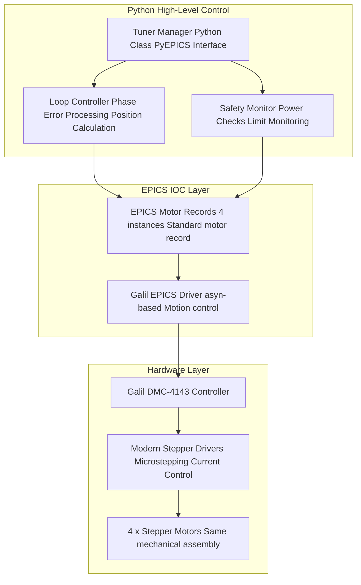

---

## 8. Legacy Code Structure

## 8.1 File Organization

The legacy SNL code follows a consistent pattern:

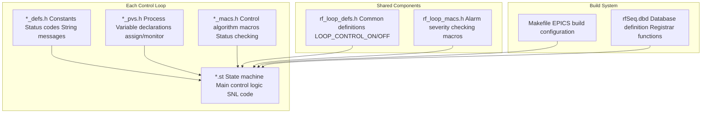

### 8.2 Key Design Patterns

**Pattern 1: Event-Driven + Heartbeat**
```c
// SNL pattern used throughout
when (efTestAndClear(ready_ef) || delay(MAX_INTERVAL))
{
    // Control algorithm
}
```

**Pattern 2: Priority Safety Checks**
```c
// Common pattern in all loops
if (module_severity >= INVALID_ALARM) return STATUS_BAD;
if (measurement_severity >= MAJOR_ALARM) return STATUS_BAD;
if (safety_condition_violated) return STATUS_FAULT;
// Only then apply control
```

**Pattern 3: Status Machine**
```c
// Each loop maintains
int status_code;           // For automation
string status_string;      // For operators  
int previous_status;       // For change detection
```

### 8.3 Critical Code Sections

**DAC Loop Core Algorithm** (`rf_dac_loop_macs.h`):
```c
#define DAC_LOOP_SET() \
    pvGet(current_counts); \
    pvGet(delta_counts); \
    if (abs(delta_counts) > MIN_DELTA_COUNTS) { \
        new_counts = current_counts + delta_counts; \
        new_counts = max(0, min(MAX_COUNTS, new_counts)); \
        pvPut(new_counts); \
    }
```

**HVPS Voltage Control** (`rf_hvps_loop_macs.h`):
```c
#define HVPS_LOOP_SET_VOLTAGE() \
    current_voltage = hvps_voltage_ctrl; \
    new_voltage = current_voltage + delta_voltage; \
    new_voltage = max(min_voltage, min(max_voltage, new_voltage)); \
    if (abs(readback - previous_request) < tolerance) { \
        hvps_voltage_ctrl = new_voltage; \
        pvPut(hvps_voltage_ctrl); \
    }
```

---

## 9. Python/EPICS Migration Strategy

### 9.1 Migration Architecture

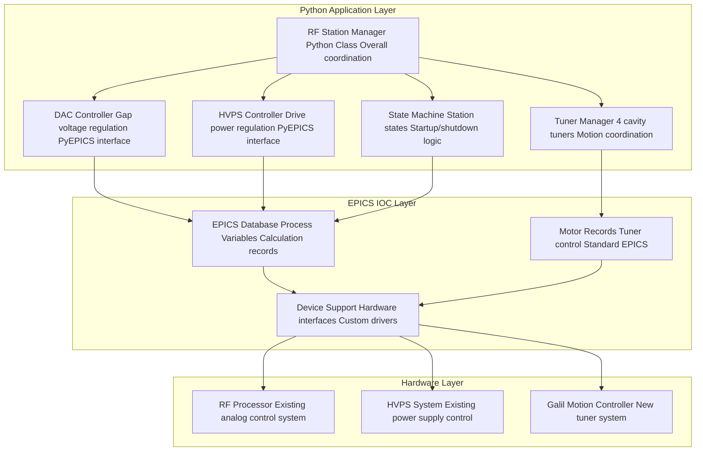

### 9.2 Python Implementation Framework

**Base Classes**:

```python
import epics
import time
import logging
from abc import ABC, abstractmethod
from enum import Enum

class StationState(Enum):
    OFF = 0
    PARK = 1
    TUNE = 2
    ON_CW = 3

class ControlLoop(ABC):
    """Base class for all control loops"""
    
    def __init__(self, name, update_rate=1.0):
        self.name = name
        self.update_rate = update_rate
        self.enabled = False
        self.status = "UNKNOWN"
        self.logger = logging.getLogger(f"LLRF.{name}")
    
    @abstractmethod
    def update(self):
        """Main control algorithm - called at update_rate"""
        pass
    
    @abstractmethod
    def enable(self):
        """Enable the control loop"""
        pass
    
    @abstractmethod
    def disable(self):
        """Disable the control loop"""
        pass

class DACController(ControlLoop):
    """DAC control loop for gap voltage regulation"""
    
    def __init__(self):
        super().__init__("DAC_Loop", update_rate=1.0)
        self.gap_voltage_pv = epics.PV('SRF1:STNVOLT:TOTAL')
        self.dac_counts_pv = epics.PV('SRF1:STN:ON:IQ.A')
        self.delta_pv = epics.PV('SRF1:STNVOLT:DAC:DELTA')
        self.setpoint = 3200.0  # kV
        
    def update(self):
        if not self.enabled:
            return
            
        gap_voltage = self.gap_voltage_pv.get()
        delta_counts = self.delta_pv.get()
        current_counts = self.dac_counts_pv.get()
        
        if abs(delta_counts) > 0.5:  # Deadband
            new_counts = max(0, min(2047, current_counts + delta_counts))
            self.dac_counts_pv.put(new_counts)
            self.logger.info(f"DAC updated: {current_counts} -> {new_counts}")

class RFStationManager:
    """Main RF station control class"""
    
    def __init__(self):
        self.state = StationState.OFF
        self.dac_controller = DACController()
        self.hvps_controller = HVPSController()
        self.tuner_manager = TunerManager()
        
        # State machine PVs
        self.state_ctrl_pv = epics.PV('SRF1:STN:STATE:CTRL')
        self.state_rbck_pv = epics.PV('SRF1:STN:STATE:RBCK')
        
    def run(self):
        """Main control loop"""
        while True:
            try:
                self._update_state_machine()
                self._update_control_loops()
                time.sleep(0.1)  # 10 Hz main loop
            except Exception as e:
                self.logger.error(f"Control loop error: {e}")
                
    def _update_control_loops(self):
        """Update all control loops at their respective rates"""
        current_time = time.time()
        
        if self._should_update(self.dac_controller, current_time):
            self.dac_controller.update()
            
        if self._should_update(self.hvps_controller, current_time):
            self.hvps_controller.update()
            
        if self._should_update(self.tuner_manager, current_time):
            self.tuner_manager.update()
```

### 9.3 EPICS Integration Strategy

**Process Variable Organization**:

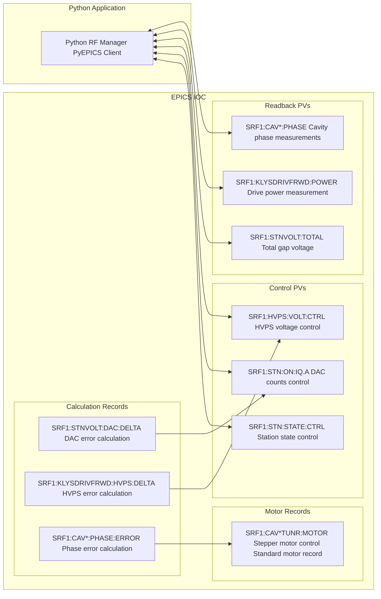


---

## 10. Implementation Recommendations

### 10.1 Migration Phases

**Phase 1: Infrastructure Setup**
1. **EPICS IOC Migration**: VxWorks → Linux soft-IOC
2. **Database Development**: Recreate PV database with calculation records
3. **Hardware Interface**: Maintain existing RFP and HVPS interfaces
4. **Basic Python Framework**: Implement base classes and PyEPICS connections

**Phase 2: Control Loop Migration**
1. **DAC Loop**: Migrate gap voltage control to Python
2. **HVPS Loop**: Migrate drive power control to Python
3. **State Machine**: Implement station state coordination
4. **Testing**: Parallel operation with legacy system

**Phase 3: Tuner System Upgrade**
1. **Hardware Replacement**: Install Galil DMC-4143 controller
2. **EPICS Motor Records**: Configure standard motor record interface
3. **Python Tuner Manager**: Implement high-level tuner coordination
4. **Commissioning**: Test with actual RF cavities

**Phase 4: Advanced Features**
1. **Enhanced Diagnostics**: Add modern monitoring capabilities
2. **Improved Algorithms**: Implement advanced control strategies
3. **Web Interface**: Modern operator interface development
4. **Documentation**: Complete system documentation

### 10.2 Hardware Recommendations

**Tuner Control System**:
- **Motion Controller**: Galil DMC-4143 (4-axis, Ethernet)
- **Stepper Drivers**: Modern microstepping drivers (16-64 microsteps/step)
- **Motors**: Keep existing Superior Electric M093-FC11 or equivalent
- **Encoders**: Optional incremental encoders for position feedback
- **Networking**: Ethernet connection to EPICS IOC

**Computing Platform**:
- **IOC Platform**: Linux (Ubuntu/CentOS) on industrial PC
- **Python Environment**: Python 3.8+ with PyEPICS, NumPy, SciPy
- **EPICS Version**: EPICS Base 7.x with modern extensions
- **Real-time**: Soft real-time sufficient for ~1 Hz control loops

### 10.3 Software Architecture Details

**Directory Structure**:
```
spear_llrf/
├── src/
│   ├── control/
│   │   ├── __init__.py
│   │   ├── base.py          # Base classes
│   │   ├── dac_loop.py      # DAC control loop
│   │   ├── hvps_loop.py     # HVPS control loop
│   │   ├── tuner_manager.py # Tuner control
│   │   └── state_machine.py # Station state machine
│   ├── hardware/
│   │   ├── __init__.py
│   │   ├── rfp_interface.py # RF Processor interface
│   │   ├── hvps_interface.py# HVPS interface
│   │   └── galil_interface.py# Galil motion controller
│   ├── utils/
│   │   ├── __init__.py
│   │   ├── logging.py       # Logging configuration
│   │   ├── config.py        # Configuration management
│   │   └── diagnostics.py   # System diagnostics
│   └── main.py              # Main application entry
├── epics/
│   ├── db/                  # EPICS database files
│   ├── ioc/                 # IOC startup scripts
│   └── protocols/           # Device protocols
├── config/
│   ├── rf_station.yaml      # Main configuration
│   ├── tuner_params.yaml    # Tuner parameters
│   └── safety_limits.yaml   # Safety limits
├── tests/
│   ├── unit/                # Unit tests
│   ├── integration/         # Integration tests
│   └── hardware/            # Hardware-in-loop tests
└── docs/
    ├── api/                 # API documentation
    ├── operations/          # Operations manual
    └── commissioning/       # Commissioning procedures
```

**Configuration Management**:
```yaml
# rf_station.yaml
station:
  name: "SRF1"
  frequency: 476.3e6  # Hz
  
control_loops:
  dac:
    update_rate: 1.0    # Hz
    deadband: 0.5       # counts
    max_counts: 2047
    
  hvps:
    update_rate: 1.0    # Hz
    min_voltage: 0      # kV
    max_voltage: 50     # kV
    
  tuners:
    update_rate: 0.5    # Hz
    deadband: 5         # microsteps
    max_speed: 1000     # steps/sec

safety:
  min_cavity_power: 10  # kW
  max_drive_power: 100  # W
  interlock_timeout: 5  # seconds
```

### 10.4 Testing Strategy

**Unit Testing**:
```python
import unittest
from unittest.mock import Mock, patch
from spear_llrf.control.dac_loop import DACController

class TestDACController(unittest.TestCase):
    
    def setUp(self):
        self.dac = DACController()
        
    @patch('epics.PV')
    def test_dac_update_within_deadband(self, mock_pv):
        """Test that small deltas are ignored"""
        mock_pv.return_value.get.side_effect = [3200.0, 0.3, 1000]
        
        self.dac.enabled = True
        self.dac.update()
        
        # Should not call put() due to deadband
        mock_pv.return_value.put.assert_not_called()
        
    @patch('epics.PV')
    def test_dac_update_above_deadband(self, mock_pv):
        """Test that large deltas are applied"""
        mock_pv.return_value.get.side_effect = [3150.0, 10.0, 1000]
        
        self.dac.enabled = True
        self.dac.update()
        
        # Should call put() with new value
        mock_pv.return_value.put.assert_called_once_with(1010)
```

**Integration Testing**:
- Test control loop interactions
- Verify state machine transitions
- Test hardware interface communication
- Validate safety interlocks

**Hardware-in-Loop Testing**:
- Test with actual RF Processor module
- Verify HVPS control interface
- Test Galil motion controller
- Validate cavity tuner operation

### 10.5 Commissioning Plan

**Pre-Commissioning**:
1. **Software Testing**: Complete unit and integration tests
2. **Hardware Verification**: Test all hardware interfaces
3. **Database Validation**: Verify EPICS PV database
4. **Safety Review**: Validate all safety interlocks

**Commissioning Phases**:

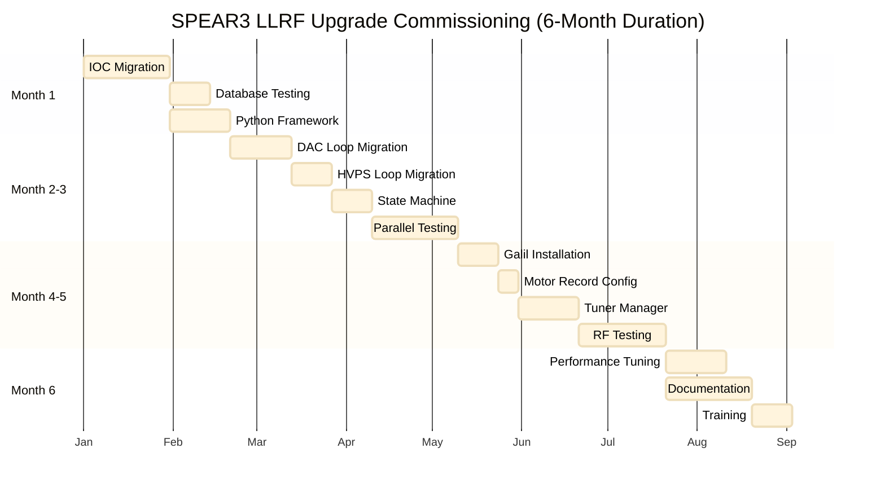

**Success Criteria**:
- **Amplitude Stability**: < 0.1% (same as legacy)
- **Phase Stability**: < 0.1° (same as legacy)
- **Tuner Resolution**: < 0.01 mm (improved from legacy)
- **Control Loop Response**: < 2 seconds (improved from legacy)
- **Uptime**: > 99.5% (same as legacy)

### 10.6 Risk Mitigation

**Technical Risks**:
1. **Hardware Compatibility**: Maintain existing RFP and HVPS interfaces
2. **Real-time Performance**: Use proven EPICS real-time capabilities
3. **Control Stability**: Implement same algorithms as legacy system
4. **Safety Systems**: Maintain all existing safety interlocks

**Operational Risks**:
1. **Downtime**: Implement parallel operation during transition
2. **Training**: Provide comprehensive operator training
3. **Documentation**: Maintain detailed operational procedures
4. **Support**: Establish clear support procedures

**Mitigation Strategies**:
- **Rollback Plan**: Ability to return to legacy system if needed
- **Parallel Operation**: Run new system alongside legacy during testing
- **Incremental Deployment**: Phase-by-phase implementation
- **Extensive Testing**: Comprehensive testing at each phase

---

## Conclusion

The SPEAR3 LLRF control system represents a sophisticated multi-loop feedback system that has successfully operated for many years. The migration to Python/EPICS offers opportunities for:

1. **Modernization**: Replace obsolete hardware with current technology
2. **Maintainability**: Python code is more maintainable than SNL
3. **Flexibility**: Easier to implement new features and algorithms
4. **Integration**: Better integration with modern control systems
5. **Performance**: Potential for improved control performance

The detailed analysis of Jim's operational document combined with the legacy code provides a solid foundation for the upgrade project. The proposed architecture maintains the proven control strategies while enabling future enhancements.

**Key Success Factors**:
- Maintain existing control algorithms during initial migration
- Implement comprehensive testing at each phase
- Provide thorough documentation and training
- Plan for parallel operation during commissioning
- Establish clear rollback procedures

This comprehensive analysis provides the technical foundation needed to successfully upgrade the SPEAR3 LLRF control system to a modern Python/EPICS implementation while maintaining the high reliability and performance required for synchrotron light source operations.
