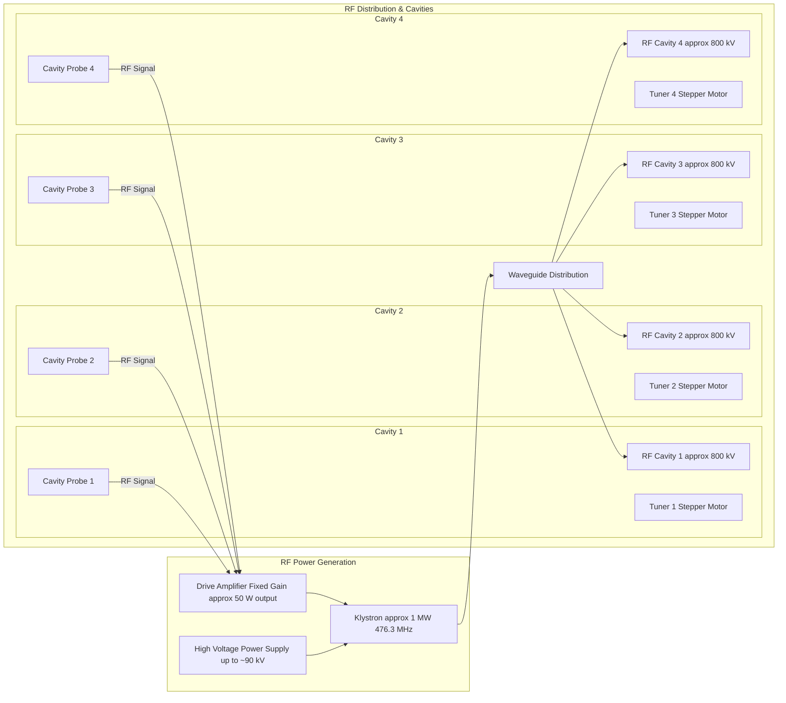

# SPEAR3 LLRF Control System — Comprehensive Analysis
## Legacy System Review & Upgrade Project Scope with Dimtel LLRF9

*Based on detailed analysis of legacy SNL code, Jim's operational documentation, LLRF9 technical manual, and LLRF Upgrade Task List Rev3*

**Document Version**: 3.0  
**Last Updated**: 2026-02-27  
**Includes**: Full upgrade project scope, LLRF9 integration, and legacy-to-upgrade comparison

---

## Table of Contents

1. [Executive Summary](#1-executive-summary)
2. [Legacy System vs. Upgraded System — At a Glance](#2-legacy-system-vs-upgraded-system--at-a-glance)
3. [LLRF9 Controller — The Heart of the Upgrade](#3-llrf9-controller--the-heart-of-the-upgrade)
4. [Full Upgrade Project Scope](#4-full-upgrade-project-scope)
5. [SPEAR3 RF System Overview (Physical System)](#5-spear3-rf-system-overview-physical-system)
6. [Legacy Control System Architecture](#6-legacy-control-system-architecture)
7. [Legacy Control Loop Analysis](#7-legacy-control-loop-analysis)
8. [Legacy Operational Modes & State Machine](#8-legacy-operational-modes--state-machine)
9. [Legacy Tuner Control System](#9-legacy-tuner-control-system)
10. [Legacy Calibration & Fault Management](#10-legacy-calibration--fault-management)
11. [Legacy Code Structure & Design Patterns](#11-legacy-code-structure--design-patterns)
12. [Upgraded System Integration Architecture](#12-upgraded-system-integration-architecture)
13. [Implementation Plan & Risk Mitigation](#13-implementation-plan--risk-mitigation)

---

## 1. Executive Summary

The SPEAR3 LLRF (Low-Level RF) control system is a sophisticated multi-loop feedback system that maintains stable RF power for the SPEAR3 storage ring at SSRL. The system controls **one klystron** driving **four RF cavities** at **476.3 MHz**, with individual **stepper motor tuners** for each cavity.

The LLRF upgrade project replaces the entire control electronics chain — not just the low-level RF controller, but also the machine protection system, HVPS controller, tuner motor controllers, and supporting subsystems. **Two Dimtel LLRF9 units** form the core of the new system, with four units purchased to provide a complete set of spares.

> **Historical Note**: The legacy control software was originally written for the **PEP-II B-Factory** project (circa 1997) and was later adapted for SPEAR3. This heritage explains the presence of operational modes (ON_FM, PARK) and hardware references (VXI, CAMAC) that are no longer used at SPEAR3.

### Key System Parameters
| Parameter | Value | Notes |
|-----------|-------|-------|
| **RF Frequency** | 476.3 MHz | Determined by beam orbit; LLRF9/476 variant supports 476 ± 2.5 MHz |
| **Total Gap Voltage** | ~3.2 MV | Sum of 4 cavity gap voltages |
| **Klystron Power** | ~1 MW | Single klystron drives all 4 cavities |
| **HVPS Voltage** | up to ~90 kV | Klystron cathode voltage |
| **Drive Power** | ~50 W nominal | Input to klystron from LLRF |
| **Number of Cavities** | 4 | Single-cell cavities with individual tuners |
| **Cavity Gap Voltage** | ~800 kV each | Individual cavity contribution |

---

## 2. Legacy System vs. Upgraded System — At a Glance

This section provides a clear, side-by-side comparison of the current (legacy) system and the planned upgraded system across every major subsystem.

### 2.1 System-Level Comparison

| Aspect | Legacy System | Upgraded System |
|--------|---------------|-----------------|
| **LLRF Controller** | Custom PEP-II analog RF Processor (RFP) module in VXI chassis | **Dimtel LLRF9** (×2 units) — digital FPGA-based, integrated EPICS IOC |
| **Control Software** | SNL (State Notation Language) on VxWorks RTOS | **Python/PyEPICS** + LLRF9 internal EPICS IOC |
| **Fast Feedback** | Analog I/Q processing, ~kHz bandwidth | Digital vector sum + PI loops, **270 ns direct loop delay** |
| **Machine Protection** | PLC-5 (Allen-Bradley 1771) | **ControlLogix 1756** (Allen-Bradley) |
| **HVPS Controller** | SLC-500 PLC + original Enerpro gate driver | **CompactLogix PLC** + upgraded Enerpro boards |
| **Tuner Motor Controller** | Allen-Bradley 1746-HSTP1 + Slo-Syn PWM driver | **Modern motion controller** (Galil DMC-4143 or equivalent) |
| **Tuner Motor Driver** | Superior Electric SS2000MD4-M (obsolete) | Modern stepper driver with microstepping |
| **RF Signal Monitoring** | VXI-based analog modules (RFP, GVF, CFM) | LLRF9 9-channel digital acquisition + external slow power detectors |
| **Arc Detection** | Non-functional existing system | **Microstep-MIS optical arc detectors** (new) |
| **Interlocks** | Distributed across analog modules | LLRF9 integrated interlocks (9 RF + 8 baseband) + MPS PLC |
| **Diagnostics** | Limited; fault file capture from VXI modules | LLRF9 waveform capture (16k samples/ch), network/spectrum analyzer |
| **Communication** | VXI backplane, CAMAC, field bus | **Ethernet/EPICS Channel Access** throughout |

### 2.2 Control Loop Comparison

| Control Loop | Legacy Implementation | Upgraded Implementation |
|--------------|----------------------|------------------------|
| **Fast RF Feedback (Direct Loop)** | Analog I/Q in RFP module | LLRF9 FPGA: digital proportional + integral, 270 ns latency |
| **DAC Control Loop** (~1 Hz) | SNL `rf_dac_loop.st` on VxWorks | LLRF9 vector sum + setpoint control; Python/EPICS for supervisory |
| **HVPS Control Loop** (~1 Hz) | SNL `rf_hvps_loop.st` on VxWorks | **Python/EPICS** — still required; HVPS remains external to LLRF9 |
| **Tuner Control Loops** (×4) | SNL `rf_tuner_loop.st` on VxWorks | **LLRF9 phase measurement** → Python/EPICS → Motor controller |
| **Station State Machine** | SNL `rf_states.st` on VxWorks | **Python/EPICS** supervisory layer |
| **Calibration** | SNL `rf_calib.st` (2800+ lines, ~20 min) | **LLRF9 built-in digital calibration** — eliminates analog drift |
| **Ripple Rejection** | Analog ripple loop in legacy hardware | LLRF9 digital feedback — inherently rejects power-line ripple |
| **Comb/GFF Loops** | Dedicated analog modules (CFM, GVF) | **Eliminated** — replaced by LLRF9 digital feedback |

### 2.3 What Stays, What Changes, What's New

#### ✅ Retained (same physical hardware)
- **Klystron** and its RF output
- **4 RF Cavities** and their waveguide distribution
- **Stepper motors** (same M093-FC11 or equivalent) and mechanical tuner assemblies
- **Linear potentiometers** on tuners (position indication, not used in closed-loop)
- **HVPS power electronics** (transformer, rectifier, oil system) — controller upgraded, power stage unchanged

#### 🔄 Replaced / Upgraded
- **LLRF Controller**: Analog RFP module → Dimtel LLRF9 (×2)
- **MPS System**: PLC-5 1771 → ControlLogix 1756
- **HVPS Controller**: SLC-500 → CompactLogix + new Enerpro boards + redesigned analog regulator
- **Tuner Motor Controllers**: Allen-Bradley HSTP1 + Slo-Syn driver → Galil or equivalent
- **Control Software**: SNL/VxWorks → Python/EPICS + LLRF9 IOC
- **Operator Interface**: Legacy EDM panels → modernized panels

#### 🆕 New Subsystems
- **Arc Detection**: Microstep-MIS optical sensors on cavity windows and klystron
- **Slow Power Monitoring**: 8-channel Minicircuits detector chassis for circulator/load powers
- **Interface Chassis**: New integration hub connecting LLRF9, MPS, and HVPS systems
- **Waveform Diagnostics**: LLRF9 network/spectrum analyzer, 16k-sample waveform capture

---

## 3. LLRF9 Controller — The Heart of the Upgrade

### 3.1 Overview

The Dimtel LLRF9 is a 9-channel low-level RF controller specifically designed for lepton storage rings. SPEAR3 requires the **LLRF9/476 variant** (476 ± 2.5 MHz). **Two LLRF9 units** are required for the 4-cavity configuration; four units have been purchased to provide a complete set of spares.

The LLRF9 replaces the legacy analog RFP module and its associated VXI-based signal processing with a fully digital, FPGA-based system that includes its own Linux-based EPICS IOC.

### 3.2 Hardware Architecture

Each LLRF9 contains:
- **3 × LLRF4.6 boards**: Each with 4 high-speed ADC channels + 2 DAC channels, powered by a Xilinx Spartan-6 FPGA
- **LO/Interconnect module**: Local oscillator synthesis (divide-and-mix topology for low phase noise), RF reference distribution, output amplification/filtering, interlock logic
- **Linux SBC**: mini-ITX form factor, runs the built-in EPICS IOC
- **Thermal stabilization**: Aluminum cold plate with 3 TEC (thermoelectric cooler) modules under PID control — critical for phase stability
- **Interlock subsystem**: 9 RF input interlocks + 8 baseband ADC interlocks, hardware daisy-chain

**LO Signal Generation** (LLRF9/476):
| Signal | Ratio to f_rf | Frequency (MHz) |
|--------|--------------|-----------------|
| Reference (f_rf) | 1 | 476.000 |
| IF | 1/12 | 39.667 |
| Local Oscillator | 11/12 | 436.333 |
| ADC Clock | 11/48 | 109.083 |
| DAC Clock | 11/24 | 218.167 |

### 3.3 SPEAR3 Configuration: Two LLRF9 Units

Per the LLRF9 manual Section 8.4 ("One station, four cavities, single power source"), this configuration requires **two LLRF9 units**:

**Unit 1 — Field Control & Tuner Loops:**
- Runs the field control feedback loop (vector sum of cavity probes)
- Manages all four tuner loops using 10 Hz phase data
- Connected to: 4 cavity probe signals + 4 cavity forward signals + klystron forward signal
- Outputs: Klystron drive signal (DAC0)

**Unit 2 — Monitoring & Interlocks:**
- Monitors 4 cavity reflected signals (for interlock protection)
- Monitors additional signals: circulator loads, magic-T loads, etc.
- Provides interlock chain redundancy
- No drive output required

**Communication**: Both units connect via Ethernet to the Python/EPICS coordinator. The LLRF9's built-in EPICS IOC publishes all PVs on the control network.

### 3.4 Key Capabilities

| Capability | Specification | Replaces Legacy... |
|------------|---------------|-------------------|
| **Vector sum** | 2-channel digital combining | Analog RFP I/Q summation |
| **Direct loop delay** | 270 ns | Analog direct loop (~µs) |
| **Feedback loops** | Proportional + Integral | Analog P+I in RFP |
| **Phase measurement** | 10 Hz, synchronized across all 9 channels, ±17.4 ns timestamp | VXI-based phase detection |
| **Setpoint profiles** | 512 points, 70 µs – 18.9 s ramp time | Not available in legacy |
| **Waveform capture** | 16,384 samples/channel, hardware trigger | Limited fault file dumps |
| **Network analyzer** | Built-in swept measurement, ±25 kHz around RF | External test equipment |
| **Interlocks** | 9 RF + 8 baseband, timestamped, daisy-chain I/O | Distributed analog interlocks |
| **Tuner interface** | EPICS motor record, RS-485 or Ethernet to motor controllers | Allen-Bradley HSTP1 |
| **Calibration** | Digital — no analog drift; factory EEPROM + installation-specific | rf_calib.st (2800 lines, ~20 min) |
| **Slow ADC** | 8 channels, 12-bit, ±10V/±5V/0-10V/0-5V, interlockable | External monitoring |

### 3.5 What LLRF9 Replaces vs. What Remains External

#### ✅ LLRF9 Replaces:
- Analog RF Processor (RFP) module — all fast I/Q processing
- Gap Voltage Feed-forward (GVF) module
- Cavity Field Monitor (CFM) module
- Complex calibration system (`rf_calib.st`)
- Comb loop, direct loop, GFF loop analog processing
- Phase detection for tuner feedback
- RF interlock processing

#### 🔄 Still Required in Python/EPICS Layer:
- **Station state machine** (OFF/TUNE/ON_CW) — high-level coordination
- **HVPS supervisory control** — HVPS remains controlled by external PLC
- **Tuner position management** — LLRF9 provides phase error, Python coordinates motor motion
- **Load angle offset loop** — for Robinson-stable detuning (especially low beam loading) &  balances gap voltage across 4 cavities
- **MPS coordination** — system-level fault handling
- **Slow power monitoring** — additional RF channels beyond LLRF9's 18 inputs
- **Operator interface** — EDM panels and logging

---

## 4. Full Upgrade Project Scope

This section covers the **complete** upgrade project scope as defined in the LLRF Upgrade Task List (Rev 3, July 2025). The upgrade is far more than an LLRF controller swap — it modernizes the entire RF control electronics chain.

### 4.1 Subsystem Overview

### SPEAR3 RF Upgrade Scope

```
┌───────────────────────────────────────────────────────────────────────────┐
│                           SPEAR3 RF Upgrade Scope                          │
├────────────────────┬──────────────────────────┬──────────────────────────┬───────────────────────────┤
│ LLRF System        │ MPS System               │ HVPS Control             │ Support Systems           │
│ (Dimtel LLRF9 ×2)  │ (PLC-5 → ControlLogix)   │ (SLC-500 → CompactLogix) │                           │
├────────────────────┼──────────────────────────┼──────────────────────────┼───────────────────────────┤
│ Procured      ✓    │ Built            ✓       │ 75% designed             │ • Arc Detection           │
│ Commissioned       │ Tested           ✓       │                          │ • Slow Power Monitoring  │
│ on SPEAR3          │ (no RF power)             │                          │ • Interface Chassis      │
│                    │                          │                          │ • Tuner Motors           │
│                    │                          │                          │ • Software               │
└────────────────────┴──────────────────────────┴──────────────────────────┴───────────────────────────┘
```


### 4.2 LLRF System (Dimtel LLRF9)

**Status**: Procurement complete. Prototype commissioned on SPEAR3 before full procurement.

- 2 LLRF9 units for operation + 2 spares = 4 total
- Dimtel offers one week of commissioning assistance
- Built-in EPICS IOC for direct integration
- Complete documentation from Dimtel

### 4.3 Machine Protection System (MPS)

**Status**: Hardware assembled, software written, tested on SPEAR3 without RF power.

**Upgrade**: Migrate from legacy PLC-5 (1771 I/O) to ControlLogix (1756 I/O) using Rockwell Automation conversion kit.

**Inputs**:
- One electrical input from LLRF9 (optocoupler)
- One fiber optic input from HVPS controller
- One electrical input from RF power detector (optocoupler)
- One electrical input from Microstep-MIS arc detectors (optocoupler)
- One 24 VDC input from SPEAR3 MPS (optocoupler)
- One 24 VDC input from SPEAR3 orbit interlock (optocoupler)
- Two spare inputs

**Outputs**:
- One electrical output to LLRF9 (disable RF output)
- One fiber optic output to HVPS (enable phase control thyristors)
- One fiber optic output to HVPS (prevent crowbar firing)

### 4.4 HVPS Controller

**Status**: 75% specified based on existing system. All CompactLogix PLC modules in house.

**Upgrade Tasks**:
- Reverse-engineer and rewrite PLC code (SLC-500 → CompactLogix)
- Redesign analog regulator board with modern components
- Specify new Enerpro gate firing boards (~$4k for 5 boards)
- Modify PPS (Personnel Protection System) interface to current standards
- Build and test on Test Stand 18 before SPEAR3 installation

**Interfaces**:
- Software: CompactLogix ↔ EPICS (report analog data, digital status; receive contactor control, voltage setpoint at ≤1 Hz)
- Hardware: Fiber optic permits to/from MPS (no direct LLRF9 ↔ HVPS hardware link)

### 4.5 Arc Detection (New)

**Status**: Concept exists; no detailed design yet.

**Components**: Microstep-MIS optical arc detection sensors
- 2 sensors per cavity (air-side and vacuum-side of each window) = 8 sensors
- Additional sensors on circulator and klystron window
- Estimated ~$20k total (sensors + receivers + cables + adapters)

### 4.6 Slow Power Monitoring (New)

**Status**: Conceptual design.

The LLRF9's 18 RF inputs (9 per unit) cannot cover all monitoring points. ~8 additional channels are needed for circulator reflected power, load reflected powers, etc.

**Hardware**: Minicircuits ZX47-40LN-S+ power detectors (~$105 each, 10 units)
- Analog conditioning (op-amps) and MPS trip levels in a dedicated chassis
- Digitized signals fed to control system
- Total hardware ~$1,700 plus chassis fabrication

### 4.7 Interface Chassis (New)

**Status**: Interfaces specified for LLRF9; no chassis design started.

This is the integration hub that connects the LLRF9, MPS, and HVPS controller with proper isolation (optocouplers, fiber optics) and signal conditioning.

### 4.8 Stepper Motor Controls for Cavity Tuners

**Status**: Conceptual design complete. Production chassis built and used as prototypes.

**Current hardware (all obsolete)**:
- Allen-Bradley 1746-HSTP1 controller module
- Superior Electric Slo-Syn SS2000MD4-M bipolar PWM driver
- Superior Electric Slo-Syn M093-FC11 stepper motor

**Candidate replacements**:
- Galil DMC-4143 four-axis motion controller
- Motion control solutions developed by Domenico/Mike Dunning
- Alternative: Danh's design

**Requirements**:
- Robust system with reliable 1 Hz update rate
- Small step sizes (fraction of a mm)
- Proper motion profiles (acceleration/deceleration)
- Graceful handling of power loss and communication failure
- EPICS motor record interface accepting Channel Access commands from LLRF9

### 4.9 Software

**Status**: Conceptual design only — nothing fleshed out.

**Scope**: Reproduce existing functionality using a combination of:
- Dimtel LLRF9 internal EPICS IOC (fast feedback, phase measurement, interlocks, diagnostics)
- Python/PyEPICS (station state machine, HVPS supervisory control, tuner coordination, logging)
- CompactLogix PLC code (HVPS regulation, MPS logic)

---

## 5. SPEAR3 RF System Overview (Physical System)

### 5.1 Physical System Layout



### 5.2 Energy Balance & Control Purpose

The fundamental purpose of the RF system is **energy replacement**:

1. **Energy Loss**: Electrons lose energy each turn due to synchrotron radiation
2. **Energy Replacement**: 4 cavities provide ~3.2 MV total gap voltage
3. **Stability Requirements**: 
   - Amplitude stability < 0.1% for constant beam energy
   - Phase stability < 0.1° for synchronous acceleration
   - Individual cavity tuning to maintain resonance at the beam-determined RF frequency

### 5.3 Control Chain

The RF system is controlled by a chain of feedback loops at different speeds:

1. **Fastest (~µs)**: LLRF fast feedback — stabilizes cavity field amplitude and phase
2. **Medium (~1 Hz)**: DAC loop — adjusts drive amplitude to maintain gap voltage
3. **Medium (~1 Hz)**: HVPS loop — adjusts klystron voltage to maintain drive power
4. **Slow (~1 Hz)**: Tuner loops — move mechanical tuners to maintain cavity resonance
5. **Supervisory (seconds)**: State machine — coordinates startup, shutdown, fault recovery

---

## 6. Legacy Control System Architecture

> **Note**: This section documents the legacy system for reference. See Sections 2–4 for the upgraded system.

### 6.1 Three-Level Control Hierarchy

The legacy system implements a three-level control hierarchy:

**Level 3 — Station Control (seconds timescale)**:
- Master state machine (`rf_states.st`) — coordinates all operations
- Manages station states: OFF, PARK, TUNE, ON_FM, ON_CW
- Handles fault detection, auto-reset, and fault file capture

**Level 2 — Slow Digital Control (~1 Hz timescale)**:
- DAC Control Loop (`rf_dac_loop.st`) — gap voltage regulation via DAC counts
- HVPS Control Loop (`rf_hvps_loop.st`) — drive power regulation via HVPS voltage
- Tuner Control Loops (`rf_tuner_loop.st`, ×4) — cavity resonance via stepper motors
- All implemented as SNL (State Notation Language) state machines on VxWorks

**Level 1 — Fast Analog Control (~kHz timescale)**:
- RF Processor (RFP) module — analog I/Q decomposition and reconstruction
- Direct loop feedback with analog integrator
- Comb loop and GFF processing via dedicated modules (CFM, GVF)

### 6.2 Control Loop Interactions

The three main control loops work together in a coordinated fashion:

```
Normal Operation Cycle (~1 Hz):

Gap voltage drops below setpoint
  → DAC loop increases SRF1:STN:ON:IQ (DAC counts)
    → Drive power increases
      → HVPS loop detects drive power above its setpoint
        → HVPS loop increases SRF1:HVPS:VOLT:CTRL
          → Klystron gain increases → drive power drops back to setpoint

Meanwhile:
Cavity temperature drifts → resonant frequency shifts
  → Tuner loop detects phase error between forward and probe
    → Tuner loop moves stepper motor to correct position
      → Cavity resonance restored
```

### 6.3 Hardware Platform

- **IOC**: VxWorks on VXI-based controller
- **Build System**: EPICS R3.14.x with SNL compiler
- **Module Communication**: VXI backplane + CAMAC
- **Operator Interface**: EDM (Extensible Display Manager) panels
- **Process Variables**: Standard EPICS Channel Access

---

## 7. Legacy Control Loop Analysis

### 7.1 DAC Control Loop (`rf_dac_loop.st`)

**Purpose**: Maintains total gap voltage by controlling the amplitude of the RF Processor output.

**Key Process Variables**:
- **Control Output**: `SRF1:STN:ON:IQ` (DAC counts, 0–2047)
- **Measurement**: Sum of 4 cavity gap voltages
- **Setpoint**: Total gap voltage (~3.2 MV)
- **Maximum update interval**: 10.0 seconds (`DAC_LOOP_MAX_INTERVAL`)
- **Minimum delta**: 0.5 counts (`DAC_LOOP_MIN_DELTA_COUNTS`)

**Operating States**:
1. **`loop_off`**: Station OFF, PARK, or ON_FM — no gap voltage control
2. **`loop_tune`**: Station TUNE — adjust drive power for cavity processing
3. **`loop_on`**: Station ON_CW — **complex 4-way branching logic** (see below)

**Critical 4-Way Branching in ON_CW Mode** (`rf_dac_loop.st` lines 200–290):

| Direct Loop | GVF Module | Control Strategy |
|-------------|------------|-----------------|
| OFF | Available | Adjust **drive power** via GFF counts |
| OFF | Unavailable | Adjust **drive power** via RFP DAC (fallback) |
| ON | Available | Adjust **gap voltage** via GFF counts |
| ON | Unavailable | Adjust **gap voltage** via RFP DAC (fallback) |

**GVF Module Fault Detection**: `LOOP_INVALID_SEVERITY(pvSeverity(gvf_module_sevr))`

> **Upgrade Note**: The LLRF9 vector sum + setpoint control subsumes most of this logic. The 4-way branching and GVF fallback are artifacts of legacy hardware modularity that the LLRF9's integrated digital processing eliminates.

**Ripple Loop Integration**: The DAC loop includes ripple loop amplitude tracking as a sub-process:
- Uses `ripple_loop_ready_ef` event flag for slower update rate
- Only updates when `ripple_loop_ampl` severity is valid
- Operates in all active DAC loop states

### 7.2 HVPS Control Loop (`rf_hvps_loop.st`)

**Purpose**: Maintains optimal klystron drive power by adjusting the high voltage power supply.

**Key Process Variables**:
- **Control Output**: `SRF1:HVPS:VOLT:CTRL` (kV)
- **Measurement**: `SRF1:KLYSDRIVFRWD:POWER` (drive power)
- **Setpoint**: `SRF1:KLYSDRIVFRWD:POWER:ON` or `HIGH`

**Three Operating Modes**:

1. **OFF** (`HVPS_LOOP_CONTROL_OFF = 0`):
   - No voltage control; used when station is OFF or PARK

2. **PROCESS** (`HVPS_LOOP_CONTROL_PROC = 1`):
   - Vacuum processing/conditioning mode
   - Used after cavity maintenance to remove particles
   - **Decrease voltage** if: klystron forward power > max, gap voltage > setpoint, or **cavity vacuum too high**
   - **Increase voltage** if all conditions good
   - Slowly ramps while vacuum system removes particles

3. **ON** (`HVPS_LOOP_CONTROL_ON = 2`):
   - Normal regulation mode; maintains drive power setpoint
   - As DAC loop increases RF amplitude → drive power increases
   - HVPS loop increases klystron voltage → higher gain → drive power returns to setpoint
   - **Dual algorithm**: ON_CW + Direct Loop ON uses drive power; TUNE or Direct Loop OFF uses gap voltage error

**Status Codes** (16 distinct values in `rf_hvps_loop_defs.h`):
`UNKNOWN`, `GOOD`, `RFP_BAD`, `CAVV_LIM`, `OFF`, `VACM_BAD`, `POWR_BAD`, `GAPV_BAD`, `GAPV_TOL`, `VOLT_LIM`, `STN_OFF`, `VOLT_TOL`, `VOLT_BAD`, `DRIV_BAD`, `ON_FM`, `DRIV_TOL`

> **Upgrade Note**: The HVPS control loop **must be reimplemented** in the Python/EPICS layer because the HVPS is external to the LLRF9. The CompactLogix PLC handles low-level HVPS regulation; the Python layer provides supervisory control and setpoint management.

### 7.3 Tuner Control Loops (×4, `rf_tuner_loop.st`)

**Purpose**: Maintain each cavity at resonance by controlling stepper motor position based on phase measurement.

**Key Process Variables** (per cavity):
- **Control Output**: Stepper motor position commands
- **Measurement**: Phase difference between forward power and cavity field (from LLRF9 in upgrade)
- **Setpoint**: Desired phase angle

**Algorithm Features**:
1. **Home Position**: Establishes reference position using potentiometer reading
2. **Power Interlock**: Disables tuning if cavity power below threshold (`klys_frwd_pwr < klys_frwd_pwr_min`)
3. **Deadband**: Prevents chattering with small corrections
4. **Motion Monitoring**: Detects stalled motors (`SM_DONE_MOVING` checks)
5. **"Stop and Init"**: Realigns step counter with potentiometer reading without moving tuner
6. **Phase Offset Processing**: Includes load angle offset for cavity balancing

**Dual Feedback Loops** (from Jim's document):
- **Primary**: Phase control — maintains cavity resonance based on forward-vs-probe phase
- **Secondary**: Load angle offset — balances gap voltage across 4 cavities by adjusting phase setpoints. Each cavity's strength fraction is set via `SRF1:CAV1:STRENGTH:CTRL`

**Tuner Mechanical Specifications**:
- **Stepper Motor**: Superior Electric Slo-Syn M093-FC11 (NEMA 34D), 200 steps/rev
- **Microsteps**: 2 per step = 400 microsteps/rev
- **Gear Ratio**: 15:30 timing belt pulleys = 1:2 (2 motor revolutions = 1 leadscrew revolution)
- **Lead Screw**: 1/2-10 Acme thread = 0.1″ per leadscrew turn = 2.54 mm per turn
- **Resolution**: 2.54 mm ÷ (2 × 400) = 0.003175 mm per microstep
- **Deadband**: 5 microsteps (`RDBD`)
- **Typical Startup Motion**: ~2.5 mm; Normal operation: ~0.2 mm

> **Upgrade Note**: The LLRF9 provides 10 Hz synchronized phase measurements for all cavities. The Python/EPICS layer coordinates motor commands via EPICS motor records to the new motion controller. The load angle offset loop is best suited for the Python/EPICS layer rather than the LLRF9 internal IOC.

---

## 8. Legacy Operational Modes & State Machine

### 8.1 Station States (`rf_states.st`)

The master state machine defines the legal state transitions:

```
From \ To →  OFF    PARK   TUNE   ON_FM  ON_CW
OFF           -      Y      Y      Y      Y
PARK         Y       -
TUNE         Y                             Y
ON_FM        Y              Y
ON_CW        Y              Y
```

**State Descriptions**:
- **OFF**: All loops disabled, HVPS off, RF off, HVPS voltage zeroed. Used for: Normal shutdown, maintenance, fault recovery.
- **PARK**: Designed for PEP-II when station was down. **Not used at SPEAR3.**
- **TUNE**: Low-power testing mode. DAC loop controls drive power (few watts). HVPS loop should be off. Tuner loop may be active. Used for controlled system bring-up after hardware changes.
- **ON_FM**: PEP-II legacy feature for Cavity vacuum processing mode. **Not used at SPEAR3** (Jim's doc: "We have had one incident... we could successfully process the cavity by varying the gap voltage in the ON_CW mode. We did not need the ON_FM mode.")
- **ON_CW**: Full power operation. All loops active. Direct loop engaged. DAC loop controls gap voltage (~3.2 MV). HVPS maintains drive power (~50W). Normal operating state.

### 8.2 Turn-On Sequence (ON_CW)

Based on Jim's operational document and `rf_states.st` analysis:

1. **Initial Setup**:
   - Tuners move to "TUNE/ON Home" position (`SRF1:CAV1TUNR:POSN:ONHOME`)
   - HVPS programmed to turn-on voltage (`SRF1:HVPS:VOLT:MIN`)
   - DAC set to initial value (`SRF1:STN:ONFAST:INIT`, ~100 counts)

2. **Low Power State**:
   - RF output enabled — a few watts drive power, a few hundred kV gap voltage
   - Sufficient signal for phase measurement → tuner loop can start

3. **Direct Loop Closure**:
   - Analog switch closed, adding integrator to feedback
   - Causes controlled power transient (~45 W before settling to ~10 W)
   - Done at low HVPS voltage to limit klystron output to ~50 kW (safe level)

4. **Ramp to Full Power** (10–20 seconds):
   - DAC counts increased to ~200
   - HVPS voltage ramped up
   - Both DAC and HVPS feedback loops become active
   - System converges on: ~50 W drive, ~3.2 MV gap voltage, ~1 MW klystron output

**Fast Turn-On**: A separate state set (`ss rf_statesFAST`) provides faster startup by jumping to predetermined "safe" values rather than gradual ramping. Requires careful calibration of fast-on values.

### 8.3 Critical Control Parameters

| Parameter | PV Name | Purpose |
|-----------|---------|---------|
| Direct Loop Gain | `SRF1:STNDIRECT:LOOP:COUNTS.A` | Feedback loop stability |
| Direct Loop Phase | `SRF1:STNDIRECT:LOOP:PHASE.C` | Phase compensation (must be adjusted if klystron is replaced) |
| Fast On Counts (TUNE) | `SRF1:STN:TUNEFAST:INIT` | Fast turn-on for TUNE mode |
| Fast On Counts (ON_CW) | `SRF1:STN:ONFAST:INIT` | Fast turn-on for ON_CW mode |
| Turn-On Voltage | `SRF1:HVPS:VOLT:MIN` | Initial HVPS voltage |
| Drive Power Setpoint | `SRF1:KLYSDRIVFRWD:POWER:ON` | Normal operation target |
| Max GV Wait Time | `MAX_GV_UP_WAIT` | Gap voltage ramp timeout |

### 8.4 Auto-Reset Logic

The state machine includes automatic recovery from transient faults:
- **Conditions**: Auto-reset enabled AND fault cleared AND contactor status OK
- **Limits**: Maximum retry count (configurable)
- **Timing**: Configurable delay between attempts
- **Exclusion**: No auto-reset if contactor fault (hardware safety issue)

---

## 9. Legacy Tuner Control System

### 9.1 Tuner Mechanical Assembly

Based on Jim's documentation and drawing SA-341-392-61:

**Drive Train**: Stepper motor → 15-groove pulley → timing belt → 30-groove pulley → lead screw → cylindrical tuner

**Calculations**:
- Gear ratio: 15:30 = 1:2 (2 motor turns = 1 leadscrew turn)
- Lead screw: 1/2-10 Acme = 0.1″/turn = 2.54 mm/turn
- Motor: 200 steps/rev × 2 microsteps = 400 microsteps/rev
- Linear resolution: 2.54 mm / (2 × 400) = 0.003175 mm/microstep
- Per motor revolution: 0.05″ = 1.27 mm of tuner travel

**Position Sensing**: Linear potentiometers provide position indication but are **not** part of any feedback loop. The step counter in the controller tracks commanded position.

### 9.2 Control Algorithm Details

**From `rf_tuner_loop.st`**:

**States**: `loop_init` → `loop_unknown` → `loop_off` / `loop_on` / `loop_reset`

**Key Algorithm (in `loop_on` state)**:
1. Wait for `loop_ready_ef` or `LOOP_MAX_DELAY` timeout
2. Check if `loop_ctrl == LOOP_CONTROL_OFF` → report OFF status
3. Check if `meas_count == 0` → report PHASMISS (no phase measurement available)
4. Check if stepper motor stalled → report SM_MOVE status after threshold
5. Get `posn_delta` (phase-derived position correction)
6. Calculate `posn_new = sm_posn + posn_delta`
7. Check drive limits (`sm_drvh`, `sm_drvl`) → clamp and report DRV_LIMT
8. Check load angle limits
9. Issue `posn_ctrl = posn_new` → `pvPut(posn_ctrl)` to move motor

**Reset Procedure**: Iteratively moves tuner to home position using potentiometer feedback:
1. Read desired home position (`posn_on_home` or `posn_park_home`)
2. Get potentiometer reading (`posn`)
3. Calculate delta = home - current
4. If delta < tolerance (MDEL × RESET_TOLS): done
5. Otherwise: command new stepper position = sm_posn + delta
6. Wait for motion complete; repeat up to `LOOP_RESET_COUNT` times

### 9.3 Upgrade Requirements for Tuner System

From Jim's document and task list, the upgraded tuner system must:

1. **Accept LLRF9 commands**: The LLRF9 provides phase error data; the EPICS driver must accept Channel Access commands
2. **Enforce step limits**: Driver must prevent excessive motion that could cause mechanical wear
3. **Support "stop and init"**: Ability to realign counter with potentiometer without motion
4. **Define home positions**: Establish and move to home on startup
5. **Disable below threshold**: No tuning when cavity power is too low
6. **Implement motion profiles**: Acceleration/deceleration (the legacy system only used uniform pulse rates)
7. **Handle communication loss**: Graceful behavior if connection to control system is lost
8. **Coordinate with LLRF9**: In worst case (communication failure + cavity far out of tune), may need to signal LLRF9 to shut down station

---

## 10. Legacy Calibration & Fault Management

### 10.1 Calibration System (`rf_calib.st`)

The calibration system is the **largest legacy file** at ~2800 lines (112,931 bytes).

**Purpose**: Null out DC offsets and calibrate gain coefficients for all analog processing stages in the RFP module.

**Calibration Categories**:
- **Octal DAC Offset Nulling**: 8 channels for klystron I/Q, compensation, comb loop, RF modulator (iterative convergence, MAX_ATTEMPTS=50, MARGIN=1 count)
- **Demodulator Coefficients**: 2×2 matrix (II, IQ, QI, QQ) for cavity demodulation
- **Difference Node Offsets**: Error signal processing stages
- **Klystron Demodulator Offsets**: Forward/reflected power demodulation

**Procedure**: Station OFF → disable all loops → apply known test signals → iteratively adjust DAC offsets → calculate transformation matrices → verify response → store in EPICS autosave

> **Upgrade Note**: The LLRF9's digital processing **eliminates the need** for this entire calibration system. Digital signal processing does not suffer from analog drift, DC offsets, or temperature-dependent gain changes. The LLRF9 has factory calibration stored in EEPROM, with installation-specific parameters configured during commissioning.

### 10.2 Fault File Writing System (`rf_statesFF`)

**Purpose**: Automatically capture diagnostic data when the station faults to OFF state.

**Implementation** (`rf_states.st` lines 2088–2226):
- Dedicated state set `rf_statesFF` runs independently from main state machine
- Triggered by `ffwrite_ef` event flag
- Puts RFP, CFM, GVF modules into LOAD state for data capture
- Rotating fault file numbering (1 to `NUMFAULTS`)
- Timestamped fault data with timeout handling
- Restores normal filenames/sizes after capture

> **Upgrade Note**: Replaced by LLRF9's 16k-sample waveform capture with hardware interlock trigger. The LLRF9 can capture pre/post-trigger data automatically, providing far more detailed fault diagnostics.

### 10.3 Message Logging System (`rf_msgs.st`)

**Event Categories**:
- **Station Events**: Trip resets, online/offline transitions
- **Filament Events**: Bypass/on/off with automatic contactor opening on fault
- **HVPS Faults**: Conditional logging (12KV, ENERFAST, ENERSLOW, SUPPLY, SCR1, SCR2) — only logged when no other station faults present
- **TAXI Error Detection** (`rf_msgsTAXI` state set): Monitors GVF module CAMAC taxi overflow errors; performs automatic LFB resync with randomized delay to prevent IOC collision

### 10.4 Event Flag Coordination System

The legacy system uses EPICS event flags (`efSet`, `efTest`, `efClear`) as the core inter-loop communication mechanism.

**Key Event Flags**:
- **Control Loop**: `directlp_ef`, `comblp_ef`, `gfflp_ef`, `lfblp_ef`, `leadcomp_ef`, `intcomp_ef`
- **Timing**: `ripple_loop_ready_ef`, `dac_loop_ready_ef`, `hvps_loop_ready_ef`
- **Fault/Diagnostic**: `ffwrite_ef`, station trip coordination

**Usage Patterns**:
1. **Simple Trigger**: Producer sets flag → Consumer tests/clears and acts
2. **Multi-Consumer Broadcast**: One flag set → multiple loops respond independently
3. **Synchronization Barrier**: Wait for multiple flags before proceeding
4. **Rate Limiting**: Slower loops use dedicated "ready" flags

> **Upgrade Note**: Python/EPICS replaces event flags with Python `asyncio` events for intra-process coordination and EPICS Channel Access monitors for inter-process communication.

---

## 11. Legacy Code Structure & Design Patterns

### 11.1 File Organization

```
legacyLLRF/
├── Makefile              # EPICS build configuration
├── rfSeq.dbd             # Database definition (registrar functions)
├── rf_loop_defs.h        # Shared: station states, LOOP_CONTROL_ON/OFF
├── rf_loop_macs.h        # Shared: alarm severity macros
│
├── rf_states.st          # Master state machine (2227 lines)
│   └── State sets: rf_states, rf_statesFAST, rf_statesFF
│
├── rf_dac_loop.st        # DAC control loop (290 lines)
├── rf_dac_loop_defs.h    # DAC loop constants and status codes
├── rf_dac_loop_macs.h    # DAC loop algorithm macros
├── rf_dac_loop_pvs.h     # DAC loop process variable declarations
│
├── rf_hvps_loop.st       # HVPS control loop (343 lines)
├── rf_hvps_loop_defs.h   # HVPS loop constants and status codes
├── rf_hvps_loop_macs.h   # HVPS loop algorithm macros
├── rf_hvps_loop_pvs.h    # HVPS loop process variable declarations
│
├── rf_tuner_loop.st      # Tuner control loop (555 lines)
├── rf_tuner_loop_defs.h  # Tuner loop constants
├── rf_tuner_loop_macs.h  # Tuner loop algorithm macros
├── rf_tuner_loop_pvs.h   # Tuner loop process variable declarations
│
├── rf_calib.st           # Calibration system (2800+ lines)
└── rf_msgs.st            # Message logging (352 lines)
```

### 11.2 Key Design Patterns

**Pattern 1: Event-Driven + Heartbeat**
```c
// All loops use this pattern for timing
when (efTestAndClear(ready_ef) || delay(MAX_INTERVAL))
{
    // Control algorithm executes on event or timeout
}
```

**Pattern 2: Priority Safety Checks**
```c
// Common pattern: check hardware health before applying control
if (LOOP_INVALID_SEVERITY(pvSeverity(module))) return STATUS_BAD;
if (LOOP_MAJOR_SEVERITY(pvSeverity(measurement))) return STATUS_BAD;
// Only then apply control action
```

**Pattern 3: Status Machine**
```c
// Each loop maintains human-readable and machine-readable status
int    status_code;      // For automation
string status_string;    // For operators
int    previous_status;  // For change detection — log only on transitions
```

**Pattern 4: Consistent Header Organization**
- `*_defs.h` — Constants, status codes, status strings
- `*_pvs.h` — Process variable declarations (assign, monitor, evflag, sync)
- `*_macs.h` — Algorithm macros (control logic, status checking)
- `*.st` — State machine (states, transitions, logic flow)

---

## 12. Upgraded System Integration Architecture

### 12.1 System Block Diagram

```
┌─────────────────────────────────────────────────────────────────────────┐
│                        Python/EPICS Coordinator                         │
│  • Station State Machine (OFF/TUNE/ON_CW)                              │
│  • HVPS Supervisory Control (setpoint mgmt, safety limits)             │
│  • Tuner Position Management (load angle offset, motion coordination)  │
│  • MPS Coordination (safety permits, fault handling)                   │
│  • Fault Logging & Diagnostics                                         │
│  • Operator Interface                                                  │
└──┬────┬─────────────────┬──────────────────┬──────────────────┬────────┘
   │    │ Ethernet/EPICS  │ Ethernet/EPICS   │ Ethernet/EPICS   │ Ethernet/EPICS
   │    ▼                 ▼                  ▼                  ▼
   │ ┌────────────────┐ ┌──────────────┐ ┌────────────────────┐ ┌──────────────────┐
   │ │ LLRF9 Unit 1   │ │ LLRF9 Unit 2 │ │ CompactLogix PLC   │ │ ControlLogix PLC │
   │ │ Field Control  │ │ Monitoring   │ │ HVPS Controller    │ │ MPS System       │
   │ │ • Vector sum   │ │ • 4× reflected│ │ • Voltage regulation│ │ • Safety permits │
   │ │ • PI feedback  │ │ • Interlocks │ │ • Thyristor control │ │ • HVPS/LLRF coord│
   │ │ • 4× tuner     │ │ • Extra ch.  │ │ • PPS interface    │ │ • Arc detection  │
   │ │   phase data   │ │              │ │                    │ │                  │
   │ │ • Drive output │ │              │ │                    │ │                  │
   │ └────────┬───────┘ └──────┬───────┘ └────────┬───────────┘ └──────────────────┘
   │          │                │                   │
   │          ▼                ▼                   ▼
   │     Klystron Drive   RF Interlocks      HVPS Power Stage
   │          │                │                   │
   │          ▼                ▼                   ▼
   │ ┌──────────────────────────────────────────────────────┐
   │ │                  Physical RF System                    │
   │ │  Klystron → Waveguide → 4 RF Cavities (with tuners)  │
   │ └──────────────────────────────────────────────────────┘
   │                                      ▲
   │ ┌──────────────────┐ ┌──────────────────┐ │
   │ │ Slow Power       │ │ Motion Controller│ │
   │ │ Monitoring       │ │ (Galil or equiv.)│ │
   │ │ • 8× Minicircuit │ │ • 4× stepper     │ │
   │ │   detectors      │ │   motor control  │ │
   │ │ • EPICS IOC      │ │ • EPICS motor rec│ │
   │ │ • MPS trip levels│ │                  │ │
   │ └──────────────────┘ └──────────────────┘ │
   │          │                   │             │
   │          └───────────────────┼─────────────┘
   │ Ethernet/EPICS              │ Ethernet/EPICS
   └─────────────────────────────┘
```

### 12.2 Communication Flows

All subsystems communicate with the Python/EPICS Coordinator via **Ethernet/EPICS Channel Access**, providing a unified control network:

**Python/EPICS ↔ LLRF9 Units (×2)**: EPICS Channel Access over Ethernet
- Python reads: cavity amplitudes, phases (10 Hz), interlock status, waveforms, diagnostics
- Python writes: setpoints, feedback enable/disable, configuration parameters

**Python/EPICS ↔ HVPS Controller (CompactLogix PLC)**: EPICS Channel Access over Ethernet
- Python reads: voltage/current measurements, digital status, fault conditions
- Python writes: contactor control, voltage setpoint (≤1 Hz update rate)

**Python/EPICS ↔ MPS System (ControlLogix PLC)**: EPICS Channel Access over Ethernet
- Python reads: safety permit status, interlock states, fault history
- Python writes: system enable/disable commands, configuration parameters

**Python/EPICS ↔ Motion Controller (Galil)**: EPICS Motor Records over Ethernet
- Python reads: motor positions, motion status, limit switch states
- Python writes: position commands, motion profiles, enable/disable

**Python/EPICS ↔ Slow Power Monitoring**: EPICS Channel Access over Ethernet
- Python reads: 8× power detector readings, trip status
- Python writes: trip level setpoints, enable/disable

**Hardware Interlocks** (independent of EPICS):
- LLRF9 ↔ MPS: Hardware interlock chain (optocoupler signals)
- HVPS ↔ MPS: Fiber optic permits (thyristor enable, crowbar inhibit)
- Arc Detection → MPS: Hardware trip signals (optocoupler)

### 12.3 Software Architecture

```
spear_llrf/
├── src/
│   ├── control/
│   │   ├── state_machine.py     # Station state machine (OFF/TUNE/ON_CW)
│   │   ├── hvps_loop.py         # HVPS supervisory control
│   │   ├── tuner_manager.py     # 4-cavity tuner coordination
│   │   ├── load_angle.py        # Load angle offset loop
│   │   └── mps_coordinator.py   # MPS system coordination
│   ├── hardware/
│   │   ├── llrf9_interface.py   # LLRF9 EPICS PV interface (×2 units)
│   │   ├── hvps_interface.py    # HVPS CompactLogix PLC interface
│   │   ├── mps_interface.py     # MPS ControlLogix PLC interface
│   │   ├── motor_interface.py   # Galil motion controller interface
│   │   └── power_monitor.py     # Slow power monitoring interface
│   ├── safety/
│   │   ├── interlock_monitor.py # System-wide interlock monitoring
│   │   ├── fault_handler.py     # Fault detection and recovery
│   │   └── arc_detection.py     # Arc detection system interface
│   ├── diagnostics/
│   │   ├── logging.py           # Structured event logging
│   │   ├── waveform_capture.py  # LLRF9 waveform readout
│   │   └── performance_monitor.py # System performance metrics
│   └── main.py                  # Application entry point
├── config/
│   ├── rf_station.yaml          # Station parameters
│   ├── tuner_params.yaml        # Tuner mechanical parameters
│   ├── safety_limits.yaml       # Safety interlock thresholds
│   ├── mps_config.yaml          # MPS system configuration
│   └── power_monitor_config.yaml # Power monitoring configuration
├── tests/
│   ├── unit/                    # Unit tests for each module
│   ├── integration/             # Integration tests
│   └── hardware/                # Hardware-in-loop tests
└── docs/
    ├── api/                     # API documentation
    ├── operations/              # Operations manual
    └── commissioning/           # Commissioning procedures
```

### 12.4 Control Loop Mapping: Legacy → Upgraded

| Legacy Function | Legacy File | Upgraded Location | Notes |
|----------------|-------------|-------------------|-------|
| Fast RF feedback | RFP analog module | LLRF9 FPGA | 270 ns loop delay |
| DAC control loop | `rf_dac_loop.st` | LLRF9 setpoint control + Python supervisory | Most logic in LLRF9 |
| HVPS control loop | `rf_hvps_loop.st` | Python `hvps_loop.py` | Must reimplement; HVPS external |
| Tuner control | `rf_tuner_loop.st` | LLRF9 phase data + Python `tuner_manager.py` | Split responsibility |
| State machine | `rf_states.st` | Python `state_machine.py` | Simplified; many substates eliminated |
| Calibration | `rf_calib.st` | LLRF9 internal | Eliminated from software |
| Fault files | `rf_statesFF` | LLRF9 waveform capture | Hardware-triggered |
| Message logging | `rf_msgs.st` | Python `logging.py` | Structured logging |
| TAXI monitoring | `rf_msgsTAXI` | Eliminated | CAMAC no longer used |

---

## 13. Implementation Plan & Risk Mitigation

### 13.1 Implementation Phases

**Phase 1: Foundation** — IOC and database setup, Python framework, LLRF9 PV interface

**Phase 2: Core Control** — State machine, HVPS loop, DAC supervisory control. Parallel testing with legacy.

**Phase 3: Tuner System** — Motor controller installation, EPICS motor record configuration, tuner manager with load angle offset loop.

**Phase 4: Integration** — MPS commissioning, interface chassis, arc detection, slow power monitoring.

**Phase 5: Validation** — Performance tuning, documentation, operator training.

### 13.2 Success Criteria

| Metric | Legacy Performance | Target |
|--------|-------------------|--------|
| Amplitude stability | < 0.1% | Same or better |
| Phase stability | < 0.1° | Same or better |
| Tuner resolution | 0.003 mm/microstep | Improved with modern controller |
| Control loop response | ~1 second | Same or better |
| Uptime | > 99.5% | Same or better |

### 13.3 Risk Mitigation

**Technical Risks**:
1. **Tuner motor reliability**: Hardest-to-prove subsystem. Test on booster tuners first.
2. **HVPS PLC code migration**: Reverse engineering required. Build test stand before SPEAR3.
3. **Communication latency**: Ethernet/EPICS must be sufficient for ~1 Hz control. Proven in prototype.

**Operational Risks**:
1. **Rollback plan**: Ability to return to legacy system if needed during commissioning
2. **Parallel operation**: Run new system alongside legacy for validation
3. **Incremental deployment**: Phase-by-phase to minimize risk at each step

**Procurement Status** (from Task List, July 2025):
- LLRF9: ✅ Complete (4 units)
- MPS PLC modules: ✅ Complete
- HVPS PLC modules: ✅ Complete
- Enerpro boards: Needed (~$4k)
- Arc detection: Needed (~$20k)
- Slow power monitoring: Needed (~$2k hardware + chassis)
- Remaining items: Mostly small (<$50k total, fundable from operational budget)

---

## Appendix: Source Material References

| Source | Content | Key Information |
|--------|---------|-----------------|
| `Docs/llrf9_manual_print.pdf` | Dimtel LLRF9 Technical Manual v1.5 (Nov 2022) | Hardware specs, feedback architecture, interlock system, configurations |
| `Docs/LLRFOperation_jims.docx` | Jim's SPEAR3 RF Station Operation Guide | Control hierarchy, tuner mechanics, turn-on sequences, EDM panels |
| `Docs/LLRFUpgradeTaskListRev3.docx` | LLRF Upgrade Task List Rev 3 (July 2025) | Full project scope, procurement status, interface specifications |
| `legacyLLRF/rf_states.st` | Master state machine (2227 lines) | Station states, turn-on, fault handling, auto-reset, fault files |
| `legacyLLRF/rf_dac_loop.st` | DAC control loop (290 lines) | Gap voltage regulation, 4-way branching, ripple loop |
| `legacyLLRF/rf_hvps_loop.st` | HVPS control loop (343 lines) | Drive power regulation, 3-mode operation, vacuum processing |
| `legacyLLRF/rf_tuner_loop.st` | Tuner control loop (555 lines) | Phase-based tuning, home reset, motion monitoring |
| `legacyLLRF/rf_calib.st` | Calibration system (2800+ lines) | Analog offset nulling, coefficient calibration |
| `legacyLLRF/rf_msgs.st` | Message logging (352 lines) | Event logging, HVPS faults, TAXI error detection |
| `legacyLLRF/*_defs.h` | Status codes and constants | DAC loop: 15 status codes; HVPS loop: 16 status codes |
| `legacyLLRF/*_macs.h` | Algorithm macros | Control logic, voltage setting, status checking |
| `legacyLLRF/*_pvs.h` | PV declarations | All process variables with assign/monitor/sync |
