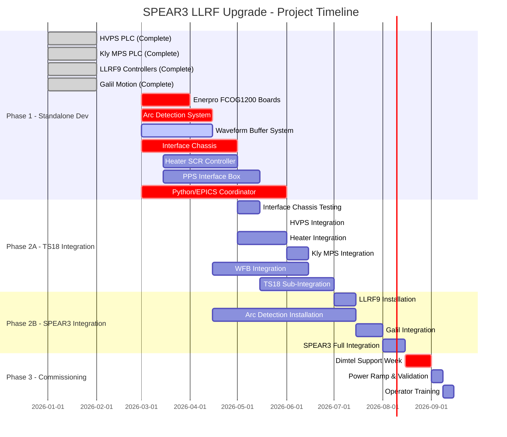
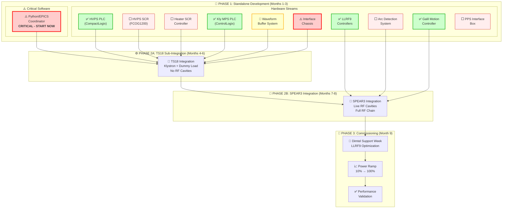

# SPEAR3 LLRF Upgrade Project - Complete Implementation Path

> **Based on**: ProjectPath.md analysis and Physical Design Report  
> **Created**: March 2026  
> **Status**: 10 Subsystems, 4 Phases, 9-Month Timeline

---

## 📊 **Project Overview Diagram**

---

## 🔄 **Detailed Subsystem Flow**

---

## 🚨 **Critical Risk Matrix**

| Risk Item | Severity | Status | Impact | Mitigation Strategy |
|-----------|----------|--------|--------|-------------------|
| **Python/EPICS Coordinator** | **Critical** | Not Started | Blocks all integration | Start architecture design immediately |
| **Interface Chassis Logic** | **High** | In Progress | Gates all subsystem integration | Complete LLRF9/HVPS feedback loop design |
| **Kly MPS PLC Software** | **High** | Not Started | Blocks fault handling | Begin IOC development with simulated I/O |
| **PPS Interface Approval** | **High** | Not Started | Regulatory bottleneck | Engage protection managers early |
| **Tuner Controller Reliability** | **Medium** | Testing | Affects system performance | Test on Booster cavity first |

---

## 📈 **Success Criteria & Performance Targets**

| Metric | Legacy Performance | Target | Validation Method |
|--------|-------------------|--------|------------------|
| **Amplitude Stability** | <0.1% | Same or better | RF power measurements |
| **Phase Stability** | <0.1 deg | Same or better | Vector analysis |
| **Tuner Resolution** | ~0.002-0.003 mm/step | Improved (256 μsteps) | Motion encoder feedback |
| **Control Loop Response** | ~1 second | Same or better | Step response testing |
| **System Uptime** | >99.5% | Same or better | Operational statistics |
| **Fault Diagnostics** | Limited fault files | 16k-sample waveform + first-fault | Waveform capture validation |
| **Calibration Time** | ~20 minutes | ~3 minutes | LLRF9 digital calibration |

---

## 🎯 **Key Implementation Principles**

### **1. Maximum Standalone Development**
- **Rationale**: Extremely limited integration testing window
- **Strategy**: Complete all possible subsystem testing before installation
- **Benefit**: Minimizes risk during critical integration phases

### **2. Critical Path Focus**
- **Interface Chassis**: Gates all integration testing
- **Python/EPICS Software**: Required for all control functions  
- **Safety Systems First**: PPS and interlock validation before RF power

### **3. Phased Integration Approach**
- **TS18 Sub-Integration**: Test with klystron and dummy load (no cavities)
- **SPEAR3 Integration**: Add cavity-dependent systems incrementally
- **Commissioning**: Optimize vendor support window for LLRF9-specific tasks

### **4. Risk Mitigation Strategy**
- **Parallel Development**: Multiple subsystems developed simultaneously
- **Simulation Testing**: Software development with mock hardware interfaces
- **Backup Plans**: Rollback procedures for each integration step
- **Vendor Optimization**: Pre-complete all work before Dimtel support week

---

## 📋 **Next Immediate Actions**

### **Week 1-2: Critical Path Initiation**
1. **Start Python/EPICS Coordinator architecture design** (highest priority)
2. **Finalize Interface Chassis I/O specifications** 
3. **Order Enerpro FCOG1200 boards** (5 units needed)
4. **Initiate PPS Interface regulatory approval process**

### **Month 1: Foundation Development**
1. **Complete Interface Chassis logic design** (LLRF9/HVPS feedback loop)
2. **Begin Kly MPS PLC software integration** with simulated I/O
3. **Procure Arc Detection system** (10 sensors + 5 processors + spares)
4. **Start Heater SCR controller design** and fabrication

### **Month 2-3: Parallel Subsystem Development**
1. **Waveform Buffer PCB fabrication** and assembly
2. **Python/EPICS Coordinator module development** with mock interfaces
3. **Interface Chassis fabrication** and standalone testing
4. **HVPS PLC integration** and EPICS development

---

**🎯 This comprehensive project path ensures systematic development, risk mitigation, and successful commissioning of the SPEAR3 LLRF upgrade within the 9-month timeline!**

