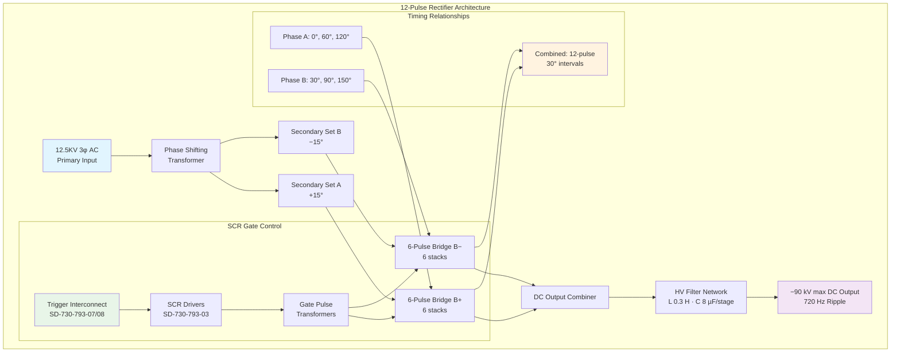
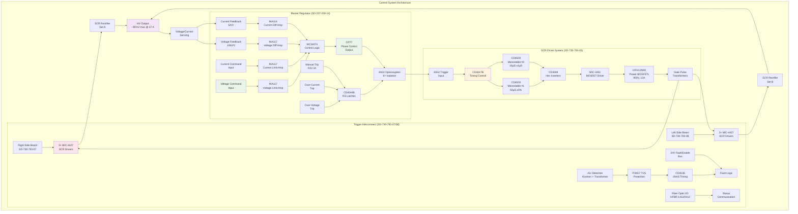
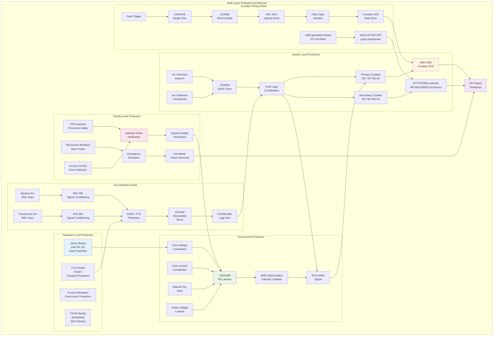
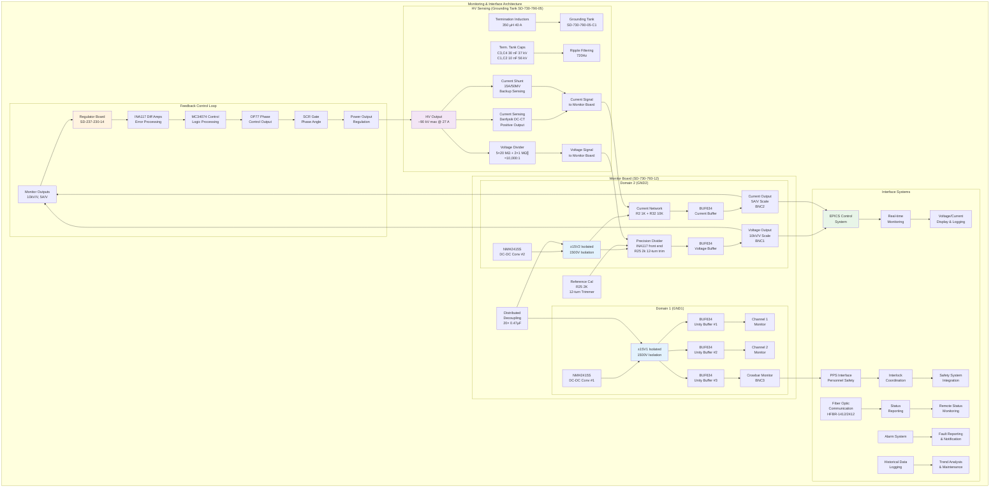

# SPEAR3 High Voltage Power Supply (HVPS) System — Complete Design Overview

**Document ID:** HVPS-OVERVIEW-001  
**Revision:** R2  
**Date:** September 2026  
**Author:** Engineering Team (SSRL/SLAC)  
**Classification:** System Design Reference — Complete HVPS Architecture

> ## ⚠ Verification status — PARTIALLY VERIFIED, use with care
>
> Every section has been read line-by-line against the verified per-drawing notes in this directory. Two limits remain:
>
> - The Mermaid diagrams in §7–§8 and the board interconnection matrix have **not** been traced net-by-net against the drawings.
> - A few component values (arc-detection R26/R33, monitor-board R33/R36) could not be confirmed on any drawing and are flagged in place.
>
> **Where this document disagrees with a per-drawing note in this directory, or with `Designs/tex/L_legacy_system_architecture.pdf`, those win.**

### Revision history

| Rev | Date | Change |
|---|---|---|
| R1 | 2025 | Initial draft, written from directory listings without reading the source drawings |
| R2 | Sept 2026 | Line-by-line verification against all 14 per-drawing notes. Separated the HVPS filter (main oil tank) from the Grounding Tank, whose component values R1 had swapped (§3.3); output rating, transformer input current, SCR stack count and phase shift corrected (§2, §3); regulator test-point map, device designators, diode minimum-select architecture and inert current loop added (§4.4, §11.1); monitor-board buffer count and drawing titles corrected (§6.1) |

---

## Purpose and Scope

This document provides a comprehensive technical overview of the SPEAR3 High Voltage Power Supply (HVPS) system. It serves as the orientation reference for understanding the complete HVPS design, from system-level architecture down to individual circuit boards.

### Authoritative sources

Every drawing below was rendered to image and read directly in September 2026. **Prefer these over this overview for any specific value.**

| Drawing | Content | Verified note |
|---|---|---|
| `../../wiringDiagrams/ei7307900000.pdf` | **EI-730-790-00-C0 / NWL #39308** — the transformer manufacturer's own schematic. Authoritative for transformer ratings (**2750 kVA, 12.5 kV at 127 A**), monitor windings, and all oil/pressure/vacuum/flow protection setpoints | [ei7307900000.md](ei7307900000.md) |
| `../sd7307900101.pdf` | SD-730-790-01-C1 — HVPS system schematic, full power chain and DC stage taps | [sd7307900101.md](sd7307900101.md) |
| `../sd7307900501.pdf` | SD-730-790-05-C1 — Grounding Tank | [sd7307900501.md](sd7307900501.md) |
| `../sd2372301200.pdf` | SD-237-230-12-R0 — Enerpro FCOG6100 firing circuit (Enerpro E128) | [sd2372301299.md](sd2372301299.md) |
| `../sd2372301401.pdf` | SD-237-230-14-C1 — voltage and current regulator board | [sd2372301401.md](sd2372301401.md) |
| `../sd7307930304.pdf` | SD-730-793-03-C4 — 12 kV SCR driver board | [sd7307930304.md](sd7307930304.md) |
| `../sd7307930402.pdf` | SD-730-793-04-C2 — SCR crowbar trigger board | [sd7307930402.md](sd7307930402.md) |
| `../sd7307930702.pdf` | SD-730-793-07-C2 — right side trigger interconnect | [sd7307930702.md](sd7307930702.md) |
| `../sd7307930801.pdf` | SD-730-793-08-C1 — left side trigger interconnect | [sd7307930801.md](sd7307930801.md) |
| `../sd7307931203.pdf` | SD-730-793-12-C3 — PS monitor board | [sd7307931203.md](sd7307931203.md) |
| `../sd7307931301.pdf` | SD-730-793-13-C1 — optical SCR trigger board | [sd7307931301.md](sd7307931301.md) |
| `../sd7307940400.pdf` | SD-730-794-04-C0 — crowbar trigger board, 1999 generation | [sd7307940400.md](sd7307940400.md) |
| `../../wiringDiagrams/wd7307940400.pdf` | WD-730-794-04-C0 — **contains the HVPS output voltage dividers** in its "TRANSFORMER TANK WD-730-792-01" section | — |
| `../../wiringDiagrams/wd7307900206.pdf` | WD-730-790-02-C6 — master trigger enclosure wiring diagram | `pps/diagrams/04_wd7307900206_hoffman_box_wiring.md` |
| `../../wiringDiagrams/wd7307900103.pdf` | WD-730-790-01-C3 — system interconnection wiring | `pps/diagrams/05_wd7307900103_interconnection_full.md` |

### Original engineering documents

| Document | Content |
|---|---|
| `../../procedures/spear3HvpsHazards.tex` | J. Sebek — stored energy, discharge time constants, transformer secondary voltages, klystron perveance |
| `../../../architecture/designNotes/EnerproVoltageandCurrentRegulatorBoardNotes.docx` | J. Sebek — authoritative circuit analysis of the regulator board |
| `../../../controls/enerpro/enerproBoardHvps.docx` | J. Sebek — installed Enerpro board revisions, serials, phase-reference wiring |
| `../../plc/plcNotesR1.docx` | J. Sebek — PLC timing, the N7:10 digital low-pass filter |
| `../../plc/CasselPLCCode.pdf` | Full ladder logic listing, program SSRLV6-4-05-10 |
| `../../../architecture/originalDocuments/ps3413600102.pdf` | PS-341-360-01 — the written HVPS specification |
| `../../../architecture/originalDocuments/slac-pub-7591.pdf` | Cassel & Nguyen, PAC 1997 — crowbar timing, regulation and ripple figures |
| `../../../../pps/HoffmanBoxPPSWiring.docx` | J. Sebek — terminal-by-terminal PPS wiring trace, switchgear theory of operation |

---

## Table of Contents

1. [Executive Summary](#1-executive-summary)
2. [System Architecture Overview](#2-system-architecture-overview)
3. [Power Conversion Chain](#3-power-conversion-chain)
4. [Control and Regulation System](#4-control-and-regulation-system)
5. [Protection and Safety Systems](#5-protection-and-safety-systems)
6. [Monitoring and Interface Systems](#6-monitoring-and-interface-systems)
7. [Circuit Board Inventory and Functions](#7-circuit-board-inventory-and-functions)
8. [Signal Flow and Interconnections](#8-signal-flow-and-interconnections)
9. [Component Technology Analysis](#9-component-technology-analysis)
10. [System Performance Characteristics](#10-system-performance-characteristics)
11. [Maintenance and Troubleshooting](#11-maintenance-and-troubleshooting)
12. [Upgrade Considerations](#12-upgrade-considerations)

---

## 1. Executive Summary

### 1.1 System Function
The SPEAR3 HVPS converts 12.5KV 3-phase AC mains power into regulated −90 kV DC rated at 27 A (2.5 MW), typically operated at ≈ −72 to −75 kV to power a klystron tube that provides ≈476.3 MHz RF power to the SPEAR3 storage ring cavities.

### 1.2 Key System Characteristics
- **Power Level**: 2.5 MW rated (−90 kV × 27 A); typical operation ≈ 1.5 MW
- **Architecture**: 12-pulse thyristor-controlled rectifier
- **Regulation**: Precision voltage/current control via SCR phase angle
- **Protection**: Multi-layer protection including crowbar, arc detection, and interlocks
- **Control**: Distributed control across multiple specialized circuit boards
- **Safety**: Integrated with Personnel Protection System (PPS)

### 1.3 System Topology

```mermaid
graph TD
    A[12.5KV 3φ AC<br/>Facility Power] --> B[Phase Shifting Transformer<br/>±15° (30° between sets)]
    B --> C[12-Pulse SCR Rectifier<br/>2 bridges × 6 stacks<br/>stack rated 40 kV 80 A]
    C --> D[HV Filter Network<br/>L 0.3 H · C 8 µF/stage]
    D --> E[−90 kV max / −72…−75 kV typ<br/>Klystron Load<br/>2.5 MW rated]
    
    F[Control System<br/>SD-237-230-14] --> C
    G[Protection System<br/>Crowbar + Arc Det.] --> C
    H[Monitoring System<br/>SD-730-793-12] --> D
    
    I[SCR Drivers<br/>SD-730-793-03] --> C
    J[Trigger Interconnect<br/>SD-730-793-07/08] --> I
    F --> J
    
    K[Crowbar Drivers<br/>SD-730-793-04] --> L[Crowbar SCR<br/>40KV 80A]
    G --> K
    L --> D
    
    style A fill:#e1f5fe
    style E fill:#f3e5f5
    style F fill:#e8f5e8
    style G fill:#fff3e0
    style H fill:#fce4ec
```

---

## 2. System Architecture Overview

### 2.1 Functional Block Diagram

```mermaid
graph TB
    subgraph "Power Conversion Subsystem"
        A1[12.5 kV 3φ AC Input<br/>127 A (2750 kVA)]
        A2[Phase Shifting Transformer<br/>±15° (30° between sets)]
        A3[SCR Rectifier Bridge B+<br/>6 stacks, 40 kV 80 A each]
        A4[SCR Rectifier Bridge B−<br/>6 stacks, 40 kV 80 A each]
        A5[HV Filter Network<br/>L: 0.3 H, C: 8 µF/stage]
        A6[−90 kV max DC Output<br/>27 A rated to Klystron]
        
        A1 --> A2
        A2 --> A3
        A2 --> A4
        A3 --> A5
        A4 --> A5
        A5 --> A6
    end
    
    subgraph "Control & Regulation Subsystem"
        B1[Voltage/Current Regulator<br/>SD-237-230-14<br/>INA117, MC34074]
        B2[SCR Driver Boards<br/>SD-730-793-03<br/>CD4047B, IXFH12N90]
        B3[Right Trigger Interconnect<br/>SD-730-793-07<br/>6-Phase Control]
        B4[Left Trigger Interconnect<br/>SD-730-793-08<br/>Mirror Architecture]
        
        B1 --> B2
        B2 --> B3
        B2 --> B4
        B3 --> A3
        B4 --> A4
    end
    
    subgraph "Protection Subsystem"
        C1[Arc Detection<br/>Klystron + Transformer]
        C2[Crowbar Driver A<br/>SD-730-793-04<br/>MIC-4427 Optical]
        C3[Crowbar Driver B<br/>SD-730-794-04<br/>IXYTH12N90 MOSFETs]
        C4[Crowbar SCR<br/>40KV 80A<br/>Fast Protection]
        C5[PPS Interface<br/>Personnel Safety]
        
        C1 --> C2
        C1 --> C3
        C2 --> C4
        C3 --> C4
        C4 --> A5
        C5 --> B1
    end
    
    subgraph "Monitoring & Interface Subsystem"
        D1[Monitor Board<br/>SD-730-793-12<br/>Dual Isolated]
        D2[Grounding Tank<br/>SD-730-790-05<br/>Danfysik Sensing]
        D3[EPICS Interface<br/>Control System]
        D4[Voltage Feedback<br/>10kV/V Scale]
        D5[Current Feedback<br/>5A/V Scale]
        
        A5 --> D2
        D2 --> D1
        D1 --> D4
        D1 --> D5
        D4 --> B1
        D5 --> B1
        D1 --> D3
    end
    
    style A1 fill:#e1f5fe
    style A6 fill:#f3e5f5
    style B1 fill:#e8f5e8
    style C4 fill:#fff3e0
    style D1 fill:#fce4ec
```

The HVPS consists of four major subsystems:

#### A. Power Conversion Subsystem
- **Input**: 12.5KV 3-phase AC from facility power
- **Phase Shifting Transformer**: Provides 30° phase shift for 12-pulse operation
- **SCR Rectifier**: two 6-pulse bridges, six stacks each (stack rated 40 kV 80 A), in 12-pulse configuration
- **Output Filter**: LC network in the main oil tank — **0.3 H inductors, 8 µF/stage capacitors** (§3.3)
- **Output**: −90 kV DC rated at 27 A to klystron (typical ≈ −72 to −75 kV)

#### B. Control and Regulation Subsystem
- **Voltage/Current Regulator Board** (SD-237-230-14): Master control with precision op-amps
- **SCR Driver Boards** (SD-730-793-03): Generate gate pulses for thyristors
- **Trigger Interconnect Boards** (SD-730-793-07/08): Coordinate 6-phase SCR firing

#### C. Protection Subsystem
- **Crowbar System**: Fast-acting thyristor protection (40KV 80A)
- **SCR Crowbar Driver Boards** (SD-730-793-04, SD-730-794-04): Crowbar firing control
- **Arc Detection**: Klystron and transformer arc monitoring
- **Interlock System**: Integration with PPS for personnel safety

#### D. Monitoring and Interface Subsystem
- **Monitor Board** (SD-730-793-12): Precision voltage/current measurement
- **Grounding Tank** (SD-730-790-05): HV filtering and sensing
- **Interface Systems**: EPICS control system integration

### 2.2 Physical Layout
- **Main Tank**: Contains SCR rectifiers, transformers, and HV components
- **Phase Tank**: Houses phase shifting transformer
- **Crowbar Tank**: Contains crowbar thyristor and protection circuits
- **Grounding Tank**: HV filter components and current/voltage sensing
- **Control Racks**: Electronic control boards and interfaces

---

## 3. Power Conversion Chain

### 3.1 Input Power System (SD-730-790-01)
**Primary Components:**
- 12.5KV 3-phase AC input with disconnect and breaker
- Phase shifting transformer providing dual secondary outputs
- 30° phase shift between secondary sets for 12-pulse operation

**Benefits of 12-Pulse Configuration:**
- Eliminates 5th and 7th harmonics
- Doubles ripple frequency to 720Hz (12 × 60Hz)
- Reduces input current distortion
- Improves power quality and regulation


```mermaid
graph TD
    subgraph "12-Pulse Rectifier Architecture"
        A[12.5KV 3φ AC<br/>Primary Input] --> B[Phase Shifting<br/>Transformer]
        
        B --> C[Secondary Set A<br/>+15°]
        B --> D[Secondary Set B<br/>−15°]
        
        C --> E[6-Pulse Bridge B+<br/>6 stacks]
        D --> F[6-Pulse Bridge B−<br/>6 stacks]
        
        E --> G[DC Output Combiner]
        F --> G
        
        G --> H[HV Filter Network<br/>L 0.3 H · C 8 µF/stage]
        H --> I[−90 kV max DC Output<br/>720 Hz Ripple]
        
        subgraph "SCR Gate Control"
            J[Trigger Interconnect<br/>SD-730-793-07/08]
            K[SCR Drivers<br/>SD-730-793-03]
            L[Gate Pulse<br/>Transformers]
            
            J --> K
            K --> L
            L --> E
            L --> F
        end
        
        subgraph "Timing Relationships"
            M[Phase A: 0°, 60°, 120°]
            N[Phase B: 30°, 90°, 150°]
            O[Combined: 12-pulse<br/>30° intervals]
            
            M --> E
            N --> F
            E --> O
            F --> O
        end
    end
    
    style A fill:#e1f5fe
    style I fill:#f3e5f5
    style J fill:#e8f5e8
    style O fill:#fff3e0
```

### 3.2 SCR Rectifier System
**Thyristor Specifications:**
- **Rating**: 40 kV 80 A **per stack** (SD-730-790-01-C1 reads "THYRISTOR CONTROLLED RECTIFIER 40KV 80A"). Each stack contains ~14 series Powerex T8K7 thyristors; ~168 devices total
- **Configuration**: **two 6-pulse bridges** (B+ and B−), six stacks each, fed from the ±15° phase-shifted secondaries
- **Control**: Phase-angle control for voltage regulation
- **Firing**: Synchronized gate pulses from trigger system

**Rectifier Operation:**
- Two 6-pulse rectifier sets fed from phase-shifted transformer
- Precision timing control via CD4047B/CD4528 timing circuits
- IXFH12N90 MOSFET gate drivers (900V, 12A)
- 50µS ±5% gate pulse width with adjustable sub-pulses

### 3.3 Output Filter System

> **Two physically separate assemblies.** The **HVPS filter** is inside the main oil tank (SD-730-790-01-C1); the **Grounding Tank** (SD-730-790-05-C1) is a separate tank near the klystron that terminates the HV cable. Their component values are completely different — do not interchange them.

**HVPS filter — main oil tank, SD-730-790-01-C1**

| Item | Value |
|---|---|
| Primary filter inductors L1, L2 | **0.3 H**, 85 A, 0.38 Ω, ≈1084 J each at rated current |
| Filter capacitors | **8 µF, 30 kV per stage × 4 series stages** (2 µF net across the output); 8,788 J stored |
| Filter resistors | **500 Ω, 1 kW**, in oil |
| Filter rectifiers | 30 kV, 3 A average |

**Grounding Tank — SD-730-790-05-C1** (see [`sd7307900501.md`](sd7307900501.md))

| Item | Value |
|---|---|
| Cable termination inductors L1, L2 | **"350 UHY 40A"** — *these are the 350 µH parts; they are not the HVPS filter inductors* |
| Diode across each inductor | **25 kV, 100 A** — *this is a diode, not a "voltage transducer"* |
| Capacitor across each inductor | C3, C4 — **30 nF, 37 kV** |
| Series pair to ground | C1, C2 — **10 nF, 56 kV** |
| Series damping resistor | R1 — **50 Ω, 90 kV** |
| Current sensing | Danfysik DC-CT; Pearson 110 CT at 10 A/V; **15 A / 50 mV shunt** (3.333 mΩ) |
| Bushings | HVT-1 (POWER SUPPLY), HVT-2 (LOAD), HVT-G (PWR GRN) — *HVT-G is a ground-return bushing, not a 50 Ω termination* |

**Filter performance**

- The main-tank LC network provides the ripple reduction; measured ripple is **< 1% peak-to-peak and < 0.2% RMS above 60 kV**
- Both tanks are oil-filled for HV insulation
- The termination-tank inductors limit the rate of rise of cable discharge current into the klystron and force a current zero during a fault

---

## 4. Control and Regulation System


```mermaid
graph TD
    subgraph "Control System Architecture"
        subgraph "Master Regulator (SD-237-230-14)"
            A1[Voltage Command<br/>Input] --> A2[INA117<br/>Voltage Limit Amp]
            A3[Current Command<br/>Input] --> A4[INA117<br/>Current Limit Amp]
            A5[Voltage Feedback<br/>10kV/V] --> A6[INA117<br/>Voltage Diff Amp]
            A7[Current Feedback<br/>5A/V] --> A8[INA114<br/>Current Diff Amp]
            
            A2 --> A9[MC34074<br/>Control Logic]
            A4 --> A9
            A6 --> A9
            A8 --> A9
            
            A9 --> A10[OP77<br/>Phase Control<br/>Output]
            
            A11[Over-Voltage<br/>Trip] --> A12[CD4044B<br/>RS Latches]
            A13[Over-Current<br/>Trip] --> A12
            A14[Manual Trip<br/>R32 1K] --> A12
            
            A12 --> A15[4N32 Optocouplers<br/>6× Isolation]
            A10 --> A15
        end
        
        subgraph "SCR Driver System (SD-730-793-03)"
            B1[60Hz Trigger<br/>Input] --> B2[CD4047B<br/>Timing Control]
            B2 --> B3[CD4528<br/>Monostable #1<br/>50µS ±5%]
            B2 --> B4[CD4528<br/>Monostable #2<br/>16µS ±1µS]
            
            B3 --> B5[CD4049<br/>Hex Inverters]
            B4 --> B5
            B5 --> B6[MIC-4451<br/>MOSFET Driver]
            B6 --> B7[IXFH12N90<br/>Power MOSFETs<br/>900V, 12A]
            B7 --> B8[Gate Pulse<br/>Transformers]
        end
        
        subgraph "Trigger Interconnect (SD-730-793-07/08)"
            C1[Right Side Board<br/>SD-730-793-07] --> C2[3× MIC-4427<br/>SCR Drivers]
            C3[Left Side Board<br/>SD-730-793-08] --> C4[3× MIC-4427<br/>SCR Drivers]
            
            C5[Arc Detection<br/>Klystron + Transformer] --> C6[P3KE7 TVS<br/>Protection]
            C6 --> C7[CD4538<br/>20mS Timing]
            C7 --> C8[Fault Logic]
            
            C9[Fiber Optic I/O<br/>HFBR-1412/2412] --> C10[Status<br/>Communication]
            C11[24V Fault/Enable<br/>Bus] --> C8
        end
        
        A15 --> B1
        B8 --> C2
        B8 --> C4
        C2 --> D1[SCR Rectifier<br/>Set A]
        C4 --> D2[SCR Rectifier<br/>Set B]
        
        D1 --> D3[HV Output<br/>−90 kV max @ 27 A]
        D2 --> D3
        
        D3 --> E1[Voltage/Current<br/>Sensing]
        E1 --> A5
        E1 --> A7
    end
    
    style A1 fill:#e8f5e8
    style A10 fill:#e8f5e8
    style B2 fill:#fff3e0
    style C2 fill:#fce4ec
    style D3 fill:#f3e5f5
```

### 4.1 Master Regulator Board (SD-237-230-14)
**Architecture:**
- **Power Supply**: ±15V, +30V rails with precision regulation
- **Op-Amp Stages**: MC34074 (quad), OP77 (precision), INA117/INA114 (instrumentation)
- **Isolation**: 6× 4N32 optocouplers for galvanic isolation
- **Protection Logic**: CD4044B RS latches for trip conditions

**Functional Circuits** *(designators read from the drawing and J. Sebek's `EnerproVoltageandCurrentRegulatorBoardNotes.docx`)*:

| # | Function | Device | Notes |
|---|---|---|---|
| 1 | Voltage difference amplifier | **U16 INA117** | Input from J1A/J1B "NEG. VOLTAGE SENSE" |
| 2 | Voltage limit / error amplifier | **U13 OP77** | R31 10.00 K, R33 9.53 K, R37 4.99 K, C11 2 µF, C17 0.001 µF |
| 3 | Isolated current preamp | **U9 INA114** | With DC1 NMA1215 isolated DC-DC |
| 4 | Current difference amplifier | **U12 INA117** | — |
| 5 | Current limit / error amplifier | **U17 OP77** | R58 10.00 K, R59 9.53 K, R65 4.99 K, C31 2 µF |
| 6 | Over-voltage comparator | **U11A MC34074** | Threshold set by R38 5 K trimmer |
| 7 | Over-current comparator | **U14A MC34074** | Threshold set by R43 5 K trimmer |
| 8 | Trip latches | **U10A–U10D CD4044B** | Quad R/S three-state latches |
| 9 | SCR phase-control output | **U18 OP77** → R69 7.50 K → J4C | Clamped by a **10 V Zener** |
| 10 | Trip and soft-start | **U11D MC34074** | R28 10 K CW, R52 250 K, R53 100 K, C18 10 µF |
| 11 | Auto reset | **U14B MC34074** | R51 300 K, C32 10 µF, jumper JP7 |
| 12 | SCR gate under-voltage lockout | **U14D MC34074** | R47 4.3 K, D8 1N4747 20 V |

> **Designators are easy to confuse on this board.** U13 is an **OP77**, U16 is the **INA117** difference amplifier, and U11A is an **MC34074** comparator.

#### Control architecture — three points that are easy to miss

**1. The two loops are combined by a diode minimum-select, not a summing junction.** The voltage and current chains feed a **non-linear diode junction with both anodes tied together**; the *lower* cathode voltage wins and becomes SIG-HI. A 15 V supply through 10 kΩ biases the conducting diode and a **10 V Zener** clamps the anode.

**2. The AC current loop is saturated by design and never takes control.** Its reference at **J4-2 (IL1)** comes from the Enerpro board's own +5 V reference; against a typical current sense of ≈ 2.2 V DC the OP77 saturates at ≈ +14 V, above the 10 V clamp. **The HVPS is voltage-regulated only.**

**3. The board senses AC *input* current, not HVPS *output* current.** Input phases are sensed by **300:5 CTs** (EI-730-790-00-C0), rectified, paralleled and terminated in a **0.5 Ω burden**. HVPS output current is measured separately by the Danfysik transducer in the termination tank.

**Reference input**: the voltage setpoint arrives from **AB Slot-8 Output 0** at **J4-1 / J4-7**. The drawing labels that pin "POS. VOLTAGE LIMIT COMMAND", which is a **misnomer** — it is the reference input, not a limit.

**Loop dynamics**: input low-pass τ = 0.01 s (corner 15.9 Hz); error amplifier zero at 7.96 Hz, poles at 0 Hz (pure integrator) and 15.9 kHz; **Type 1**, no steady-state error; integrator gain ≈ −5 × 10⁻³.

**Configuration Options:**
- **PEP II Mode**: R20 not used (gain=1), standard component values
- **NLCTA Mode**: R20=5.6K (gain=10), C11=5µF, modified jumpers

### 4.2 SCR Driver System (SD-730-793-03/04)
**Timing Generation:**
- **CD4047B**: Astable/monostable multivibrator for base timing
- **CD4528**: Dual monostable multivibrators for precision pulse widths
- **CD4049**: Hex inverting buffers for signal conditioning
- **Timing Parameters**: 50µS ±5% main pulse, 16µS ±1µS adjustable sub-pulse

**Power Stage:**
- **MIC-4451**: High-speed MOSFET gate driver
- **IXFH12N90**: Power MOSFETs (900V, 12A) for gate pulse generation
- **1N4744**: 15V Zener diodes for MOSFET gate protection
- **MR856**: Fast-recovery diodes for output rectification

**Variants:**
- **SD-730-793-03**: Standard SCR driver (60Hz continuous operation)
- **SD-730-793-04**: Crowbar driver (single-shot operation, MIC-4427 optical output)

### 4.3 Trigger Interconnect System (SD-730-793-07/08)
**Right Side Board (SD-730-793-07):**
- **SCR Triggers**: 3× MIC-4427 drivers for 6-phase SCR control
- **Phase Monitoring**: 6 channels with CD4538 (20mS timing)
- **Arc Detection**: Klystron + transformer arc inputs with P3KE7 TVS protection
- **Crowbar Control**: CD4538 timing with R29 (237K) for 1-second CBREADY
- **Fiber-Optic I/O**: HCPL-4503, HFBR-1412/2412 for status communication

**Left Side Board (SD-730-793-08):**
- **Mirror Architecture**: Same IC complement as right-side board
- **24V Fault/Enable Bus**: Connection to right-side board
- **Commands Interface**: **P1 IDC14** carries the COMMANDS bus between the two boards (+12 V PWR, 24 V FAULT/ENABLE, FO SCR ENABLE, CB ENABLE, SLAVE CB TRIG, PLC FORCE CB, SLAVE CB OFF). **E1 IDC20** carries the SCR TRIGGERS — *the two connectors are easily transposed*
- **Monitoring**: M1 IDC14 bus — SCR ENABLE MON, CB TRIG MON, CB MONITOR, KLYS ARC MON, SCR MONITOR, KLYS CB MON

---

## 5. Protection and Safety Systems


```mermaid
graph TD
    subgraph "Multi-Layer Protection Architecture"
        subgraph "Hardware Level Protection"
            H1[Zener Diodes<br/>1N4744 15V<br/>Gate Protection]
            H2[TVS Diodes<br/>P3KE7<br/>Transient Protection]
            H3[Fuses & Breakers<br/>Overcurrent Protection]
            H4[Ferrite Beads<br/>300Ω/500Ω<br/>EMI Filtering]
        end
        
        subgraph "Circuit Level Protection"
            C1[Over-Voltage<br/>Comparator] --> C2[CD4044B<br/>RS Latches]
            C3[Over-Current<br/>Comparator] --> C2
            C4[Manual Trip<br/>Input] --> C2
            C5[Under-Voltage<br/>Lockout] --> C2
            
            C2 --> C6[4N32 Optocouplers<br/>Galvanic Isolation]
            C6 --> C7[SCR Inhibit<br/>Signal]
        end
        
        subgraph "System Level Protection"
            S1[Primary Crowbar<br/>SD-730-793-04] --> S2[40KV 80A<br/>Crowbar SCR]
            S3[Secondary Crowbar<br/>SD-730-794-04] --> S4[IXYTH12N90 switches<br/>IRFD9120/IRFD110 drivers]
            
            S5[Arc Detection<br/>Klystron] --> S6[CD4538<br/>20mS Timer]
            S7[Arc Detection<br/>Transformer] --> S6
            S6 --> S8[Fault Logic<br/>Coordination]
            
            S8 --> S1
            S8 --> S3
            S8 --> C7
        end
        
        subgraph "Facility Level Protection"
            F1[PPS Interface<br/>Personnel Safety] --> F2[Interlock Chain<br/>Verification]
            F3[Disconnect Breakers<br/>Main Power] --> F4[Emergency<br/>Shutdown]
            F5[Access Control<br/>Door Interlocks] --> F2
            
            F2 --> F6[System Enable<br/>Permission]
            F4 --> F7[Immediate<br/>Power Removal]
        end
        
        subgraph "Arc Detection Detail"
            A1[Klystron Arc<br/>BNC Input] --> A2[R26 33K<br/>Signal Conditioning]
            A3[Transformer Arc<br/>BNC Input] --> A4[R33 35K<br/>Signal Conditioning]
            
            A2 --> A5[P3KE7 TVS<br/>Protection]
            A4 --> A5
            A5 --> A6[CD4538<br/>Monostable<br/>20mS]
            A6 --> A7[Fault/Enable<br/>Logic Bus]
        end
        
        subgraph "Crowbar Timing Detail"
            T1[Fault Trigger] --> T2[CD4047B<br/>Single-Shot]
            T2 --> T3[CD4538<br/>50mS Enable]
            T3 --> T4[MIC-4427<br/>Optical Driver]
            T4 --> T5[Fiber Optic<br/>Isolation]
            T5 --> T6[Crowbar SCR<br/>Gate Drive]
            
            T7[1999-generation board<br/>IXYTH12N90] --> T8[Same 60T:60T:60T<br/>pulse transformer]
        end
        
        H1 --> C1
        H2 --> A5
        C7 --> S1
        S2 --> D1[HV Output<br/>Protection]
        S4 --> D1
        F6 --> C2
        F7 --> D1
        A7 --> S8
        T6 --> S2
        T8 --> S4
    end
    
    style H1 fill:#e3f2fd
    style C2 fill:#e8f5e8
    style S2 fill:#fff3e0
    style F2 fill:#fce4ec
    style D1 fill:#f3e5f5
```

### 5.1 Crowbar Protection System
**Primary Crowbar (SD-730-793-04):**
- **Thyristor**: 40KV 80A crowbar SCR
- **Trigger**: Single-shot firing with 50mS/44µS timing
- **Optical Output**: MIC-4427 for fiber-optic isolation
- **Power**: +12V supply with IXFH12N90 MOSFETs

**Secondary Crowbar (SD-730-794-04):**
- **Switches**: **Q1, Q2 IXYTH12N90**, driven by discrete complementary pairs **Q3/Q4 IRFD9120** (P-channel) and **Q5/Q6 IRFD110** (N-channel) — in place of the MIC-4451 driver ICs used on the 2002 board
- **Power**: +15V supply (different from 793-series)
- **EMI Filtering**: Ferrite beads (300Ω/500Ω) for noise rejection
- **Timing**: CM14528 monostables with 200pF timing capacitors

### 5.2 Arc Detection System
**Klystron Arc Detection:**
- BNC input connectors on trigger interconnect boards — **J1 on the left-side board is labelled "KLYSTRON ARC TRIGGER"**
- Input network read from SD-730-793-08-C1: **R1 510 Ω, D2 1.5KE7.5CA, D1 1.5KE12A, R4 51 Ω ½ W, C4 0.001 µF**
- Integration with fault/enable logic

> **Unverified**: values of "R26 (33K) + R33 (35K)" and a "P3KE7 TVS" are quoted for this circuit elsewhere in the repository but **could not be confirmed** on either trigger interconnect drawing. The transient protection devices read directly are **1.5KE7.5CA and 1.5KE12A**.

**Transformer Arc Detection:**
- **J1 on the right-side board is labelled "TRANSFORMER ARC TRIGGER"**
- Input network read from SD-730-793-07-C2: **R37 510 Ω, D9 1.5KE7.5CA, C30 0.001 µF, D8 1.5KE12A, R33 51 Ω ½ W**
- Combined fault logic for coordinated protection

### 5.3 Multi-Layer Protection Architecture
1. **Hardware Level**: Zener diodes, TVS diodes, fuses
2. **Circuit Level**: Op-amp comparators, CD4044B latches
3. **System Level**: Crowbar thyristors, SCR inhibit
4. **Facility Level**: PPS interlocks, disconnect breakers

---

## 6. Monitoring and Interface Systems


```mermaid
graph TD
    subgraph "Monitoring & Interface Architecture"
        subgraph "HV Sensing (Grounding Tank SD-730-790-05)"
            G1[HV Output<br/>−90 kV max @ 27 A] --> G2[Voltage Divider<br/>5×20 MΩ + 2×1 MΩ∥<br/>≈10,000:1]
            G1 --> G3[Current Sensing<br/>Danfysik DC-CT<br/>Positive Output]
            G1 --> G4[Current Shunt<br/>15A/50MV<br/>Backup Sensing]
            
            G5[Termination Inductors<br/>350 µH 40 A] --> G6[Grounding Tank<br/>SD-730-790-05-C1]
            G7[Term. Tank Caps<br/>C3,C4 30 nF 37 kV<br/>C1,C2 10 nF 56 kV] --> G8[Ripple Filtering<br/>720Hz]
            
            G2 --> G9[Voltage Signal<br/>to Monitor Board]
            G3 --> G10[Current Signal<br/>to Monitor Board]
            G4 --> G10
        end
        
        subgraph "Monitor Board (SD-730-793-12)"
            subgraph "Domain 1 (GND1)"
                M1[NMH2415S<br/>DC-DC Conv #1] --> M2[±15V1 Isolated<br/>1500V Isolation]
                M2 --> M3[BUF634<br/>Unity Buffer #1]
                M2 --> M4[BUF634<br/>Unity Buffer #2]
                M2 --> M5[BUF634<br/>Unity Buffer #3]
                
                M3 --> M6[Channel 1<br/>Monitor]
                M4 --> M7[Channel 2<br/>Monitor]
                M5 --> M8[Crowbar Monitor<br/>BNC3]
            end
            
            subgraph "Domain 2 (GND2)"
                M9[NMH2415S<br/>DC-DC Conv #2] --> M10[±15V2 Isolated<br/>1500V Isolation]
                M10 --> M11[Precision Divider<br/>INA117 front end<br/>R25 2k 12-turn trim]
                M10 --> M12[Current Network<br/>R2 1K + R32 10K]
                
                M11 --> M13[BUF634<br/>Voltage Buffer]
                M12 --> M14[BUF634<br/>Current Buffer]
                
                M13 --> M15[Voltage Output<br/>10kV/V Scale<br/>BNC1]
                M14 --> M16[Current Output<br/>5A/V Scale<br/>BNC2]
            end
            
            M17[Reference Cal<br/>R25 2K<br/>12-turn Trimmer] --> M11
            M18[Distributed<br/>Decoupling<br/>20× 0.47µF] --> M2
            M18 --> M10
        end
        
        subgraph "Interface Systems"
            I1[EPICS Control<br/>System] --> I2[Real-time<br/>Monitoring]
            I3[PPS Interface<br/>Personnel Safety] --> I4[Interlock<br/>Coordination]
            I5[Fiber Optic<br/>Communication<br/>HFBR-1412/2412] --> I6[Status<br/>Reporting]
            
            I2 --> I7[Voltage/Current<br/>Display & Logging]
            I4 --> I8[Safety System<br/>Integration]
            I6 --> I9[Remote Status<br/>Monitoring]
            
            I10[Alarm System] --> I11[Fault Reporting<br/>& Notification]
            I12[Historical Data<br/>Logging] --> I13[Trend Analysis<br/>& Maintenance]
        end
        
        G9 --> M11
        G10 --> M12
        M15 --> I1
        M16 --> I1
        M8 --> I3
        
        subgraph "Feedback Control Loop"
            F1[Monitor Outputs<br/>10kV/V, 5A/V] --> F2[Regulator Board<br/>SD-237-230-14]
            F2 --> F3[INA117 Diff Amps<br/>Error Processing]
            F3 --> F4[MC34074 Control<br/>Logic Processing]
            F4 --> F5[OP77 Phase<br/>Control Output]
            F5 --> F6[SCR Gate<br/>Phase Angle]
            F6 --> F7[Power Output<br/>Regulation]
            F7 --> G1
        end
        
        M15 --> F1
        M16 --> F1
    end
    
    style G1 fill:#f3e5f5
    style M2 fill:#e3f2fd
    style M10 fill:#e3f2fd
    style I1 fill:#e8f5e8
    style F2 fill:#fff3e0
```

### 6.1 Monitor Board (SD-730-793-12)
**Dual Isolated Architecture:**
- **Domain 1**: +15V1, -15V1, GND1 (channels 1-3, crowbar monitor)
- **Domain 2**: +15V2, -15V2, GND2 (voltage/current BNC outputs)
- **DC-DC Converters**: 2× NMH2415S for 1500V isolation

**Precision Monitoring:**
- **Voltage Monitor**: 10 kV/V scale — BNC1 is labelled "+ Voltage 10 kV/V" on the drawing
- **Current Monitor**: 5 A/V scale — BNC2 is labelled "+ Current 5A/V"

> **Unverified**: scaling resistor values "R33/R36 (511Ω/536Ω 1%)" are quoted for this board elsewhere in the repository but **could not be confirmed** on the drawing. The values read directly were R26 9.09 k, R24 150 Ω, R13/R14/R15 100 Ω ½ W, R7/R8 1 k and the R25 2 k 12-turn trim pot.
- **Buffer Amplifiers**: **4× BUF634** unity-gain buffers (U7, U8, U9, U10)
- **Reference Calibration**: R25 (2K 12-turn trimmer)
- **Input amplifiers**: U1, U3, U4, U5, U6 INA117; U2 AD841

**Output Connectors:**
- **BNC1**: Voltage output (10kV/V)
- **BNC2**: Current output (5A/V)
- **BNC3**: Crowbar monitor output

### 6.2 Interface Systems
**EPICS Integration:**
- Real-time monitoring of voltage, current, status
- Remote control capabilities
- Alarm and fault reporting
- Historical data logging

**PPS Interface:**
- Safety interlock integration
- Personnel protection coordination
- Emergency shutdown capabilities
- Status reporting to facility systems

---

## 7. Circuit Board Inventory and Functions

### 7.1 Complete Board Inventory

| Drawing Number | Board Name | Primary Function | Key Components |
|----------------|------------|------------------|----------------|
| **SD-730-790-01-C1** | HVPS System Overview | System-level architecture | Phase shift transformer, SCR rectifiers, filters |
| **SD-730-790-05-C1** | Grounding Tank Assembly | HV filtering and sensing | 350µHY inductors, 30NFD caps, Danfysik DC-CT |
| **SD-237-230-14-C1** | Voltage/Current Regulator | Master control and regulation | INA117, MC34074, CD4044B, 4N32 optocouplers |
| **SD-730-793-03-C4** | SCR Driver Board | SCR gate pulse generation | CD4047B, CD4528, MIC-4451, IXFH12N90 |
| **SD-730-793-04-C2** | SCR Crowbar Driver | Crowbar firing control | CD4047B, CD4538, MIC-4427 optical |
| **SD-730-793-07-C2** | Right Side Trigger Interconnect | 6-phase SCR control hub | 3× MIC-4427, CD4538 monitoring, fiber-optic I/O |
| **SD-730-793-08-C1** | Left Side Trigger Interconnect | Mirror of right-side control | Same as 793-07, 24V fault/enable bus |
| **SD-730-793-12-C3** | Monitor Board | Precision measurement | NMH2415S, BUF634, dual isolated domains |
| **SD-730-793-13-C1** | **Optical SCR Trigger Board** (M. Nguyen, 16-APR-03) | Fibre-fed SCR gate drive | 6N-139 optocoupler, CD4047B/CD4538 timing, IXFH12N90, 60T:60T:60T pulse transformer, P1 rails +240 V/+120 V |
| **SD-730-794-04-C0** | SCR Crowbar Trigger Board, **1999 generation** (R. Cassel 11/08/99) | Earlier design, superseded by SD-730-793-04-C2 | +15 V logic, 6N-138 opto, **IXYTH12N90** switches with discrete IRFD9120/IRFD110 drivers, ferrite beads |

### 7.2 Board Interconnection Matrix

```
System Level:
SD-730-790-01 (System) ←→ All other boards (power, control, monitoring)

Control Level:
SD-237-230-14 (Master) ←→ SD-730-793-03/04 (SCR Drivers)
                       ←→ SD-730-793-07/08 (Trigger Interconnect)

Monitoring Level:
SD-730-793-12 (Monitor) ←→ SD-730-790-05 (Grounding Tank)
                        ←→ System voltage/current sensing

Protection Level:
SD-730-793-04/SD-730-794-04 (Crowbar) ←→ Arc detection inputs
                                       ←→ Fault/enable logic
```

---

## 8. Signal Flow and Interconnections

```mermaid
graph TD
    subgraph "Complete HVPS Signal Flow Architecture"
        subgraph "Power Flow Path"
            P1[12.5 kV 3φ AC<br/>Facility Power<br/>127 A] --> P2[Phase Shifting Transformer<br/>±15° (30° between sets)]
            P2 --> P3[SCR Bridge B+<br/>6 stacks 40 kV 80 A<br/>+15°]
            P2 --> P4[SCR Bridge B−<br/>6 stacks 40 kV 80 A<br/>−15°]
            P3 --> P5[DC Combiner<br/>12-Pulse Output]
            P4 --> P5
            P5 --> P6[HV Filter (main tank)<br/>L 0.3 H · C 8 µF/stage<br/>then Grounding Tank]
            P6 --> P7[−90 kV max / −72…−75 kV typ<br/>Klystron Load<br/>2.5 MW rated Output]
        end
        
        subgraph "Control Signal Flow"
            C1[Voltage Command<br/>External Input] --> C2[Regulator Board<br/>SD-237-230-14<br/>INA117 Processing]
            C3[Current Command<br/>External Input] --> C2
            
            C2 --> C4[OP77 Phase<br/>Control Output<br/>0-10V]
            C4 --> C5[4N32 Optocouplers<br/>6× Isolation<br/>Galvanic Barrier]
            C5 --> C6[SCR Driver Boards<br/>SD-730-793-03<br/>CD4047B Timing]
            
            C6 --> C7[Gate Pulse<br/>Generation<br/>50µS ±5%]
            C7 --> C8[Trigger Interconnect<br/>SD-730-793-07/08<br/>6-Phase Coordination]
            
            C8 --> C9[SCR Gate Drives<br/>Phase A: 0°,60°,120°]
            C8 --> C10[SCR Gate Drives<br/>Phase B: 30°,90°,150°]
            
            C9 --> P3
            C10 --> P4
        end
        
        subgraph "Feedback Signal Flow"
            F1[HV Voltage Sensing<br/>5×20 MΩ + 2×1 MΩ∥<br/>≈10,000:1 divider] --> F2[Monitor Board<br/>SD-730-793-12<br/>Domain 2]
            F3[HV Current Sensing<br/>Danfysik DC-CT<br/>+ 15A/50MV Shunt] --> F2
            
            F2 --> F4[Precision Scaling<br/>on PS Monitor Board<br/>SD-730-793-12-C3]
            F2 --> F5[Current Network<br/>1K + 10K<br/>Resistors]
            
            F4 --> F6[BUF634 Buffer<br/>Voltage Output<br/>10kV/V Scale]
            F5 --> F7[BUF634 Buffer<br/>Current Output<br/>5A/V Scale]
            
            F6 --> F8[Voltage Feedback<br/>to Regulator<br/>INA117 Diff Amp]
            F7 --> F9[Current Feedback<br/>to Regulator<br/>INA114 Diff Amp]
            
            F8 --> C2
            F9 --> C2
            
            P6 --> F1
            P6 --> F3
        end
        
        subgraph "Protection Signal Flow"
            PR1[Arc Detection<br/>Klystron BNC] --> PR2[Signal Conditioning<br/>R26 33K + P3KE7<br/>TVS Protection]
            PR3[Arc Detection<br/>Transformer BNC] --> PR4[Signal Conditioning<br/>R33 35K + P3KE7<br/>TVS Protection]
            
            PR2 --> PR5[CD4538 Timer<br/>20mS Monostable<br/>Arc Processing]
            PR4 --> PR5
            PR5 --> PR6[Fault Logic<br/>Coordination<br/>24V Bus]
            
            PR7[Over-Voltage<br/>Comparator] --> PR8[CD4044B Latches<br/>Trip Logic<br/>Protection]
            PR9[Over-Current<br/>Comparator] --> PR8
            PR10[Manual Trip<br/>R32 1K Input] --> PR8
            
            PR8 --> PR11[SCR Inhibit<br/>Signal<br/>Emergency Stop]
            PR6 --> PR12[Crowbar Trigger<br/>SD-730-793-04<br/>Single-Shot]
            
            PR12 --> PR13[40KV 80A<br/>Crowbar SCR<br/>Fast Protection]
            PR13 --> P5
            PR11 --> C5
            
            F8 --> PR7
            F9 --> PR9
        end
        
        subgraph "Interface Signal Flow"
            I1[EPICS Control<br/>System Interface] --> I2[Command Inputs<br/>Voltage/Current<br/>Setpoints]
            I3[PPS Interface<br/>Personnel Safety<br/>Interlocks] --> I4[System Enable<br/>Permission<br/>Logic]
            
            I2 --> C1
            I2 --> C3
            I4 --> C2
            
            F6 --> I5[Real-time<br/>Monitoring<br/>Display & Logging]
            F7 --> I5
            
            I6[Fiber Optic<br/>Communication<br/>HFBR-1412/2412] --> I7[Status Reporting<br/>Remote Monitoring<br/>Fault Notification]
            
            PR6 --> I7
            PR8 --> I7
        end
        
        subgraph "Power Supply Distribution"
            PS1[±15V Rails<br/>Regulator Board<br/>Precision Analog] --> C2
            PS2[+12V Rails<br/>793-Series Boards<br/>Digital Logic] --> C6
            PS3[+15V Rails<br/>794-Series + Monitor<br/>Alternative Supply] --> F2
            PS4[+30V Rail<br/>Output Stages<br/>High Voltage] --> C4
            
            PS5[NMH2415S<br/>DC-DC Converters<br/>1500V Isolation] --> F2
        end
    end
    
    style P1 fill:#e1f5fe
    style P7 fill:#f3e5f5
    style C2 fill:#e8f5e8
    style F2 fill:#fce4ec
    style PR8 fill:#fff3e0
    style I1 fill:#e8f5e8
```

### 8.1 Primary Signal Paths

#### Power Flow:
```
12.5KV 3φ AC → Phase Shift Transformer → SCR Rectifiers → 
HV Filter (main tank) → Grounding Tank → −90 kV max DC → Klystron
```

#### Control Flow:
```
Voltage/Current Commands → Regulator Board → SCR Drivers → 
Trigger Interconnect → SCR Gate Pulses → Thyristors
```

#### Feedback Flow:
```
HV Output → Voltage/Current Sensing → Monitor Board → 
Regulator Board → Control Loop Closure
```

#### Protection Flow:
```
Fault Detection → Protection Logic → Crowbar Trigger → 
SCR Inhibit → System Shutdown
```

### 8.2 Critical Signal Nets

**Power Rails:**
- +12V: Logic supply for 793-series boards
- +15V: Logic supply for 794-series and monitor boards
- ±15V: Analog supply for regulator board
- +30V: High-voltage rail for output stages

**Control Signals:**
- SCR Gate Pulses: 6-phase synchronized firing
- Phase Control: Variable phase angle from regulator
- Enable/Inhibit: System enable and emergency shutdown
- Soft-Start: Controlled startup sequencing

**Monitoring Signals:**
- Voltage Feedback: 10kV/V scale from monitor board
- Current Feedback: 5A/V scale from current sensing
- Status Signals: Power-on, ready, fault indications
- Arc Detection: Klystron and transformer arc inputs

**Protection Signals:**
- Crowbar Trigger: Fast-acting fault protection
- Trip Signals: Over-voltage, over-current, manual trip
- Interlock Signals: PPS interface and safety systems
- Fault/Enable Bus: 24V coordination between boards

---

## 9. Component Technology Analysis

### 9.1 Integrated Circuits by Function

#### Timing and Logic:
- **CD4047B**: CMOS astable/monostable multivibrator (base timing)
- **CD4528/CD4538**: CMOS dual monostable multivibrators (precision timing)
- **CD4049**: CMOS hex inverting buffers (signal conditioning)
- **CD4001**: CMOS quad NOR gates (logic functions)
- **CD4075**: CMOS triple 3-input OR gates (fault logic)
- **CD4044B**: CMOS quad RS latches (trip/protection logic)

#### Analog Processing:
- **MC34074**: Quad operational amplifiers (general purpose)
- **OP77**: Precision operational amplifiers (critical paths)
- **INA117**: High common-mode voltage instrumentation amplifiers
- **INA114**: Precision instrumentation amplifiers
- **BUF634**: High-speed unity-gain buffer amplifiers

#### Drivers and Interfaces:
- **MIC-4451**: High-speed MOSFET gate drivers
- **MIC-4427**: Dual low-side MOSFET drivers (optical outputs)
- **75116**: Differential line driver/receiver
- **NMH2415S**: Isolated DC-DC converters (±15V output)

#### Isolation and Communication:
- **4N32**: Optocouplers for galvanic isolation
- **HCPL-4503**: High-speed optocouplers
- **HFBR-1412**: Fiber-optic transmitters
- **HFBR-2412**: Fiber-optic receivers
- **6N-138/6N-139**: Optocouplers for trigger isolation

### 9.2 Power Semiconductors

#### Power MOSFETs:
- **IXFH12N90**: N-channel power MOSFETs (900V, 12A) - primary switching
- **IXYTH12N90**: N-channel power MOSFETs — main switches on the 1999-generation crowbar trigger board
- **IRFD9120 / IRFD110**: complementary P/N-channel pair forming discrete gate drivers on the same board
- **IRFD110**: N-channel MOSFETs (trigger switching)

#### Thyristors:
- **Main SCRs**: 40KV 80A thyristors for power rectification
- **Crowbar SCR**: 40KV 80A thyristor for fault protection

#### Diodes:
- **MR856**: Fast-recovery rectifiers (output stages)
- **1N3064**: Signal diodes (protection/clamping)
- **1N4728**: 3.3V Zener diodes (references)
- **1N4740**: 10V Zener diodes (clamping)
- **1N4742**: 12V Zener diodes (references)
- **1N4744/1N4744A**: 15V Zener diodes (MOSFET protection)
- **1N4747**: 20V Zener diodes (clamping)
- **P3KE7**: TVS diodes (transient protection)

### 9.3 Passive Components

#### Precision Resistors:
- **10.00K (0.1%)**: Precision feedback networks
- **4.99K**: Current/voltage limit amplifiers
- **511Ω/536Ω (1%)**: Precision voltage scaling
- **237K**: Crowbar timing (1-second)
- **24.9K**: 5µS timing resistors

#### Filter Components:
- **350 µH 40 A**: cable termination inductors in the Grounding Tank (*not* the HVPS filter inductors, which are 0.3 H / 85 A)
- **30 nF 37 kV**: capacitors across the termination inductors (Grounding Tank)
- **10 nF 56 kV**: series capacitor pair to ground (Grounding Tank)
- **Ferrite Beads**: 300Ω/500Ω EMI filtering

#### Timing Capacitors:
- **200pF**: Monostable timing
- **0.1µF**: Decoupling and bypass
- **10µF**: Power supply filtering
- **0.47µF**: Distributed decoupling (20× on monitor board)

---

## 10. System Performance Characteristics

### 10.1 Power Specifications
- **Input**: 12.5 kV 3-phase AC, **127 A** at the 2750 kVA nameplate rating (EI-730-790-00-C0)
- **Output**: −90 kV DC rated at 27 A (2.5 MW); typical ≈ −72 to −75 kV at 19–22 A
- **Efficiency**: ~85–90% — *estimate, not measured*
- **Power Factor**: >0.95 — *estimate for a 12-pulse converter, not measured*
- **Harmonic Distortion**: <5% THD — *estimate; the 12-pulse configuration cancels the 5th and 7th harmonics, not measured*

### 10.2 Regulation Performance
- **Voltage Regulation**: **< 0.1%** (Cassel & Nguyen, SLAC-PUB-7591)
- **Current Regulation**: the AC current loop is **saturated by design and never takes control** — see §4.1. There is no active current regulation
- **Transient Response**: governed by the PLC setpoint ramp, a digital single-pole filter with **τ = 0.759 s** (α = 0.1, T = 80 ms), plus the analog loop above
- **Stability**: Type 1 system — no steady-state error between setpoint and readback
- **Ripple**: **< 1% peak-to-peak and < 0.2% RMS above 60 kV**, at 720 Hz (SLAC-PUB-7591)
- **Stability**: Long-term drift <0.1%/hour

### 10.3 Protection Response Times
- **Crowbar activation**: **≈ 10 µs** before the crowbar conducts (SLAC-PUB-7591). Energy to the klystron is then **< 5 J** with the crowbar, versus < 40 J without
- **SCR gate inhibit**: gate drive removed immediately, but conduction continues to the next current zero; primary current is interrupted in **4–8 ms**
- **Arc Detection**: fast — *specific figure not documented in any source; the "<100 µs" previously quoted is unverified*
- **Over-voltage Trip**: comparator response, *unverified*
- **Over-current Trip**: comparator response, *unverified*
- **Primary current interruption**: **4–8 ms** (SLAC-PUB-7591) — this, not the gate-inhibit time, is what bounds fault energy

### 10.4 Control System Performance
- **Phase Control Range**: 0-150° (SCR firing angle)
- **Timing Accuracy**: ±1µS (gate pulse timing)
- **Soft-Start Time**: Adjustable, typically 1-10 seconds
- **Monitoring Accuracy**: ±0.1% (voltage/current measurement)

---

## 11. Maintenance and Troubleshooting

### 11.1 Critical Test Points

#### Regulator Board (SD-237-230-14):

> **Authoritative test-point map**, from J. Sebek's `EnerproVoltageandCurrentRegulatorBoardNotes.docx`. Test-point lists that give TP3 = +15 V, TP6 = −15 V or TP9 = power-on do **not** match this board:

| TP | Measures |
|---|---|
| **TP1** | Output of the current difference amplifier |
| **TP2** | Output of the over-current comparator |
| **TP4** | Inverted voltage difference of the negative voltage sense |
| **TP5** | Output of the inverting error amplifier |
| **TP8** | Output of the over-voltage comparator |
| **TP9** | Inverted input of the voltage reference |
| **TP10** | Over-voltage threshold setting |
| **TP11** | Over-current threshold setting |
| **TP12** | Inverted reference value generated by the Enerpro board |

**TP10 and TP11 are the two most important test points on the board** — they read the over-voltage and over-current trip thresholds, and **neither as-set value is recorded anywhere in this repository**. The over-voltage pot spans 2 V to 12 V, i.e. **20 kV to 120 kV** of HVPS output. Measure both, publish the intended values, and confirm the boards are set to them.

#### SCR Driver Boards (SD-730-793-03/04):
- **TP1**: Trigger input verification
- **TP2**: Timing chain output
- **TP3**: Intermediate timing
- **TP4**: MOSFET gate drive Q1
- **TP5**: MOSFET gate drive Q2

#### Trigger Interconnect Boards (SD-730-793-07/08):
- **TP1-TP11**: Various monitoring points for diagnostics
- **Multiple test points**: For 6-phase monitoring and fault logic

### 11.2 Common Failure Modes

#### Power Stage Failures:
- **SCR Gate Drive Failure**: Check IXFH12N90 MOSFETs and MIC-4451 drivers
- **Timing Circuit Failure**: Verify CD4047B/CD4528 operation and timing capacitors
- **Protection Circuit Failure**: Check Zener diodes and TVS protection devices

#### Control System Failures:
- **Regulation Loop Instability**: Check op-amp stages and feedback networks
- **Optocoupler Failure**: Test 4N32 isolation devices
- **Reference Voltage Drift**: Verify Zener diode references

#### Protection System Failures:
- **Crowbar Malfunction**: Check crowbar SCR and trigger circuits
- **Arc Detection False Trips**: Verify P3KE7 TVS diodes and signal conditioning
- **Interlock System Issues**: Check PPS interface and fault logic

### 11.3 Calibration Procedures

#### Voltage Regulation Calibration:
1. Verify reference voltage accuracy (Zener diodes)
2. Calibrate voltage feedback scaling (precision resistors)
3. Adjust voltage limit settings (potentiometers)
4. Verify over-voltage trip points

#### Current Regulation Calibration:
1. Calibrate current sensing (Danfysik DC-CT, shunt resistors)
2. Adjust current limit settings
3. Verify over-current trip points
4. Check current feedback scaling

#### Timing Calibration:
1. Verify SCR gate pulse timing (50µS ±5%)
2. Adjust sub-pulse timing (16µS ±1µS)
3. Check crowbar timing (1-second CBREADY)
4. Verify soft-start timing

---

## 12. Upgrade Considerations

### 12.1 Component Obsolescence Assessment

#### High Risk (Obsolete/Difficult to Source):
- **VTL5C** (VR1, VR2 on the regulator board): **opto-coupled variable resistor — the single component that most constrains the upgrade.** Obsolete with no drop-in equivalent; resistance swings MΩ→kΩ in milliseconds but takes ≈ 150 ms to return. Identified in the PDR as forcing a regulator redesign
- **MAD4030-B**: obsolete 4.5 W isolated DC-DC converter (formerly Astec, now Artesyn)
- **1N3064**: signal diode, obsolete — Digi-Key recommends Vishay **1N4150**; Vishay lists **BAW27** as the direct replacement
- **OP77**: Precision op-amp, consider modern equivalents (OPA177, AD797)
- **INA117**: High-voltage instrumentation amp, consider INA149 or discrete design
- **CD4047B**: CMOS multivibrator, still available but consider modern timing ICs
- **NMH2415S**: Isolated DC-DC converter, consider modern equivalents

#### Medium Risk (Available but Aging):
- **MC34074**: Quad op-amp, widely available, multiple sources
- **4N32**: Standard optocoupler, multiple sources available
- **IXFH12N90**: Power MOSFET, consider modern equivalents with better performance
- **MIC-4451/4427**: MOSFET drivers, consider modern high-speed drivers

#### Low Risk (Standard Components):
- **CD4528/CD4538**: CMOS logic, widely available
- **1N4728 series**: Standard Zener diodes, multiple sources
- **BUF634**: Unity-gain buffer, still in production
- **Passive components**: Resistors, capacitors generally available

### 12.2 Performance Improvement Opportunities

#### Digital Control Upgrade:
- Replace analog control loops with digital controllers
- Implement advanced control algorithms (PID, adaptive control)
- Add comprehensive diagnostics and monitoring
- Enable remote configuration and calibration

#### Protection System Enhancement:
- Implement faster digital protection algorithms
- Add predictive fault detection
- Enhance arc detection with advanced signal processing
- Improve coordination between protection systems

#### Monitoring System Upgrade:
- Add high-resolution ADCs for better measurement accuracy
- Implement real-time data logging and analysis
- Add network connectivity for remote monitoring
- Enhance user interface with graphical displays

### 12.3 Modernization Strategy

#### Phase 1: Component Replacement
- Replace obsolete components with modern equivalents
- Maintain existing circuit topology and interfaces
- Improve reliability and availability
- Reduce maintenance requirements

#### Phase 2: Control System Upgrade
- Implement digital control system
- Maintain existing power stage and protection systems
- Add enhanced monitoring and diagnostics
- Improve regulation performance and stability

#### Phase 3: Complete System Modernization
- Replace entire control and protection systems
- Implement modern power electronics (IGBT-based)
- Add advanced features (soft switching, active filtering)
- Integrate with modern facility control systems

---

## Document Cross-Reference Index

### Per-drawing technical notes (all VERIFIED by direct reading)

| Note | Drawing | Content |
|---|---|---|
| [ei7307900000.md](ei7307900000.md) | EI-730-790-00-C0 / NWL #39308 | Transformer manufacturer's schematic — ratings, monitor windings, protection setpoints |
| [sd7307900101.md](sd7307900101.md) | SD-730-790-01-C1 | HVPS system schematic |
| [sd7307900501.md](sd7307900501.md) | SD-730-790-05-C1 | Grounding Tank |
| [sd2372301299.md](sd2372301299.md) | SD-237-230-12-R0 | Enerpro FCOG6100 firing circuit (E128) |
| [sd2372301401.md](sd2372301401.md) | SD-237-230-14-C1 | Voltage / current regulator board |
| [sd7307930304.md](sd7307930304.md) | SD-730-793-03-C4 | 12 kV SCR driver board |
| [sd7307930402.md](sd7307930402.md) | SD-730-793-04-C2 | SCR crowbar trigger board |
| [sd7307930702.md](sd7307930702.md) | SD-730-793-07-C2 | Right side trigger interconnect |
| [sd7307930801.md](sd7307930801.md) | SD-730-793-08-C1 | Left side trigger interconnect |
| [sd7307931203.md](sd7307931203.md) | SD-730-793-12-C3 | PS monitor board |
| [sd7307931301.md](sd7307931301.md) | SD-730-793-13-C1 | Optical SCR trigger board |
| [sd7307940400.md](sd7307940400.md) | SD-730-794-04-C0 | Crowbar trigger board, 1999 generation |

### Removed documents

- `SD-7307900101_HVPS_System_Schematic_Analysis.md` — **deleted**; duplicated `sd7307900101.md` and disagreed with it
- `SD-237-230-14_Regulator_Board_Analysis.md` — **deleted**; duplicated `sd2372301401.md`

### System engineering documents

| Document | Content |
|---|---|
| [`../../../../Designs/tex/L_legacy_system_architecture.pdf`](../../../../Designs/tex/L_legacy_system_architecture.pdf) | **The consolidated legacy system reference.** Supersedes the older `Designs/4_HVPS_Engineering_Technical_Note.md` and `Designs/8_HVPS_PPS_INTERFACE_TECHNICAL_DOCUMENT.md`, both now in `Designs/obsolete/` |
| [`../../switchgear/00_SYSTEM_OVERVIEW.md`](../../switchgear/00_SYSTEM_OVERVIEW.md) | Switchgear system overview |
| [`../../plc/technical-notes/README.md`](../../plc/technical-notes/README.md) | PLC control system notes (verified clean) |
| [`../../../../pps/diagrams/README.md`](../../../../pps/diagrams/README.md) | PPS system view and interconnection notes |

---

**Document Status**: System overview; core power-chain and control content corrected against the source drawings, September 2026  
**Last correction pass**: September 2026 (line-by-line)  
**Confidence**: High for §1–§6 and §9–§12 where cross-referenced to a verified per-drawing note; **medium** for the Mermaid diagrams and the interconnection matrix in §7–§8, which have not been individually traced against the drawings  
**Next Review**: after the field-verification items in `../../../../Designs/tex/L_legacy_system_architecture.pdf` §20.2 are closed
