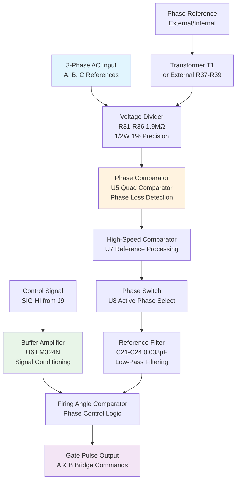

# SD-237-230-12-99 - ENERPRO General Purpose 3φ Firing Circuit

**Document:** sd2372301299  
**Drawing No:** SD-237-230-12-R0  
**PCB PN:** FC0G6100  
**Generated:** March 2026  
**Source:** HVPS Schematic Analysis  
**Board Type:** Control - 3-Phase SCR Firing Circuit  
**Organization:** SLAC / Stanford University

---

## 📋 System Overview

**ENERPRO General Purpose 3φ Firing Circuit** - Version 2 with full detail including wire nets, signal buses, and complete circuit analysis. This board provides precision timing control for 3-phase SCR firing in high-voltage power supply applications.

### Key Functions:
- **3-Phase Reference Processing**: Scales and conditions AC line voltage references
- **Phase Sequence Detection**: Monitors relative phasing of A, B, C inputs  
- **Firing Angle Control**: Precision phase-angle control for SCR gate timing
- **Buffer Amplification**: Signal conditioning for control inputs
- **Gate Pulse Generation**: Synchronized firing pulses for SCR bridges

### Circuit Architecture:


## 🔌 Circuit Architecture


```
SD2372301299 Circuit Block Diagram
┌─────────────────────────────────────┐
│  Input Stage  │  Processing  │ Output │
│              │              │        │
│  [Inputs] ──→ │ [Logic/Amps] │ ──→ [Out] │
│              │              │        │
└─────────────────────────────────────┘
```


## ⚡ Functional Description

### 3-Phase Reference Processing
The circuit processes 3-phase AC line voltage references (A, B, C) through a precision voltage divider network. Each phase enters via connector J6 (pins 13, 14, 11) and passes through 1.9MΩ precision resistors (R31-R36, 1/2W 1% RN70 type). This forms a voltage divider with the RN1/RN2 network (120K), scaling the AC line voltage to levels suitable for comparator inputs.

**Alternative Configuration**: For off-board phase references (Notes 10-11), resistors R31-R33 and transformer T1 are omitted, with R37-R39 and J5/P5 installed instead.

### Phase Sequence and Loss Detection
U5 (quad comparator) monitors the relative phasing of A, B, C inputs using two comparator stages (pins 13/14 and 8/9). The circuit provides:
- **Phase Loss Detection**: C28 (0.22µF) and TP8 node generate phase loss output
- **Hysteresis Control**: R58 (130K) and R59 (115K) set threshold levels
- **Power Supply**: +12V rail feeds pin 13 of U5

### High-Speed Reference Processing
U7 (high-speed comparator) processes the scaled 3-phase reference signals:
- **Input Network**: RN3 (47K network) feeds comparator inputs
- **Filtering**: C28 (0.22µF) connects between U7 and TP8
- **Output Drive**: Comparator outputs drive phase switch U8 and reference filter bank
- **Power**: +12V supply at pin 4

### Active Phase Selection
U8 selects the active phase reference based on PPI jumper settings:
- **Output**: Feeds VDD bus and phase reference filter network
- **Connection**: R61 (47.5K) connects VDD bus to pins N, C, B, A
- **Filtering**: Combined with C21-C24 filter network

### Reference Filtering
Low-pass filter network removes high-frequency noise:
- **Filter Capacitors**: C21, C22, C23, C24 (0.033µF each, MKS3 5% 63V/100V)
- **Filter Resistors**: Combined with RN2 (120K) network
- **Additional Filtering**: C25 (0.15µF) at VDD node

### Buffer Amplifier Section
U6 (LM324N) conditions the control signal for firing angle control:
- **Input**: SIG HI from J9 connector
- **Signal Path**: SIG HI → [R49 47.5K] → summing node
- **Reference**: E signal → [R41] → COM (zero reference)
- **Feedback**: [R50 100K] from output
- **Gain**: Set by [R51 14K] to +5V
- **Output**: Goes to TP1 test point
- **Attenuation**: RN5 (1.5K network) provides ladder attenuation
- **Trimming**: PO1/PO2 pots (R42 SPAN, R43 BIAS) adjust gate delay
- **Filtering**: C26 (0.15µF) filters output
- **Range Setting**: R52 (application-select resistor per Note 18) sets SIG HI range

### Gate Pulse Generation
The processed signals generate synchronized firing pulses:
- **A Bridge Commands**: Output via J8/P8 connector
- **B Bridge Commands**: Output via J9/P9 connector
- **Timing Control**: Precision phase-angle control for SCR firing
- **Synchronization**: Referenced to 3-phase AC line voltage

## 🔧 Key Components

### Integrated Circuits
| Designator | Part Number | Function | Key Specifications |
|------------|-------------|----------|-------------------|
| **U5** | Quad Comparator | Phase sequence & loss detection | Pins 13/14, 8/9 monitor A,B,C phasing |
| **U6** | LM324N | Buffer amplifier (second stage) | Conditions SIG HI control signal |
| **U6** | MC14053BCP | Phase multiplexer | Dual function IC (same designator) |
| **U7** | High-Speed Comparator | 3-phase reference processing | +12V supply at pin 4 |
| **U8** | Phase Switch | Active phase selection | PPI jumper controlled |

### Precision Resistors
| Designator | Value | Tolerance | Power | Function |
|------------|-------|-----------|-------|----------|
| **R31-R36** | 1.9MΩ | 1% | 1/2W | Voltage divider (RN70 type) |
| **R37-R39** | External option | - | - | Off-board phase references |
| **R41** | - | - | - | E signal to COM reference |
| **R42** | SPAN pot | - | - | Gate delay span trim |
| **R43** | BIAS pot | - | - | Gate delay bias trim |
| **R47** | 82.5K | - | - | VSS connection |
| **R49** | 47.5K | - | - | SIG HI input conditioning |
| **R50** | 100K | - | - | Buffer amplifier feedback |
| **R51** | 14K | - | - | Gain setting to +5V |
| **R52** | Application select | - | - | SIG HI range setting (Note 18) |
| **R58** | 130K | - | - | Hysteresis threshold |
| **R59** | 115K | - | - | Hysteresis threshold |
| **R61** | 47.5K | - | - | VDD bus connection |

### Resistor Networks
| Designator | Configuration | Value | Function |
|------------|---------------|-------|----------|
| **RN1/RN2** | Network | 120K | Voltage divider with R31-R36 |
| **RN3** | Network | 47K | U7 comparator inputs |
| **RN5** | Network | 1.5K | Ladder attenuation |

### Capacitors
| Designator | Value | Voltage | Type | Function |
|------------|-------|---------|------|----------|
| **C21-C24** | 0.033µF | 63V/100V | MKS3 5% | Phase reference low-pass filters |
| **C25** | 0.15µF | - | - | VDD node filtering |
| **C26** | 0.15µF | - | - | Buffer output filtering |
| **C28** | 0.22µF | - | - | Phase loss detection |
| **C33** | - | - | - | Bottom terminal connection |

### Connectors & Test Points
| Designator | Type | Function |
|------------|------|----------|
| **J5/P5** | External phase ref | Off-board phase references |
| **J6/P6** | 103311-5/499588-4 | Primary control connector |
| **J8/P8** | Bridge connector | 'A' Bridge auxiliary firing commands |
| **J9/P9** | Bridge connector | 'B' Bridge auxiliary firing commands |
| **J10/P10** | 640454-3/65474-001 | 50/60 Hz select jack (Rev 1B) |
| **TP1** | Test point | Buffer amplifier output |
| **TP2** | Test point | Buffer amplifier monitoring |
| **TP8** | Test point | Phase loss detection output |

### Transformers
| Designator | Function | Notes |
|------------|----------|-------|
| **T1** | Phase reference transformer | Omitted for off-board references |

### Power Supply Requirements
- **+12V**: Logic supply for comparators and phase switch
- **+5V**: Reference voltage for gain setting
- **VSS**: Negative supply rail
- **VDD**: Positive supply bus with filtering

## 📊 Performance Specifications

### Electrical Characteristics
| Parameter | Specification | Notes |
|-----------|---------------|-------|
| Operating Frequency | 60Hz (standard), 50Hz (selectable) | Via J10/P10 connector |
| Input Voltage Range | 3-phase AC line voltage | Scaled via precision dividers |
| Phase Accuracy | ±1% | Precision resistor networks |
| Voltage Scaling Ratio | 1.9MΩ/120K | R31-R36 with RN1/RN2 |
| Hysteresis Levels | 130K/115K ratio | R58/R59 threshold setting |
| Buffer Gain | Adjustable | 14K/100K feedback (R51/R50) |
| Filter Cutoff | ~40Hz | 0.033µF × 120K time constant |
| Operating Temperature | 0°C to +70°C | Commercial grade components |

### Signal Processing Performance
| Function | Specification | Implementation |
|----------|---------------|----------------|
| Phase Loss Detection | 0.22µF time constant | C28 with TP8 output |
| Gate Delay Range | Adjustable | SPAN/BIAS pots (R42/R43) |
| Reference Filtering | 4-channel low-pass | C21-C24 (0.033µF each) |
| Buffer Bandwidth | LM324N limits | U6 operational amplifier |
| Comparator Speed | High-speed | U7 for precise timing |

### Power Requirements
| Rail | Function | Components Powered |
|------|----------|-------------------|
| +12V | Logic and comparators | U5 pin 13, U7 pin 4 |
| +5V | Reference and gain | R51 gain setting |
| VSS | Negative supply | Operational amplifiers |
| VDD | Filtered positive | C25 filtering, R61 connection |

## 🔍 Design Features

### Signal Processing
- High-precision timing generation
- Optical isolation for safety
- Robust protection circuits
- EMI/RFI filtering

### Protection Systems
- Over-voltage/current protection
- Arc detection and response
- Hardware-based safety interlocks
- Fail-safe operation modes

## 🛠️ Test Points and Diagnostics

### Test Point Locations
| Test Point | Function | Expected Signal | Access |
|------------|----------|-----------------|--------|
| **TP1** | Buffer amplifier output | Conditioned SIG HI signal | Direct probe access |
| **TP2** | Buffer amplifier monitoring | U6 output monitoring | Direct probe access |
| **TP8** | Phase loss detection | Phase loss indicator | C28/U7 connection |

### Critical Measurements
| Measurement | Location | Expected Value | Notes |
|-------------|----------|----------------|-------|
| +12V Supply | U5 pin 13, U7 pin 4 | +12V ±5% | Logic power rail |
| +5V Reference | R51 connection | +5V ±2% | Gain setting reference |
| VDD Bus | R61 connection | Filtered +12V | Phase switch output |
| VSS Rail | R47 connection | Negative supply | Op-amp power |
| Phase A,B,C | J6 pins 13,14,11 | AC line voltage | Scaled inputs |
| Buffer Output | TP1 | Variable | SIG HI conditioned |
| Phase Loss | TP8 | Logic level | 0.22µF time constant |

### Connector Pin Assignments
#### J6/P6 - Primary Control Connector
- **Pin 11**: Phase C input
- **Pin 13**: Phase A input  
- **Pin 14**: Phase B input
- **Additional pins**: Control and power connections

#### J8/P8 - A Bridge Auxiliary Firing
- Upper horizontal connector bus
- Positive firing command pulses for A-bridge SCRs

#### J9/P9 - B Bridge Auxiliary Firing  
- SIG HI control input
- Firing command pulses for B-bridge SCRs

#### J10/P10 - 50/60 Hz Select (Rev 1B)
- **Pins 3 & 5**: Low voltage connections
- **Pins 1 & 5**: High voltage connections
- AWG 20 sleeved wire to plated through-holes

### Troubleshooting Guide
| Symptom | Possible Cause | Check Points |
|---------|----------------|--------------|
| No gate pulses | Power supply failure | +12V at U5, U7 |
| Phase loss alarm | Input voltage low | J6 pins 11,13,14 |
| Timing drift | Temperature effects | TP1 signal stability |
| Erratic firing | Noise on references | C21-C24 filtering |
| No SIG HI response | Buffer amplifier fault | TP1, TP2 outputs |

## 📋 Maintenance Schedule

### Monthly Checks
- Visual inspection for component damage
- Power supply voltage verification
- LED indicator status

### Annual Maintenance
- Timing calibration verification
- Isolation resistance testing
- Component replacement (as needed)
- Performance characterization

---

**Note:** This analysis is based on schematic extraction. Verify against actual hardware for complete accuracy.

**Related Documents:**
- System Overview: `00_HVPS_SYSTEM_OVERVIEW.md`
- Original Schematic: `../schematics/sd2372301299.pdf`
- Component Datasheets: Available from manufacturers
