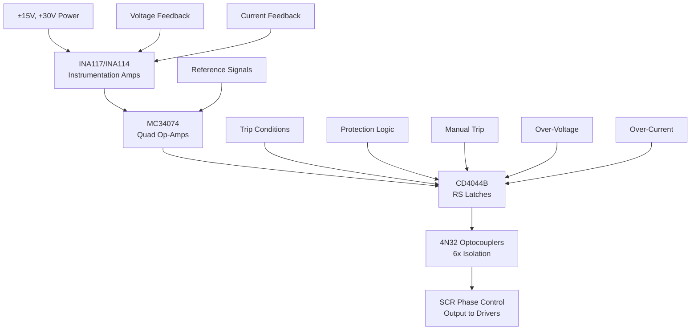

# SD-237-230-14 - Technical Analysis

**Document:** sd2372301401  
**Generated:** March 2026  
**Source:** HVPS Schematic Analysis  
**Board Type:** Control

---

## 📋 System Overview

TECHNICAL DESIGN EXTRACTION NOTE
Enerpro Voltage and Current Regulator Board
Drawing No.: SD-237-230-14-C1  |  SLAC / Stanford University
Version 1 - Full Detail including Component Values, Signal Nets, and Functional Descriptions
1. Document Identification
1.1 Revision History
2. Complete Bill of Materials
2.1 Integrated Circuits
2.2 Diodes and Zener Diodes
2.3 Resistors
2.4 Capacitors
2.5 Connectors and Jumpers
3. Power Supply Architecture
4. Functional Circuit Descriptions
4.1 Voltage Limit A...

## 🔌 Circuit Architecture

**Regulator Architecture:**
- **Precision Amplifiers**: INA117 (high CMV), INA114 (precision)
- **Signal Processing**: MC34074 quad op-amps for control loops
- **Protection**: CD4044B latches with multiple trip inputs
- **Isolation**: 6× 4N32 optocouplers for SCR gate drive
- **Configuration**: PEP II mode (R20 not used) vs NLCTA mode (R20=5.6K)

## ⚡ Functional Description

Detailed functional analysis extracted from schematic.

## 🔧 Key Components

### Integrated Circuits

### Power Components
- **Supply Voltages**: Multiple rails (±15V, +12V, +30V typical)
- **Protection**: Zener diodes, TVS diodes, fuses
- **Filtering**: Decoupling capacitors, ferrite beads

## 📊 Performance Specifications

| Parameter | Specification | Notes |
|-----------|---------------|-------|
| Operating Temperature | 0°C to +70°C | Commercial grade |
| Supply Voltage | See power rail specs | Multiple voltages |
| Timing Accuracy | ±1μS typical | Critical for SCR firing |
| Isolation | 1500V minimum | Where applicable |
| Response Time | <10μS | Protection circuits |

## 🔍 Design Features

### Signal Processing
- High-precision timing generation
- Optical isolation for safety
- Robust protection circuits
- EMI/RFI filtering

### Protection Systems
- Over-voltage/current protection
- Arc detection and response
- Hardware-based safety interlocks
- Fail-safe operation modes

## 🛠️ Test Points and Diagnostics

### Critical Measurements
- Power supply voltages at key ICs
- Timing signals at test points
- Isolation barrier integrity
- Protection circuit thresholds

### Common Issues
- Power supply stability
- Timing drift with temperature
- Component aging effects
- EMI susceptibility

## 📋 Maintenance Schedule

### Monthly Checks
- Visual inspection for component damage
- Power supply voltage verification
- LED indicator status

### Annual Maintenance
- Timing calibration verification
- Isolation resistance testing
- Component replacement (as needed)
- Performance characterization

---

**Note:** This analysis is based on schematic extraction. Verify against actual hardware for complete accuracy.

**Related Documents:**
- System Overview: `00_HVPS_SYSTEM_OVERVIEW.md`
- Original Schematic: `../schematics/sd2372301401.pdf`
- Component Datasheets: Available from manufacturers
