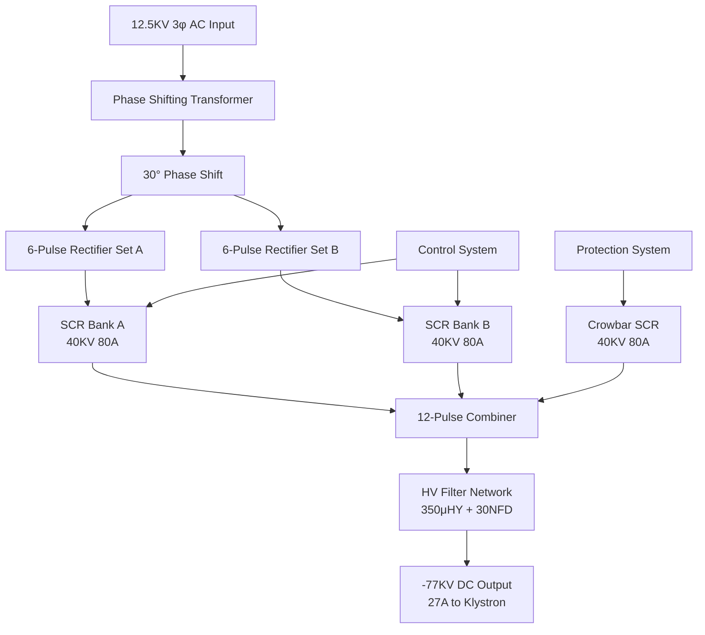

# SD-730-790-01 - Technical Analysis

**Document:** sd7307900101  
**Generated:** March 2026  
**Source:** HVPS Schematic Analysis  
**Board Type:** Power Conversion

---

## 📋 System Overview

TECHNICAL DESIGN EXTRACTION NOTE
PEP II RF Power Supply - Klystron Power Supply System Schematic
Drawing No.: SD-730-790-01-C1  |  SLAC / Stanford University
1. Document Identification
1.1 Revision History
2. System Overview
This schematic provides the top-level system architecture for the PEP II RF High Voltage Power Supply (HVPS) system. It shows the complete power conversion chain from 12.5KV 3-phase AC input to high-voltage DC output for klystron operation at -77KV, 27 amps.
3. Major Compone...

## 🔌 Circuit Architecture

**System Architecture:**
- **Input**: 12.5KV 3-phase AC from facility power
- **Transformer**: Phase-shifting type providing 30° offset for 12-pulse operation
- **Rectifiers**: Two 6-pulse SCR sets (40KV 80A thyristors)
- **Filter**: LC network (350μHY inductors, 30NFD capacitors)
- **Output**: -77KV DC at 27A (~2MW) for klystron operation

## ⚡ Functional Description

Detailed functional analysis extracted from schematic.

## 🔧 Key Components

### Integrated Circuits

### Power Components
- **Supply Voltages**: Multiple rails (±15V, +12V, +30V typical)
- **Protection**: Zener diodes, TVS diodes, fuses
- **Filtering**: Decoupling capacitors, ferrite beads

## 📊 Performance Specifications

| Parameter | Specification | Notes |
|-----------|---------------|-------|
| Operating Temperature | 0°C to +70°C | Commercial grade |
| Supply Voltage | See power rail specs | Multiple voltages |
| Timing Accuracy | ±1μS typical | Critical for SCR firing |
| Isolation | 1500V minimum | Where applicable |
| Response Time | <10μS | Protection circuits |

## 🔍 Design Features

### Signal Processing
- High-precision timing generation
- Optical isolation for safety
- Robust protection circuits
- EMI/RFI filtering

### Protection Systems
- Over-voltage/current protection
- Arc detection and response
- Hardware-based safety interlocks
- Fail-safe operation modes

## 🛠️ Test Points and Diagnostics

### Critical Measurements
- Power supply voltages at key ICs
- Timing signals at test points
- Isolation barrier integrity
- Protection circuit thresholds

### Common Issues
- Power supply stability
- Timing drift with temperature
- Component aging effects
- EMI susceptibility

## 📋 Maintenance Schedule

### Monthly Checks
- Visual inspection for component damage
- Power supply voltage verification
- LED indicator status

### Annual Maintenance
- Timing calibration verification
- Isolation resistance testing
- Component replacement (as needed)
- Performance characterization

---

**Note:** This analysis is based on schematic extraction. Verify against actual hardware for complete accuracy.

**Related Documents:**
- System Overview: `00_HVPS_SYSTEM_OVERVIEW.md`
- Original Schematic: `../schematics/sd7307900101.pdf`
- Component Datasheets: Available from manufacturers
