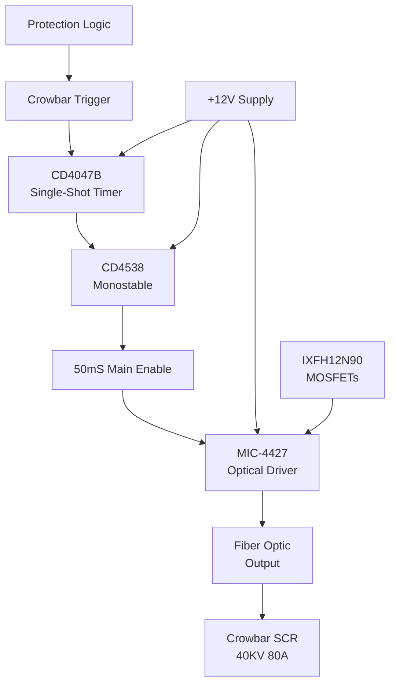

# SD-730-793-04 - Technical Analysis

**Document:** sd7307930402  
**Generated:** March 2026  
**Source:** HVPS Schematic Analysis  
**Board Type:** Driver/Protection

---

## 📋 System Overview

TECHNICAL DESIGN EXTRACTION NOTE
PEP II RF System - 2MW Klystron Power Supply SCR Crowbar Driver Board
Drawing No.: SD-730-793-04-C2  |  SLAC / Stanford University
1. Document Identification
1.1 Revision History
2. System Overview
The SCR Crowbar Driver Board generates gate drive pulses for the crowbar thyristor protection circuit. When a fault is detected, it fires the crowbar SCR to short-circuit the high-voltage output, protecting the klystron from damage. It accepts a single-shot trigger inp...

## 🔌 Circuit Architecture

**Crowbar Driver Features:**
- **Single-Shot**: One-time firing for fault protection
- **Timing**: 50mS main enable, 44μS gate pulse
- **Isolation**: MIC-4427 optical output for safety
- **Power**: IXFH12N90 MOSFETs for gate drive

## ⚡ Functional Description

Detailed functional analysis extracted from schematic.

## 🔧 Key Components

### Integrated Circuits
| Designator | Part Number | Function | Key Specifications |
|------------|-------------|----------|-------------------|
| **U1A/U1B** | CD4047B | Monostable multivibrator | Single-shot trigger, astable/monostable operation |
| **U5** | MIC-4451 | MOSFET driver | Drives IXFH12N90 MOSFETs through zener-protected gates |

### Power Components
| Designator | Part Number | Function | Key Specifications |
|------------|-------------|----------|-------------------|
| **Q1/Q2** | IXFH12N90 | Power MOSFETs | Gate drive for SCR crowbar trigger |

### Timing Components
| Designator | Function | Specification |
|------------|----------|---------------|
| **R1** | Pulse width adjust | 50mS main pulse timing |
| **R2** | Sub-pulse adjust | 44μS gate pulse timing |

### Protection Components
| Designator | Part Number | Function |
|------------|-------------|----------|
| **1N4744A** | Zener diode | Gate protection for MOSFETs |
| **MR856** | Fast diode | Output rectification |

### Additional Power Components
- **Supply Voltages**: Multiple rails (±15V, +12V, +30V typical)
- **Protection**: Zener diodes, TVS diodes, fuses
- **Filtering**: Decoupling capacitors, ferrite beads

## 📊 Performance Specifications

| Parameter | Specification | Notes |
|-----------|---------------|-------|
| Operating Temperature | 0°C to +70°C | Commercial grade |
| Supply Voltage | See power rail specs | Multiple voltages |
| Timing Accuracy | ±1μS typical | Critical for SCR firing |
| Isolation | 1500V minimum | Where applicable |
| Response Time | <10μS | Protection circuits |

## 🔍 Design Features

### Signal Processing
- High-precision timing generation
- Optical isolation for safety
- Robust protection circuits
- EMI/RFI filtering

### Protection Systems
- Over-voltage/current protection
- Arc detection and response
- Hardware-based safety interlocks
- Fail-safe operation modes

## 🛠️ Test Points and Diagnostics

### Critical Measurements
- Power supply voltages at key ICs
- Timing signals at test points
- Isolation barrier integrity
- Protection circuit thresholds

### Common Issues
- Power supply stability
- Timing drift with temperature
- Component aging effects
- EMI susceptibility

## 📋 Maintenance Schedule

### Monthly Checks
- Visual inspection for component damage
- Power supply voltage verification
- LED indicator status

### Annual Maintenance
- Timing calibration verification
- Isolation resistance testing
- Component replacement (as needed)
- Performance characterization

---

**Note:** This analysis is based on schematic extraction. Verify against actual hardware for complete accuracy.

**Related Documents:**
- System Overview: `00_HVPS_SYSTEM_OVERVIEW.md`
- Original Schematic: `../schematics/sd7307930402.pdf`
- Component Datasheets: Available from manufacturers
