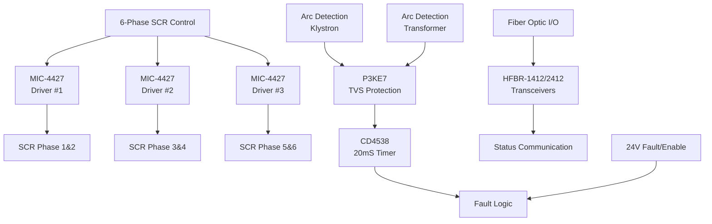

# SD-730-793-07 - Technical Analysis

**Document:** sd7307930702  
**Generated:** March 2026  
**Source:** HVPS Schematic Analysis  
**Board Type:** Driver/Protection

---

## 📋 System Overview

TECHNICAL DESIGN EXTRACTION NOTE
PEP II RF System - SCR Control Driver / Right Side Trigger Interconnect Board
Drawing No.: SD-730-793-07-C2  |  SLAC / Stanford University
1. Document Identification
1.1 Revision History
2. System Overview
The Right Side Trigger Interconnect Board is the central control and monitoring hub for the right-side SCR trigger circuits in the 2MW klystron power supply. It provides SCR trigger generation, monitoring of all three phases (+A/+B/+C and -A/-B/-C), fault/enabl...

## 🔌 Circuit Architecture

**Trigger Interconnect Functions:**
- **6-Phase Control**: 3× MIC-4427 drivers for synchronized SCR firing
- **Arc Protection**: P3KE7 TVS diodes with 20mS CD4538 timing
- **Communication**: Fiber-optic status with HFBR transceivers
- **Coordination**: 24V fault/enable bus between left/right boards

## ⚡ Functional Description

Detailed functional analysis extracted from schematic.

## 🔧 Key Components

### Integrated Circuits

### Power Components
- **Supply Voltages**: Multiple rails (±15V, +12V, +30V typical)
- **Protection**: Zener diodes, TVS diodes, fuses
- **Filtering**: Decoupling capacitors, ferrite beads

## 📊 Performance Specifications

| Parameter | Specification | Notes |
|-----------|---------------|-------|
| Operating Temperature | 0°C to +70°C | Commercial grade |
| Supply Voltage | See power rail specs | Multiple voltages |
| Timing Accuracy | ±1μS typical | Critical for SCR firing |
| Isolation | 1500V minimum | Where applicable |
| Response Time | <10μS | Protection circuits |

## 🔍 Design Features

### Signal Processing
- High-precision timing generation
- Optical isolation for safety
- Robust protection circuits
- EMI/RFI filtering

### Protection Systems
- Over-voltage/current protection
- Arc detection and response
- Hardware-based safety interlocks
- Fail-safe operation modes

## 🛠️ Test Points and Diagnostics

### Critical Measurements
- Power supply voltages at key ICs
- Timing signals at test points
- Isolation barrier integrity
- Protection circuit thresholds

### Common Issues
- Power supply stability
- Timing drift with temperature
- Component aging effects
- EMI susceptibility

## 📋 Maintenance Schedule

### Monthly Checks
- Visual inspection for component damage
- Power supply voltage verification
- LED indicator status

### Annual Maintenance
- Timing calibration verification
- Isolation resistance testing
- Component replacement (as needed)
- Performance characterization

---

**Note:** This analysis is based on schematic extraction. Verify against actual hardware for complete accuracy.

**Related Documents:**
- System Overview: `00_HVPS_SYSTEM_OVERVIEW.md`
- Original Schematic: `../schematics/sd7307930702.pdf`
- Component Datasheets: Available from manufacturers
