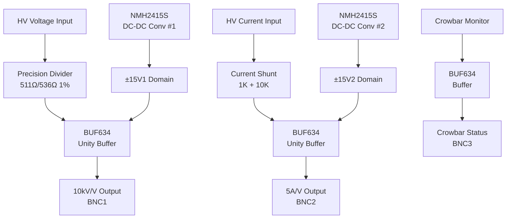

# SD-730-793-12 - Technical Analysis

**Document:** sd7307931203  
**Generated:** March 2026  
**Source:** HVPS Schematic Analysis  
**Board Type:** Driver/Protection

---

## 📋 System Overview

TECHNICAL DESIGN EXTRACTION NOTE
PEP II RF System - 2MW Klystron Power Supply Monitor Board
Drawing No.: SD-730-793-12-C3  |  SLAC / Stanford University
1. Document Identification
2. System Overview
The Monitor Board provides precision voltage and current monitoring for the 2MW klystron power supply. It features isolated DC-DC converters, precision buffer amplifiers, reference voltage generation, and multiple BNC output connectors for instrument-grade monitoring of power supply voltage (10 kV/V ...

## 🔌 Circuit Architecture

**Monitor Board Features:**
- **Dual Isolation**: 1500V isolation between domains
- **Precision**: 10kV/V voltage, 5A/V current scaling
- **Buffering**: BUF634 unity-gain buffers for all outputs
- **Calibration**: 2K 12-turn trimmer for reference adjustment

## ⚡ Functional Description

Detailed functional analysis extracted from schematic.

## 🔧 Key Components

### Integrated Circuits

### Power Components
- **Supply Voltages**: Multiple rails (±15V, +12V, +30V typical)
- **Protection**: Zener diodes, TVS diodes, fuses
- **Filtering**: Decoupling capacitors, ferrite beads

## 📊 Performance Specifications

| Parameter | Specification | Notes |
|-----------|---------------|-------|
| Operating Temperature | 0°C to +70°C | Commercial grade |
| Supply Voltage | See power rail specs | Multiple voltages |
| Timing Accuracy | ±1μS typical | Critical for SCR firing |
| Isolation | 1500V minimum | Where applicable |
| Response Time | <10μS | Protection circuits |

## 🔍 Design Features

### Signal Processing
- High-precision timing generation
- Optical isolation for safety
- Robust protection circuits
- EMI/RFI filtering

### Protection Systems
- Over-voltage/current protection
- Arc detection and response
- Hardware-based safety interlocks
- Fail-safe operation modes

## 🛠️ Test Points and Diagnostics

### Critical Measurements
- Power supply voltages at key ICs
- Timing signals at test points
- Isolation barrier integrity
- Protection circuit thresholds

### Common Issues
- Power supply stability
- Timing drift with temperature
- Component aging effects
- EMI susceptibility

## 📋 Maintenance Schedule

### Monthly Checks
- Visual inspection for component damage
- Power supply voltage verification
- LED indicator status

### Annual Maintenance
- Timing calibration verification
- Isolation resistance testing
- Component replacement (as needed)
- Performance characterization

---

**Note:** This analysis is based on schematic extraction. Verify against actual hardware for complete accuracy.

**Related Documents:**
- System Overview: `00_HVPS_SYSTEM_OVERVIEW.md`
- Original Schematic: `../schematics/sd7307931203.pdf`
- Component Datasheets: Available from manufacturers
