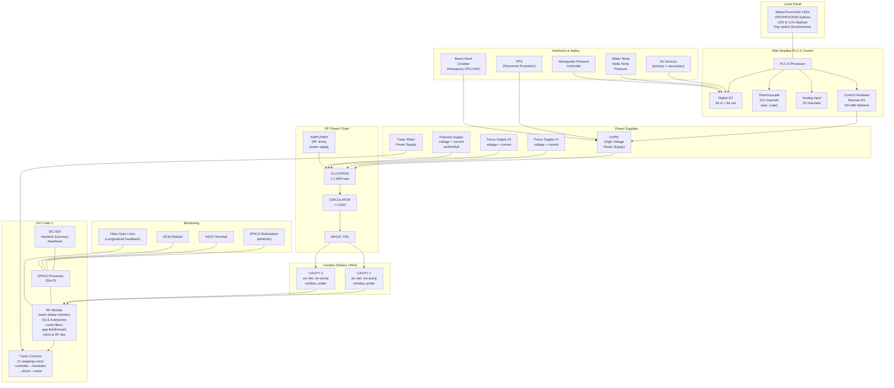

# PEP-II LER RF Station — Block Diagram

| Field | Value |
|-------|-------|
| **Document Number** | BD-340-330-00-R0 |
| **Title** | PEP-II LER RF Station — Block Diagram |
| **Author** | P. Corredoura, 1/28/99 |
| **Organization** | Stanford Linear Accelerator Center, U.S. Department of Energy |
| **Date** | January 28, 1999 |
| **Pages** | 1 |
| **Source PDF** | `bd3403300000.pdf` |
| **Drawing Standard** | ASME Y14.5M-1994 |

---

## ASCII Replica — Complete LER RF Station

> This diagram replicates BD-340-330-00, showing the full station from PLC control
> through klystron to beam cavities, including all support systems.
> Station shown: **LR44** (LER, 2 cavities)

```
 ┌─────────────────────────────────────────────────────────────────────────────────┐
 │                          LOCAL PANEL (front of rack)                            │
 │  ○ STATUS    ○ OFF     LED display    LCD display    key switch                │
 │  ○ TUNE      ○ PROCESS   (power)                   (local/remote)             │
 │  ○ AUTO                                                                        │
 │  LED's (status indicators)                                                     │
 └────────────────────────────────────┬────────────────────────────────────────────┘
                                      │
 ┌────────────────────────────────────┴────────────────────────────────────────────┐
 │                        ALLEN BRADLEY PLC-5 CONTROL SYSTEM                      │
 │                                                                                │
 │  ┌──────────────────┐  ┌─────────────────┐  ┌──────────────────────────────┐  │
 │  │ PLC-5 Processor  │  │  Allen Bradley  │  │  Allen Bradley DH-485       │  │
 │  │                  │  │  Control        │  │  Network Interface          │  │
 │  │  ┌────────────┐  │  │  Hardware       │  │                            │  │
 │  │  │Digital Out │  │  │                 │  │  ┌─────────────────────┐   │  │
 │  │  │64 channels │  │  │  Remote I/O     │  │  │ Focus Supply #1    │   │  │
 │  │  └────────────┘  │  │                 │  │  │  voltage, current  │──▶│  │
 │  │  ┌────────────┐  │  │                 │  │  └─────────────────────┘   │  │
 │  │  │Digital In  │  │  │                 │  │  ┌─────────────────────┐   │  │
 │  │  │64 channels │  │  │                 │  │  │ Focus Supply #2    │   │  │
 │  │  └────────────┘  │  │                 │  │  │  voltage, current  │──▶│  │
 │  │  ┌────────────┐  │  │                 │  │  └─────────────────────┘   │  │
 │  │  │Thermocouple│  │  │                 │  │  ┌─────────────────────┐   │  │
 │  │  │Input 112 ch│  │  │                 │  │  │ Filament Supply    │   │  │
 │  │  │(sep. crate)│  │  │                 │  │  │  on/current limit  │   │  │
 │  │  └────────────┘  │  │                 │  │  │  on/full current   │──▶│  │
 │  │  ┌────────────┐  │  │                 │  │  │  voltage monitor   │   │  │
 │  │  │Analog In   │  │  │                 │  │  │  current monitor   │   │  │
 │  │  │32 channels │  │  │                 │  │  └─────────────────────┘   │  │
 │  │  └────────────┘  │  │                 │  │                            │  │
 │  └──────────────────┘  └─────────────────┘  └──────────────────────────────┘  │
 │                                                                                │
 │  SIGNALS TO/FROM PLC:                                                          │
 │  ├── to RF: HVPS on/off request, HVPS reset, open/close contactor             │
 │  ├── from RF: HVPS ready signal, contactor status, HVPS on/off status         │
 │  ├── interlock inputs (64 channels)                                            │
 │  ├── thermocouple inputs (112 channels, separate crate)                        │
 │  └── analog inputs (32 channels)                                               │
 └────────────────────────────────┬───────────────────────────────────────────────┘
                                  │
                                  │ fiber optic links
                                  │ fiber receiver, LED signals
 ┌────────────────────────────────┴───────────────────────────────────────────────┐
 │                           RF POWER CHAIN                                       │
 │                                                                                │
 │                                     circulator interface                       │
 │    ┌───────────────┐              ┌──────────────┐                            │
 │    │  AMPLIFIER    │              │  KLYSTRON     │        ┌──────────────┐    │
 │    │  (RF drive)   │─────────────▶│  1.2 MW max  │───────▶│ CIRCULATOR   │    │
 │    │  power supply │              │              │        │              │    │
 │    └───────────────┘              └──────┬───────┘        └──────┬───────┘    │
 │                                          │                       │            │
 │                                    ┌─────┴──────┐          ┌────┴─────┐      │
 │                                    │  magnet    │          │  LOAD    │      │
 │                                    │  current   │          │(circ.)   │      │
 │                                    │  magnet    │          └──────────┘      │
 │                                    │  over temp │                            │
 │                                    └────────────┘                            │
 │                                                                               │
 │    ┌───────────────────────────────────────────────────────────────────┐      │
 │    │                HIGH VOLTAGE POWER SUPPLY (HVPS)                  │      │
 │    │                                                                   │      │
 │    │  PPS ─────────────▶ PPS status                                   │      │
 │    │  beam abort ──────▶ crowbar protection                           │      │
 │    │  emergency off ───▶ +24V hardwired                               │      │
 │    │                      trigger control (fiber optic)                │      │
 │    │                      high voltage ─▶ KLYSTRON                    │      │
 │    │                                                                   │      │
 │    │  Allen Bradley remote I/O:                                       │      │
 │    │  ├── HVPS ready signal                                           │      │
 │    │  ├── contactor status                                            │      │
 │    │  ├── HVPS on/off status                                          │      │
 │    │  ├── HVPS on/off request                                         │      │
 │    │  ├── HVPS reset                                                  │      │
 │    │  └── open/close contactor                                        │      │
 │    └───────────────────────────────────────────────────────────────────┘      │
 │                                                                               │
 │    INTERLOCKS:                                                                │
 │    ├── primary air source, secondary air source                               │
 │    ├── input water temp → to interlocks                                       │
 │    ├── water delta temp → PG → to interlocks                                  │
 │    ├── magnet over temp → to interlocks                                       │
 │    ├── high pump (local panel high P sensor)                                  │
 │    ├── air/waveguide pressure → controller                                    │
 │    ├── beam abort → to analog monitor                                         │
 │    └── magnet current → to analog monitor                                     │
 └────────────────────────────────┬───────────────────────────────────────────────┘
                                  │ MAGIC TEE power splitter
                                  │
 ┌────────────────────────────────┴───────────────────────────────────────────────┐
 │                        RF DISTRIBUTION TO CAVITIES                             │
 │                                                                                │
 │    ┌────────────┐           ┌────────────┐                                    │
 │    │ MAGIC TEE  │──────────▶│  CAVITY 1  │   (station LR44, LER)             │
 │    │            │           │            │                                    │
 │    │            │           │  ┌───────┐ │  ┌────────────────────────────┐    │
 │    │            │           │  │window │ │  │ arc detector              │    │
 │    │            │           │  └───────┘ │  │ ion pump                  │    │
 │    │            │           └────────────┘  │ cavity probe signals      │    │
 │    │     LOAD   │                           │ I/Q & A detector (IQ)     │    │
 │    │  (magic tee│           ┌────────────┐  │ stepping motor controller │    │
 │    │   load)    │──────────▶│  CAVITY 2  │  └────────────────────────────┘    │
 │    └────────────┘           │            │                                    │
 │                             │  ┌───────┐ │  ┌────────────────────────────┐    │
 │                             │  │window │ │  │ arc detector              │    │
 │                             │  └───────┘ │  │ ion pump                  │    │
 │                             └────────────┘  │ cavity probe signals      │    │
 │                                             │ I/Q & A detector (IQ)     │    │
 │                                  476 MHz    │ stepping motor controller │    │
 │                                             └────────────────────────────┘    │
 └────────────────────────────────┬───────────────────────────────────────────────┘
                                  │ cavity probe signals
                                  │
 ┌────────────────────────────────┴───────────────────────────────────────────────┐
 │                          VXI CRATE 1 (LLRF)                                    │
 │                                                                                │
 │  ┌────────────────────────────────────────────────────────────────────────┐    │
 │  │  Slot 0: EPICS Processor                                              │    │
 │  │  SIC-500: System Interlock Summary, "heartbeat"                       │    │
 │  │  arc detector/interlocks                                               │    │
 │  ├────────────────────────────────────────────────────────────────────────┤    │
 │  │  RF Module:                                                            │    │
 │  │    476 MHz beam phase monitors                                         │    │
 │  │    I/Q & A detector (IQ)  ← cavity 1                                  │    │
 │  │    I/Q & A detector (IQ)  ← cavity 2                                  │    │
 │  │    equalized comb filter (×2)                                          │    │
 │  │    gap feed forward module                                             │    │
 │  │    clock & RF distribution                                             │    │
 │  │    spare slots (×3)                                                    │    │
 │  ├────────────────────────────────────────────────────────────────────────┤    │
 │  │  Tuner Controls (from Windows beam phase):                             │    │
 │  │                                                                        │    │
 │  │    Cavity 1 tuner:                                                     │    │
 │  │      stepping motor controller → translator → driver → tuner motor    │    │
 │  │    Cavity 2 tuner:                                                     │    │
 │  │      stepping motor controller → translator → driver → tuner motor    │    │
 │  │                                                                        │    │
 │  │    Tuner motor power supply (shared)                                   │    │
 │  │    Limit switches (×2 per tuner)                                       │    │
 │  ├────────────────────────────────────────────────────────────────────────┤    │
 │  │  Fiber Optic Links:                                                    │    │
 │  │    ├── Longitudinal Feedback (kick) — fiber optic link                │    │
 │  │    └── fiber optic link (×2) to beam feedback system                  │    │
 │  ├────────────────────────────────────────────────────────────────────────┤    │
 │  │  Monitoring:                                                           │    │
 │  │    ├── ASCII terminal monitor                                         │    │
 │  │    ├── EPICS workstation (ethernet)                                   │    │
 │  │    ├── DCM module                                                     │    │
 │  │    ├── Allen Bradley VME scanner                                      │    │
 │  │    └── Remote I/O link                                                │    │
 │  └────────────────────────────────────────────────────────────────────────┘    │
 └────────────────────────────────────────────────────────────────────────────────┘
```

---

## Mermaid — LER RF Station (System-Level View)



---

## Complete Component Inventory

### Control System
| Component | Specification |
|-----------|--------------|
| PLC-5 Processor | Allen Bradley main controller |
| Digital Output | 64 channels |
| Digital Input | 64 channels (interlock inputs) |
| Thermocouple Input | 112 channels (separate crate) |
| Analog Input | 32 channels |
| Control Network | Allen Bradley DH-485 |
| Remote I/O | Allen Bradley remote I/O link |

### RF Power Chain
| Component | Specification |
|-----------|--------------|
| RF Frequency | 476 MHz |
| RF Drive | Amplifier with power supply |
| Klystron | 1.2 MW max output |
| Circulator | With high-power load |
| Magic Tee | 2-way splitter to cavities |

### Power Supplies
| Supply | Parameters Monitored |
|--------|---------------------|
| HVPS | on/off, contactor, ready signal, voltage |
| Focus Supply #1 | voltage, current |
| Focus Supply #2 | voltage, current |
| Filament Supply | voltage, current, on/current limit, on/full current |
| Tuner Motor PSU | shared for all tuner motors |

### Cavity Systems (Station LR44)
| Feature | Cavity 1 | Cavity 2 |
|---------|----------|----------|
| Arc detector | ✓ | ✓ |
| Ion pump | ✓ | ✓ |
| Window | ✓ | ✓ |
| Cavity probe | ✓ | ✓ |
| I/Q & A detector | ✓ | ✓ |
| Stepping motor controller | ✓ | ✓ |
| Tuner (translator → driver) | ✓ | ✓ |
| Limit switches | 2 | 2 |

### VXI Crate Contents
| Slot/Module | Function |
|------------|----------|
| Slot 0 | EPICS Processor |
| SIC-500 | System interlock summary, "heartbeat" |
| RF Module | Beam phase monitors, I/Q detectors |
| Comb Filter | ×2 equalized comb filter modules |
| Gap Feedforward | Gap feed forward module |
| Clock & RF | Clock & RF distribution |
| Spare | ×3 spare slots |

### Interlock & Safety Systems
| System | Function |
|--------|----------|
| PPS | Personnel Protection System status |
| Beam abort | HVPS crowbar protection |
| Emergency off | +24V hardwired safety |
| Trigger control | Fiber optic HVPS control |
| Air sources | Primary and secondary air monitoring |
| Water temp | Input water temperature |
| Water delta temp | Temperature differential (PG → interlocks) |
| Magnet over temp | Magnet temperature monitoring |
| Air/waveguide pressure | Pressure monitoring via controller |
| Magnet current | Current monitoring → analog monitor |

### External Interfaces
| Interface | Connection |
|-----------|-----------|
| Longitudinal Feedback | Fiber optic link (kick signal) |
| EPICS Workstation | Ethernet |
| ASCII Terminal | Serial monitor |
| DCM Module | Data communication |
| Allen Bradley VME Scanner | Remote I/O link |
| Windows Beam Phase | Tuner control source |
| Fiber optic links | ×2 to feedback system |

---

## Title Block

| Field | Value |
|-------|-------|
| Drawing | BD-340-330-00 R0 |
| Title | PEP2 LER RF STATION — BLOCK DIAGRAM |
| Designed by | Paul Corredoura |
| Drawn by | Paul Corredoura |
| Approved by | Paul Corredoura |
| Date | 1/28/99 |
| Status | Draft |
| Scale | Do Not Scale Drawing |

---

> **Transcription Note (v2)**: ASCII and Mermaid diagrams replicated from OCR of `bd3403300000.pdf`. This is a complex single-page engineering block diagram showing the complete LER RF station. Component names and interconnections extracted from multiple OCR passes with different segmentation modes. **The original PDF should be consulted for precise signal routing, cable connections, and spatial layout details.**
>
> **OCR v2 Verification (Tesseract 5.3.0 at 450 DPI, PSM 6+11, sparse mode best at 3424 chars):** Re-extraction at higher DPI confirms all major component labels. Additional details recovered: "EPICS processor - slot 0" label on control system, "Allen Bradley DH-485" network interface confirmed, "tuner control" and "beam phase" labels on cavity monitoring paths, "PLC-5 processor" designation confirmed, "crowbar" protection explicitly labeled on HVPS, "contactor status" and "open/close contactor" control signals confirmed, "from windows" label on operator interface path. These additional labels verify the ASCII art reconstruction and provide more granular signal path identification than the v1 extraction.

