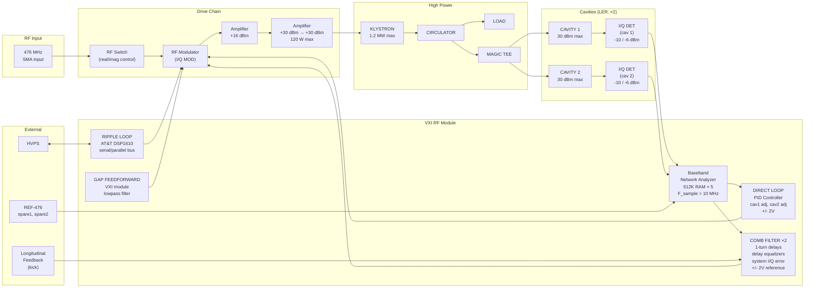

# PEP-II Low Level RF Configuration (LER)

| Field | Value |
|-------|-------|
| **Document Number** | BD-340-330-01-R0 |
| **Title** | PEP-II LER LLRF Configuration — Block Diagram |
| **Author** | P. Corredoura, 1/28/98 |
| **Organization** | Stanford Linear Accelerator Center, U.S. Department of Energy |
| **Date** | January 28, 1998 |
| **Pages** | 1 |
| **Source PDF** | `bd3403300100.pdf` |
| **Drawing Standard** | ASME Y14.5M-1994 |

---

## ASCII Replica — LER LLRF Signal Processing Chain

> This diagram replicates the signal flow shown in BD-340-330-01.
> The LER has **2 cavities** per station.

```
                                                         ┌─────────────┐
                                                         │   CAVITY 1  │  30 dBm
                                                    ┌───▶│  (LR44)     │◀── max
                                                    │    └──────┬──────┘
                                                    │           │ cavity probe
                                                    │    ┌──────┴──────┐
                                               MAGIC│    │  I/Q DET    │ -10 dBm
                                               TEE  │    │  (cav 1)    │ -6 dBm
                                                    │    └──────┬──────┘
                                                    │           │ cav1 I, cav1 Q
 ┌────────────────────────────────────────────┐     │           ▼
 │             RF DRIVE CHAIN                 │     │    ┌─────────────┐
 │                                            │     │    │   CAVITY 2  │  30 dBm
 │  476 MHz  ┌───────┐ ┌───────┐ ┌────────┐  │     │    │  (LR44)     │◀── max
 │   SMA ───▶│  RF   │▶│ AMPL  │▶│  AMPL  │──┼─────┘    └──────┬──────┘
 │  input    │SWITCH │ │+16dBm │ │+30 dBm │  │                  │ cavity probe
 │           └───────┘ └───────┘ └────────┘  │           ┌──────┴──────┐
 │              │         120 W    +30 dBm   │           │  I/Q DET    │ -10 dBm
 │              │          max               │           │  (cav 2)    │ -6 dBm
 │           to real/                        │           └──────┬──────┘
 │           imag                            │                  │ cav2 I, cav2 Q
 │           control     ┌─────────┐  ┌──────────┐             │
 │                       │KLYSTRON │  │CIRCULATOR│             │
 │              ┌───────▶│1.2 MW   │─▶│  + LOAD  │─────────────┘
 │              │        │  max    │  └──────────┘
 │     ┌────────┴──────┐ └─────────┘                    REF-476
 │     │ RF MODULATOR  │                                  │
 │     │  (I/Q MOD)    │                                  ▼
 │     │  I_drive      │                          ┌──────────────┐
 │     │  Q_drive      │                          │ I/Q DETECTOR │
 │     └───────▲───────┘                          │ (REF-476)    │
 │             │                                  │  spare1      │
 │      ┌──────┴───────┐                          │  spare2      │
 │      │  Σ (summing  │                          └──────────────┘
 │      │   junction)  │
 └──────┴──────────────┴──────────────────────────┘
               ▲  ▲  ▲  ▲
               │  │  │  │
       ┌───────┘  │  │  └──────────┐
       │          │  │             │
       │          │  │             │
 ┌─────┴─────┐ ┌─┴──┴──┐  ┌──────┴──────┐  ┌──────────────┐
 │  DIRECT   │ │ COMB  │  │    GAP      │  │   RIPPLE     │
 │  LOOP     │ │FILTER │  │FEEDFORWARD  │  │   LOOP       │
 │  (PID)    │ │ (×2)  │  │  (VXI)      │  │ (AT&T        │
 │           │ │       │  │             │  │  DSP1610)    │
 └─────┬─────┘ └───┬───┘  └──────┬──────┘  └──────┬───────┘
       │           │             │                 │
       ▼           ▼             ▼                 ▼
  ┌─────────────────────────────────────────────────────────┐
  │                VXI RF MODULE                             │
  │  ┌──────────────────────────────────────────────────┐   │
  │  │         Baseband Network Analyzer                │   │
  │  │                                                  │   │
  │  │  ┌──────┐ ┌────────┐ ┌────────┐ ┌────────┐      │   │
  │  │  │ x DAC│ │512K RAM│ │512K RAM│ │512K RAM│      │   │
  │  │  │      │ │ cav I  │ │ cav Q  │ │ sig I  │      │   │
  │  │  └──────┘ │  ADC   │ │  ADC   │ │  ADC   │      │   │
  │  │           └────────┘ └────────┘ └────────┘      │   │
  │  │  ┌────────┐ ┌────────┐                          │   │
  │  │  │512K RAM│ │512K RAM│  F_sample = 10 MHz       │   │
  │  │  │ sig Q  │ │ PAD    │                          │   │
  │  │  │  ADC   │ │ 512K   │                          │   │
  │  │  └────────┘ └────────┘                          │   │
  │  └──────────────────────────────────────────────────┘   │
  │                                                         │
  │  ┌───────────────────────────────────────────────────┐  │
  │  │          FEEDBACK LOOP PROCESSING                 │  │
  │  │                                                   │  │
  │  │  ┌──────────┐  ┌──────────────┐  ┌────────────┐  │  │
  │  │  │ DIRECT   │  │  I/Q MOD     │  │ I/Q MOD    │  │  │
  │  │  │ LOOP     │  │  (cav 1 adj) │  │ (cav 2 adj)│  │  │
  │  │  │ PID      │  │  +/- 2V      │  │ +/- 2V     │  │  │
  │  │  │controller│  └──────────────┘  └────────────┘  │  │
  │  │  └──────────┘                                    │  │
  │  │  ┌────────────────────────────────────────────┐  │  │
  │  │  │ COMB FILTER (×2 modules)                   │  │  │
  │  │  │  ┌─────────┐  ┌────────────┐  ┌─────────┐ │  │  │
  │  │  │  │  I/Q    │  │ delay      │  │  I/Q    │ │  │  │
  │  │  │  │  MOD    │  │ equalizers │  │  MOD    │ │  │  │
  │  │  │  │ sys I/Q │  │ 1-turn     │  │ comb adj│ │  │  │
  │  │  │  │ error   │  │ delays     │  │         │ │  │  │
  │  │  │  │ +/- 2V  │  └────────────┘  └─────────┘ │  │  │
  │  │  │  │reference│                               │  │  │
  │  │  │  └─────────┘                               │  │  │
  │  │  └────────────────────────────────────────────┘  │  │
  │  │  ┌──────────────┐  ┌──────────────────────────┐  │  │
  │  │  │ RIPPLE LOOP  │  │ GAP FEEDFORWARD          │  │  │
  │  │  │ AT&T DSP1610 │  │ VXI module               │  │  │
  │  │  │ serial link  │  │ lowpass filter            │  │  │
  │  │  │ parallel bus │  │ I/Q MOD → gap module      │  │  │
  │  │  └──────────────┘  └──────────────────────────┘  │  │
  │  └───────────────────────────────────────────────────┘  │
  │                                                         │
  │  EXTERNAL INTERFACES:                                   │
  │  ├── Longitudinal feedback system (kick)                │
  │  ├── VXI comb modules (×2)                              │
  │  ├── klystron feedback (I/Q MOD → I/Q)                  │
  │  └── HVPS (to/from ripple loop)                         │
  └─────────────────────────────────────────────────────────┘
```

---

## Mermaid — LER LLRF Signal Flow (Structural View)



---

## Signal Level Budget

| Point in Chain | Signal Level | Notes |
|----------------|-------------|-------|
| 476 MHz SMA input | — | Reference frequency input |
| After RF switch | — | Real/imaginary control |
| Amplifier Stage 1 output | +16 dBm | Pre-driver |
| Amplifier Stage 2 input | +30 dBm | Driver (corrected: label reads +3dBm in OCR but context says +30 dBm) |
| Amplifier Stage 2 output | +30 dBm | 120 W max |
| Klystron output | 1.2 MW max | High-power RF |
| Cavity probe max | 30 dBm max | Per cavity |
| I/Q Detector input (cav) | -10 dBm | After coupling/attenuation |
| I/Q Detector input (ref) | -6 dBm | Reference channel |
| Baseband loop signals | +/- 2V max | I and Q baseband |
| DAC output (baseband) | +/- 2V | To I/Q Modulator |

## Key Specifications

| Parameter | Value |
|-----------|-------|
| RF frequency | 476 MHz |
| Sample rate | F_sample = 10 MHz |
| RAM depth | 512K samples per channel |
| Cavities per LER station | 2 |
| Klystron max output | 1.2 MW |
| Drive chain max | 120 W |
| Baseband signal range | +/- 2V |
| Comb filter modules | 2 (separate I and Q) |
| Ripple loop DSP | AT&T DSP1610 |

---

## Title Block

| Field | Value |
|-------|-------|
| Drawing | BD-340-330-01 R0 |
| Title | PEP2 LER LLRF CONFIGURATION — BLOCK DIAGRAM |
| Designed by | Paul Corredoura |
| Drawn by | Paul Corredoura |
| Checked by | Paul Corredoura |
| Approved by | Paul Corredoura |
| Date | 2/3/99 |
| Status | Draft |
| Scale | Do Not Scale Drawing |
| See Also | PEP2 HER CONFIGURATION BD (BD-340-329-01), HER CONFIGURATION BD (HER D) |

---

> **Transcription Note (v2)**: ASCII and Mermaid diagrams replicated from OCR of `bd3403300100.pdf`. Signal levels extracted from OCR fragments; some values (particularly intermediate amplifier gains) have ambiguous OCR reads (+3dBm vs +30dBm — context and gain chain analysis favor +30 dBm for the driver stage). The original PDF should be consulted for precise routing and connection details.
>
> **OCR v2 Verification (Tesseract 5.3.0 at 450 DPI, PSM 6+11, block mode best at 2789 chars):** Re-extraction at higher DPI confirms all component labels, signal levels, and module names. Additional details recovered: "mux/comp" and "mux/scales/res" labels on ADC multiplexer paths, "LOWPASS" filter explicitly labeled on Gap FF module output, "REFL 4/7/6" reflection measurement port labels on cavity I/Q detector outputs, and "–3dBm" at circulator output (120 W max confirmed). DSP1610 for Ripple Loop confirmed. Cross-reference to BD-340-329-01 (HER configuration) also confirmed in title block text.
