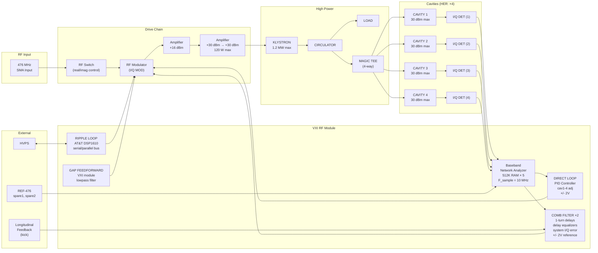

# PEP-II Low Level RF Configuration (HER)

| Field | Value |
|-------|-------|
| **Document Number** | BD-340-329-01-R0 |
| **Title** | PEP-II HER LLRF Configuration — Block Diagram |
| **Author** | P. Corredoura, 1/26/98 |
| **Organization** | Stanford Linear Accelerator Center, U.S. Department of Energy |
| **Date** | January 26, 1998 |
| **Pages** | 1 |
| **Source PDF** | `blockDiagrambd3403290100-1.pdf` |
| **Drawing Standard** | ASME Y14.5M-1994 |

> **Note**: This is the HER counterpart to BD-340-330-01 (LER). Same LLRF architecture but with **4 cavities** per station (vs. 2 for LER). Drawing group 329 (HER) vs. 330 (LER).

---

## ASCII Replica — HER LLRF Signal Processing Chain (4 Cavities)

```
                                                              ┌────────────┐
                                                         ┌───▶│  CAVITY 1  │ 30 dBm max
                                                         │    └─────┬──────┘
                                                         │          │ probe
                                                         │    ┌─────┴──────┐
                                                         │    │I/Q DET (1) │ -10/-6 dBm
                                                         │    └─────┬──────┘
                                                         │          │ cav1 I,Q
                                                         │    ┌────────────┐
                                                         ├───▶│  CAVITY 2  │ 30 dBm max
                                                         │    └─────┬──────┘
                                                         │          │ probe
                                                    MAGIC│    ┌─────┴──────┐
                                                    TEE  │    │I/Q DET (2) │ -10/-6 dBm
                                                    (4-  │    └─────┬──────┘
                                                    way) │          │ cav2 I,Q
                                                         │    ┌────────────┐
                                                         ├───▶│  CAVITY 3  │ 30 dBm max
                                                         │    └─────┬──────┘
                                                         │          │ probe
                                                         │    ┌─────┴──────┐
                                                         │    │I/Q DET (3) │ -10/-6 dBm
                                                         │    └─────┬──────┘
                                                         │          │ cav3 I,Q
                                                         │    ┌────────────┐
                                                         └───▶│  CAVITY 4  │ 30 dBm max
                                                              └─────┬──────┘
                                                                    │ probe
  ┌──────────────────────────────────────────────────┐        ┌─────┴──────┐
  │              RF DRIVE CHAIN                      │        │I/Q DET (4) │ -10/-6 dBm
  │                                                  │        └─────┬──────┘
  │  476 MHz  ┌───────┐ ┌───────┐ ┌────────┐        │              │ cav4 I,Q
  │   SMA ───▶│  RF   │▶│ AMPL  │▶│  AMPL  │─┐      │              │
  │  input    │SWITCH │ │+16dBm │ │+30 dBm │ │      │              │
  │           └───────┘ └───────┘ └────────┘ │      │              │
  │              │        120 W    +30 dBm   │      │              │
  │           to real/    max                │      │              │
  │           imag                           │      │              │
  │           control                        │      │              │
  │                      ┌─────────┐  ┌──────┴────┐ │              │
  │                      │KLYSTRON │  │CIRCULATOR │ │              │
  │             ┌───────▶│1.2 MW   │─▶│  + LOAD   │─┘              │
  │             │        │  max    │  └───────────┘                │
  │    ┌────────┴──────┐ └─────────┘                               │
  │    │ RF MODULATOR  │                        REF-476            │
  │    │  (I/Q MOD)    │                          │                │
  │    │  I_drive      │                    ┌─────┴──────┐         │
  │    │  Q_drive      │                    │ I/Q DET    │         │
  │    └───────▲───────┘                    │ (REF-476)  │         │
  │            │                            │ spare1     │         │
  │     ┌──────┴───────┐                    │ spare2     │         │
  │     │  Σ (summing  │                    └────────────┘         │
  │     │   junction)  │                                           │
  └─────┴──────────────┴───────────────────────────────────────────┘
              ▲  ▲  ▲  ▲
              │  │  │  │
      ┌───────┘  │  │  └──────────┐
      │          │  │             │
┌─────┴─────┐ ┌─┴──┴──┐  ┌──────┴──────┐  ┌──────────────┐
│  DIRECT   │ │ COMB  │  │    GAP      │  │   RIPPLE     │
│  LOOP     │ │FILTER │  │FEEDFORWARD  │  │   LOOP       │
│  (PID)    │ │ (×2)  │  │  (VXI)      │  │ (AT&T        │
│           │ │       │  │             │  │  DSP1610)    │
└─────┬─────┘ └───┬───┘  └──────┬──────┘  └──────┬───────┘
      │           │             │                 │
      ▼           ▼             ▼                 ▼
 ┌─────────────────────────────────────────────────────────────┐
 │                   VXI RF MODULE                              │
 │  ┌──────────────────────────────────────────────────────┐   │
 │  │         Baseband Network Analyzer                    │   │
 │  │                                                      │   │
 │  │  ┌──────┐ ┌────────┐ ┌────────┐ ┌────────┐          │   │
 │  │  │ x DAC│ │512K RAM│ │512K RAM│ │512K RAM│          │   │
 │  │  │      │ │ cav I  │ │ cav Q  │ │ sig I  │          │   │
 │  │  └──────┘ │  ADC   │ │  ADC   │ │  ADC   │          │   │
 │  │           └────────┘ └────────┘ └────────┘          │   │
 │  │  ┌────────┐ ┌────────┐                              │   │
 │  │  │512K RAM│ │512K RAM│  F_sample = 10 MHz           │   │
 │  │  │ sig Q  │ │ PAD    │  (mux for 4 cavities)        │   │
 │  │  │  ADC   │ │ 512K   │                              │   │
 │  │  └────────┘ └────────┘                              │   │
 │  └──────────────────────────────────────────────────────┘   │
 │                                                             │
 │  ┌─────────────────────────────────────────────────────┐    │
 │  │        FEEDBACK LOOP PROCESSING (4-cavity)          │    │
 │  │                                                     │    │
 │  │  DIRECT LOOP (PID controller):                      │    │
 │  │  ┌──────────┐ ┌──────────┐ ┌──────────┐ ┌────────┐ │    │
 │  │  │I/Q MOD   │ │I/Q MOD   │ │I/Q MOD   │ │I/Q MOD │ │    │
 │  │  │cav 1 adj │ │cav 2 adj │ │cav 3 adj │ │cav4 adj│ │    │
 │  │  │ +/- 2V   │ │ +/- 2V   │ │ +/- 2V   │ │+/- 2V  │ │    │
 │  │  └──────────┘ └──────────┘ └──────────┘ └────────┘ │    │
 │  │                                                     │    │
 │  │  COMB FILTER (×2 modules, VXI comb):                │    │
 │  │  ┌──────────┐ ┌─────────────┐ ┌─────────────────┐  │    │
 │  │  │ I/Q MOD  │ │ delay       │ │  I/Q MOD        │  │    │
 │  │  │ sys I/Q  │ │ equalizers  │ │  comb adj       │  │    │
 │  │  │ error    │ │ 1-turn      │ │  lowpass filter │  │    │
 │  │  │+/- 2V   │ │ delays      │ │                 │  │    │
 │  │  │reference │ └─────────────┘ └─────────────────┘  │    │
 │  │  └──────────┘                                      │    │
 │  │                                                     │    │
 │  │  RIPPLE LOOP:        GAP FEEDFORWARD:               │    │
 │  │  ┌──────────────┐   ┌─────────────────────────┐    │    │
 │  │  │ AT&T DSP1610 │   │ VXI module              │    │    │
 │  │  │ serial link  │   │ lowpass filter           │    │    │
 │  │  │ parallel bus │   │ I/Q MOD → gap module     │    │    │
 │  │  └──────────────┘   └─────────────────────────┘    │    │
 │  └─────────────────────────────────────────────────────┘    │
 │                                                             │
 │  EXTERNAL INTERFACES:                                       │
 │  ├── Longitudinal feedback system (kick)                    │
 │  ├── VXI comb modules (×2)                                  │
 │  ├── Klystron feedback (I/Q MOD → I/Q, via 476 module)      │
 │  └── HVPS (to/from ripple loop)                             │
 └─────────────────────────────────────────────────────────────┘
```

---

## Mermaid — HER LLRF Signal Flow (Structural View)



---

## Key Differences: HER (BD-340-329-01) vs. LER (BD-340-330-01)

| Feature | LER (BD-340-330-01) | HER (BD-340-329-01) |
|---------|--------------------|--------------------|
| Cavities per station | **2** | **4** |
| I/Q Detector channels | 2 cavity + ref | 4 cavity + ref |
| Magic Tee | 2-way | 4-way |
| Direct loop adj channels | cav 1, cav 2 | cav 1, cav 2, cav 3, cav 4 |
| Klystron power | 1.2 MW max | 1.2 MW max (same) |
| RF drive chain | identical | identical |
| Comb filter modules | ×2 | ×2 (same) |
| Sample rate | 10 MHz | 10 MHz (same) |
| Baseband signal range | +/- 2V | +/- 2V (same) |
| Drawing number | BD-340-**330**-01 | BD-340-**329**-01 |
| Date | 1/28/98 | 1/26/98 |

---

## Signal Level Budget (Same as LER)

| Point in Chain | Signal Level | Notes |
|----------------|-------------|-------|
| 476 MHz SMA input | — | Reference frequency input |
| Amplifier Stage 1 output | +16 dBm | Pre-driver |
| Amplifier Stage 2 output | +30 dBm | 120 W max |
| Klystron output | 1.2 MW max | High-power RF |
| Cavity probe max | 30 dBm max | Per cavity (×4) |
| I/Q Detector input (cav) | -10 dBm | After coupling/attenuation |
| I/Q Detector input (ref) | -6 dBm | Reference channel |
| Baseband loop signals | +/- 2V max | I and Q baseband |

---

## Title Block

| Field | Value |
|-------|-------|
| Drawing | BD-340-329-01 R0 |
| Title | PEP2 HER LLRF CONFIGURATION — BLOCK DIAGRAM |
| Designed by | Paul Corredoura |
| Drawn by | Paul Corredoura |
| Approved by | Paul Corredoura |
| Date | 2/3/99 |
| Status | Draft |
| Scale | Do Not Scale Drawing |

---

> **Transcription Note**: ASCII and Mermaid diagrams replicated from OCR (Tesseract 5.3.0 at 400 DPI, PSM 3+6+11) of `blockDiagrambd3403290100-1.pdf`. The HER LLRF architecture is structurally identical to the LER (BD-340-330-01) with the key difference being 4 cavity channels instead of 2. All signal levels, module types, and processing architecture are shared. The original PDF should be consulted for precise routing and connection details.

