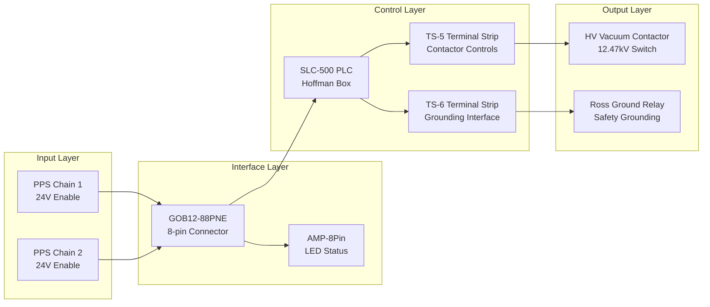

# AI Design Reference - HVPS PPS System
## Consolidated Technical Specifications for AI Design Processes

---

## System Architecture Overview



---

## Critical Component Specifications

### Relays (from gp4397040201.pdf OCR)
```yaml
K4_Relay:
  rating: "25A"
  function: "Contactor Enable"
  terminal: "TB1-1"
  control_source: "PPS 1 via Slot 5 OUT2"
  fail_mode: "Safe (PPS is voltage source)"

RR_Relay:
  rating: "3.2A" 
  function: "Reset TX latch"
  fail_mode: "Safe"

TX_Relay:
  rating: "15A"
  function: "Trip/Fault Latch"
  inputs: ["50A", "50B", "50C", "50N"]
  
MX_Relay:
  rating: "56KM coil"
  function: "Hold circuit control"
  terminal: "TB3-22"
  controls: ["L1_hold_coil", "L2_close_coil"]
```

### Vacuum Contactor (from rossEngr713203.pdf OCR)
```yaml
L1_Coil:
  type: "Hold coil"
  power: "Low power, continuous"
  function: "Maintains contactor closed"
  
L2_Coil:
  type: "Close coil" 
  power: "High power, pulse"
  function: "Initial closing force"
  
Auxiliary_Contacts:
  S1: "NO contact"
  S2: "NC contact"
  S3: "NO contact"
  S4: "NC contact"
  S5: "NO contact - PPS readback"
  
Energy_Storage:
  voltage: "300-400 VDC"
  discharge_time: "5 minutes"
  safety_wire_gauge: "#12 minimum"
```

### PLC I/O Assignments (from HoffmanBoxPPSWiring.docx)
```yaml
Slot_5_AB1746OX8:  # Relay Outputs
  OUT1: 
    terminal: "TS-5-2"
    function: "Contactor On/Off"
    wire_color: "Red"
  OUT2:
    terminal: "TS-5-4" 
    function: "Contactor Enable (K4 Relay)"
    wire_color: "Black"
    criticality: "SAFETY_CRITICAL"

Slot_6_AB1746IB16:  # Digital Inputs
  IN14:
    terminal: "TS-8-1"
    function: "PPS 1 Permit"
    source: "GOB12-88PNE Pin E"
    wire_color: "Green"
  IN15:
    terminal: "TS-8-3"
    function: "PPS 2 Permit" 
    source: "GOB12-88PNE Pin G"
    wire_color: "Blue"
  IN8:
    terminal: "TS-6-8"
    function: "Ground Tank Oil Level"
    wire_color: "Red"
  IN9:
    terminal: "TS-6-10"
    function: "Ground Switch NC"
    wire_color: "Gray"
  IN10:
    terminal: "TS-6-16"
    function: "Crowbar Tank Oil"
    wire_color: "Violet"
  IN11:
    terminal: "TS-6-18"
    function: "SCR Tank Oil"
    wire_color: "Yellow"

Slot_2_AB1746IO8:  # AC Outputs
  OUT3:
    terminal: "TS-6-13"
    function: "Ross Ground Relay Coil"
    wire_color: "Black"
    voltage: "120V AC"
    criticality: "SAFETY_CRITICAL"
    concern: "PLC_DEPENDENT"

Slot_7_AB1746IV16:  # Status Inputs
  IN0:
    terminal: "TS-5-7"
    function: "Blocking"
    wire_color: "Brown"
  IN1:
    terminal: "TS-5-9"
    function: "Overcurrent"
    wire_color: "Red"
  IN2:
    terminal: "TS-5-11"
    function: "Contactor Closed/OK"
    wire_color: "Orange"
  IN3:
    terminal: "TS-5-13"
    function: "Contactor Ready"
    wire_color: "Blue"
```

---

## GOB12-88PNE Connector Specification

```yaml
Connector_Type: "Burndy/Souriau 8-pin circular"
Part_Number: "GOB12-88PNE"

Pin_A:
  wire_color: "Red/Black"
  function: "Contactor readback common"
  destinations:
    - "TS-5-15"
    - "AMP-8Pin J2-2 (PPS1 Green LED Cathode)"

Pin_B:
  wire_color: "Red"
  function: "Contactor readback NC"
  destinations:
    - "TS-5-14"
    - "AMP-8Pin J2-1 (PPS1 Green LED Anode)"

Pin_C:
  wire_color: "Orange"
  function: "Ground relay readback"
  destinations:
    - "TS-6-12"
    - "AMP-8Pin J2-3 (PPS2 Green LED Anode)"

Pin_D:
  wire_color: "Green/Black"
  function: "Ground relay readback common"
  destinations:
    - "TS-6-11"
    - "AMP-8Pin J2-4 (PPS2 Green LED Cathode)"

Pin_E:
  wire_color: "Green"
  function: "PPS 1 Permit (24V source)"
  destinations:
    - "TS-8-1"
    - "Slot 6 IN14"
    - "AMP-8Pin J2-7 (PPS4 Red LED Anode)"

Pin_F:
  wire_color: "Black"
  function: "PPS Common (contactor)"
  destinations:
    - "TS-5-3"
    - "AMP-8Pin J2-8 (PPS4 Red LED Cathode)"

Pin_G:
  wire_color: "Blue"
  function: "PPS 2 Permit (24V source)"
  destinations:
    - "TS-8-3"
    - "Slot 6 IN15"
    - "AMP-8Pin J2-5 (PPS3 Red LED Anode)"
    - "PPS LED1 Anode (Local Panel)"

Pin_H:
  wire_color: "White"
  function: "PPS Common (permits)"
  destinations:
    - "TS-8-6"
    - "TS-5-1,8 (System common)"
    - "TS-2-2,4,6, TS-6-2 (Control power common)"
    - "AMP-8Pin J2-6 (PPS3 Red LED Cathode)"
    - "Key switch 1A (Local Emergency Off)"
```

---

## Safety Chain Analysis

### Chain 1: Contactor Control (FAIL-SAFE)
```yaml
Normal_Operation:
  - PPS_Interface: "Sources 24V on Pin E"
  - GOB12_88PNE: "Pin E → TS-8-1"
  - PLC_Input: "Slot 6 IN14 receives 24V"
  - PLC_Output: "Slot 5 OUT2 relay contacts close"
  - K4_Relay: "Energized (25A)"
  - MX_Relay: "Energized (56KM)"
  - Contactor_Coils: "L1 hold + L2 close"
  - HV_Switch: "12.47kV contacts closed"

Emergency_Operation:
  - PPS_Interface: "Removes 24V from Pin E"
  - PLC_Input: "Slot 6 IN14 no signal"
  - PLC_Output: "Slot 5 OUT2 relay contacts open"
  - K4_Relay: "De-energized (FAIL SAFE)"
  - MX_Relay: "De-energized"
  - Contactor_Coils: "L1/L2 lose power"
  - HV_Switch: "Opens within 1 cycle"

Fail_Safe_Analysis: "SAFE - PPS is voltage source for relay contacts"
```

### Chain 2: Ross Grounding (PLC DEPENDENT)
```yaml
Normal_Operation:
  - PPS_Interface: "Sources 24V on Pin G"
  - PLC_Logic: "PPS1 AND PPS2 required"
  - PLC_Output: "Slot 2 OUT3 sources 120V AC"
  - Ross_Relay: "Energized, switch OPEN"
  - HVPS_Output: "Not grounded (normal)"

Emergency_Operation:
  - PPS_Interface: "Removes 24V from Pin G"
  - PLC_Logic: "PPS1 OR PPS2 missing"
  - PLC_Output: "Slot 2 OUT3 removes 120V AC"
  - Ross_Relay: "De-energized, switch CLOSED"
  - HVPS_Output: "Grounded (safe)"

Safety_Concern: "PLC failure could prevent grounding"
Recommendation: "Add hardware bypass relays"
```

---

## Power Supply Specifications

```yaml
Kepko_Supplies:
  Model_12V: "Kepko-12@V/1A"
  Model_5V: "Kepko-5V/2@A"  
  Model_240V: "Kepko-240V/@2.25A"

SOLA_Supply:
  Model: "SOLA PS-6"
  Outputs:
    P1_1: "+15V DC"
    P1_2: "Common"
    P1_3: "-15V DC"

Control_Voltage: "24V DC"
AC_Control: "120V AC"
HV_System: "12.47kV"
```

---

## Terminal Block Mappings

### TS-5 (Contactor Controls)
```yaml
TS5_1: {color: "Green", function: "System Common"}
TS5_2: {color: "Red", function: "Contactor On/Off", plc: "Slot 5 OUT1"}
TS5_3: {color: "Black", function: "PPS Common", connector: "Pin F"}
TS5_4: {color: "Black", function: "Contactor Enable", plc: "Slot 5 OUT2"}
TS5_7: {color: "Brown", function: "Blocking", plc: "Slot 7 IN0"}
TS5_9: {color: "Red", function: "Overcurrent", plc: "Slot 7 IN1"}
TS5_11: {color: "Orange", function: "Contactor OK", plc: "Slot 7 IN2"}
TS5_13: {color: "Blue", function: "Ready", plc: "Slot 7 IN3"}
TS5_14: {color: "Red", function: "PPS Readback", connector: "Pin B"}
TS5_15: {color: "Red/Black", function: "PPS Common", connector: "Pin A"}
```

### TS-6 (Grounding Interface)
```yaml
TS6_8: {color: "Red", function: "Ground Tank Oil", plc: "Slot 6 IN8"}
TS6_10: {color: "Gray", function: "Ground Switch NC", plc: "Slot 6 IN9"}
TS6_11: {color: "Green/Black", function: "Ground Relay Common", connector: "Pin D"}
TS6_12: {color: "Orange", function: "Ground Relay NC", connector: "Pin C"}
TS6_13: {color: "Black", function: "Ground Relay Coil", plc: "Slot 2 OUT3"}
TS6_14: {color: "White", function: "Ground Relay Coil", plc: "Slot 2 Common"}
TS6_16: {color: "Violet", function: "Crowbar Oil", plc: "Slot 6 IN10"}
TS6_18: {color: "Yellow", function: "SCR Oil", plc: "Slot 6 IN11"}
TS6_20: {color: "BNC signal", function: "Shunt +", destination: "BNC-12"}
TS6_21: {color: "BNC shield", function: "Shunt Common", destination: "BNC-12"}
```

---

## Design Constraints for AI Systems

### Safety Requirements
1. **PPS Chain 1 must remain fail-safe** (voltage source dependency)
2. **PPS Chain 2 requires hardware bypass** (eliminate PLC dependency)
3. **Energy storage discharge** (5-minute safety concern)
4. **Wire gauge minimums** (#12 for HV circuits)

### Interface Requirements
1. **GOB12-88PNE connector compatibility** (8-pin circular)
2. **SLC-500 PLC I/O assignments** (maintain existing slots)
3. **Terminal strip compatibility** (TS-5, TS-6 layouts)
4. **LED status indication** (AMP-8Pin connector)

### Monitoring Requirements
1. **Oil level sensors** (3 tanks: Ground, Crowbar, SCR)
2. **Current monitoring** (15A/50mV shunt)
3. **Auxiliary contact feedback** (S5, Ross aux)
4. **PLC status monitoring** (all I/O points)

This reference provides all necessary specifications for AI-driven design processes including exact wire colors, terminal assignments, PLC I/O mappings, and safety constraints.

