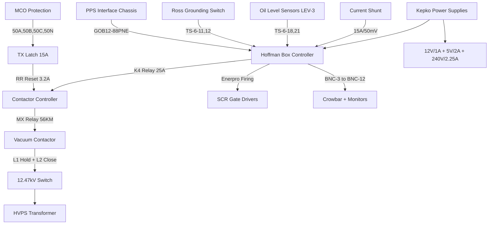

# HVPS System Circuit Diagrams
## Based on OCR Analysis of PDF Schematics

---

## 1. Vacuum Contactor Controller Circuit (gp4397040201.pdf)

### ASCII Circuit Diagram - Relay Logic

```
                    120V AC Control Power
                           |
                           |
    ┌─────────────────────────────────────────────────────────┐
    │                CONTACTOR CONTROLLER                     │
    │                                                         │
    │  ┌─────┐    ┌─────┐    ┌─────┐    ┌─────┐              │
    │  │ 50A │    │ 50B │    │ 50C │    │ 50N │              │
    │  │ MCO │    │ MCO │    │ MCO │    │ MCO │              │
    │  │Relay│    │Relay│    │Relay│    │Relay│              │
    │  └──┬──┘    └──┬──┘    └──┬──┘    └──┬──┘              │
    │     │          │          │          │                 │
    │     └──────────┼──────────┼──────────┘                 │
    │                │          │                            │
    │           ┌────┴────┐     │                            │
    │           │   TX    │     │                            │
    │           │  15A    │     │                            │
    │           │ Latch   │     │                            │
    │           └────┬────┘     │                            │
    │                │          │                            │
    │           ┌────┴────┐     │                            │
    │           │   RR    │     │                            │
    │           │  3.2A   │     │                            │
    │           │ Reset   │     │                            │
    │           └────┬────┘     │                            │
    │                │          │                            │
    │           ┌────┴────┐     │                            │
    │           │   K4    │     │                            │
    │           │  25A    │     │                            │
    │           │ Enable  │     │                            │
    │           └────┬────┘     │                            │
    │                │          │                            │
    │                │     ┌────┴────┐                       │
    │                │     │   MX    │                       │
    │                │     │ 56KM    │                       │
    │                │     │ Hold    │                       │
    │                │     └────┬────┘                       │
    │                │          │                            │
    └────────────────┼──────────┼────────────────────────────┘
                     │          │
                     │          │
    ┌────────────────┼──────────┼────────────────────────────┐
    │           VACUUM CONTACTOR                             │
    │                │          │                            │
    │           ┌────┴────┐┌────┴────┐                       │
    │           │   L2    ││   L1    │                       │
    │           │ Close   ││ Hold    │                       │
    │           │ Coil    ││ Coil    │                       │
    │           └─────────┘└─────────┘                       │
    │                                                        │
    │           Auxiliary Contacts: S1, S2, S3, S4, S5      │
    │                                                        │
    └────────────────────────────────────────────────────────┘
                           │
                           │
                    12.47 kV to HVPS
```

### Terminal Block Connections

```
TB1 (Controller Input Terminals):
TB1-1  ── K4 Hot (25A relay input)
TB1-7  ── Control voltage connections
TB1-15 ── Door interlocks
TB1-19 ── Local reset connections  
TB1-20 ── Energy relay connections

TB2 (Contactor Interface):
TB2-3  ── PPS interface
TB2-9  ── Contactor auxiliary S2 contact
TB2-10 ── Contactor auxiliary S3B contact  
TB2-11 ── Contactor auxiliary contacts
TB2-12 ── Local control interface
TB2-13 ── Vacuum contactor switch
TB2-14 ── Contactor status

TB3 (Energy/Control Relays):
TB3-5  ── K3 energy relay (25W)
TB3-6  ── K3 energy relay connections
TB3-9  ── TX relay connections
TB3-10 ── Energy relay status
TB3-11 ── Vacuum contactor connections
TB3-21 ── K2 time delay relay
TB3-22 ── MX hold relay (56KM)
```

---

## 2. Ross Engineering Vacuum Contactor (rossEngr713203.pdf, 1978)

### ASCII Circuit Diagram - L1/L2 Coil Configuration

```
                    Allen-Bradley Vacuum Contactor
    ┌─────────────────────────────────────────────────────────┐
    │                                                         │
    │  ⚠️  HV ENERGY STORAGE: 300-400 VDC                    │
    │      DISCHARGE TIME: ~5 MINUTES                         │
    │      MIN WIRE GAUGE: #12                                │
    │                                                         │
    │           ┌─────────────────────────────┐               │
    │           │     CONTACTOR MECHANISM     │               │
    │           │                             │               │
    │  L2 ──────┤  CLOSE COIL (High Power)   │               │
    │  (Close)  │  - Initial closing force   │               │
    │           │  - High current, short time│               │
    │           │                             │               │
    │  L1 ──────┤  HOLD COIL (Low Power)     │               │
    │  (Hold)   │  - Maintains closed state  │               │
    │           │  - Low current, continuous │               │
    │           │                             │               │
    │           └─────────────────────────────┘               │
    │                                                         │
    │  Auxiliary Contacts (Status Feedback):                 │
    │  ┌─────┐ ┌─────┐ ┌─────┐ ┌─────┐ ┌─────┐               │
    │  │ S1  │ │ S2  │ │ S3  │ │ S4  │ │ S5  │               │
    │  │ NO  │ │ NC  │ │ NO  │ │ NC  │ │ NO  │               │
    │  └─────┘ └─────┘ └─────┘ └─────┘ └─────┘               │
    │                                                         │
    └─────────────────────────────────────────────────────────┘
```

---

## 3. PPS Interface Connector (GOB12-88PNE)

### ASCII Connector Pinout

```
    GOB12-88PNE Connector (8-pin circular)
    
         A ●     ● B
           ╲   ╱
        H ●  ╲ ╱  ● C
             ╳
        G ●  ╱ ╲  ● D
           ╱   ╲
         F ●     ● E

Pin Assignments:
A (Red/Black) ── Contactor readback common (TS-5-15, S5 common)
B (Red)       ── Contactor readback NC (TS-5-14, S5 NC + PPS1 Green LED)
C (Orange)    ── Ground relay readback (TS-6-12, Ross switch aux NC)
D (Green/Blk) ── Ground relay readback common (TS-6-11, Ross aux common)
E (Green)     ── PPS 1 Permit (TS-8-1 → Slot 6 IN14 + PPS4 Red LED)
F (Black)     ── PPS Common contactor (TS-5-3)
G (Blue)      ── PPS 2 Permit (TS-8-3 → Slot 6 IN15 + PPS3 Red LED)
H (White)     ── PPS Common permits (TS-8-6 + System common)
```

---

## 4. Hoffman Box Power Supplies (wd7307900206.pdf)

### ASCII Power Distribution

```
                    Hoffman Box Internal Power
    ┌─────────────────────────────────────────────────────────┐
    │                                                         │
    │  ┌─────────────────┐  ┌─────────────────┐              │
    │  │  Kepko-12@V/1A  │  │  Kepko-5V/2@A   │              │
    │  │   12V DC, 1A    │  │   5V DC, 2A     │              │
    │  └─────────────────┘  └─────────────────┘              │
    │                                                         │
    │  ┌─────────────────┐                                    │
    │  │ Kepko-240V/     │                                    │
    │  │    @2.25A       │                                    │
    │  │  240V, 2.25A    │                                    │
    │  └─────────────────┘                                    │
    │                                                         │
    │  ┌─────────────────┐                                    │
    │  │ Enerpro Firing  │ ── SCR Gate Drivers               │
    │  │     Board       │                                    │
    │  └─────────────────┘                                    │
    │                                                         │
    │  BNC Connections:                                       │
    │  BNC-3  ── Crowbar trigger                             │
    │  BNC-4  ── Monitor signal                              │
    │  BNC-5  ── Monitor signal                              │
    │  BNC-6  ── Monitor signal                              │
    │  BNC-7  ── Monitor signal                              │
    │  BNC-8  ── A-Phase connection                          │
    │  BNC-9  ── B-Phase connection                          │
    │  BNC-10 ── C-Phase connection                          │
    │  BNC-11 ── Monitor signal                              │
    │  BNC-12 ── Monitor signal                              │
    │                                                         │
    │  AMP-8PIN ── PPS Status LEDs                           │
    │                                                         │
    └─────────────────────────────────────────────────────────┘
```

---

## 5. TS-5 to TB2 Interconnection (wd7307940600.pdf)

### ASCII Wiring Diagram

```
    TS-6 Terminal Strip Connections
    ┌─────────────────────────────────────────────────────────┐
    │                                                         │
    │  TS-6-11 ── Ross switch aux common                      │
    │  TS-6-12 ── Ross switch aux NC contact                  │
    │  TS-6-18 ── SCR oil level monitoring                    │
    │  TS-6-21 ── LEV-3 oil level sensor                      │
    │                                                         │
    │  External Equipment:                                    │
    │  ┌─────────────────┐                                    │
    │  │     LEV-3       │ ── Oil level sensors               │
    │  │  Oil Sensors    │                                    │
    │  └─────────────────┘                                    │
    │                                                         │
    │  ┌─────────────────┐                                    │
    │  │ Manual Ground   │ ── Safety grounding switch        │
    │  │    Switch       │                                    │
    │  └─────────────────┘                                    │
    │                                                         │
    │  ┌─────────────────┐                                    │
    │  │ Current Shunt   │ ── 15A/50mV measurement           │
    │  │  Connections    │                                    │
    │  └─────────────────┘                                    │
    │                                                         │
    │  Cable: BELDEN 93709 (#16, #18 wire)                   │
    │                                                         │
    └─────────────────────────────────────────────────────────┘
```

---

## 6. System Integration Overview

### Mermaid Flow Diagram



---

## Key Findings from Schematic Analysis:

1. **K4 Relay**: 25A rating, controls contactor enable (TB1-1)
2. **RR Relay**: 3.2A rating, resets TX latch 
3. **TX Relay**: 15A rating, summarizes MCO faults
4. **MX Relay**: 56KM coil, controls L1 hold circuit (TB3-22)
5. **MCO Protection**: Four relays (50A, 50B, 50C, 50N) for 3-phase + neutral
6. **L1/L2 Coils**: L1=hold (low power), L2=close (high power) - CONFIRMED
7. **HV Energy Storage**: 300-400 VDC, 5-minute discharge time
8. **Safety Requirements**: #12 wire minimum, considerable distances
9. **Auxiliary Contacts**: S1-S5 provide status feedback
10. **Power Supplies**: Specific Kepko models identified with ratings

