# HVPS PPS Wiring Diagrams from DOCX Analysis
## Based on HoffmanBoxPPSWiring.docx by Jim Sebek

---

## Complete PPS Interface Wiring Diagram

### GOB12-88PNE Connector Detailed Pinout (Table 0 from DOCX)

```
    GOB12-88PNE Connector (Burndy/Souriau 8-pin circular)
    
         A ●     ● B
           ╲   ╱
        H ●  ╲ ╱  ● C
             ╳
        G ●  ╱ ╲  ● D
           ╱   ╲
         F ●     ● E

Pin A (Red/Black):
├── Contactor readback common → TS-5-15 (PPS)
└── PPS1 Green LED Cathode → AMP-8Pin J2-2

Pin B (Red):
├── Contactor readback NC → TS-5-14
└── PPS1 Green LED Anode → AMP-8Pin J2-1

Pin C (Orange):
├── Ground Relay readback → TS-6-12
└── PPS2 Green LED Anode → AMP-8Pin J2-3

Pin D (Green/Black):
├── Ground Relay readback common → TS-6-11
└── PPS2 Green LED Cathode → AMP-8Pin J2-4

Pin E (Green):
├── PPS 1 Permit → TS-8-1 → Slot 6 AB-1746-IB16 IN14
└── PPS4 Red LED Anode → AMP-8Pin J2-7

Pin F (Black):
├── PPS Common (contactor) → TS-5-3
└── PPS4 Red LED Cathode → AMP-8Pin J2-8

Pin G (Blue):
├── PPS 2 Permit → TS-8-3 → Slot 6 AB-1746-IB16 IN15
├── PPS3 Red LED Anode → AMP-8Pin J2-5
└── PPS LED in Local Panel → PPS LED1 Anode

Pin H (White):
├── PPS Common (permits) → TS-8-6
├── Contactor controls common → TS-5-1,8
├── Control power supply common → TS-2-2,4,6, TS-6-2, etc.
├── PPS3 Red LED Cathode → AMP-8Pin J2-6
└── Local Panel Emergency Off → Key switch 1A
```

---

## TS-5 Contactor Controls Terminal Strip (Hoffman Box)

### ASCII Wiring Diagram - TS-5 (Table 1 from DOCX)

```
    TS-5 Terminal Strip - Contactor Controls (Hoffman Box)
    ┌─────────────────────────────────────────────────────────────────┐
    │                                                                 │
    │  TS-5-1  (Green)     ── System Common                           │
    │  │                      (AMP-8PIN, PPS, Local Panel, etc.)     │
    │  │                                                              │
    │  TS-5-2  (Red)       ── Contactor On/Off                       │
    │  │                      → Slot 5 AB-1746-OX8-3 OUT1            │
    │  │                                                              │
    │  TS-5-3  (Black)     ── PPS Common                              │
    │  │                      → PPS GOB12-88PNE Pin F                 │
    │  │                                                              │
    │  TS-5-4  (Black)     ── Contactor Enable                       │
    │  │                      → Slot 5 AB-1746-OX8-5 OUT2            │
    │  │                                                              │
    │  TS-5-5  (N/C)       ── Reset (Not Connected)                  │
    │  TS-5-6  (N/C)       ── ?? (Not Connected)                     │
    │  │                                                              │
    │  TS-5-7  (Brown)     ── Blocking                                │
    │  │                      → Slot 7 AB-1746-IV16-0 IN0            │
    │  │                                                              │
    │  TS-5-8  (Green)     ── System Common (tied to TS-5-1)         │
    │  │                                                              │
    │  TS-5-9  (Red)       ── Overcurrent                             │
    │  │                      → Slot 7 AB-1746-IV16-1 IN1            │
    │  │                                                              │
    │  TS-5-10 (??)        ── Contactor Open                          │
    │  │                      → TS-8-8 Local Panel LED Off cathode   │
    │  │                                                              │
    │  TS-5-11 (Orange)    ── Contactor Closed/OK                     │
    │  │                      → Slot 7 AB-1746-IV16-2 IN2            │
    │  │                      → TS-8-7 Local Panel LED On cathode    │
    │  │                                                              │
    │  TS-5-12 (N/C)       ── ?? (Not Connected)                     │
    │  │                                                              │
    │  TS-5-13 (Blue)      ── Contactor Ready                         │
    │  │                      → Slot 7 AB-1746-IV16-3 IN3            │
    │  │                                                              │
    │  TS-5-14 (Red)       ── PPS Readback                            │
    │  │                      → PPS GOB12-88PNE Pin B                 │
    │  │                      → AMP-8Pin-1 PPS1 Green LED anode      │
    │  │                                                              │
    │  TS-5-15 (Red/Black) ── PPS Readback Common                     │
    │  │                      → PPS GOB12-88PNE Pin A                 │
    │  │                                                              │
    └─────────────────────────────────────────────────────────────────┘
```

---

## TS-6 Grounding Tank Interface Terminal Strip

### ASCII Wiring Diagram - TS-6 (Tables 3 & 4 from DOCX)

```
    TS-6 Terminal Strip - Grounding Tank Interface
    ┌─────────────────────────────────────────────────────────────────┐
    │                                                                 │
    │  TS-6-1  (Red/White)  ── DC Current                             │
    │  │                       → Slot-9 AB-1746-NI4-9 In3+           │
    │  │                       → Voltage Monitor TS-3-10             │
    │  │                                                              │
    │  TS-6-2  (Black/Green)── DC Common                              │
    │  │                       → Slot-9 AB-1746-NI4-10 In3-          │
    │  │                       → SOLA PS-6 P1-2 Common               │
    │  │                       → Control Power Supply TS-2-2         │
    │  │                                                              │
    │  TS-6-3  (Green/Blue) ── -12V (-15V?)                          │
    │  │                       → Voltage Monitor TS-3-8              │
    │  │                       → SOLA PS-6 P1-3 -V DC                │
    │  │                                                              │
    │  TS-6-4  (Red)        ── +12V (+15V?)                          │
    │  │                       → Voltage Monitor TS-3-9              │
    │  │                       → SOLA PS-6 P1-1 +V DC                │
    │  │                                                              │
    │  TS-6-5  (Red)        ── Status +                               │
    │  │                       → Control Power Supply TS-2-5         │
    │  │                                                              │
    │  TS-6-6  (N/C)        ── Status - Transductor                  │
    │  TS-6-7  (Red)        ── +12V (tied to 5,9,15,17)             │
    │  │                                                              │
    │  TS-6-8  (Red)        ── Ground Tank Oil                        │
    │  │                       → Slot-6 AB-1746-IB16 IN8-8           │
    │  │                                                              │
    │  TS-6-9  (Red)        ── +12V (tied to 5,7,15,17)             │
    │  │                                                              │
    │  TS-6-10 (Gray)       ── Ground Switch NC                       │
    │  │                       → Slot-6 AB-1746-IB16 IN9-9           │
    │  │                                                              │
    │  TS-6-11 (Green/Black)── Ground Relay NC Common                 │
    │  │                       → PPS GOB12-88PNE Pin D                │
    │  │                       → AMP-8Pin-3                          │
    │  │                       → Ross Ground Relay Aux Common (P5-J) │
    │  │                                                              │
    │  TS-6-12 (Orange)     ── Ground Relay NC Contact               │
    │  │                       → PPS GOB12-88PNE Pin C                │
    │  │                       → Ross Ground Relay Aux NC (P5-H)     │
    │  │                                                              │
    │  TS-6-13 (Black)      ── Ground Relay Coil                      │
    │  │                       → Slot-2 AB-1746-IO8 OUT3-5           │
    │  │                       → Ross Ground Relay Coil (P5-F)       │
    │  │                                                              │
    │  TS-6-14 (White)      ── Ground Relay Coil                      │
    │  │                       → Slot-2 AB-1746-IO8 AC Common-10     │
    │  │                       → Ross Ground Relay Coil (P5-E)       │
    │  │                                                              │
    │  TS-6-15 (Red)        ── +12V (tied to 5,7,9,17)              │
    │  TS-6-16 (Violet)     ── Crowbar Tank Oil                       │
    │  │                       → Slot-6 AB-1746-IB16 IN10-10         │
    │  │                                                              │
    │  TS-6-17 (Red)        ── +12V (tied to 5,7,9,15)              │
    │  │                                                              │
    │  TS-6-18 (Yellow)     ── SCR Tank Oil                           │
    │  │                       → Slot-6 AB-1746-IB16 IN11-11         │
    │  │                                                              │
    │  TS-6-19 (Black)      ── Ground Relay NO                        │
    │  │                       → Transformer Interlocks TS-4-3       │
    │  │                       → Slot-7 AB-1746-IV16 IN13-13         │
    │  │                       → Ross Ground Relay Aux NO (P5-I)     │
    │  │                                                              │
    │  TS-6-20 (BNC signal) ── Shunt + (15A/50mV)                    │
    │  │                       → BNC-12 signal                       │
    │  │                       → 15A/50mV Shunt + (P5-A)             │
    │  │                                                              │
    │  TS-6-21 (BNC shield) ── Shunt Common                           │
    │  │                       → BNC-12 shield                       │
    │  │                       → 15A/50mV Shunt Common (P5-B)        │
    │  │                                                              │
    └─────────────────────────────────────────────────────────────────┘
```

---

## Complete System Integration Mermaid Diagram

```mermaid
graph TB
    subgraph "PPS Interface Chassis (External)"
        PPS1_SRC[PPS Chain 1<br/>24V Source]
        PPS2_SRC[PPS Chain 2<br/>24V Source]
        PPS_READBACK[PPS Readback<br/>Monitoring]
    end
    
    subgraph "GOB12-88PNE Connector"
        PINE[Pin E - Green<br/>PPS 1 Permit]
        PING[Pin G - Blue<br/>PPS 2 Permit]
        PINH[Pin H - White<br/>Common]
        PINF[Pin F - Black<br/>PPS Common]
        PINA[Pin A - Red/Black<br/>Readback Common]
        PINB[Pin B - Red<br/>Readback NC]
        PINC[Pin C - Orange<br/>Ground Readback]
        PIND[Pin D - Green/Black<br/>Ground Common]
    end
    
    subgraph "Hoffman Box SLC-500 PLC"
        SLOT5_OUT1[Slot 5 AB-1746-OX8<br/>OUT1 - Contactor On/Off]
        SLOT5_OUT2[Slot 5 AB-1746-OX8<br/>OUT2 - Contactor Enable]
        SLOT6_IN14[Slot 6 AB-1746-IB16<br/>IN14 - PPS 1]
        SLOT6_IN15[Slot 6 AB-1746-IB16<br/>IN15 - PPS 2]
        SLOT2_OUT3[Slot 2 AB-1746-IO8<br/>OUT3 - Ross Coil]
        SLOT7_IN0[Slot 7 AB-1746-IV16<br/>IN0 - Blocking]
        SLOT7_IN1[Slot 7 AB-1746-IV16<br/>IN1 - Overcurrent]
        SLOT7_IN2[Slot 7 AB-1746-IV16<br/>IN2 - Contactor OK]
        SLOT7_IN3[Slot 7 AB-1746-IV16<br/>IN3 - Ready]
        SLOT6_IN8[Slot 6 AB-1746-IB16<br/>IN8 - Ground Tank Oil]
        SLOT6_IN9[Slot 6 AB-1746-IB16<br/>IN9 - Ground Switch]
        SLOT6_IN10[Slot 6 AB-1746-IB16<br/>IN10 - Crowbar Oil]
        SLOT6_IN11[Slot 6 AB-1746-IB16<br/>IN11 - SCR Oil]
    end
    
    subgraph "Terminal Strips"
        TS5_1[TS-5-1 System Common]
        TS5_2[TS-5-2 Contactor On/Off]
        TS5_3[TS-5-3 PPS Common]
        TS5_4[TS-5-4 Contactor Enable]
        TS5_7[TS-5-7 Blocking]
        TS5_9[TS-5-9 Overcurrent]
        TS5_11[TS-5-11 Contactor OK]
        TS5_13[TS-5-13 Ready]
        TS5_14[TS-5-14 PPS Readback]
        TS5_15[TS-5-15 PPS Common]
        
        TS6_8[TS-6-8 Ground Tank Oil]
        TS6_10[TS-6-10 Ground Switch]
        TS6_11[TS-6-11 Ground Relay Common]
        TS6_12[TS-6-12 Ground Relay NC]
        TS6_13[TS-6-13 Ground Relay Coil]
        TS6_14[TS-6-14 Ground Relay Coil]
        TS6_16[TS-6-16 Crowbar Oil]
        TS6_18[TS-6-18 SCR Oil]
        TS6_20[TS-6-20 Shunt +]
        TS6_21[TS-6-21 Shunt Common]
    end
    
    subgraph "External Equipment"
        CONTACTOR[HV Vacuum Contactor<br/>S5 Aux Contacts]
        ROSS_RELAY[Ross Ground Relay<br/>Aux Contacts]
        GROUND_TANK[Ground Tank<br/>Oil Level LEV-3]
        CROWBAR_TANK[Crowbar Tank<br/>Oil Level]
        SCR_TANK[SCR Tank<br/>Oil Level]
        CURRENT_SHUNT[15A/50mV<br/>Current Shunt]
        MANUAL_SWITCH[Manual Ground<br/>Switch]
    end
    
    subgraph "Status LEDs"
        AMP8PIN[AMP-8Pin Connector]
        PPS1_GREEN[PPS1 Green LED]
        PPS2_GREEN[PPS2 Green LED]
        PPS3_RED[PPS3 Red LED]
        PPS4_RED[PPS4 Red LED]
    end
    
    %% PPS Chain 1 - Contactor Control
    PPS1_SRC --> PINE
    PINE --> TS5_4
    TS5_4 --> SLOT5_OUT2
    SLOT5_OUT2 --> CONTACTOR
    
    %% PPS Chain 2 - Ross Grounding
    PPS2_SRC --> PING
    PING --> SLOT6_IN15
    SLOT6_IN15 --> SLOT2_OUT3
    SLOT2_OUT3 --> TS6_13
    TS6_13 --> ROSS_RELAY
    
    %% Readback Chains
    CONTACTOR --> TS5_14
    CONTACTOR --> TS5_15
    TS5_14 --> PINB
    TS5_15 --> PINA
    PINB --> PPS_READBACK
    PINA --> PPS_READBACK
    
    ROSS_RELAY --> TS6_11
    ROSS_RELAY --> TS6_12
    TS6_11 --> PIND
    TS6_12 --> PINC
    PINC --> PPS_READBACK
    PIND --> PPS_READBACK
    
    %% Status Monitoring
    TS5_7 --> SLOT7_IN0
    TS5_9 --> SLOT7_IN1
    TS5_11 --> SLOT7_IN2
    TS5_13 --> SLOT7_IN3
    
    %% Oil Level Monitoring
    GROUND_TANK --> TS6_8
    TS6_8 --> SLOT6_IN8
    CROWBAR_TANK --> TS6_16
    TS6_16 --> SLOT6_IN10
    SCR_TANK --> TS6_18
    TS6_18 --> SLOT6_IN11
    
    %% Current Monitoring
    CURRENT_SHUNT --> TS6_20
    CURRENT_SHUNT --> TS6_21
    
    %% LED Status
    PINB --> PPS1_GREEN
    PINC --> PPS2_GREEN
    PING --> PPS3_RED
    PINE --> PPS4_RED
    
    style PPS1_SRC fill:#ff9999
    style PPS2_SRC fill:#ff9999
    style SLOT5_OUT2 fill:#ffcc99
    style SLOT2_OUT3 fill:#99ff99
    style CONTACTOR fill:#9999ff
    style ROSS_RELAY fill:#99ff99
```



---

## Key Findings from DOCX Analysis:

### 1. **Confirmed PLC I/O Assignments**:
- **Slot 5 AB-1746-OX8**: Relay outputs for contactor control
  - OUT1: Contactor On/Off (TS-5-2)
  - OUT2: Contactor Enable (TS-5-4) ← **Critical PPS control**
- **Slot 6 AB-1746-IB16**: Digital inputs
  - IN14: PPS 1 Permit (TS-8-1)
  - IN15: PPS 2 Permit (TS-8-3)
  - IN8-11: Oil level monitoring
- **Slot 2 AB-1746-IO8**: AC outputs
  - OUT3: Ross Ground Relay Coil (TS-6-13) ← **Safety concern**

### 2. **Verified Wire Color Coding**:
- **Green wires**: System common, +12V power
- **Red wires**: Control signals, +12V power
- **Black wires**: PPS common, relay coils
- **Orange wires**: Ground relay signals
- **Blue wires**: PPS 2 permits, ready signals

### 3. **Safety Analysis Confirmation**:
- **K4 Relay Control**: Confirmed via Slot 5 OUT2 (fails safe - PPS is voltage source)
- **Ross Switch Control**: Confirmed via Slot 2 OUT3 (PLC dependent - safety concern)
- **Readback Monitoring**: S5 aux contacts (contactor) + Ross aux contacts (grounding)

### 4. **Oil Level Monitoring System**:
- **Ground Tank**: TS-6-8 → Slot 6 IN8
- **Crowbar Tank**: TS-6-16 → Slot 6 IN10  
- **SCR Tank**: TS-6-18 → Slot 6 IN11
- **LEV-3 sensors**: External oil level monitoring

### 5. **Current Monitoring**:
- **15A/50mV Shunt**: TS-6-20/21 → BNC-12 → External monitoring

This detailed wiring analysis provides the exact terminal assignments and wire colors needed for AI-driven design processes and system integration.

