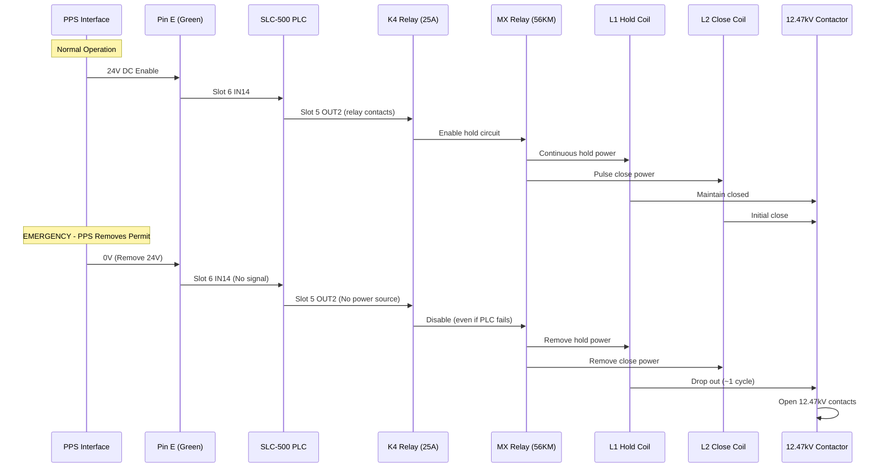
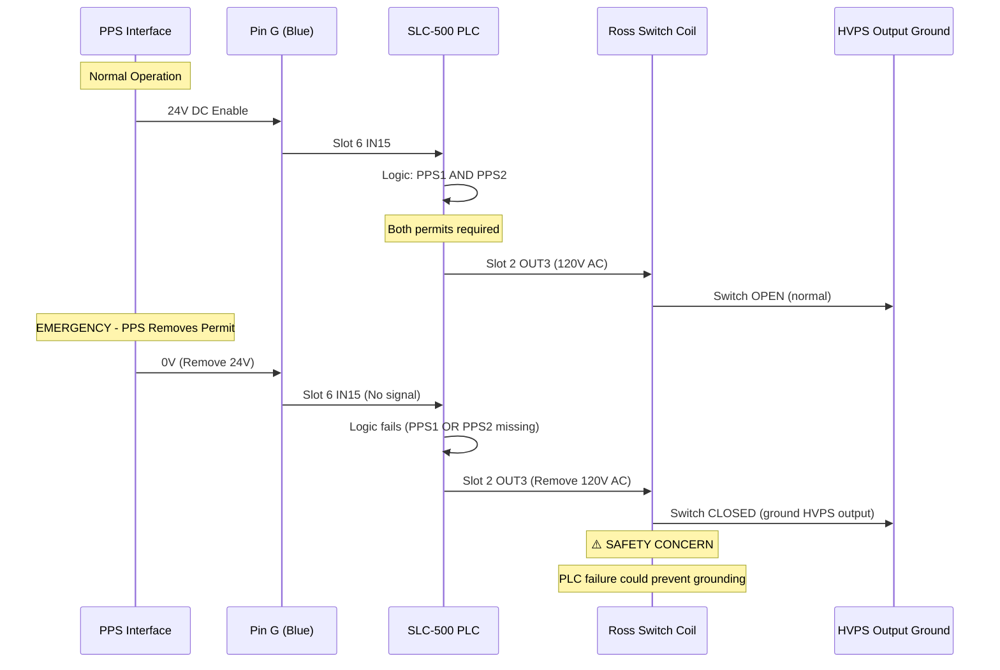

# PPS Safety Chains - Detailed Analysis
## Based on Schematic OCR Extraction

---

## Complete PPS Interface Flow

```mermaid
graph TB
    subgraph "PPS Interface Chassis (External)"
        PPS1[PPS Chain 1<br/>24V Enable]
        PPS2[PPS Chain 2<br/>24V Enable]
        READBACK1[Contactor Status<br/>Readback]
        READBACK2[Ross Switch Status<br/>Readback]
    end
    
    subgraph "GOB12-88PNE Connector"
        PINE[Pin E - Green<br/>PPS 1 Permit]
        PING[Pin G - Blue<br/>PPS 2 Permit]
        PINH[Pin H - White<br/>PPS Common]
        PINF[Pin F - Black<br/>Contactor Common]
        PINA[Pin A - Red/Black<br/>Contactor Readback Common]
        PINB[Pin B - Red<br/>Contactor Readback NC]
        PINC[Pin C - Orange<br/>Ground Relay Readback]
        PIND[Pin D - Green/Black<br/>Ground Relay Common]
    end
    
    subgraph "Hoffman Box (SLC-500 PLC)"
        SLOT6IN14[Slot 6 IN14<br/>PPS 1 Input]
        SLOT6IN15[Slot 6 IN15<br/>PPS 2 Input]
        SLOT5OUT2[Slot 5 OUT2<br/>K4 Relay Control]
        SLOT2OUT3[Slot 2 OUT3<br/>Ross Switch Control]
        TS5[Terminal Strip TS-5]
        TS6[Terminal Strip TS-6]
        TS8[Terminal Strip TS-8]
    end
    
    subgraph "Contactor Controller"
        K4[K4 Relay<br/>25A Enable]
        MX[MX Relay<br/>56KM Hold]
        TX[TX Relay<br/>15A Latch]
        RR[RR Relay<br/>3.2A Reset]
        MCO1[50A MCO]
        MCO2[50B MCO]
        MCO3[50C MCO]
        MCO4[50N MCO]
    end
    
    subgraph "Vacuum Contactor"
        L1[L1 Hold Coil<br/>Low Power]
        L2[L2 Close Coil<br/>High Power]
        S1[S1 Aux Contact]
        S2[S2 Aux Contact]
        S3[S3 Aux Contact]
        S4[S4 Aux Contact]
        S5[S5 Aux Contact]
        CONTACTS[12.47kV Main Contacts]
    end
    
    subgraph "Ross Grounding Switch"
        ROSSCOIL[Ross Switch Coil<br/>120V AC]
        ROSSAUX[Ross Aux Contacts<br/>NC for safety]
    end
    
    %% PPS Chain 1 - Contactor Control
    PPS1 --> PINE
    PINE --> TS8
    TS8 --> SLOT6IN14
    SLOT6IN14 --> SLOT5OUT2
    SLOT5OUT2 --> K4
    K4 --> MX
    MX --> L1
    MX --> L2
    
    %% PPS Chain 2 - Ross Grounding
    PPS2 --> PING
    PING --> TS8
    TS8 --> SLOT6IN15
    SLOT6IN15 --> SLOT2OUT3
    SLOT2OUT3 --> ROSSCOIL
    
    %% MCO Protection Chain
    MCO1 --> TX
    MCO2 --> TX
    MCO3 --> TX
    MCO4 --> TX
    TX --> RR
    RR --> K4
    
    %% Readback Chains
    S5 --> PINA
    S5 --> PINB
    PINA --> READBACK1
    PINB --> READBACK1
    
    ROSSAUX --> PINC
    ROSSAUX --> PIND
    PINC --> READBACK2
    PIND --> READBACK2
    
    %% Power Flow
    L1 --> CONTACTS
    L2 --> CONTACTS
    CONTACTS --> HVPS[12.47kV to HVPS]
    
    %% Safety Ground
    ROSSCOIL --> GROUND[Safety Ground<br/>to HVPS Output]
    
    style PPS1 fill:#ff9999
    style PPS2 fill:#ff9999
    style K4 fill:#ffcc99
    style MX fill:#ffcc99
    style TX fill:#ffcc99
    style RR fill:#ffcc99
    style ROSSCOIL fill:#99ff99
    style CONTACTS fill:#9999ff
```



---

## Safety Chain Analysis

### Chain 1: Contactor Control (Input Power Removal)



### Chain 2: Ross Grounding Switch (Output Grounding)



---

## Terminal Block Detailed Mapping

### TS-5 (Contactor Controls)
```
TS-5-3  ── PPS Common (contactor) ── Pin F (Black)
TS-5-14 ── S5 NC contact ── Pin B (Red) + PPS1 Green LED
TS-5-15 ── S5 common ── Pin A (Red/Black)
```

### TS-6 (Grounding Tank Interface)  
```
TS-6-11 ── Ross switch aux common ── Pin D (Green/Black)
TS-6-12 ── Ross switch aux NC ── Pin C (Orange)
TS-6-18 ── SCR oil level monitoring
TS-6-21 ── LEV-3 oil level sensor
```

### TS-8 (PPS/Local Panel)
```
TS-8-1 ── PPS 1 Permit ── Pin E (Green) → Slot 6 IN14 + PPS4 Red LED
TS-8-3 ── PPS 2 Permit ── Pin G (Blue) → Slot 6 IN15 + PPS3 Red LED  
TS-8-6 ── PPS Common (permits) ── Pin H (White) + System common
```

---

## Critical Safety Analysis

### ⚠️ Identified Safety Concerns:

1. **Ross Switch PLC Dependency**
   - Ross grounding switch controlled via PLC Slot 2 OUT3
   - PLC failure could prevent safety grounding function
   - **Recommendation**: Add hardware relays R_PPS1, R_PPS2 with NC contacts in series with Ross coil power

2. **Energy Storage Hazard**
   - 300-400 VDC stored energy in contactor controller
   - 5-minute discharge time after power removal
   - Requires #12 minimum wire gauge
   - Door interlocks discharge capacitors when opened

3. **MCO Protection Verification**
   - Four independent relays: 50A, 50B, 50C, 50N
   - TX relay (15A) summarizes all MCO faults
   - RR relay (3.2A) provides reset function
   - Anti-pump protection via TX reset circuit

4. **Auxiliary Contact Verification**
   - S5 contact provides contactor status to PPS
   - Ross aux contacts provide grounding switch status
   - Both use NC contacts for fail-safe operation

### ✅ Verified Safe Design Elements:

1. **K4 Relay Fail-Safe**
   - PPS 1 is the SOURCE voltage for Slot 5 OUT2 relay
   - Even if PLC fails, no PPS permit = no K4 energization
   - This design fails safe

2. **L1/L2 Coil Configuration**
   - L1 (hold) = low power, continuous operation
   - L2 (close) = high power, pulse operation
   - Proper coil labeling confirmed from 1978 Ross Engineering drawing

3. **Multiple Protection Layers**
   - MCO overcurrent protection (4 relays)
   - Door interlocks with capacitor discharge
   - Auxiliary contact feedback to PPS
   - Anti-pump protection via reset circuit

