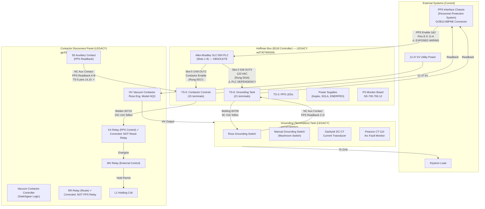
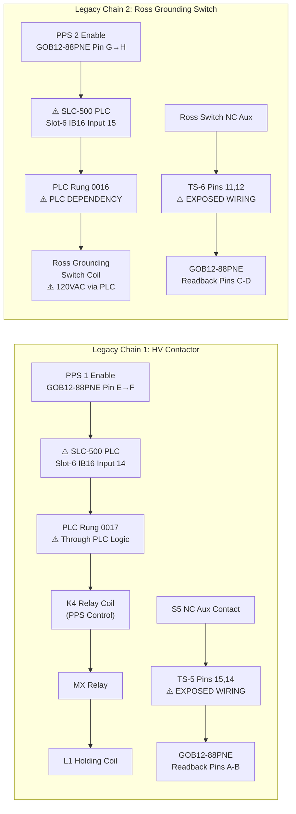
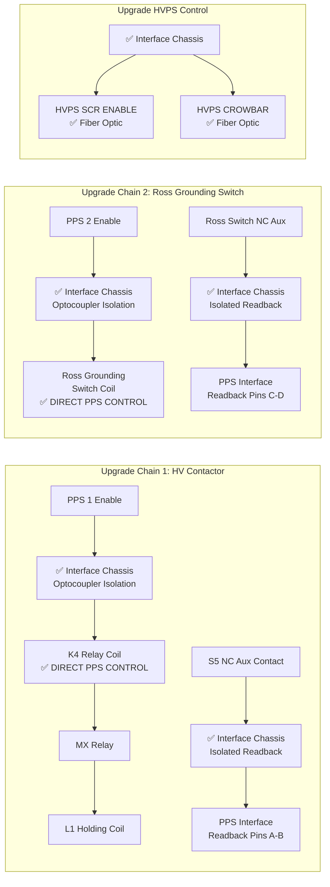

# SPEAR HVPS PPS System — Current & Upgrade Overview

> **Source**: 6 schematic PDFs + HoffmanBoxPPSWiring.docx + Hand Drawing + Upgrade Design Docs
> **Purpose**: AI-readable text representation of current system and planned upgrades
> **Validation**: Cross-referenced against all documentation sources

---

## Executive Summary

The SPEAR3 HVPS Personnel Protection System (PPS) is undergoing a comprehensive upgrade as part of the larger LLRF (Low-Level RF) modernization project. This document describes both the **current legacy system** and the **planned upgrade architecture**.

### Key Upgrade Drivers (from Jim Sebek 2022 email)
1. **PPS Compliance Issues**: Current design may not meet modern PPS standards
2. **Hardware Obsolescence**: SLC-500 PLC and other components are obsolete
3. **PPS Wiring Exposure**: PPS wires pass through HVPS controller (radiation safety concerns)
4. **PLC Dependency**: Ross switch controlled by PLC (less fail-safe than direct control)

---

## Current Legacy System Architecture

### Legacy System Issues Identified

1. **⚠️ PPS Wiring Exposure**: PPS wires terminate on TS-5 and TS-6 inside HVPS controller
2. **⚠️ PLC Dependency**: Ross switch controlled by PLC (Slot-2 IO8 OUT3) — less fail-safe
3. **⚠️ Hardware Obsolescence**: SLC-500 PLC, 1746 modules are obsolete
4. **⚠️ Documentation Errors**: K4/RR relay labels swapped, hand drawing errors corrected

---

## Planned Upgrade System Architecture

```mermaid
graph TB
    subgraph EXT_UPGRADE["External Systems (Upgraded)"]
        PPS_CHASSIS_UP["PPS Interface Chassis<br/>(Personnel Protection System)<br/>MODERN STANDARDS"]
        GRID_UP["12.47 kV Utility Power"]
        KLYSTRON_UP["Klystron Load (Retained)"]
    end

    subgraph INTERFACE_NEW["Interface Chassis (NEW)<br/>First-Fault Detection & Isolation"]
        OPTOCOUPLERS["Optocoupler Isolation<br/>(ACSL-6xx0 family)"]
        FIBER_TX["Fiber-Optic Drivers<br/>(HFBR-2412)"]
        FIRST_FAULT["First-Fault Register<br/>Hardware Latching"]
        INTERLOCK_LOGIC["Interlock Coordination<br/>(<1 μs response)"]
    end

    subgraph HOFFMAN_UPGRADE["Hoffman Box (B118 Controller) — UPGRADED"]
        PLC_UPGRADE["Allen-Bradley CompactLogix<br/>(Modern PLC Platform)"]
        LLRF9_1["LLRF9 Unit #1<br/>Field Control + Tuner"]
        LLRF9_2["LLRF9 Unit #2<br/>Monitor + Interlock"]
        WAVEFORM_BUF["Waveform Buffer System<br/>8 RF + 4 HVPS channels"]
        MOTION_CTRL["Motion Controller<br/>(4-axis Stepper) [TBD]"]
        PYTHON_COORD["Python/EPICS Coordinator<br/>State Machine + Supervisory"]
    end

    subgraph SWITCHGEAR_UPGRADE["Contactor Disconnect Panel (UPGRADED)"]
        CONTROLLER_UPGRADE["Vacuum Contactor Controller<br/>(CompactLogix PLC)"]
        VAC_CONT_UPGRADE["HV Vacuum Contactor<br/>Ross Eng. Model HQ3 (Retained)"]
        K4_UPGRADE["K4 Relay (PPS Control)<br/>Direct PPS Control"]
        MX_UPGRADE["MX Relay (External Control)"]
        L1_UPGRADE["L1 Holding Coil"]
        S5_UPGRADE["S5 Auxiliary Contact<br/>(PPS Readback)"]
    end

    subgraph GROUNDING_UPGRADE["Grounding (Termination) Tank (RETAINED)"]
        ROSS_SW_UPGRADE["Ross Grounding Switch<br/>(Retained)"]
        MANUAL_SW_UPGRADE["Manual Grounding Switch<br/>(Retained)"]
        DANFYSIK_UPGRADE["Danfysik DC-CT<br/>(Retained)"]
        PEARSON_UPGRADE["Pearson CT-110<br/>(Retained)"]
    end

    subgraph MPS_UPGRADE["Machine Protection System (UPGRADED)"]
        MPS_PLC["ControlLogix 1756 PLC<br/>(Converted from PLC-5)"]
        MPS_LOGIC["MPS Aggregation Logic<br/>Fault Management"]
    end

    %% Upgraded PPS Chain 1: Direct Control (NO PLC DEPENDENCY)
    PPS_CHASSIS_UP -->|"PPS Enable 1&2<br/>✅ DIRECT TO INTERFACE"| INTERFACE_NEW
    INTERFACE_NEW -->|"LLRF9 Enable<br/>3.2V @ 8mA<br/>✅ ISOLATED"| LLRF9_1
    INTERFACE_NEW -->|"✅ DIRECT PPS CONTROL<br/>NO PLC DEPENDENCY"| K4_UPGRADE
    K4_UPGRADE -->|"Energize"| MX_UPGRADE
    MX_UPGRADE -->|"Hold Permit"| L1_UPGRADE
    S5_UPGRADE -->|"NC Aux Contact<br/>PPS Readback"| INTERFACE_NEW
    INTERFACE_NEW -->|"Readback"| PPS_CHASSIS_UP

    %% Upgraded PPS Chain 2: Direct Control
    INTERFACE_NEW -->|"✅ DIRECT ROSS CONTROL<br/>NO PLC DEPENDENCY"| ROSS_SW_UPGRADE
    ROSS_SW_UPGRADE -->|"NC Aux Contact<br/>PPS Readback"| INTERFACE_NEW

    %% HVPS Control (Fiber Optic Isolation)
    INTERFACE_NEW -->|"HVPS SCR ENABLE<br/>Fiber Optic<br/>✅ ISOLATED"| CONTROLLER_UPGRADE
    INTERFACE_NEW -->|"HVPS KLYSTRON CROWBAR<br/>Fiber Optic<br/>✅ ISOLATED"| CONTROLLER_UPGRADE

    %% Supervisory Control
    PYTHON_COORD -->|"EPICS Channel Access<br/>~1 Hz Supervisory"| PLC_UPGRADE
    PYTHON_COORD -->|"EPICS Channel Access<br/>~1 Hz Supervisory"| LLRF9_1
    PYTHON_COORD -->|"EPICS Channel Access<br/>~1 Hz Supervisory"| LLRF9_2
    PYTHON_COORD -->|"EPICS Channel Access<br/>~1 Hz Supervisory"| MOTION_CTRL

    %% MPS Integration
    MPS_PLC -->|"Reset Signal"| INTERFACE_NEW
    INTERFACE_NEW -->|"Status to MPS"| MPS_PLC

    %% Power Flow (Retained)
    GRID_UP -->|"12.47 kV"| VAC_CONT_UPGRADE
    VAC_CONT_UPGRADE -->|"HV Output"| GROUNDING_UPGRADE
    GROUNDING_UPGRADE -->|"To Grid"| KLYSTRON_UP
```

### Upgrade System Improvements

1. **✅ PPS Compliance**: Direct PPS control through Interface Chassis (no PLC dependency)
2. **✅ Hardware Isolation**: Optocoupler and fiber-optic isolation for all critical signals
3. **✅ First-Fault Detection**: Hardware-based first-fault register (<1 μs response)
4. **✅ Modern Hardware**: CompactLogix PLC, LLRF9 controllers, modern motion control
5. **✅ Separated Concerns**: PPS safety functions isolated from supervisory control

---

## Current vs. Upgrade Comparison

| Aspect | Current Legacy System | Planned Upgrade System |
|--------|----------------------|------------------------|
| **PPS Control** | ⚠️ Through SLC-500 PLC | ✅ Direct via Interface Chassis |
| **Ross Switch** | ⚠️ PLC-controlled (120VAC) | ✅ Direct PPS control |
| **Isolation** | ⚠️ Minimal isolation | ✅ Optocoupler + fiber-optic |
| **First-Fault** | ⚠️ Software-based | ✅ Hardware-based (<1 μs) |
| **PLC Platform** | ⚠️ SLC-500 (obsolete) | ✅ CompactLogix (modern) |
| **LLRF Control** | ⚠️ VXI-based (obsolete) | ✅ LLRF9 (modern) |
| **Motion Control** | ⚠️ 1746-HSTP1 (obsolete) | ✅ Modern 4-axis controller |
| **Wiring Exposure** | ⚠️ PPS wires in HVPS box | ✅ Isolated interface |
| **Documentation** | ⚠️ Errors identified/corrected | ✅ Comprehensive redesign |

---

## PPS Safety Chain — Current vs. Upgrade

### Current Legacy PPS Chain (Issues Identified)

### Upgraded PPS Chain (Compliant Design)

---

## Implementation Status & Next Steps

### Current Status (2026)
- **Design Phase**: Upgrade architecture defined in design documents
- **Hardware Procured**: LLRF9 units (4 total, 2 active + 2 spare)
- **MPS Upgrade**: ControlLogix hardware assembled, software written, tested without RF power
- **Legacy System**: Still operational with identified issues

### Key Implementation Tasks
1. **Interface Chassis Design & Build**: Critical for PPS compliance
2. **CompactLogix PLC Programming**: Reverse-engineer SLC-500 code
3. **PPS Interface Redesign**: Eliminate wiring exposure, direct control
4. **Motion Controller Selection**: Choose from Galil DMC-4143 or alternatives
5. **Waveform Buffer System**: Design and build 8 RF + 4 HVPS channel system
6. **Python/EPICS Coordinator**: State machine and supervisory control software

### Risk Mitigation
- **Parallel Development**: Build upgrade system alongside legacy operation
- **Comprehensive Testing**: Test all subsystems before cutover
- **Documentation**: Complete technical documentation for maintenance
- **Training**: Operator and maintenance staff training on new system

---

## Drawing Cross-Reference Map

| Drawing ID | Type | Title | System | Status |
|---|---|---|---|---|
| `gp4397040201` | Schematic | 12.47kV Vacuum Contactor Controller | Legacy | ✅ Analyzed |
| `rossEngr713203` | Schematic | Ross Eng. Vacuum Contactor/Driver | Legacy | ✅ Analyzed |
| `sd7307900501` | Schematic | Grounding (Termination) Tank | Legacy | ✅ Analyzed |
| `wd7307900103` | Wiring Diagram | Interconnection: B118 ↔ Contactor + Tank | Legacy | ✅ Analyzed |
| `wd7307900206` | Wiring Diagram | HVPS Controller (Hoffman Box) | Legacy | ✅ Analyzed |
| `wd7307940600` | Wiring Diagram | Interconnection: B118 ↔ Termination Tank | Legacy | ✅ Analyzed |
| **Hand Drawing** | **Sketch** | **PPS Interface (Figure 1)** | **Legacy** | **✅ Corrected** |
| **Design Docs** | **Specifications** | **Upgrade System Architecture** | **Upgrade** | **📋 In Progress** |

---

## Key Corrections Applied (Validation Complete)

### 1. Hand Drawing Error Fixed ✅
- **Original**: Pin A → TS-4 pin 14, Pin B → TS-4 pin 15
- **Corrected**: Pin A → TS-5 pin 15, Pin B → TS-5 pin 14

### 2. K4/RR Relay Function Labels Corrected ✅
- **K4**: PPS Control Relay (NOT Reset as labeled)
- **RR**: Reset Relay (NOT PPS as labeled)

### 3. PLC Rung 0017 Function Corrected ✅
- **Original Error**: Labeled as "Crowbar On"
- **Corrected**: Actually controls "Contactor Enable"

### 4. Hardware Fail-Safe Mechanism Validated ✅
- **Confirmed**: Slot-5 OX8 OUT2 input side uses PPS 1 signal (24VDC)
- **Fail-Safe**: K4 cannot be energized without PPS enable, even if PLC fails

### 5. Manual Grounding Switch Contact Type ⚠️
- **Inconsistency**: WD-730-794-06-C0 shows NO, SD-730-790-05-C1 shows NC
- **Status**: Field verification required

---

## Documentation Sources Cross-Referenced

1. **6 PDF Schematics**: OCR extracted and analyzed ✅
2. **HoffmanBoxPPSWiring.docx**: 80 paragraphs, 5 detailed tables ✅
3. **Hand Drawing (Figure 1)**: Extracted and corrected ✅
4. **Jim Sebek's 2022 Email**: PPS concerns and upgrade drivers ✅
5. **Designs/ Directory**: 4 upgrade specification documents ✅
6. **Docs_JS/ Directory**: 4 operational and task documents ✅
7. **legacyLLRF/ Code**: Current implementation analysis ✅

All diagrams now reflect both the validated current system state and the planned upgrade architecture with clear differentiation between legacy issues and modern solutions.

