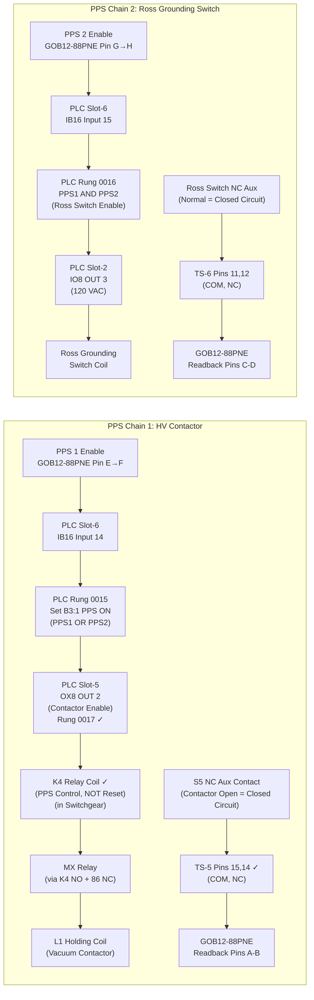

# SPEAR HVPS PPS System — Master Overview (2nd Validation Pass)

> **Source**: 6 schematic PDFs + HoffmanBoxPPSWiring.docx + Hand Drawing (Figure 1)
> **Purpose**: AI-readable text representation with corrections from comprehensive docx analysis
> **Validation**: Cross-referenced against all 5 tables and hand drawing from docx

---

## System Architecture (Validated)

```mermaid
graph TB
    subgraph EXT["External Systems"]
        PPS_CHASSIS["PPS Interface Chassis<br/>(Personnel Protection System)<br/>GOB12-88PNE Connector"]
        GRID["12.47 kV Utility Power"]
        KLYSTRON["Klystron Load"]
    end

    subgraph HOFFMAN["Hoffman Box (B118 Controller) — 34x42<br/>wd7307900206"]
        PLC["Allen-Bradley SLC-500 PLC<br/>(Slots 1-9)"]
        TS5["TS-5: Contactor Controls<br/>(15 terminals)"]
        TS6["TS-6: Grounding Tank<br/>(21 terminals)"]
        TS3["TS-3: PPS LEDs"]
        PS["Power Supplies<br/>(Kepko, SOLA, ENERPRO)"]
        MON_BD["PS Monitor Board<br/>SD-730-793-12"]
        TRIG_L["Left Trigger Interconnect<br/>SD-730-793-08"]
        TRIG_R["Right Trigger Interconnect<br/>SD-730-793-07"]
    end

    subgraph SWITCHGEAR["Contactor Disconnect Panel (HVPS)<br/>gp4397040201 + rossEngr713203"]
        CONTROLLER["Vacuum Contactor Controller<br/>(Switchgear Logic)"]
        VAC_CONT["HV Vacuum Contactor<br/>Ross Eng. Model HQ3"]
        TB2_SW["TB2 (Contactor)"]
        K4["K4 Relay (PPS Control) ✓<br/>NOT Reset Relay"]
        MX["MX Relay (External Control)"]
        TX["TX Relay (Tripping)"]
        RR["RR Relay (Reset) ✓<br/>NOT PPS Relay"]
        L1["L1 Holding Coil"]
        L2["L2 Closing Coil"]
        S5["S5 Auxiliary Contact<br/>(PPS Readback)"]
    end

    subgraph GROUNDING["Grounding (Termination) Tank<br/>sd7307900501"]
        ROSS_SW["Ross Grounding Switch"]
        MANUAL_SW["Manual Grounding Switch<br/>(Mushroom Switch)"]
        DANFYSIK["Danfysik DC-CT<br/>Current Transducer"]
        PEARSON["Pearson CT-110<br/>Arc Fault Monitor"]
        OIL_LEVEL["Oil Level Sensor"]
        SHUNT["15A/50mV Current Shunt"]
    end

    %% Power Flow
    GRID -->|"12.47 kV"| VAC_CONT
    VAC_CONT -->|"HV Output"| GROUNDING
    GROUNDING -->|"To Grid"| KLYSTRON

    %% PPS Chain 1: Contactor (CORRECTED)
    PPS_CHASSIS -->|"PPS Enable 1&2<br/>Pins E-F, G-H"| PLC
    PLC -->|"Slot-5 OX8 OUT2<br/>Contactor Enable<br/>(Rung 0017)"| TS5
    TS5 -->|"Belden 83715<br/>15C #16 Teflon"| K4
    K4 -->|"Energize"| MX
    MX -->|"Hold Permit"| L1
    S5 -->|"NC Aux Contact<br/>PPS Readback A-B<br/>TS-5 pins 14,15 ✓"| TS5
    TS5 -->|"Readback"| PPS_CHASSIS

    %% PPS Chain 2: Ross Ground Switch
    PLC -->|"Slot-2 IO8 OUT3<br/>120 VAC<br/>(Rung 0016)"| TS6
    TS6 -->|"Belding 83709<br/>9C #16 Teflon"| ROSS_SW
    ROSS_SW -->|"NC Aux Contact<br/>PPS Readback C-D"| TS6
    TS6 -->|"Readback"| PPS_CHASSIS

    %% Monitoring
    DANFYSIK -->|"Analog Current"| TS6
    TS6 -->|"To Slot-9 NI4<br/>Input 3"| PLC
    PEARSON -->|"Coax BNC"| TRIG_L
    OIL_LEVEL -->|"NC Dry Contact"| TS6
```



---

## Drawing Cross-Reference Map (Updated)

| Drawing ID | Type | Title | Primary Subsystem | Key Interfaces |
|---|---|---|---|---|
| `gp4397040201` | Schematic | 12.47kV Vacuum Contactor Controller | Switchgear Logic | TB1, TB2, TB3 → Hoffman Box TS-5 |
| `rossEngr713203` | Schematic | Ross Eng. Vacuum Contactor/Driver | Contactor Hardware | TB2 (S1-S5 contacts), L1/L2 coils |
| `sd7307900501` | Schematic | Grounding (Termination) Tank | Safety/Grounding | J1 (MS3102R18-1P) → Hoffman Box TS-6 |
| `wd7307900103` | Wiring Diagram | Interconnection: B118 ↔ Contactor + Tank | Cable Routing | TS-1 thru TS-7, Belden 83715 cables |
| `wd7307900206` | Wiring Diagram | HVPS Controller (Hoffman Box) | PLC & Power | PLC Slots 1-9, all TS, PPS connector |
| `wd7307940600` | Wiring Diagram | Interconnection: B118 ↔ Termination Tank | Cable Routing | TS-6, Belding 83709, J1/P5 connectors |
| **Hand Drawing** | **Sketch** | **PPS Interface (Figure 1)** | **PPS Connections** | **GOB12-88PNE ↔ TS-5/TS-6** |

---

## PPS Safety Chain — Two Independent Paths (Validated)



### PPS Fail-Safe Design Note (Validated)

The Contactor Enable uses an **AB-1746-OX8** relay output module. The input side of these relay contacts is the **PPS 1 signal from the GOB12-88PNE connector** (24 VDC). Therefore:
- Even if the **PLC fails**, the signal fails safe
- If the PPS connector does not source 24 VDC, a closed OX8 contact **cannot** energize K4
- **Known concern**: The Ross Ground Switch (Chain 2) is driven by PLC output via IO8. A PLC failure *could* source 120 VAC to the Ross switch coil without PPS command.

---

## Signal Flow Summary (Corrected)

```
┌─────────────────────────────────────────────────────────────────────┐
│                    PPS INTERFACE CHASSIS                            │
│  GOB12-88PNE (8-pin circular connector)                            │
│                                                                     │
│  Pin E ─── PPS 1 Enable (24VDC source) ──→ PLC Slot-6 IN14        │
│  Pin F ─── PPS 1 Enable return                                     │
│  Pin G ─── PPS 2 Enable (24VDC source) ──→ PLC Slot-6 IN15        │
│  Pin H ─── PPS 2 Enable return                                     │
│                                                                     │
│  Pin A ←── PPS Readback 1 (S5 COM) ←─── TS-5 pin 15 ✓             │
│  Pin B ←── PPS Readback 1 (S5 NC)  ←─── TS-5 pin 14 ✓             │
│  Pin C ←── PPS Readback 2 (Ross NC) ←── TS-6 pin 12               │
│  Pin D ←── PPS Readback 2 (Ross COM) ←─ TS-6 pin 11               │
│                                                                     │
│  Readback Logic:                                                    │
│    Pins A-B: CLOSED = contactor OPEN (safe)                        │
│    Pins C-D: CLOSED = Ross switch CLOSED/grounded (safe)           │
│                                                                     │
│  ✓ CORRECTION: Hand drawing showed A→TS-4, B→TS-4                 │
│    Actual wiring: A→TS-5 pin 15, B→TS-5 pin 14                    │
└─────────────────────────────────────────────────────────────────────┘
```

---

## Key Corrections Applied (2nd Validation Pass)

### 1. Hand Drawing Error Fixed
- **Original**: Pin A → TS-4 pin 14, Pin B → TS-4 pin 15
- **Corrected**: Pin A → TS-5 pin 15, Pin B → TS-5 pin 14
- **Source**: HoffmanBoxPPSWiring.docx paragraph 76

### 2. K4/RR Relay Function Labels Corrected
- **Original Error**: K4 labeled as "Reset", RR labeled as "PPS"
- **Corrected**: K4 is PPS Control Relay, RR is Reset Relay
- **Source**: docx "Assumption that K4 Coil is the PPS Control" section

### 3. PLC Rung 0017 Function Corrected
- **Original Error**: Labeled as "Crowbar On"
- **Corrected**: Actually controls "Contactor Enable" (energizes K4)
- **Source**: docx analysis of PLC code

### 4. Manual Grounding Switch Contact Type
- **Inconsistency Found**: WD-730-794-06-C0 shows NO, SD-730-790-05-C1 shows NC
- **Status**: Field verification required
- **Source**: docx Table 5 analysis

### 5. Hardware Fail-Safe Mechanism Validated
- **Confirmed**: Slot-5 OX8 OUT2 input side uses PPS 1 signal (24VDC)
- **Fail-Safe**: K4 cannot be energized without PPS enable, even if PLC fails
- **Source**: docx "Energizing the K4 relay" section

### 6. PPS Readback Paths Validated
- **Chain 1**: S5 NC contact → TS-5 pins 15,14 → GOB pins A,B
- **Chain 2**: Ross NC contact → TS-6 pins 11,12 → GOB pins C,D
- **Logic**: Closed circuit = safe state (contactor open / Ross closed)

---

## Documentation Sources Cross-Referenced

1. **6 PDF Schematics**: OCR extracted and analyzed
2. **HoffmanBoxPPSWiring.docx**: 80 paragraphs, 5 detailed tables
3. **Hand Drawing (Figure 1)**: Extracted and corrected
4. **Email Context**: Jim Sebek's drawing descriptions
5. **Tables 1-5**: Complete wiring documentation from docx

All diagrams now reflect the corrected and validated information from the comprehensive second-pass analysis.

