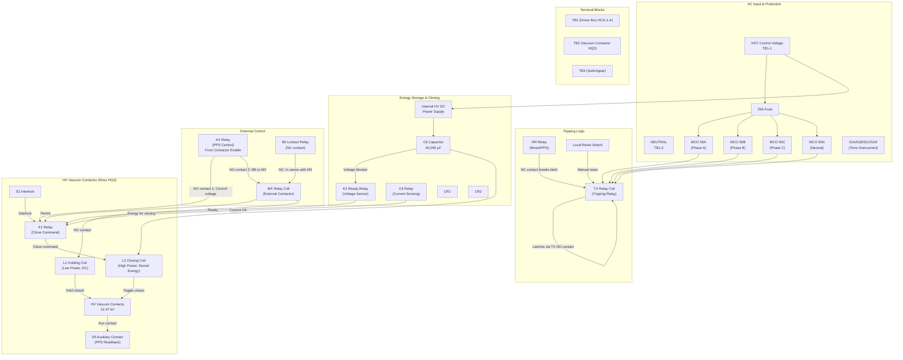
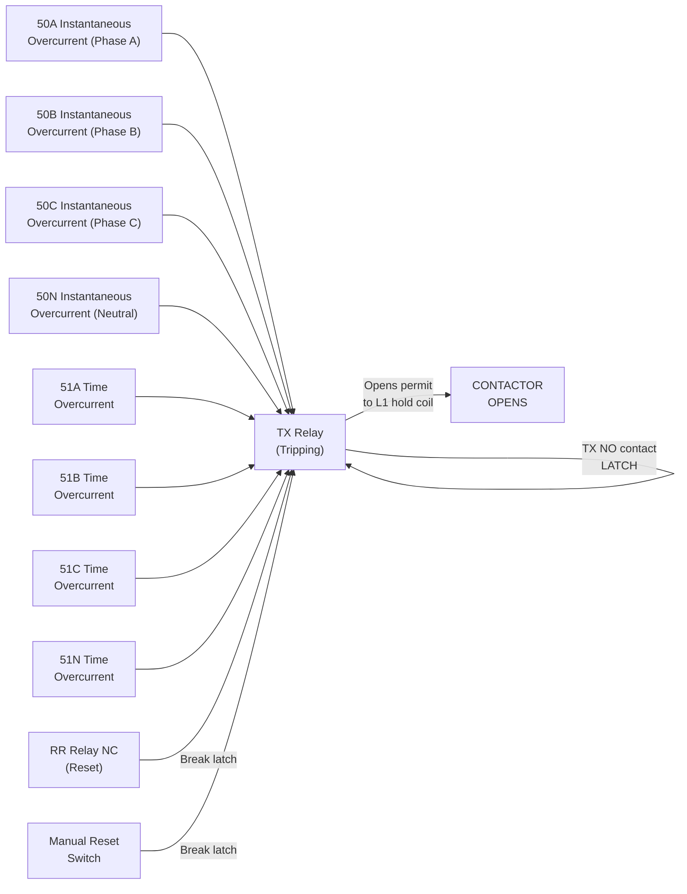

# GP-439-704-02-C1 — Vacuum Contactor Controller Schematic

> **Drawing**: `gp4397040201.pdf`
> **Title**: 12.47KV OUTDR SWGR, VAC CNTOR — ELECTRICAL SCHEMATIC DIAGRAM
> **Origin**: SLAC / PEP-II, redrawn to CAD per AS-RATE TE 89425
> **Supersedes**: Manual drawing GP-439-704-02 R0

---

## Functional Block Diagram



---

## Relay Logic — Detailed Sequence

### Closing Sequence (Energize Contactor)

```
STEP 1: K4 Energized (PPS Enable from PLC Slot-5 OX8 OUT2)
        ├── K4 NO contact #1 CLOSES → Control voltage to relay chain
        └── K4 NO contact #2 CLOSES → Wire BB to MX coil path

STEP 2: MX Energized (if K4 closed AND 86 Lockout NC closed)
        ├── MX NO contact CLOSES → L1 holding coil circuit ready
        └── MX permit → K1 close command path enabled

STEP 3: Energy Storage Charges
        ├── HV DC Power Supply charges C6 (40,000 µF)
        ├── K3 energizes when C6 voltage sufficient
        └── K2 (Ready Relay) closes when full energy available

STEP 4: K1 Closes (if MX + K2 + K3 + S1 interlock all satisfied)
        └── Stored energy from C6 applied to L2 (Closing Coil)

STEP 5: L2 Solenoid fires
        ├── Toggle mechanism closes HV contacts
        ├── S1 interlock actuated (holding coil sealed in)
        └── L1 Holding Coil maintains contactor closed

STEP 6: HV Contacts Closed
        ├── 12.47 kV power flows to HVPS
        └── S5 auxiliary contact OPENS (readback to PPS)
```

### Opening Sequence (De-energize Contactor)

```
TRIGGER: Any of:
  - K4 de-energized (PPS removed)
  - MX de-energized (external command)
  - TX energized (overcurrent trip)
  - Local OFF switch
  - Door interlocks open

STEP 1: MX de-energized
        ├── MX NO contact OPENS → L1 holding coil loses power
        └── K4 de-energized → All control voltage removed

STEP 2: L1 drops out (within 1 AC cycle)
        ├── Toggle base drops
        └── HV vacuum contacts OPEN

STEP 3: HV contacts clear (approx 1/2 to 1 cycle)
        └── Nominally at first current zero after contacts part

STEP 4: S5 auxiliary contact CLOSES
        └── PPS readback: closed circuit = contactor OPEN (safe state)

STEP 5: Toggle resets L1 and L2
        ├── C6 begins recharging (few seconds)
        └── K2 Ready relay closes when C6 charged → Ready for reclose
```

---

## Protection Logic (TX Tripping Relay)



### TX Latch Logic
```
TX energizes IF any MCO relay (50 or 51) trips

TX LATCHES via its own NO contact:
  TX stays energized even after MCO fault clears

TX UNLATCHES only when ALL conditions met:
  1. All MCO relays clear (no active faults)
  2. AND EITHER:
     a. RR relay is energized (RR NC contact opens, breaking latch)
     b. OR Manual Reset switch depressed
```

---

## Terminal Block Assignments

### TB1 — Driver Box (HCA-1-A)

```
TB1-1  ── HOT Control Voltage (AC input)
TB1-2  ── NEUTRAL (AC input)
TB1-4  ── DC voltage (to vacuum contactor)
TB1-7  ── Internal HV DC Power Supply connections (×3)
TB1-15 ── Door Interlocks, Cap Dump
TB1-18 ── DC voltage indicator
TB1-19 ── (connection point)
TB1-20 ── HV DC PS connection
TB1-21 ── CRI connection
```

### TB2 — Vacuum Contactor (HQ3)

```
TB2-1  ── DC holding / Frame connection
TB2-2  ── Stored energy (C6, 40,000µF)
TB2-3  ── (connection)
TB2-5  ── S3A (aux contact)
TB2-6  ── Current Sensing / Voltage Sensor
TB2-9  ── Ready indication
TB2-10 ── Contactor state
TB2-11 ── S2 limit indication
TB2-12 ── Local Reset
TB2-13 ── Contactor Switch / CR7
TB2-14 ── MX / PPS connection
TB2-S2  ── S2 auxiliary (indication)
TB2-S2B ── S2B auxiliary (limit)
TB2-S3A ── S3A auxiliary
TB2-S3B ── S3B auxiliary (indication)
```

### TB3 — Switchgear

```
TB3-1  ──  (connection)
TB3-4  ──  Cap Dump / Door Interlocks
TB3-5  ──  (connection)
TB3-6  ──  Energy Relay
TB3-7  ──  (connection)
TB3-9  ──  TX / Voltage
TB3-10 ── (connection)
TB3-11 ── Contactor TB2-10
TB3-13 ── (connection)
TB3-14 ── DC voltage
TB3-15 ── RR / connection
TB3-16 ── K2 LO
TB3-17 ── Vacuum Contactor
TB3-21 ── MX connection
TB3-22 ── Relay / PPS
```

---

## Component List

| Ref | Component | Function | Rating |
|-----|-----------|----------|--------|
| L1 | Holding Coil | Holds contactor closed (DC, low power) | DC |
| L2 | Closing Coil | Fires toggle to close contactor (stored energy) | High power |
| K1 | Close Relay | Applies stored energy to L2 | — |
| K2 | Ready Relay | Indicates C6 fully charged (voltage sensor) | — |
| K3 | Current Sensing Relay | Checks holding coil current | — |
| K4 | PPS Control Relay | **Main PPS interlock** — 2 NO contacts | — |
| MX | External Control Contactor | External permit for contactor operation | 24VDC coil |
| TX | Tripping Relay | Summarizes MCO overcurrent faults, latching | — |
| RR | Reset Relay | Resets TX latch (from PLC) | — |
| BR | Blocking Relay | Prevents opening during excessive fault | — |
| 86-L | Lockout Relay | NC contact in series with MX | — |
| CR1, CR2 | Control Relays | Internal sequencing | — |
| MCO 50A-N | Overcurrent Relays | Instantaneous trip, 4 phases | — |
| MCO 51A-N | Time Overcurrent | Time-delayed trip, 4 phases | — |
| C6 | Storage Capacitor | Closing energy | 40,000 µF |
| S1-S5 | Auxiliary Contacts | Status/interlock feedback | — |
| TD1 | Time Delay Relay | Sequencing | — |
| CT200/5 | Current Transformers | Phase current measurement | 200/5A, 1200/5A |
| F1-F4 | Fuses | Phase protection | 200A each |

---

## Key Design Notes

1. **K4 vs RR Labeling Error**: Documentation on WD-730-794-02-C0 has K4 and RR labels **swapped**. K4 is the PPS control relay (not "Reset"), and RR acts as the reset relay.

2. **L1 vs L2 Labeling Error**: GP-439-704-02-C1 **mislabels L1 as L2**, identifying two different coils with the same name. Reference rossEngr713203 for correct labeling.

3. **Fail-Safe**: The K4 relay is critical — de-energizing K4 removes ALL control power AND de-energizes MX, causing the contactor to open. The controller requires several seconds to recharge C6 before reclosing.

4. **PPS Source**: K4 coil is sourced from PLC Slot-5 OX8 OUT 2, but the **input side** of the OX8 relay contacts uses the PPS 1 signal from GOB12-88PNE. This provides a hardware fail-safe even if the PLC fails.

