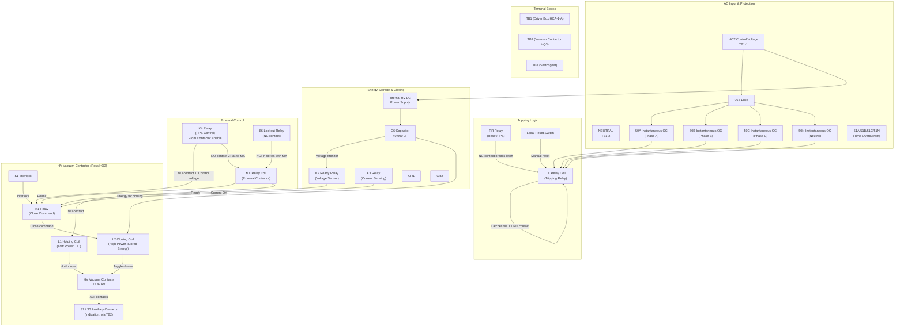
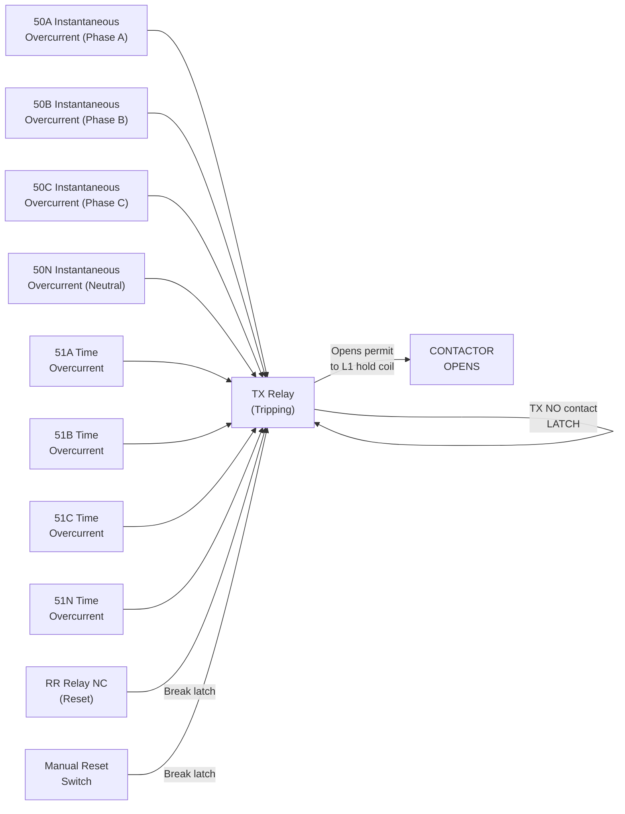

# GP-439-704-02-C1 — Vacuum Contactor Controller Schematic

> **Drawing**: `gp4397040201.pdf`
> **Title**: POSITRON ELECTRON PROJECT 2 — 12.47KV OUTDR SWGR, VAC CNTOR — ELECTRICAL SCHEMATIC DIAGRAM
> **Origin**: Stanford Linear Accelerator Center
> **Revision**: "REDRAWN TO CAD AS SHOWN AND REV PER AS-BUILT", 09/25/06
> **Supersedes**: "THIS SUPERSEDES MANUAL DRAWING GP-439-704-02 R0."
> **Reference on drawing**: ID-308-801-06, "PEP2, 12.47KV VAC CNTOR CONTROLLER, ELECTRICAL, CONN WIRING DIAG"
> **Contactor/driver model**: Energy-storage closing vacuum contactor/driver **Model HQ3**
>
> **Verification status: VERIFIED (3 September 2026)** — read directly from the scanned drawing rendered to image. Corrections applied in this pass: the provenance line previously read "redrawn to CAD per AS-RATE TE 89425", which does not appear on the drawing; the 50/51 protective relays were labelled "MCO" relays, which conflates them with the separate MCO device shown at bottom right; the TB3 terminal list was largely incorrect and has been replaced with the drawing's own WIRE NAME table; and an "S5 auxiliary contact (PPS readback)" was described that does not appear on **this** drawing.
>
> **On S5**: the contact does exist, but on the *Ross Engineering* drawing 713203 E-1, where **S4 and S5 are the two spare AUX contact sets** brought out to TB2-15…17 and TB2-18…20 of the HQ3 contactor. Nothing on either drawing identifies S5 as a PPS readback; how the SLAC installation uses S4/S5 is not documented here and should be confirmed in the field.

### Terminal block locations (per drawing notes)

| Block | Location |
|---|---|
| **TB1** | Terminal block on **HCA driver box** |
| **TB2** | Terminal block on **HQ3 vacuum contactor** |
| **TB3** | Terminal block on **switchgear** |

---

## Functional Block Diagram


```mermaid
flowchart TB
    subgraph INPUT["AC Input & Protection"]
        HOT["HOT Control Voltage<br/>TB1-1"]
        NEUTRAL["NEUTRAL<br/>TB1-2"]
        FUSE["25A Fuse"]
        MCO_A["50A Instantaneous OC<br/>(Phase A)"]
        MCO_B["50B Instantaneous OC<br/>(Phase B)"]
        MCO_C["50C Instantaneous OC<br/>(Phase C)"]
        MCO_N["50N Instantaneous OC<br/>(Neutral)"]
        MCO_51["51A/51B/51C/51N<br/>(Time Overcurrent)"]
    end

    subgraph TRIP["Tripping Logic"]
        TX_COIL["TX Relay Coil<br/>(Tripping Relay)"]
        RR_RELAY["RR Relay<br/>(Reset/PPS)"]
        RESET_SW["Local Reset Switch"]
    end

    subgraph ENERGY["Energy Storage & Closing"]
        HV_DC_PS["Internal HV DC<br/>Power Supply"]
        C6["C6 Capacitor<br/>40,000 µF"]
        K2["K2 Ready Relay<br/>(Voltage Sensor)"]
        K3["K3 Relay<br/>(Current Sensing)"]
        CR1["CR1"]
        CR2["CR2"]
    end

    subgraph CONTROL["External Control"]
        K4["K4 Relay<br/>(PPS Control)<br/>From Contactor Enable"]
        MX_COIL["MX Relay Coil<br/>(External Contactor)"]
        LOCK86["86 Lockout Relay<br/>(NC contact)"]
    end

    subgraph CONTACTOR["HV Vacuum Contactor (Ross HQ3)"]
        L1["L1 Holding Coil<br/>(Low Power, DC)"]
        L2["L2 Closing Coil<br/>(High Power, Stored Energy)"]
        K1["K1 Relay<br/>(Close Command)"]
        S1["S1 Interlock"]
        S5["S2 / S3 Auxiliary Contacts<br/>(indication, via TB2)"]
        HV_CONTACTS["HV Vacuum Contacts<br/>12.47 kV"]
    end

    subgraph TB["Terminal Blocks"]
        TB1["TB1 (Driver Box HCA-1-A)"]
        TB2["TB2 (Vacuum Contactor HQ3)"]
        TB3["TB3 (Switchgear)"]
    end

    %% Power flow
    HOT --> FUSE --> MCO_A & MCO_B & MCO_C & MCO_N
    MCO_A & MCO_B & MCO_C & MCO_N --> TX_COIL

    %% Trip logic
    TX_COIL -->|"Latches via TX NO contact"| TX_COIL
    RR_RELAY -->|"NC contact breaks latch"| TX_COIL
    RESET_SW -->|"Manual reset"| TX_COIL

    %% Energy storage
    HOT --> HV_DC_PS --> C6
    C6 -->|"Voltage Monitor"| K2
    C6 -->|"Energy for closing"| L2

    %% Control chain
    K4 -->|"NO contact 1: Control voltage"| K1
    K4 -->|"NO contact 2: BB to MX"| MX_COIL
    LOCK86 -->|"NC: In series with MX"| MX_COIL

    %% Closing sequence
    MX_COIL -->|"Permit"| K1
    K2 -->|"Ready"| K1
    K3 -->|"Current OK"| K1
    S1 -->|"Interlock"| K1
    K1 -->|"Close command"| L2
    L2 -->|"Toggle closes"| HV_CONTACTS
    MX_COIL -->|"NO contact"| L1
    L1 -->|"Hold closed"| HV_CONTACTS

    %% Readback
    HV_CONTACTS -->|"Aux contacts"| S5
```

---

## Relay Logic — Detailed Sequence

### Closing Sequence (Energize Contactor)

```
STEP 1: K4 Energized (PPS Enable from PLC Slot-5 OX8 OUT2)
        ├── K4 NO contact #1 CLOSES → Control voltage to relay chain
        └── K4 NO contact #2 CLOSES → Wire BB to MX coil path

STEP 2: MX Energized (if K4 closed AND 86 Lockout NC closed)
        ├── MX NO contact CLOSES → L1 holding coil circuit ready
        └── MX permit → K1 close command path enabled

STEP 3: Energy Storage Charges
        ├── HV DC Power Supply charges C6 (40,000 µF)
        ├── K3 energizes when C6 voltage sufficient
        └── K2 (Ready Relay) closes when full energy available

STEP 4: K1 Closes (if MX + K2 + K3 + S1 interlock all satisfied)
        └── Stored energy from C6 applied to L2 (Closing Coil)

STEP 5: L2 Solenoid fires
        ├── Toggle mechanism closes HV contacts
        ├── S1 interlock actuated (holding coil sealed in)
        └── L1 Holding Coil maintains contactor closed

STEP 6: HV Contacts Closed
        ├── 12.47 kV power flows to HVPS
        └── S2 / S3 auxiliary contacts change state
           (VAC CONT "OPEN" green lamp off, "CLOSED" red lamp on;
            indication wired out via TB2-9 through TB2-14)
```

### Opening Sequence (De-energize Contactor)

```
TRIGGER: Any of:
  - K4 de-energized (PPS removed)
  - MX de-energized (external command)
  - TX energized (overcurrent trip)
  - Local OFF switch
  - Door interlocks open

STEP 1: MX de-energized
        ├── MX NO contact OPENS → L1 holding coil loses power
        └── K4 de-energized → All control voltage removed

STEP 2: L1 drops out (within 1 AC cycle)
        ├── Toggle base drops
        └── HV vacuum contacts OPEN

STEP 3: HV contacts clear (approx 1/2 to 1 cycle)
        └── Nominally at first current zero after contacts part

STEP 4: S2 / S3 auxiliary contacts revert
        └── VAC CONT "OPEN" green lamp on
```

---

## Sequence of Operation — transcribed from the drawing

The drawing carries its own numbered sequence, headed *"ENERGY STORAGE CLOSING VACUUM CONTACTOR/DRIVER MODEL #HQ3"*. It is reproduced here because it contains timing figures that appear nowhere else in this repository.

### To close

1. MX closed to start sequence of closing HV vacuum contactor.
2. Current sensing relay to check voltage in holding coil. Check K3 voltage in closing coil.
3. When full current is reached in holding coil, K3 closes and if K2 ready relay is closed, with full energy available and holding coil is mechanically sealed-in thus actuating interlock S1, K1 then closes applying stored energy to closing coil L2.
4. L2 solenoid then closes toggle which closes HV contacts with high closing force.

### To open

5. MX opened to start upon sequence of vacuum contactor (or TX, local off, or interlocks open). If BR blocking relay closed by excessive fault, MX and TX local off are bypassed and contactor cannot open immediately even if AC is lost, and as long as BR stays closed until CG decays. **With loss of AC control voltage, contactor will hold in for at least 170 milliseconds before dropping out.**
6. When DC current is shut off to L1 holding coil, L1 holding solenoid drops out **within 1 cycle**, dropping toggle base and opening HV vacuum contactor, which then clears in approximately **½ to 1 cycle**. HV contacts nominally at the first current zero after contacts part.
7. As soon as L1 drops out and opens HV vacuum contacts, toggle breaks and resets L1 and L2. This then allows reclosing, after energy storage closing capacitor is recharged in a few seconds to a level sensed by the driver voltage sensor, which then closes K2 ready relay.
8. Ready indicator then indicates whether voltage on energy storage closing capacitor is sufficient for positive closing, and also allows closing sequence to start if MX and remainder of closing circuit is closed at reset. Antipump relay may be necessary; however, recharge time reduces pumping rate. Using TX in a reset circuit suffices for positive antipump.
9. Door interlocks on the energy storage driver unit automatically discharge capacitors when driver door is opened. External terminals are also provided to test or discharge capacitors without opening door.

> **CAUTION (verbatim from drawing)**: *"AC MUST BE OFF BEFORE EXTERNAL DISCHARGE OF CAPACITORS IS DONE TO PREVENT BLOWING AC FUSES."*

### Safety significance of the 170 ms hold-in

The contactor is **not** instantaneous on loss of control power. Losing AC control voltage leaves the HV contacts closed for **at least 170 ms**, after which L1 drops out (1 cycle) and the contacts clear (½–1 cycle). Total worst-case time from loss of control power to interruption of the 12.47 kV feed is therefore on the order of **200 ms**, not the few-millisecond figure one might assume for a fail-safe-open device. Any timing analysis of PPS Chain 1 must use this figure.

After the contacts open, the toggle resets L1 and L2 and the closing capacitor begins recharging; K2 (ready relay) closes again only when the driver voltage sensor MT1 confirms sufficient stored energy, which takes **a few seconds**. The contactor therefore cannot be reclosed immediately after an open.

---

## Protection Logic (TX Tripping Relay)


```mermaid
flowchart LR
    MCO_50A["50A Instantaneous<br/>Overcurrent (Phase A)"] --> TX
    MCO_50B["50B Instantaneous<br/>Overcurrent (Phase B)"] --> TX
    MCO_50C["50C Instantaneous<br/>Overcurrent (Phase C)"] --> TX
    MCO_50N["50N Instantaneous<br/>Overcurrent (Neutral)"] --> TX
    MCO_51A["51A Time<br/>Overcurrent"] --> TX
    MCO_51B["51B Time<br/>Overcurrent"] --> TX
    MCO_51C["51C Time<br/>Overcurrent"] --> TX
    MCO_51N["51N Time<br/>Overcurrent"] --> TX

    TX["TX Relay<br/>(Tripping)"]
    TX -->|"TX NO contact<br/>LATCH"| TX
    RR["RR Relay NC<br/>(Reset)"] -->|"Break latch"| TX
    RESET["Manual Reset<br/>Switch"] -->|"Break latch"| TX

    TX -->|"Opens permit<br/>to L1 hold coil"| OPEN["CONTACTOR<br/>OPENS"]
```

### TX Latch Logic
```
TX energizes IF any MCO relay (50 or 51) trips

TX LATCHES via its own NO contact:
  TX stays energized even after MCO fault clears

TX UNLATCHES only when ALL conditions met:
  1. All MCO relays clear (no active faults)
  2. AND EITHER:
     a. RR relay is energized (RR NC contact opens, breaking latch)
     b. OR Manual Reset switch depressed
```

---

## Terminal Block Assignments

### TB1 — Driver Box (HCA-1-A)

```
TB1-1  ── HOT Control Voltage (AC input)
TB1-2  ── NEUTRAL (AC input)
TB1-4  ── DC voltage (to vacuum contactor)
TB1-7  ── Internal HV DC Power Supply connections (×3)
TB1-15 ── Door Interlocks, Cap Dump
TB1-18 ── DC voltage indicator
TB1-19 ── (connection point)
TB1-20 ── HV DC PS connection
TB1-21 ── CRI connection
```

### TB2 — Vacuum Contactor (HQ3)

```
TB2-1  ── DC holding / Frame connection
TB2-2  ── Stored energy (C6, 40,000µF)
TB2-3  ── (connection)
TB2-5  ── S3A (aux contact)
TB2-6  ── Current Sensing / Voltage Sensor
TB2-9  ── Ready indication
TB2-10 ── Contactor state
TB2-11 ── S2 limit indication
TB2-12 ── Local Reset
TB2-13 ── Contactor Switch / CR7
TB2-14 ── MX / PPS connection
TB2-S2  ── S2 auxiliary (indication)
TB2-S2B ── S2B auxiliary (limit)
TB2-S3A ── S3A auxiliary
TB2-S3B ── S3B auxiliary (indication)
```

### TB3 — Switchgear

Transcribed from the **24 V DC CONTROL SCHEMATIC / WIRE NAME** table on the drawing. Terminals are grouped by the device they serve; the third column is the wire name printed alongside.

| Device | TB3 terminals | Wire names |
|---|---|---|
| **BR** (blocking relay) | TB3-10, TB3-11, TB3-12 | 5, 6, 7 |
| **PPS (CONTACTOR)** | **TB3-22, TB3-23, TB3-24** | **20, 21, 22** |
| **MX** (remote close) | TB3-20, TB3-21 | BB, CC1 |
| **27 RELAY** (undervoltage) | TB3-4, TB3-5, TB3-6 | 14, 15, 16 |
| **VACUUM CONTACTOR** | TB3-16, TB3-17, TB3-18 | W, HH, DD |
| **TX** (auxiliary tripping) | TB3-7, TB3-8, TB3-9 | 8, 9, 10 |
| **K4** (control voltage interlock) | TB3-14, TB3-15 | 11, CC |
| **RR** | TB3-13, TB3-15 | EE, CC |

> **The PPS interface to this controller is TB3-22 / TB3-23 / TB3-24.** These are the terminals labelled "PPS (CONTACTOR)" on the drawing and are the point at which the Personnel Protection System enforces its permit on the 12.47 kV vacuum contactor (PPS Chain 1, fail-safe open).

---

## Component List

| Ref | Component | Function | Rating |
|-----|-----------|----------|--------|
| L1 | Holding Coil | Holds contactor closed (DC, low power) | DC |
| L2 | Closing Coil | Fires toggle to close contactor (stored energy) | High power |
| K1 | Close Relay | Applies stored energy to L2 | — |
| K2 | Ready Relay | Indicates C6 fully charged (voltage sensor) | — |
| K3 | Current Sensing Relay | Checks holding coil current | — |
| K4 | PPS Control Relay | **Main PPS interlock** — 2 NO contacts | — |
| MX | External Control Contactor | External permit for contactor operation | 24VDC coil |
| TX | Tripping Relay | Summarizes 50/51 overcurrent faults, latching | — |
| RR | Reset Relay | Resets TX latch (from PLC) | — |
| BR | Blocking Relay | Prevents opening during excessive fault | — |
| 86-L | Lockout Relay | NC contact in series with MX | — |
| CR1, CR2 | Control Relays | Internal sequencing | — |
| 50A, 50B, 50C, 50N | Instantaneous overcurrent (ANSI 50) | Instantaneous trip, 3 phases + neutral | — |
| 51A, 51B, 51C, 51N | Time overcurrent (ANSI 51) | Time-delayed trip, 3 phases + neutral | — |
| MCO | Separate device shown with the 50/51 group and the 86-L lockout relay at bottom right | — | — |
| C6 | Storage Capacitor | Closing energy (LV hold-in supply) | 40,000 µF, 40 V |
| C7 | Capacitor | LV supply | 4 µF, 600 V |
| C1–C5 | Storage Capacitors | HV closing energy | 3500 µF, 450 V |
| MT1 | Closing energy voltage sensor | Senses stored-energy capacitor voltage; closes K2 ready relay | — |
| S1, S2, S2B, S3A, S3B | Auxiliary Contacts | Status / interlock feedback and limit (S2B) | — |
| TD1 | Time Delay Relay | Sequencing (Telemecanique relay block) | — |
| CT200/5 | Current Transformers | Phase current measurement | 200/5 A |
| Line fuses | Incoming line protection | 12.47 kV incoming line, 3 phases | 200 A each |

---

## Key Design Notes

1. **K4 vs RR Labeling Error**: Documentation on WD-730-794-02-C0 has K4 and RR labels **swapped**. K4 is the PPS control relay (not "Reset"), and RR acts as the reset relay.

2. **L1 vs L2 Labeling Error**: GP-439-704-02-C1 **mislabels L1 as L2**, identifying two different coils with the same name. Reference rossEngr713203 for correct labeling.

3. **Fail-Safe**: The K4 relay is critical — de-energizing K4 removes ALL control power AND de-energizes MX, causing the contactor to open. The controller requires several seconds to recharge C6 before reclosing.

4. **PPS Source**: K4 coil is sourced from PLC Slot-5 OX8 OUT 2, but the **input side** of the OX8 relay contacts uses the PPS 1 signal from GOB1208PNE. This provides a hardware fail-safe even if the PLC fails.

