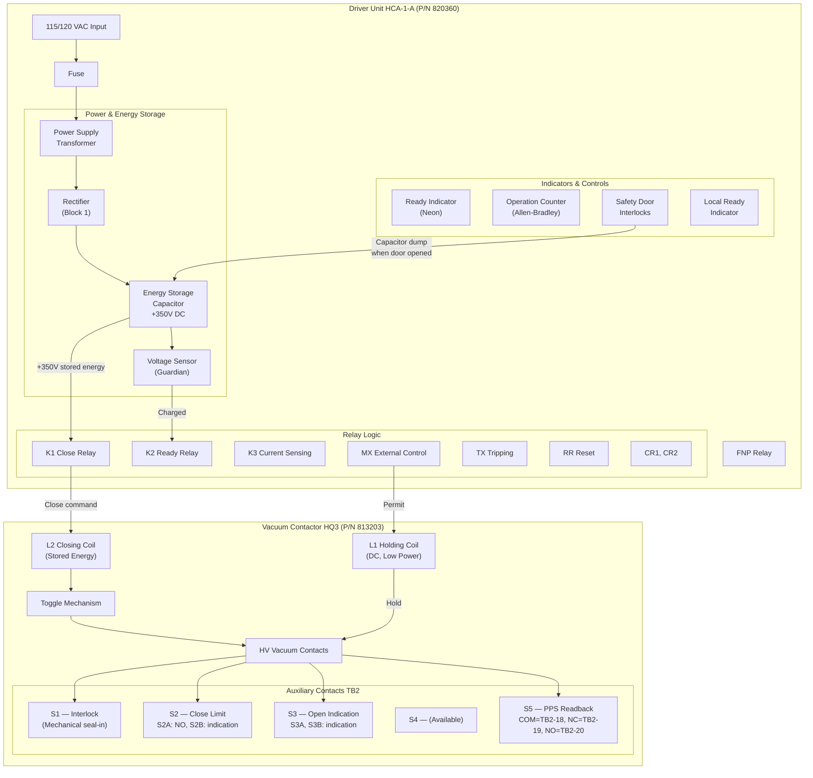
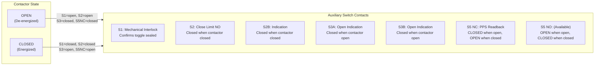

# Ross Engineering 713203 — Vacuum Contactor & Driver System Schematic

> **Drawing**: `rossEngr713203.pdf`
> **Title**: Ross Engineering Corp. System Schematic
> **Parts**: P/N 820360 (Controller/Driver HCA-1-A) + P/N 813203 (Vacuum Contactor HQ3)
> **Date**: Original 1978, ECN revisions through 2021
> **Location**: 599 Westchester Dr, Campbell, CA 95008

---

## System Block Diagram



---

## TB2 Terminal Block — Vacuum Contactor Interface

```
┌──────────────────────────────────────────────────────────────┐
│                    TB2 — VACUUM CONTACTOR                     │
│               (Ross Engineering HQ3 P/N 813203)              │
├──────┬───────────────────────────────────────────────────────┤
│ Pin  │ Function                                              │
├──────┼───────────────────────────────────────────────────────┤
│  1   │ Frame / DC Holding return                             │
│  2   │ Stored Energy (C6 connection, 40,000µF)               │
│  3   │ (Connection)                                          │
│  4   │ (Not documented)                                      │
│  5   │ S3A Auxiliary Contact                                 │
│  6   │ Current Sensing / Voltage Sensor                      │
│  7   │ (Not documented)                                      │
│  8   │ (Not documented)                                      │
│  9   │ S2 Ready Indication                                   │
│ 10   │ Contactor State                                       │
│ 11   │ S2B Limit Indication                                  │
│ 12   │ Local Reset / MT1                                     │
│ 13   │ Contactor Switch / CR7                                │
│ 14   │ MX / PPS Connection                                   │
│ 15   │ (Not documented)                                      │
│ 16   │ (Not documented)                                      │
│ 17   │ (Not documented)                                      │
│ 18   │ S5 Common (Auxiliary Contact for PPS)                 │
│ 19   │ S5 NC Contact (PPS Readback)                          │
│ 20   │ S5 NO Contact                                         │
│ S2   │ Close indication                                      │
│ S2B  │ Limit switch                                          │
│ S3A  │ Open indication                                       │
│ S3B  │ Open indication                                       │
└──────┴───────────────────────────────────────────────────────┘

PPS Readback via S5:
  Contactor OPEN  → S5 NC CLOSED  → Pins 18-19 closed circuit → SAFE
  Contactor CLOSED → S5 NC OPEN   → Pins 18-19 open circuit  → OPERATING
```

---

## Coil Specifications

```
┌──────────────────────────────────────────────────────────────────┐
│                     CONTACTOR COILS                                │
├───────────┬──────────────────────────────────────────────────────┤
│ L1        │ HOLDING COIL                                         │
│           │  - DC, Low Power                                     │
│           │  - Holds contactor closed after L2 fires             │
│           │  - Fed through MX NO contact                         │
│           │  - Fast dropout: <1 AC cycle                         │
│           │  - With AC lost: holds ≥170ms before dropout         │
├───────────┼──────────────────────────────────────────────────────┤
│ L2        │ CLOSING COIL                                         │
│           │  - High Power, Stored Energy from C6                 │
│           │  - Fires toggle mechanism to close HV contacts       │
│           │  - Energy: C6 = 40,000µF at ~350V DC                │
│           │  - Recharge time: several seconds                    │
├───────────┼──────────────────────────────────────────────────────┤
│ NOTE      │ gp4397040201 MISLABELS L1 as L2.                    │
│           │ This drawing (rossEngr713203) has CORRECT labeling.  │
└───────────┴──────────────────────────────────────────────────────┘
```

---

## Auxiliary Contact Map (S1–S5)



---

## Safety Cautions (from drawing)

```
⚠️  CAUTION: THIS IS A HV ENERGY STORAGE DEVICE
    Operating at 300 to 400 V DC
    Discharge time to 80V is approx. 5 MINUTES
    WAIT AT LEAST 5 MINUTES before touching live parts
    after removing power.

⚠️  CAUTION: AC MUST BE OFF before external discharge
    of capacitors to prevent blowing AC fuses.

⚠️  Safety door interlocks automatically discharge
    capacitors when driver door is opened.
    External terminals also provided for test/discharge
    without opening door.
```

---

## Interconnection Notes

```
Driver HCA-1-A (P/N 820360)
    └── Connected to Vacuum Contactor HQ3 via TB2
    └── Connected to Switchgear via TB3
    └── Powered by 115/120 VAC

Wire routing to Hoffman Box (TS-5):
    Wires 20, 21, 22 → TB3-22, TB3-23, TB3-24 (per GP-439-704-02)
    Also: TB2 pins 18, 19, 20 (S5 aux contacts for PPS readback)

    TS-5 in Hoffman Box:
        Pin 14 ← TB2-19 (S5 NC) via wire bundle
        Pin 15 ← TB2-18 (S5 COM) via wire bundle
        These connect to GOB12-88PNE Pins A and B for PPS readback
```

