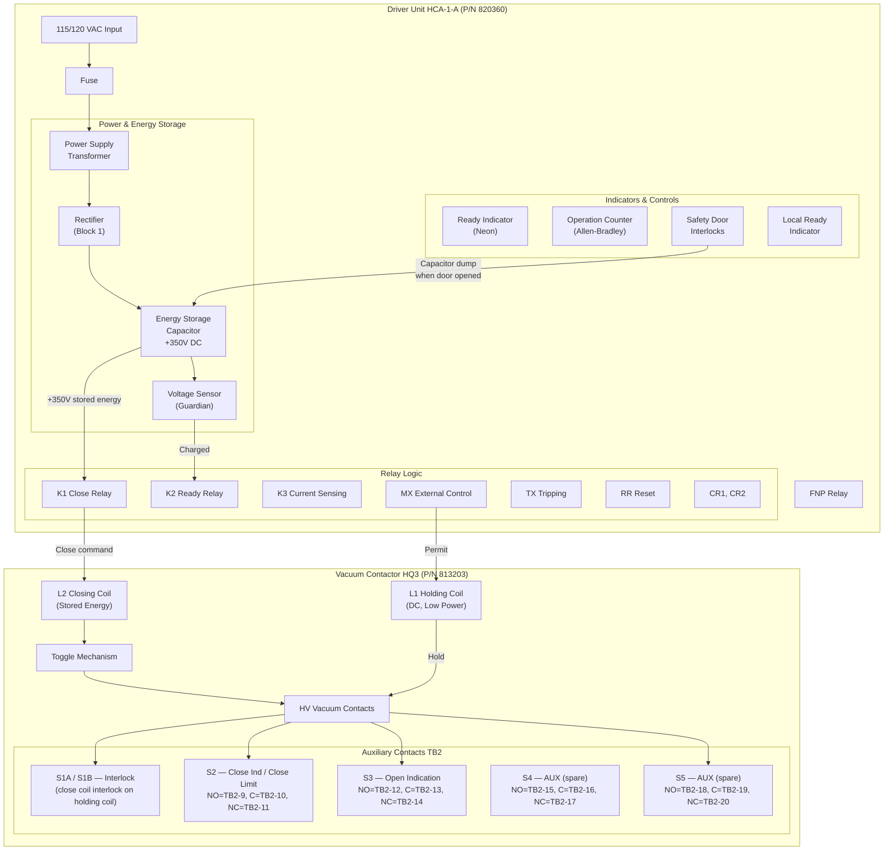
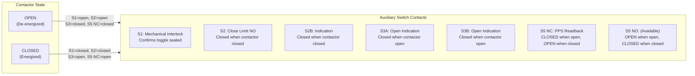

# Ross Engineering 713203 — Vacuum Contactor & Driver System Schematic

> **Drawing**: `rossEngr713203.pdf`
> **Title**: HIGH SPEED VACUUM CONTACTOR ENERGY STORAGE CLOSING & HOLDING SYSTEM SCHEMATIC
> **Manufacturer**: Ross Engineering Corp., Westchester Dr., Campbell, California
> **Drawing number**: **713203 E-1**, size C, code ident. no. 23598, sheet 1 of 1
> **Parts**: **DRIVER HCA-1-A P/N 820360** + **HQ3 VACUUM CONTACTOR P/N 813203**
> **Drawn**: January 1978
> **Condition shown**: "CONTACTOR SHOWN IN DE-ENERGIZED OPEN POSITION, REMOTE SAFETY CLOSED, DRIVER DOOR CLOSED AND DE-ENERGIZED."
>
> **Verification status: VERIFIED (3 September 2026)** — read directly from the scanned drawing rendered to image.

### Revision block (as drawn)

| Rev | Description | Date |
|---|---|---|
| A | CORRECTIONS AND ADDITIONS | 31 JAN 78 |
| B | CUSTOMER CHANGE | 13 FEB 78 |
| C | ADD TERM. NOS., IMPROVEMENTS | 14 MAR 78 |
| D | CORRECT R4 | 4 DEC 78 |
| **E** | SEE ECN # 3110 | **2-2-83** |

> **Correction**: an earlier revision of this note said "ECN revisions through 2021". The last engineering revision is **E, 2 February 1983**. The "RECEIVED APR 14 2021" mark on the sheet is a document-control receipt stamp, not a revision.

---

## System Block Diagram


```mermaid
flowchart TB
    subgraph DRIVER["Driver Unit HCA-1-A (P/N 820360)"]
        AC_IN["115/120 VAC Input"]
        FU["Fuse"]
        FNP["FNP Relay"]
        
        subgraph POWER["Power & Energy Storage"]
            XFMR["Power Supply<br/>Transformer"]
            RECT["Rectifier<br/>(Block 1)"]
            C6["Energy Storage<br/>Capacitor<br/>+350V DC"]
            VSENSOR["Voltage Sensor<br/>(Guardian)"]
        end
        
        subgraph RELAYS["Relay Logic"]
            K1["K1 Close Relay"]
            K2["K2 Ready Relay"]
            K3["K3 Current Sensing"]
            MX["MX External Control"]
            TX["TX Tripping"]
            RR["RR Reset"]
            CR1_CR2["CR1, CR2"]
        end
        
        subgraph INDICATORS["Indicators & Controls"]
            READY_IND["Ready Indicator<br/>(Neon)"]
            OPER_CTR["Operation Counter<br/>(Allen-Bradley)"]
            DOOR_INTLK["Safety Door<br/>Interlocks"]
            LOCAL_RDY["Local Ready<br/>Indicator"]
        end
    end

    subgraph CONTACTOR["Vacuum Contactor HQ3 (P/N 813203)"]
        L1_HOLD["L1 Holding Coil<br/>(DC, Low Power)"]
        L2_CLOSE["L2 Closing Coil<br/>(Stored Energy)"]
        TOGGLE["Toggle Mechanism"]
        HV_CONTACTS["HV Vacuum Contacts"]
        
        subgraph AUX["Auxiliary Contacts TB2"]
            S1["S1A / S1B — Interlock<br/>(close coil interlock on holding coil)"]
            S2["S2 — Close Ind / Close Limit<br/>NO=TB2-9, C=TB2-10, NC=TB2-11"]
            S3["S3 — Open Indication<br/>NO=TB2-12, C=TB2-13, NC=TB2-14"]
            S4["S4 — AUX (spare)<br/>NO=TB2-15, C=TB2-16, NC=TB2-17"]
            S5["S5 — AUX (spare)<br/>NO=TB2-18, C=TB2-19, NC=TB2-20"]
        end
    end

    AC_IN --> FU --> XFMR --> RECT --> C6
    C6 --> VSENSOR
    VSENSOR -->|"Charged"| K2
    C6 -->|"+350V stored energy"| K1
    K1 -->|"Close command"| L2_CLOSE
    L2_CLOSE --> TOGGLE
    TOGGLE --> HV_CONTACTS
    MX -->|"Permit"| L1_HOLD
    L1_HOLD -->|"Hold"| HV_CONTACTS
    HV_CONTACTS --> S1 & S2 & S3 & S5
    DOOR_INTLK -->|"Capacitor dump<br/>when door opened"| C6
```

---

## TB2 Terminal Block — Vacuum Contactor Interface

```
┌──────────────────────────────────────────────────────────────┐
│                    TB2 — VACUUM CONTACTOR                     │
│               (Ross Engineering HQ3 P/N 813203)              │
├──────┬───────────────────────────────────────────────────────┤
│ Pin  │ Function                                              │
├──────┼───────────────────────────────────────────────────────┤
│  1   │ Frame / DC Holding return                             │
│  2   │ Stored Energy (C6 connection, 40,000µF)               │
│  3   │ (Connection)                                          │
│  4   │ (Not documented)                                      │
│  5   │ S3A Auxiliary Contact                                 │
│  6   │ Current Sensing / Voltage Sensor                      │
│  7   │ (Not documented)                                      │
│  8   │ (Not documented)                                      │
│  9   │ S2 Ready Indication                                   │
│ 10   │ Contactor State                                       │
│ 11   │ S2B Limit Indication                                  │
│ 12   │ Local Reset / MT1                                     │
│ 13   │ Contactor Switch / CR7                                │
│ 14   │ MX / PPS Connection                                   │
│ 15   │ (Not documented)                                      │
│ 16   │ (Not documented)                                      │
│ 17   │ (Not documented)                                      │
│ 18   │ S5 Common (Auxiliary Contact for PPS)                 │
│ 19   │ S5 NC Contact (PPS Readback)                          │
│ 20   │ S5 NO Contact                                         │
│ S2   │ Close indication                                      │
│ S2B  │ Limit switch                                          │
│ S3A  │ Open indication                                       │
│ S3B  │ Open indication                                       │
└──────┴───────────────────────────────────────────────────────┘

PPS Readback via S5:
  Contactor OPEN  → S5 NC CLOSED  → Pins 18-19 closed circuit → SAFE
  Contactor CLOSED → S5 NC OPEN   → Pins 18-19 open circuit  → OPERATING
```

---

## Coil Specifications

```
┌──────────────────────────────────────────────────────────────────┐
│                     CONTACTOR COILS                                │
├───────────┬──────────────────────────────────────────────────────┤
│ L1        │ HOLDING COIL                                         │
│           │  - DC, Low Power                                     │
│           │  - Holds contactor closed after L2 fires             │
│           │  - Fed through MX NO contact                         │
│           │  - Fast dropout: <1 AC cycle                         │
│           │  - With AC lost: holds ≥170ms before dropout         │
├───────────┼──────────────────────────────────────────────────────┤
│ L2        │ CLOSING COIL                                         │
│           │  - High Power, Stored Energy from C6                 │
│           │  - Fires toggle mechanism to close HV contacts       │
│           │  - Energy: C6 = 40,000µF at ~350V DC                │
│           │  - Recharge time: several seconds                    │
├───────────┼──────────────────────────────────────────────────────┤
│ NOTE      │ gp4397040201 MISLABELS L1 as L2.                    │
│           │ This drawing (rossEngr713203) has CORRECT labeling.  │
└───────────┴──────────────────────────────────────────────────────┘
```

---

## Auxiliary Contact Map (S1–S5)


```mermaid
flowchart LR
    subgraph CONTACTOR_STATE["Contactor State"]
        OPEN["OPEN<br/>(De-energized)"]
        CLOSED["CLOSED<br/>(Energized)"]
    end

    subgraph S_CONTACTS["Auxiliary Switch Contacts"]
        S1["S1: Mechanical Interlock<br/>Confirms toggle sealed"]
        S2A["S2: Close Limit NO<br/>Closed when contactor closed"]
        S2B["S2B: Indication<br/>Closed when contactor closed"]
        S3A["S3A: Open Indication<br/>Closed when contactor open"]
        S3B["S3B: Open Indication<br/>Closed when contactor open"]
        S5_NC["S5 NC: PPS Readback<br/>CLOSED when open, OPEN when closed"]
        S5_NO["S5 NO: (Available)<br/>OPEN when open, CLOSED when closed"]
    end

    OPEN -->|"S1=open, S2=open<br/>S3=closed, S5 NC=closed"| S_CONTACTS
    CLOSED -->|"S1=closed, S2=closed<br/>S3=open, S5 NC=open"| S_CONTACTS
```

> The S5 states above assume S5 follows the contactor main contacts in the same sense as S2/S3. The drawing labels S4 and S5 only as "AUX" and does not show their mechanical sense; confirm in the field before relying on this.

---

## Notes on the drawing — transcribed verbatim

1. **"CAUTION MUST BE USED SINCE THIS IS A HV ENERGY STORAGE DEVICE OPERATING AT 300 TO 400 V DC. DISCHARGE TIME TO 80 V IS APPROX. 5 MINUTES AND TO 40 V IS APPROX. 10 MINUTES, IF NOT AUTOMATIC. BEFORE TOUCHING LIVE PARTS WAIT AT LEAST 5 MINUTES AFTER REMOVING POWER AND THEN SHORT BOTH."**
2. "CLOSE CIRCUITS SHOULD BE WIRED WITH AT LEAST #14 WIRE. IF THERE IS CONSIDERABLE DISTANCE BETWEEN BREAKER, ENERGY STORAGE SUPPLY, OR CLOSE RELAY, AT LEAST #12 WIRE SHOULD BE USED."
3. "115 V AC POWER REQUIRED IS 8 AMPS MOMENTARY, 1/2 AMP CONTINUOUS."
4. **"SAFETY DOOR INTERLOCKS S1 AND S2 SHOWN WITH DOOR CLOSED. BOTH ENERGY STORAGE CAPACITORS ARE DISCHARGED WITHIN 5 SECONDS WHEN DRIVER DOOR IS OPENED."**

> **Two distinct discharge paths.** Note 4's automatic 5-second dump happens **only when the driver door is opened** (interlock switches S1/S2 in the driver, which are *not* the same devices as the contactor auxiliary contacts S1A/S1B, S2 on TB2). If the automatic dump does not operate, Note 1 applies: **wait at least 5 minutes, then short both capacitors.** The "approx. 5 minutes" figure is the decay to 80 V, not to zero; decay to 40 V takes about 10 minutes.

### Energy storage summary

| Item | Value |
|---|---|
| Storage voltage | 300–400 V DC (+350 V DC nominal on the drawing) |
| HV closing capacitors | C1–C7, 4800 µF, 450 V |
| LV hold-in capacitor | C8, 40,000 µF, 40 V |
| Automatic dump on door open | Both capacitors, within **5 s** |
| Manual safe time if dump inoperative | **≥ 5 min**, then short both |
| Dump components | R9–R13 2 Ω 25 W; K3 (P&B KUP11D55, 10 A 6 V DC) |
| Voltage sensor | Guardian IR-LDT-100 |

---

## TB2 — HQ3 Vacuum Contactor terminal block (as drawn)

| Terminal | Function |
|---|---|
| 1 | DC holding and dropout coil, 1.5 Ω |
| 2 | Operations counter (2 µF 600 V across it) |
| 3 | S1B — close coil interlock on holding coil, 480 V 15 A |
| 4 | S1B (NC) |
| 5 | — |
| 6 | **L2 close coil, 1.5 Ω** |
| 7, 8 | NOT USED |
| **9 / 10 / 11** | **S2** — NO / C / NC — CLOSE IND, CLOSE LIMIT |
| **12 / 13 / 14** | **S3** — NO / C / NC — OPEN IND |
| **15 / 16 / 17** | **S4** — NO / C / NC — AUX (spare) |
| **18 / 19 / 20** | **S5** — NO / C / NC — AUX (spare) |
| 21, 22 | — |
| 23, 24 | NOT USED |

> The auxiliary contact sets follow a consistent **NO / COM / NC** order on ascending terminal numbers.

---

## Interconnection Notes

```
Driver HCA-1-A (P/N 820360)
    └── Connected to Vacuum Contactor HQ3 via TB2
    └── Connected to Switchgear via TB3
    └── Powered by 115/120 VAC (8 A momentary, 1/2 A continuous — Note 3)

Wire routing:
    Wires 20, 21, 22 → TB3-22, TB3-23, TB3-24
    These are the terminals labelled "PPS (CONTACTOR)" on GP-439-704-02-C1
    and are the PPS interface to the 12.47 kV contactor (PPS Chain 1).
```

### Contact orientation — corrected

Per the drawing:

| Terminal | S5 contact |
|---|---|
| TB2-18 | **NO** |
| TB2-19 | **COM** |
| TB2-20 | **NC** |

### Unconfirmed: which auxiliary contact serves the PPS readback

It is sometimes assumed that S5 is "the PPS readback" and that TB2-18/19 land on Hoffman Box TS-5 pins 15/14 and thence on GOB1208PNE pins A and B.

**On this drawing that is not established.** Neither this drawing nor GP-439-704-02-C1 identifies S4 or S5 as a PPS readback; both are simply labelled "AUX". J. Sebek's `HoffmanBoxPPSWiring.docx` states explicitly that the pin-pair assignment (E–F / G–H) and the readback assignment (A–B / C–D) on the GOB1208PNE connector are **an unconfirmed assumption**. Treat the mapping above as a hypothesis to be verified in the field, not as documented fact.

