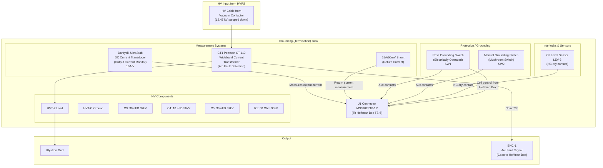
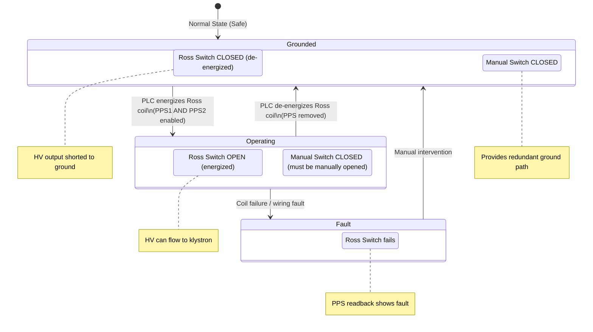

# SD-730-790-05-C1 — Grounding (Termination) Tank Schematic

> **Drawing**: `sd7307900501.pdf`
> **Title**: PEP-II 2MW Klystron Power Supply — Grounding Tank
> **Engineers**: R. Cassel (ENGR), W. Corpora (DFTR), J. Olszewski (CHKR)

---

## System Block Diagram



---

## Detailed Circuit Diagram (ASCII)

```
                            HV INPUT FROM HVPS
                                  │
                                  ▼
                    ┌─────────────────────────┐
                    │     CT1 (Pearson CT-110) │
                    │   Wideband Current XFMR  │
                    │   (Arc Fault Detection)  │
                    └──────────┬──────────────┘
                               │
                    ┌──────────┴──────────────┐
                    │                          │
            ┌───────┴────┐            ┌───────┴────────┐
            │  Danfysik  │            │  HV Path       │
            │  DC-CT     │            │                │
            │  10A/V     │            │  ┌──────────┐  │
            │  UltraStab │            │  │ HVT-2    │  │
            └──────┬─────┘            │  │ (Load)   │  │
                   │                  │  └────┬─────┘  │
                   │ Analog           │       │        │
                   │ Output           │       ▼        │
                   │                  │   To Klystron  │
                   ▼                  │       Grid     │
              J1 pins 1-2            │                │
              (to TS-6               │                │
              pins 1-2)              └────────────────┘
                                             │
                                             │ HV Return
                                             ▼
    ┌──────────────────────────────────────────────────────────┐
    │                   GROUNDING SECTION                        │
    │                                                            │
    │  ┌────────────┐   ┌───────────────┐   ┌──────────────┐  │
    │  │ Ross GRN   │   │ Manual GRN    │   │ 15A/50mV     │  │
    │  │ Switch SW1 │   │ Switch SW2    │   │ Shunt        │  │
    │  │ (Electric) │   │ (Mushroom)    │   │ (Return I)   │  │
    │  │            │   │               │   │              │  │
    │  │ Coil←──J1  │   │               │   │ Pins 20-21   │  │
    │  │ COM ──→J1  │   │ NO ──→J1      │   │ (to TS-6     │  │
    │  │ NC  ──→J1  │   │ COM──→J1      │   │  20-21)      │  │
    │  │ NO  ──→J1  │   │               │   │              │  │
    │  └────────────┘   └───────────────┘   └──────────────┘  │
    │                                                            │
    │  ┌────────────┐   ┌───────────────────────────────────┐  │
    │  │ Oil Level  │   │ HV Filter Capacitors & Resistor   │  │
    │  │ LEV-3      │   │ C3: 30nFD 37kV                    │  │
    │  │ NC contact │   │ C4: 10nFD 56kV                    │  │
    │  │ to J1      │   │ C5: 30nFD 37kV                    │  │
    │  └────────────┘   │ R1: 50Ω 90kV                      │  │
    │                    │ L1,L2: 350µHY 40A (inductors)     │  │
    │                    └───────────────────────────────────┘  │
    │                                                            │
    │                  HVT-G (Ground Reference)                 │
    └──────────────────────────────────────────────────────────┘
```

---

## J1 Connector Pinout (MS3102R18-1P)

> This connector interfaces to P5 on WD-730-794-06-C0, which connects to TS-6 in the Hoffman Box.

```
┌─────────────────────────────────────────────────────────────────┐
│  J1 Connector — MS3102R18-1P  (Grounding Tank Side)            │
├──────┬──────────────────────────────────────────────────────────┤
│ Pin  │ Function                              │ TS-6 Pin        │
├──────┼───────────────────────────────────────┼─────────────────┤
│  A   │ Danfysik +Output                      │ TS-6 pin 1      │
│  B   │ Danfysik -Output                      │ TS-6 pin 2      │
│  C   │ Danfysik +V Supply                    │ TS-6 pin 3      │
│  D   │ Danfysik -V Supply                    │ TS-6 pin 4      │
│  E   │ Danfysik +15V                         │ TS-6 pin 5      │
│  F   │ Danfysik -15V                         │ TS-6 pin 6      │
│  G   │ Oil Level NC (12VDC sourced)          │ TS-6 pin 7      │
│  H   │ Oil Level Common                      │ TS-6 pin 8      │
│  J   │ Manual GRN SW NO                      │ TS-6 pin 9      │
│  K   │ Manual GRN SW COM                     │ TS-6 pin 10     │
│  L   │ Ross GRN SW COM (Aux)                 │ TS-6 pin 11     │
│  M   │ Ross GRN SW NC (Aux)                  │ TS-6 pin 12     │
│  N   │ Ross GRN SW Coil (+)                  │ TS-6 pin 13     │
│  P   │ Ross GRN SW Coil (-)                  │ TS-6 pin 14     │
│  R   │ Ross GRN SW NO (Aux)                  │ TS-6 pin 19     │
│  S   │ Shunt (+)                             │ TS-6 pin 20     │
│  T   │ Shunt (-) / Earth GRN Tank            │ TS-6 pin 21     │
└──────┴───────────────────────────────────────┴─────────────────┘
```

---

## Grounding Switch States



### PPS Readback Logic for Ross Switch

```
Ross Switch State     │ Aux NC Contact │ TS-6 Pins 11-12 │ GOB12-88PNE C-D
─────────────────────┼────────────────┼──────────────────┼─────────────────
CLOSED (grounded)    │ CLOSED         │ Closed circuit   │ Closed = SAFE
OPEN (operating)     │ OPEN           │ Open circuit     │ Open = OPERATING
```

### Manual Grounding Switch Status

```
Manual Switch State   │ Aux Contact    │ TS-6 Pins 9-10   │ PLC Input
─────────────────────┼────────────────┼───────────────────┼──────────────
CLOSED (grounded)    │ NC=CLOSED      │ 12VDC present     │ Slot-6 IN9 ON
OPEN                 │ NC=OPEN        │ No voltage        │ Slot-6 IN9 OFF

⚠️ Documentation inconsistency:
   WD-730-794-06-C0 shows this as NO contact
   SD-730-790-05-C1 shows this as NC contact
   Field verification needed!
```

---

## Arc Fault Monitoring

```
Pearson CT-110 (CT1)
    │
    │  Wideband current transformer on HV output cable
    │  Detects transients = klystron arcs
    │
    ├── Coaxial cable (BNC, ~70 ft)
    │
    └──→ BNC-1 on Hoffman Box
         └──→ J1 of Left Side Trigger Interconnect Board
              (SD-730-793-08-C1)
              └──→ Crowbar trigger when transient exceeds threshold

    NOTE: This is NOT part of PPS. It is a fast-protection
    system that triggers the crowbar to dump stored energy
    during a klystron arc.
```

---

## Oil Level Monitoring

```
Oil Level Sensor (LEV-3)
    │
    │  NC dry contact in grounding tank oil
    │  Normally closed when oil level OK
    │
    ├── TS-6 pin 7: 12VDC sourced from Hoffman Box
    ├── TS-6 pin 8: Return to PLC
    │
    └──→ Slot-6 AB-1746-IB16 Input 8

    Oil OK:    NC contact closed → 12VDC returns → Input 8 = ON
    Oil Low:   NC contact opens  → No return     → Input 8 = OFF → ALARM
```

---

## Component Specifications

| Component | Part/Type | Specification | Function |
|-----------|-----------|---------------|----------|
| CT1 | Pearson CT-110 | Wideband current XFMR | Arc fault detection |
| Danfysik | UltraStab DC-CT | 10A/V output | HVPS output current monitor |
| Ross GRN SW | Ross Engineering | Electrically operated | HV output grounding |
| Manual GRN SW | Mushroom switch | Manually operated | Redundant grounding |
| Shunt | 15A/50mV | Current shunt | Return cable current |
| LEV-3 | Oil level sensor | NC dry contact | Tank oil level |
| C3 | Capacitor | 30 nFD, 37kV | HV filter |
| C4 | Capacitor | 10 nFD, 56kV | HV filter |
| C5 | Capacitor | 30 nFD, 37kV | HV filter |
| R1 | Resistor | 50 Ohm, 90kV | HV filter/bleeder |
| L1, L2 | Inductors | 350 µHY, 40A | HV filter |
| HVT-2 | HV Terminal | 25kV, 100A | Load connection |
| J1 | MS3102R18-1P | Circular connector | Interface to Hoffman Box |

