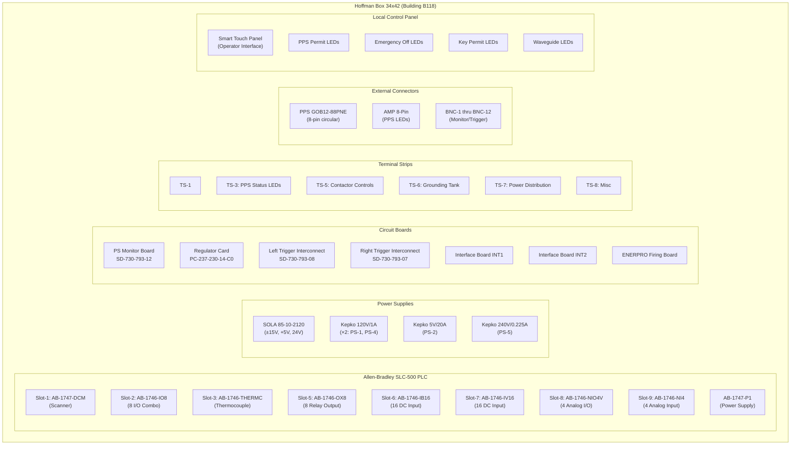
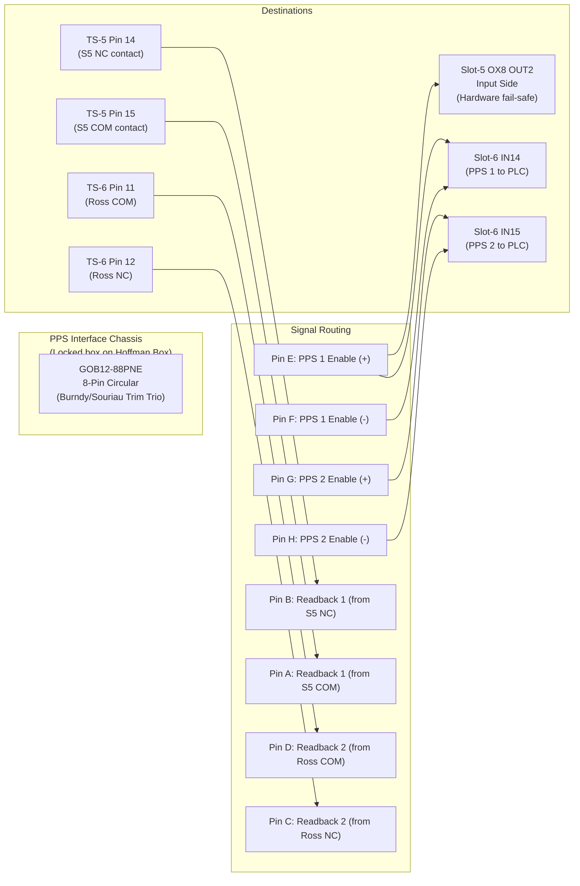

# WD-730-790-02-C6 — HVPS Controller Wiring (Hoffman Box)

> **Drawing**: `wd7307900206.pdf`
> **Title**: PEP-II RF Systems — 2.5MW Klystron PWR SPLY — Trigger Enclosure Wiring
> **Engineers**: R. Cassel (ENGR), W. Gorecki (DFTR)
> **CAD File**: wd730790020601.dgn

---

## Hoffman Box — Master Layout



---

## PLC Slot Allocation — Detailed I/O Map

### Slot-1: AB-1747-DCM (Data Communications Module)
```
Scanner / communications module
Connected to: AB-1747-L532 (processor)
```

### Slot-2: AB-1746-IO8 (8-point Digital I/O Combo)

```
┌────────────────────────────────────────────────────────────────┐
│  SLOT-2: AB-1746-IO8                                           │
├──────────┬────────┬────────────────────────────────────────────┤
│ Channel  │ Dir    │ Function                                   │
├──────────┼────────┼────────────────────────────────────────────┤
│ OUT 3    │ Output │ Ross Grounding Switch Relay Coil (120VAC)  │
│          │        │ PLC Rung 0016: PPS1 AND PPS2 → energize   │
│ OUT 5    │ Output │ (Referenced in code)                       │
│ IN 1+    │ Input  │ (Connection shown)                         │
│ IN 1-    │ Input  │ (Connection shown)                         │
│ IN 2+    │ Input  │ (Connection shown)                         │
│ IN 2-    │ Input  │ (Connection shown)                         │
│ COM      │ Common │ AC Common                                  │
└──────────┴────────┴────────────────────────────────────────────┘
```

### Slot-3: AB-1746-THERMC (Thermocouple Input)
```
Thermocouple inputs for temperature monitoring
(SCR oil temps, air temps, transformer temps)
```

### Slot-5: AB-1746-OX8 (8-point Relay Output)

```
┌────────────────────────────────────────────────────────────────┐
│  SLOT-5: AB-1746-OX8                                           │
├──────────┬────────┬────────────────────────────────────────────┤
│ Channel  │ Dir    │ Function                                   │
├──────────┼────────┼────────────────────────────────────────────┤
│ OUT 2    │ Output │ *** CONTACTOR ENABLE ***                   │
│          │        │ Energizes K4 relay in switchgear           │
│          │        │ PLC Rung 0017: Touch Panel Enable          │
│          │        │   AND Emergency Off Clear                  │
│          │        │ INPUT SIDE: PPS 1 signal (24VDC from       │
│          │        │   GOB12-88PNE) — HARDWARE FAIL-SAFE       │
│ OUT 1    │ Output │ Contactor On/Off (Rung 0002)              │
│ (others) │ Output │ Various control outputs                    │
└──────────┴────────┴────────────────────────────────────────────┘

⚠️  CRITICAL SAFETY NOTE:
    The OX8 module uses relay contacts.
    The INPUT side of OUT 2 relay contacts is wired to PPS 1 signal
    (24VDC from GOB12-88PNE connector, not from PLC power).
    If PPS removes 24VDC, K4 CANNOT be energized even if PLC fails.
```

### Slot-6: AB-1746-IB16 (16-point DC Input)

```
┌────────────────────────────────────────────────────────────────┐
│  SLOT-6: AB-1746-IB16                                          │
├──────────┬────────────────────────────────────────────────────┤
│ Input    │ Function                                            │
├──────────┼────────────────────────────────────────────────────┤
│ IN 0     │ (Available)                                         │
│ IN 1     │ (Available)                                         │
│ IN 2     │ (Available)                                         │
│ IN 3     │ (Available)                                         │
│ IN 4     │ (Available)                                         │
│ IN 5     │ (Available)                                         │
│ IN 6     │ (Available)                                         │
│ IN 7     │ (Available)                                         │
│ IN 8     │ Grounding Tank Oil Level (LEV-3 NC contact)        │
│ IN 9     │ Manual Grounding Switch Status (aux contact)       │
│ IN 10    │ (Available)                                         │
│ IN 11    │ (Available)                                         │
│ IN 12    │ (Available)                                         │
│ IN 13    │ (Available)                                         │
│ IN 14    │ *** PPS 1 Input *** (from GOB12-88PNE)            │
│          │   Rungs: 0014 (Emergency Off), 0015 (PPS ON),     │
│          │          0016 (Ross Switch Enable)                  │
│ IN 15    │ *** PPS 2 Input *** (from GOB12-88PNE)            │
│          │   Rungs: 0015 (PPS ON), 0016 (Ross Switch),       │
│          │          0068 (Bias Power Enable)                   │
└──────────┴────────────────────────────────────────────────────┘
```

### Slot-7: AB-1746-IV16 (16-point DC Input)
```
Additional digital inputs (permits, status)
```

### Slot-8: AB-1746-NIO4V (4-point Analog I/O)
```
Analog voltage I/O for control signals
```

### Slot-9: AB-1746-NI4 (4-point Analog Input)

```
┌────────────────────────────────────────────────────────────────┐
│  SLOT-9: AB-1746-NI4                                           │
├──────────┬────────────────────────────────────────────────────┤
│ Input    │ Function                                            │
├──────────┼────────────────────────────────────────────────────┤
│ IN 3     │ Danfysik DC-CT analog output                       │
│          │ (HVPS output current to klystron)                   │
│          │ Connected via TS-6 pins 1-2                         │
└──────────┴────────────────────────────────────────────────────┘
```

---

## Terminal Strip Assignments

### TS-3: PPS Status LEDs
```
Connects to AMP 8-Pin connector
4 LEDs on exterior of Hoffman Box:
  - 2× GREEN (PPS OK indicators)
  - 2× RED (PPS fault indicators)
```

### TS-5: Contactor Controls

```
┌──────────────────────────────────────────────────────────────────┐
│  TS-5 — CONTACTOR CONTROLS                                       │
│  (Interface between Hoffman Box and Contactor Disconnect Panel)  │
├──────┬──────────────┬────────────────────────────────────────────┤
│ Pin  │ Wire Color   │ Function                                   │
├──────┼──────────────┼────────────────────────────────────────────┤
│  1   │              │ (Contactor control signal)                 │
│  2   │              │ (Contactor control signal)                 │
│  3   │              │ DC Voltage                                 │
│  4   │              │ (Connection)                               │
│  5   │              │ Contactor Ready                            │
│  6   │              │ (Connection)                               │
│  7   │              │ Contactor Closed indicator                 │
│  8   │              │ (Connection)                               │
│  9   │              │ Reset contact                              │
│ 10   │              │ (Connection)                               │
│ 11   │              │ PPS signal                                 │
│ 12   │              │ PPS Common                                 │
│ 13   │              │ Close/Ready                                │
│ 14   │              │ S5 NC aux (PPS Readback) → Pin B          │
│ 15   │              │ S5 COM aux (PPS Readback) → Pin A         │
├──────┼──────────────┼────────────────────────────────────────────┤
│ Cable│ Belden 83715 │ 15 conductor, #16 AWG, Teflon insulated   │
│      │              │ Routed to Contactor Disconnect Panel       │
└──────┴──────────────┴────────────────────────────────────────────┘
```

### TS-6: Grounding Tank Interface

```
┌──────────────────────────────────────────────────────────────────┐
│  TS-6 — GROUNDING TANK CONNECTIONS                                │
│  (Interface between Hoffman Box and Termination Tank)            │
├──────┬──────────────┬────────────┬───────────────────────────────┤
│ Pin  │ Wire Color   │ Dest       │ Function                      │
├──────┼──────────────┼────────────┼───────────────────────────────┤
│  1   │              │ J2/Danfysik│ Danfysik Analog Output (+)    │
│  2   │              │ J2/Danfysik│ Danfysik Analog Output (-)    │
│  3   │              │ J2/Danfysik│ Danfysik +V Supply            │
│  4   │              │ J2/Danfysik│ Danfysik -V Supply            │
│  5   │              │ J2/Danfysik│ Danfysik +15V                 │
│  6   │              │ J2/Danfysik│ Danfysik -15V                 │
│  7   │              │ P5/Oil     │ Oil Level 12VDC Source         │
│  8   │              │ P5/Oil     │ Oil Level Return → Slot6 IN8  │
│  9   │              │ P5/ManSW   │ Manual GRN SW (NO/NC*)        │
│ 10   │              │ P5/ManSW   │ Manual GRN SW Common          │
│ 11   │ GRN/BLK      │ P5/Ross   │ Ross GRN SW Aux COM           │
│      │              │            │ → Pin D of GOB12-88PNE        │
│ 12   │              │ P5/Ross   │ Ross GRN SW Aux NC             │
│      │              │            │ → Pin C of GOB12-88PNE        │
│ 13   │              │ P5/Ross   │ Ross GRN SW Coil (+)           │
│      │              │            │ ← Slot-2 IO8 OUT3 (120VAC)   │
│ 14   │              │ P5/Ross   │ Ross GRN SW Coil (-)           │
│      │              │            │ ← Slot-2 IO8 AC COM           │
│ 15   │              │ SCR Tank  │ SCR Phase Tank Oil Level       │
│ 16   │              │ SCR Tank  │ SCR Phase Tank Oil Level       │
│ 17   │              │ Crowbar   │ Crowbar Tank Oil Level         │
│ 18   │              │ Crowbar   │ Crowbar Tank Oil Level         │
│ 19   │              │ P5/Ross   │ Ross GRN SW Aux NO             │
│ 20   │              │ P5/Shunt  │ Return Current Shunt (+)       │
│ 21   │              │ P5/Shunt  │ Return Current Shunt (-)       │
│      │              │            │ (Earth of Grounding Tank)     │
├──────┼──────────────┼────────────┼───────────────────────────────┤
│ Cable│ Belding 83709│            │ 9 conductor, #16 AWG, Teflon  │
│      │              │            │ + Belden 83715 15C #16        │
└──────┴──────────────┴────────────┴───────────────────────────────┘
```

### TS-7: Power Distribution
```
TS7-1:  120VAC A Phase
TS7-13: Filter
TS7-14: Filter
```

---

## PPS Connector — GOB12-88PNE Wiring



---

## Power Distribution

```
120VAC Input (3-Phase + Neutral)
    │
    ├── Phase A (TS7-1) ──→ SOLA 85-10-2120
    │                        ├── +15V, -15V (Danfysik, Monitor Board)
    │                        ├── +5V (Logic)
    │                        └── +24V (Control)
    │
    ├── Phase B ──→ Kepko 120V/1A (PS-1) ──→ Crowbar Left Side
    │           ──→ Kepko 120V/1A (PS-4) ──→ Crowbar Right Side
    │
    ├── Phase C ──→ Kepko 5V/20A (PS-2) ──→ Filament/Heater
    │           ──→ Kepko 240V/0.225A (PS-5) ──→ HV Bias
    │
    └── 120V/24V Transformer ──→ 24VDC for PLC, relays, control
                              ──→ AC Bias Power Supply

    120VAC ──→ ENERPRO Firing Board ──→ SCR Gate Triggers
    120VAC ──→ AC Bias P.S. ──→ Klystron Bias
    120VAC ──→ GRN Tank Relay Coil (via Slot-2 OUT3)
    240VDC ──→ P.S. ──→ (High voltage control)
```

---

## BNC Monitor/Trigger Connections

```
┌──────────────────────────────────────────────────────┐
│  BNC Panel (Rear of Hoffman Box)                      │
├──────────┬───────────────────────────────────────────┤
│ BNC-1    │ Arc Fault (Pearson CT from Grounding Tank)│
│ BNC-2    │ Thermocouple                              │
│ BNC-3    │ (Monitor)                                  │
│ BNC-4    │ (Monitor)                                  │
│ BNC-5    │ (Monitor)                                  │
│ BNC-6    │ (Monitor)                                  │
│ BNC-7    │ (Monitor)                                  │
│ BNC-8    │ (Monitor)                                  │
│ BNC-9    │ (Monitor)                                  │
│ BNC-10   │ (Monitor)                                  │
│ BNC-11   │ (Monitor)                                  │
│ BNC-12   │ (Monitor)                                  │
│ Isolated │ (Isolated BNC)                             │
└──────────┴───────────────────────────────────────────┘
```

---

## Local Control Panel

```
┌─────────────────────────────────────────────────────────┐
│              LOCAL CONTROL PANEL                         │
│  (Front of Hoffman Box)                                  │
├─────────────────────────────────────────────────────────┤
│                                                          │
│  ┌─────────┐  ┌──────────┐  ┌──────────┐  ┌─────────┐ │
│  │ PPS     │  │EMERGENCY │  │ KEY      │  │WAVEGUIDE│ │
│  │ PERMIT  │  │  OFF     │  │ PERMIT   │  │         │ │
│  │ LED(G/R)│  │ LED(G/R) │  │ LED(G/R) │  │ LED(G/R)│ │
│  └─────────┘  └──────────┘  └──────────┘  └─────────┘ │
│                                                          │
│  ┌──────────────────┐  ┌──────────────────────────────┐ │
│  │ SMART TOUCH      │  │ EMERGENCY OFF    EMERGENCY   │ │
│  │ PANEL            │  │ NC Switch        OFF NC      │ │
│  │ (Operator I/F)   │  │                  Switch      │ │
│  └──────────────────┘  └──────────────────────────────┘ │
│                                                          │
│  KEY PERMIT NO Switch                                    │
│  54VDC 4-Position Selector                               │
│                                                          │
│  CROWBAR indicators                                      │
│  SCR Bottom Oil / SCR Top Oil B                          │
│  Air Temp indicators                                     │
└─────────────────────────────────────────────────────────┘
```

---

## Weidmuller Terminal Block Parts List

```
1. QTY (2) WDK 2.5 PE  P/N 1036300000  (Ground terminal)
2. QTY (2) WDU 2.5     P/N 1020080000  (Feed-through terminal)
3. QTY (6) WDU 2.5     P/N 1020010000  (Feed-through terminal)
4. QTY (6) WDU 2.5     P/N 1020000000  (Feed-through terminal)
5. QTY (4) WSI 4/2-11/4x1/4 P/N 1880430000 (Fuse terminal)
6. QTY (1) ZQV 2.5     P/N 1693800000  (Cross connector)
7. QTY (1) ZQV 2.5     P/N 1693810000  (Cross connector)
8. QTY (1) WEW 35      P/N 1840460000  (End bracket)
```

