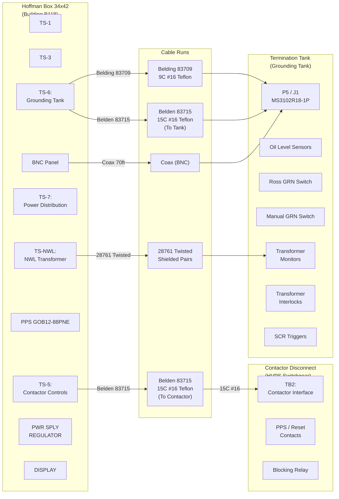

# WD-730-790-01-C3 — Full Interconnection Wiring Diagram

> **Drawing**: `wd7307900103.pdf`
> **Title**: PEP-II RF Systems — 2MW Klystron PWR SPLY — Interconnection Wiring
> **Engineers**: R. Cassel (ENGR), W. Gorecki (DFTR)
> **CAD File**: 73079001.WD3
> **Scope**: B118 Hoffman Box ↔ Contactor Disconnect ↔ Termination Tank (complete)

---

## System Interconnection Overview



---

## Hoffman Box to Contactor Disconnect — Detailed Wiring

### Cable: Belden 83715, 15 Conductor, #16 AWG, Teflon

```
┌─────────────────────────────────────────────────────────────────────────────┐
│  HOFFMAN BOX (TS-5)              Cable                CONTACTOR DISCONNECT  │
│  Contactor Controls              Belden 83715         TB2 Interface         │
├──────────┬──────────────────────┬──────────────┬──────────┬────────────────┤
│ TS-5 Pin │ Hoffman Function     │ Wire Color   │ TB2 Pin  │ Remote Func    │
├──────────┼──────────────────────┼──────────────┼──────────┼────────────────┤
│    1     │ DC Voltage           │              │ TB2-?    │ DC Voltage     │
│    2     │ DC Voltage           │              │ TB2-?    │ DC Voltage     │
│    3     │ Contactor Ready      │              │ TB2-?    │ Ready Status   │
│    4     │                      │              │ TB2-?    │                │
│    5     │ Contactor Closed     │              │ TB2-?    │ Closed Status  │
│    6     │                      │              │ TB2-?    │                │
│    7     │                      │              │          │                │
│    8     │ Reset Contacts       │ BLU          │ TB2-?    │ Reset          │
│    9     │ PPS Signal           │              │ TB2-?    │ PPS            │
│   10     │                      │              │          │                │
│   11     │ PPS COM              │              │ TB2-?    │ PPS COM        │
│   12     │ Close/Ready          │ RED/BLK      │ TB2-?    │ Close Ready    │
│   13     │ Common               │              │ TB2-?    │ Common         │
│   14     │ S5 NC (PPS Readback) │              │ S5-NC    │ Contactor NC   │
│   15     │ S5 COM (PPS Readback)│              │ S5-COM   │ Contactor COM  │
├──────────┼──────────────────────┼──────────────┼──────────┼────────────────┤
│   16     │ PPS-S (Contactor En) │              │ K4/MX    │ Contactor Enab │
│          │ ← Slot-5 OX8 OUT2   │              │          │                │
└──────────┴──────────────────────┴──────────────┴──────────┴────────────────┘
```

---

## Hoffman Box to Termination Tank — TS-6 Wiring

### Cable: Belding 83709, 9 Conductor, #16 AWG, Teflon + Belden 83715

```
┌─────────────────────────────────────────────────────────────────────────────┐
│  HOFFMAN BOX (TS-6)              Cable                TERMINATION TANK     │
│  Grounding Tank                  Belding 83709        P5/J1 Connector      │
├──────────┬──────────────────────┬──────────────┬──────────┬────────────────┤
│ TS-6 Pin │ Hoffman Function     │ Wire Color   │ Tank Pin │ Tank Function  │
├──────────┼──────────────────────┼──────────────┼──────────┼────────────────┤
│    1     │ Danfysik Out (+)     │              │ J2-A     │ Danfysik (+)   │
│    2     │ Danfysik Out (-)     │              │ J2-B     │ Danfysik (-)   │
│    3     │ Danfysik +V Supply   │              │ J2-C     │ +V Supply      │
│    4     │ Danfysik -V Supply   │              │ J2-D     │ -V Supply      │
│    5     │ Danfysik +15V        │              │ J2-E     │ +15V           │
│    6     │ Danfysik -15V        │ GRN-BLK      │ J2-F     │ -15V           │
│          │                      │ (SHIELD)     │          │                │
│    7     │ Oil Level 12VDC Src  │              │ P5-G     │ Oil NC (+)     │
│    8     │ Oil Level → S6 IN8   │              │ P5-H     │ Oil NC COM     │
│    9     │ Manual GRN SW        │ RED          │ P5-J     │ Man SW NO      │
│   10     │ Manual GRN SW COM    │              │ P5-K     │ Man SW COM     │
│          │ → Slot-6 IN9         │              │          │ (12VDC src)    │
│   11     │ Ross Aux COM         │ GRN/BLK      │ P5-L     │ Ross COM       │
│          │ → GOB Pin D          │              │          │                │
│   12     │ Ross Aux NC          │              │ P5-M     │ Ross NC        │
│          │ → GOB Pin C          │              │          │                │
│   13     │ Ross Coil (+)        │              │ P5-N     │ Ross Coil (+)  │
│          │ ← Slot-2 IO8 OUT3   │              │          │                │
│   14     │ Ross Coil (-)        │              │ P5-P     │ Ross Coil (-)  │
│          │ ← Slot-2 IO8 COM    │              │          │                │
│   15     │ SCR Oil Level        │              │ SCR Tank │ Oil NC         │
│   16     │ SCR Oil Level        │              │ SCR Tank │ Oil COM        │
│   17     │ Crowbar Oil Level    │              │ Crow Tank│ Oil NC         │
│   18     │ Crowbar Oil Level    │              │ Crow Tank│ Oil COM        │
│   19     │ Ross Aux NO          │ GRN/WHT      │ P5-R     │ Ross NO        │
│   20     │ Shunt (+)            │ BLU/WHT      │ P5-S     │ Shunt (+)      │
│   21     │ Shunt (-) / Earth    │ RED/BLK      │ P5-T     │ Shunt (-)      │
│          │                      │ (SHIELD)     │          │ Earth GRN Tank │
└──────────┴──────────────────────┴──────────────┴──────────┴────────────────┘
```

---

## NWL Transformer Connections

```
TS-NWL (Hoffman Box) ──→ NWL Transformer (#39308)
    │
    ├── Transformer Interlocks
    │   └── NC contacts for safety (door, oil, temperature)
    │
    ├── Transformer Monitors
    │   ├── 28761 Twisted Shielded pairs
    │   ├── Temperature sensors
    │   └── Oil pressure/level
    │
    └── Cable: 28761 Twisted Shielded
```

---

## Additional Interconnections

### Transformer Monitors and Interlocks

```
┌───────────────────────────────────────────────────────────┐
│  TRANSFORMER MONITORING                                    │
├──────────────┬───────────────────────────────────────────┤
│ Sudden       │ Pressure switch                            │
│ Pressure     │ NC contact → Hoffman Box                   │
├──────────────┼───────────────────────────────────────────┤
│ Oil Level    │ Level switch                               │
│ Low          │ NC contact → Hoffman Box                   │
├──────────────┼───────────────────────────────────────────┤
│ Temperature  │ Thermocouple                               │
│              │ → Slot-3 AB-1746-THERMC                    │
├──────────────┼───────────────────────────────────────────┤
│ Over Temp    │ Temperature switch                         │
│              │ NC contact → Hoffman Box                   │
└──────────────┴───────────────────────────────────────────┘
```

### SCR Tank Oil Levels

```
┌───────────────────────────────────────────────────────────┐
│  SCR OIL LEVEL MONITORING                                  │
├──────────────┬──────────┬────────────────────────────────┤
│ Sensor       │ TS-6 Pins│ PLC Input                      │
├──────────────┼──────────┼────────────────────────────────┤
│ SCR Phase    │ 15, 16   │ (via Slot-6 IB16)             │
│ Tank Oil     │          │                                │
├──────────────┼──────────┼────────────────────────────────┤
│ Crowbar      │ 17, 18   │ (via Slot-6 IB16)             │
│ Tank Oil     │          │                                │
└──────────────┴──────────┴────────────────────────────────┘
```

---

## Complete Signal Path Diagram

```mermaid
flowchart TB
    subgraph PPS_PATH["PPS Signal Path (Complete)"]
        PPS_EXT["PPS External<br/>Interface Chassis"] -->|"24VDC Enable"| GOB["GOB12-88PNE<br/>Pins E-F, G-H"]
        GOB -->|"PPS 1"| SLOT6_14["Slot-6 IN14"]
        GOB -->|"PPS 2"| SLOT6_15["Slot-6 IN15"]
        GOB -->|"PPS 1 (hardware)"| OX8_IN["Slot-5 OX8<br/>Input Side"]
        
        SLOT6_14 --> PLC_LOGIC["PLC Logic<br/>Rungs 0014-0017"]
        SLOT6_15 --> PLC_LOGIC
        
        PLC_LOGIC -->|"Rung 0017"| OX8_OUT2["Slot-5 OX8 OUT2"]
        OX8_IN --> OX8_OUT2
        OX8_OUT2 -->|"via TS-5"| CABLE_TS5["Belden 83715<br/>to Contactor"]
        CABLE_TS5 --> K4_RELAY["K4 Relay<br/>(Switchgear)"]
        K4_RELAY --> MX_RELAY["MX Relay"]
        MX_RELAY --> L1_COIL["L1 Hold Coil"]
        L1_COIL --> VAC_CONT["Vacuum Contactor<br/>OPEN/CLOSED"]
        
        VAC_CONT -->|"S5 NC Aux"| TS5_RB["TS-5 Pins 14-15"]
        TS5_RB --> GOB_AB["GOB12-88PNE<br/>Readback Pins A-B"]
        GOB_AB --> PPS_EXT
        
        PLC_LOGIC -->|"Rung 0016<br/>PPS1 AND PPS2"| IO8_OUT3["Slot-2 IO8 OUT3<br/>(120VAC)"]
        IO8_OUT3 -->|"via TS-6<br/>Pins 13-14"| CABLE_TS6["Belding 83709<br/>to Grnd Tank"]
        CABLE_TS6 --> ROSS_COIL["Ross GRN SW<br/>Coil"]
        ROSS_COIL --> ROSS_STATE["Ross Switch<br/>OPEN/CLOSED"]
        
        ROSS_STATE -->|"NC Aux Contact"| TS6_RB["TS-6 Pins 11-12"]
        TS6_RB --> GOB_CD["GOB12-88PNE<br/>Readback Pins C-D"]
        GOB_CD --> PPS_EXT
    end
```



---

## Cable Specifications Summary

| Cable | Type | Conductors | AWG | Insulation | Route |
|-------|------|-----------|-----|------------|-------|
| Main Contactor | Belden 83715 | 15C | #16 | Teflon | Hoffman → Contactor Disconnect |
| Grounding Tank | Belding 83709 | 9C | #16 | Teflon | Hoffman → Termination Tank |
| Grounding Tank Aux | Belden 83715 | 15C | #16 | Teflon | Hoffman → Termination Tank |
| Transformer Monitor | 28761 | Twisted Shielded | — | — | Hoffman → NWL Transformer |
| Arc Fault | Coaxial | 1 | — | — | Grounding Tank BNC → Hoffman BNC-1 |
| Thermocouple | BNC | 1 | — | — | Tank → Hoffman BNC-2 |

---

## Drawing Title Block

```
STANFORD LINEAR ACCELERATOR CENTER
U.S. DEPARTMENT OF ENERGY
STANFORD UNIVERSITY, STANFORD, CALIFORNIA

PEP-II RF SYSTEMS
2MW KLYSTRON PWR SPLY
INTERCONNECTION WIRING

Drawing: WD-730-790-01-C3
CAD File: 73079001.WD3
Sheet 1 of 1
```

