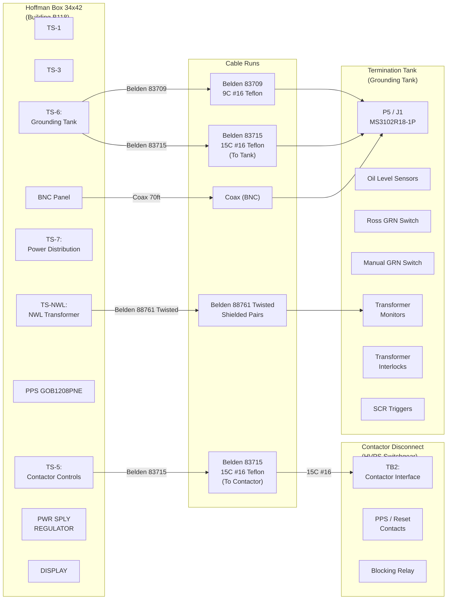

# WD-730-790-01-C3 — Full Interconnection Wiring Diagram

> **Drawing**: `wd7307900103.pdf`
> **Title**: PEPII RF SYSTEMS — 2MW KLYSTRON PWR SPLY — INTERCONNECTION WIRING
> **Engineers**: R. Cassel (ENGR), W. Gorecki (DFTR) 03/02/2000, S. Lowe (CHKR)
> **CAD File**: 73079001.WD3, sheet 1 of 1
> **Scope**: B118 Hoffman Box ↔ Contactor Disconnect ↔ Termination Tank (complete)
>
> **Verification status: VERIFIED (3 September 2026)** — read directly from the scanned drawing rendered to image.

### Revision block (as drawn)

| Rev | Description | Dftr | Chkr | Engr appv | Date |
|---|---|---|---|---|---|
| C1 | REVISED FOR CORRECTNESS | WSG | JO | RC | 08/03 |
| C2 | REVISED FOR CORRECTNESS | WSG | JO | RC | 09/03 |
| C3 | REVISED FOR CORRECTNESS | WSG | JO | RC | 10/03 |

---

## ✅ Resolves: which auxiliary contact is the PPS readback

The **CONTACTOR DISCONNECT** panel on this drawing shows six auxiliary contact sets wired to TB2, each explicitly labelled with its function:

| Contact set | Label on drawing | TB2 terminals |
|---|---|---|
| **S6** | **TEMP** | 20, 21, 22 |
| **S5** | **CONTACTS PPS** | 14, 15, 16 |
| **S4** | **CLOSE READY** | W, HH, DD |
| **S3** | **CONTACTOR** | 8, 9, 10 |
| **S2** | **OVERCURRENT** | 5, 6, 7 |
| **S1** | **BLOCKING RELAY** | — |

Also drawn in this panel: **MX** (ON/OFF), **RR** (PPS) and **K-4** (RESET) relay coils.

> **S5 is labelled "CONTACTS PPS".** This corroborates the long-standing assumption that S5 carries the PPS contact readback.
>
> **Row alignment caveat.** On this sheet the contact-set labels sit beside their symbols, and the row alignment is not certain at the available scan resolution. Treat the specific terminal groups in the table above as provisional. The load-bearing evidence for the PPS readback path comes from three other drawings, which are unambiguous and mutually consistent:
>
> | Link | Drawing | Establishes |
> |---|---|---|
> | 1 | Ross 713203 E-1 | HQ3 aux set **S5** on **TB2-18 (NO) / 19 (COM) / 20 (NC)** |
> | 2 | ID-308-801-06-C1 | TB2-18/19/20 carry **wires 20 / 21 / 22** |
> | 3 | GP-439-704-02-C1 | Wires 20/21/22 = **"PPS (CONTACTOR)"** → **TB3-22/23/24** |
>
> See `Designs/tex/L_legacy_system_architecture.pdf` §13.2.1 for the full trace.

### Contactor Disconnect terminal strip layout (as drawn)

| # | Label | # | Label | # | Label |
|---|---|---|---|---|---|
| 1 | 120V | 13 | 7 | 25 | EMPTY |
| 2 | COM | 14 | 8 | 26 | HH |
| 3 | GND | 15 | 9 | 27 | W1 |
| 4 | XXX | 16 | 10 | 28 | CC1 |
| 5 | N | 17 | EE | 29 | II |
| 6 | XX | 18 | W | 30 | 20 |
| 7 | Y | 19 | DD | 31 | 21 |
| 8 | BB | 20 | 14 | 32 | 22 |
| 9 | CC | 21 | 15 | 33 | 23 |
| 10 | EE | 22 | 16 | 34 | 24 |
| 11 | 5 | 23 | EMPTY | | |
| 12 | 6 | 24 | EMPTY | | |

---

## Oil level sensors — there are three

| Sensor | Location on drawing |
|---|---|
| **LEV-1** | SCR TIGGERS [sic] HOFFMAN 12X10 enclosure |
| **LEV-2** | CROWBAR HOFFMAN 12X10 enclosure |
| **LEV-3** | TERMINATION TANK |

Each is a two-wire (RED / BLK, pins 1 and 2) sensor on Belden 88761 twisted shielded pair.

---

## Terminal strip signal lists (Hoffman Box 34×42, as drawn)

| Strip | Title on drawing | Signals shown |
|---|---|---|
| **TS-3** | PWR SUP MONITORS | DC Voltage 1P7, DC Voltage 2P8, XFMR ARC P6 (via BNC-2) |
| **TS-4** | TRANSFORMER INTERLOCKS | AC CURRENT, TEMPERATURE, SUDDEN PRESSURE, OIL LEVEL LOW |
| **TS-5** | CONTACTOR CONTROLS | COMMON, ON, PPS COM, PPS, RESET, AUX TRIP, CONTACTOR CLOSED, ENABLE, CONTACTOR READY, PPS |
| **TS-6** | GND TANK | Termination tank circuits (see WD-730-794-06-C0) |
| **TS-7** | TRANSFORMER MONITORS | 15 conductors to the NWL transformer monitor network |
| **TS-8** | PERMITS | 8 conductors |

> **TS-5 caution.** The signal *names* above are read directly off the drawing, but the drawing's labels sit between terminal rows, so individual terminal numbers are ambiguous at this scan resolution. J. Sebek's field trace in `pps/HoffmanBoxPPSWiring.docx` assigns TS-5 differently in places (e.g. he has terminal 7 as "Blocking" and 9 as "Overcurrent", where this drawing reads "AUX TRIP" and "CONTACTOR CLOSED"). **Prefer the field trace, and verify before rewiring.**

---

## Other items read from this drawing

| Item | Detail |
|---|---|
| Transformer | **NWL**, unit **NWL #39308**; TS-NWL terminals 1–46 |
| Transformer monitor network | R1–R47, each **500 Ω 25 W**; D1–D3 **100 V 20 A**; R2 5.1 Ω 50 W |
| PPS connector | Drawn as **GOB1208PNE** (J1 / P1), with PPS-S |
| PPS block title | "PERSONEL PROTECTION SYSTEM" — *misspelled on the drawing* |
| Crowbar enclosure connector | **P5, MS3102E18-1S** |
| SCR trigger / phase SCR connectors | **P1, P2 — MS3108E24-20S** |
| Klystron arc coax | BNC-1 (Hoffman) ↔ BNC1 (Termination Tank), **COAX RG-58**, both ends labelled KLYSTRON ARC |
| Thermocouples | **T20-1-509 THERMOCOUPLE** cable; TC-1 TOP OIL A / TOP OIL B, TC-2, TC-4 AIR TEMP; SLOT3 shown as **AB-1794-THERMC** |

---

## System Interconnection Overview


```mermaid
flowchart LR
    subgraph HOFFMAN["Hoffman Box 34x42<br/>(Building B118)"]
        TS1["TS-1"]
        TS3["TS-3"]
        TS5["TS-5:<br/>Contactor Controls"]
        TS6["TS-6:<br/>Grounding Tank"]
        TS7["TS-7:<br/>Power Distribution"]
        TSNWL["TS-NWL:<br/>NWL Transformer"]
        PPS_IN["PPS GOB1208PNE"]
        BNC_PANEL["BNC Panel"]
        PS_REG["PWR SPLY<br/>REGULATOR"]
        DISPLAY["DISPLAY"]
    end

    subgraph CABLES["Cable Runs"]
        CABLE_A["Belden 83715<br/>15C #16 Teflon<br/>(To Contactor)"]
        CABLE_B["Belden 83715<br/>15C #16 Teflon<br/>(To Tank)"]
        CABLE_C["Belden 83709<br/>9C #16 Teflon"]
        CABLE_D["Belden 88761 Twisted<br/>Shielded Pairs"]
        COAX["Coax (BNC)"]
    end

    subgraph CONTACTOR_DISC["Contactor Disconnect<br/>(HVPS Switchgear)"]
        TB2_CONT["TB2:<br/>Contactor Interface"]
        PPS_CONTACTS["PPS / Reset<br/>Contacts"]
        BLOCKING["Blocking Relay"]
    end

    subgraph TERM_TANK["Termination Tank<br/>(Grounding Tank)"]
        P5["P5 / J1<br/>MS3102R18-1P"]
        OIL_LEVEL["Oil Level Sensors"]
        ROSS_SW["Ross GRN Switch"]
        MANUAL_SW["Manual GRN Switch"]
        XFMR_MON["Transformer<br/>Monitors"]
        XFMR_INTLK["Transformer<br/>Interlocks"]
        SCR_TRIG["SCR Triggers"]
    end

    TS5 -->|"Belden 83715"| CABLE_A -->|"15C #16"| TB2_CONT
    TS6 -->|"Belden 83709"| CABLE_C --> P5
    TS6 -->|"Belden 83715"| CABLE_B --> P5
    TSNWL -->|"Belden 88761 Twisted"| CABLE_D --> XFMR_MON
    BNC_PANEL -->|"Coax 70ft"| COAX --> P5
```

---

## Hoffman Box to Contactor Disconnect — Detailed Wiring

### Cable: Belden 83715, 15 Conductor, #16 AWG, Teflon

```
┌─────────────────────────────────────────────────────────────────────────────┐
│  HOFFMAN BOX (TS-5)              Cable                CONTACTOR DISCONNECT  │
│  Contactor Controls              Belden 83715         TB2 Interface         │
├──────────┬──────────────────────┬──────────────┬──────────┬────────────────┤
│ TS-5 Pin │ Hoffman Function     │ Wire Color   │ TB2 Pin  │ Remote Func    │
├──────────┼──────────────────────┼──────────────┼──────────┼────────────────┤
│    1     │ DC Voltage           │              │ TB2-?    │ DC Voltage     │
│    2     │ DC Voltage           │              │ TB2-?    │ DC Voltage     │
│    3     │ Contactor Ready      │              │ TB2-?    │ Ready Status   │
│    4     │                      │              │ TB2-?    │                │
│    5     │ Contactor Closed     │              │ TB2-?    │ Closed Status  │
│    6     │                      │              │ TB2-?    │                │
│    7     │                      │              │          │                │
│    8     │ Reset Contacts       │ BLU          │ TB2-?    │ Reset          │
│    9     │ PPS Signal           │              │ TB2-?    │ PPS            │
│   10     │                      │              │          │                │
│   11     │ PPS COM              │              │ TB2-?    │ PPS COM        │
│   12     │ Close/Ready          │ RED/BLK      │ TB2-?    │ Close Ready    │
│   13     │ Common               │              │ TB2-?    │ Common         │
│   14     │ S5 NC (PPS Readback) │              │ S5-NC    │ Contactor NC   │
│   15     │ S5 COM (PPS Readback)│              │ S5-COM   │ Contactor COM  │
├──────────┼──────────────────────┼──────────────┼──────────┼────────────────┤
│   16     │ PPS-S (Contactor En) │              │ K4/MX    │ Contactor Enab │
│          │ ← Slot-5 OX8 OUT2   │              │          │                │
└──────────┴──────────────────────┴──────────────┴──────────┴────────────────┘
```

---

## Hoffman Box to Termination Tank — TS-6 Wiring

### Cable: Belden 83709, 9 Conductor, #16 AWG, Teflon + Belden 83715

```
┌─────────────────────────────────────────────────────────────────────────────┐
│  HOFFMAN BOX (TS-6)              Cable                TERMINATION TANK     │
│  Grounding Tank                  Belden 83709        P5/J1 Connector      │
├──────────┬──────────────────────┬──────────────┬──────────┬────────────────┤
│ TS-6 Pin │ Hoffman Function     │ Wire Color   │ Tank Pin │ Tank Function  │
├──────────┼──────────────────────┼──────────────┼──────────┼────────────────┤
│    1     │ Danfysik Out (+)     │              │ J2-A     │ Danfysik (+)   │
│    2     │ Danfysik Out (-)     │              │ J2-B     │ Danfysik (-)   │
│    3     │ Danfysik +V Supply   │              │ J2-C     │ +V Supply      │
│    4     │ Danfysik -V Supply   │              │ J2-D     │ -V Supply      │
│    5     │ Danfysik +15V        │              │ J2-E     │ +15V           │
│    6     │ Danfysik -15V        │ GRN-BLK      │ J2-F     │ -15V           │
│          │                      │ (SHIELD)     │          │                │
│    7     │ Oil Level 12VDC Src  │              │ P5-G     │ Oil NC (+)     │
│    8     │ Oil Level → S6 IN8   │              │ P5-H     │ Oil NC COM     │
│    9     │ Manual GRN SW        │ RED          │ P5-J     │ Man SW NO      │
│   10     │ Manual GRN SW COM    │              │ P5-K     │ Man SW COM     │
│          │ → Slot-6 IN9         │              │          │ (12VDC src)    │
│   11     │ Ross Aux COM         │ GRN/BLK      │ P5-L     │ Ross COM       │
│          │ → GOB Pin D          │              │          │                │
│   12     │ Ross Aux NC          │              │ P5-M     │ Ross NC        │
│          │ → GOB Pin C          │              │          │                │
│   13     │ Ross Coil (+)        │              │ P5-N     │ Ross Coil (+)  │
│          │ ← Slot-2 IO8 OUT3   │              │          │                │
│   14     │ Ross Coil (-)        │              │ P5-P     │ Ross Coil (-)  │
│          │ ← Slot-2 IO8 COM    │              │          │                │
│   15     │ SCR Oil Level        │              │ SCR Tank │ Oil NC         │
│   16     │ SCR Oil Level        │              │ SCR Tank │ Oil COM        │
│   17     │ Crowbar Oil Level    │              │ Crow Tank│ Oil NC         │
│   18     │ Crowbar Oil Level    │              │ Crow Tank│ Oil COM        │
│   19     │ Ross Aux NO          │ GRN/WHT      │ P5-R     │ Ross NO        │
│   20     │ Shunt (+)            │ BLU/WHT      │ P5-S     │ Shunt (+)      │
│   21     │ Shunt (-) / Earth    │ RED/BLK      │ P5-T     │ Shunt (-)      │
│          │                      │ (SHIELD)     │          │ Earth GRN Tank │
└──────────┴──────────────────────┴──────────────┴──────────┴────────────────┘
```

---

## NWL Transformer Connections

```
TS-NWL (Hoffman Box) ──→ NWL Transformer (#39308)
    │
    ├── Transformer Interlocks
    │   └── NC contacts for safety (door, oil, temperature)
    │
    ├── Transformer Monitors
    │   ├── Belden 88761 Twisted Shielded pairs
    │   ├── Temperature sensors
    │   └── Oil pressure/level
    │
    └── Cable: Belden 88761 Twisted Shielded
```

---

## Additional Interconnections

### Transformer Monitors and Interlocks

```
┌───────────────────────────────────────────────────────────┐
│  TRANSFORMER MONITORING                                    │
├──────────────┬───────────────────────────────────────────┤
│ Sudden       │ Pressure switch                            │
│ Pressure     │ NC contact → Hoffman Box                   │
├──────────────┼───────────────────────────────────────────┤
│ Oil Level    │ Level switch                               │
│ Low          │ NC contact → Hoffman Box                   │
├──────────────┼───────────────────────────────────────────┤
│ Temperature  │ Thermocouple                               │
│              │ → Slot-3 AB-1746-THERMC                    │
├──────────────┼───────────────────────────────────────────┤
│ Over Temp    │ Temperature switch                         │
│              │ NC contact → Hoffman Box                   │
└──────────────┴───────────────────────────────────────────┘
```

### SCR Tank Oil Levels

```
┌───────────────────────────────────────────────────────────┐
│  SCR OIL LEVEL MONITORING                                  │
├──────────────┬──────────┬────────────────────────────────┤
│ Sensor       │ TS-6 Pins│ PLC Input                      │
├──────────────┼──────────┼────────────────────────────────┤
│ SCR Phase    │ 15, 16   │ (via Slot-6 IB16)             │
│ Tank Oil     │          │                                │
├──────────────┼──────────┼────────────────────────────────┤
│ Crowbar      │ 17, 18   │ (via Slot-6 IB16)             │
│ Tank Oil     │          │                                │
└──────────────┴──────────┴────────────────────────────────┘
```

---

## Complete Signal Path Diagram


```mermaid
flowchart TB
    subgraph PPS_PATH["PPS Signal Path (Complete)"]
        PPS_EXT["PPS External<br/>Interface Chassis"] -->|"24VDC Enable"| GOB["GOB1208PNE<br/>Pins E-F, G-H"]
        GOB -->|"PPS 1"| SLOT6_14["Slot-6 IN14"]
        GOB -->|"PPS 2"| SLOT6_15["Slot-6 IN15"]
        GOB -->|"PPS 1 (hardware)"| OX8_IN["Slot-5 OX8<br/>Input Side"]
        
        SLOT6_14 --> PLC_LOGIC["PLC Logic<br/>Rungs 0014-0017"]
        SLOT6_15 --> PLC_LOGIC
        
        PLC_LOGIC -->|"Rung 0017"| OX8_OUT2["Slot-5 OX8 OUT2"]
        OX8_IN --> OX8_OUT2
        OX8_OUT2 -->|"via TS-5"| CABLE_TS5["Belden 83715<br/>to Contactor"]
        CABLE_TS5 --> K4_RELAY["K4 Relay<br/>(Switchgear)"]
        K4_RELAY --> MX_RELAY["MX Relay"]
        MX_RELAY --> L1_COIL["L1 Hold Coil"]
        L1_COIL --> VAC_CONT["Vacuum Contactor<br/>OPEN/CLOSED"]
        
        VAC_CONT -->|"S5 NC Aux"| TS5_RB["TS-5 Pins 14-15"]
        TS5_RB --> GOB_AB["GOB1208PNE<br/>Readback Pins A-B"]
        GOB_AB --> PPS_EXT
        
        PLC_LOGIC -->|"Rung 0016<br/>PPS1 AND PPS2"| IO8_OUT3["Slot-2 IO8 OUT3<br/>(120VAC)"]
        IO8_OUT3 -->|"via TS-6<br/>Pins 13-14"| CABLE_TS6["Belden 83709<br/>to Grnd Tank"]
        CABLE_TS6 --> ROSS_COIL["Ross GRN SW<br/>Coil"]
        ROSS_COIL --> ROSS_STATE["Ross Switch<br/>OPEN/CLOSED"]
        
        ROSS_STATE -->|"NC Aux Contact"| TS6_RB["TS-6 Pins 11-12"]
        TS6_RB --> GOB_CD["GOB1208PNE<br/>Readback Pins C-D"]
        GOB_CD --> PPS_EXT
    end
```

---

## Cable Specifications Summary

| Cable | Type | Conductors | AWG | Insulation | Route |
|-------|------|-----------|-----|------------|-------|
| Main Contactor | Belden 83715 | 15C | #16 | Teflon | Hoffman → Contactor Disconnect |
| Grounding Tank | Belden 83709 | 9C | #16 | Teflon | Hoffman → Termination Tank |
| Grounding Tank Aux | Belden 83715 | 15C | #16 | Teflon | Hoffman → Termination Tank |
| Transformer Monitor | Belden 88761 | Twisted Shielded | — | — | Hoffman → NWL Transformer |
| Arc Fault | Coaxial | 1 | — | — | Grounding Tank BNC → Hoffman BNC-1 |
| Thermocouple | BNC | 1 | — | — | Tank → Hoffman BNC-2 |

---

## Drawing Title Block

```
STANFORD LINEAR ACCELERATOR CENTER
U.S. DEPARTMENT OF ENERGY
STANFORD UNIVERSITY, STANFORD, CALIFORNIA

PEP-II RF SYSTEMS
2MW KLYSTRON PWR SPLY
INTERCONNECTION WIRING

Drawing: WD-730-790-01-C3
CAD File: 73079001.WD3
Sheet 1 of 1
```

