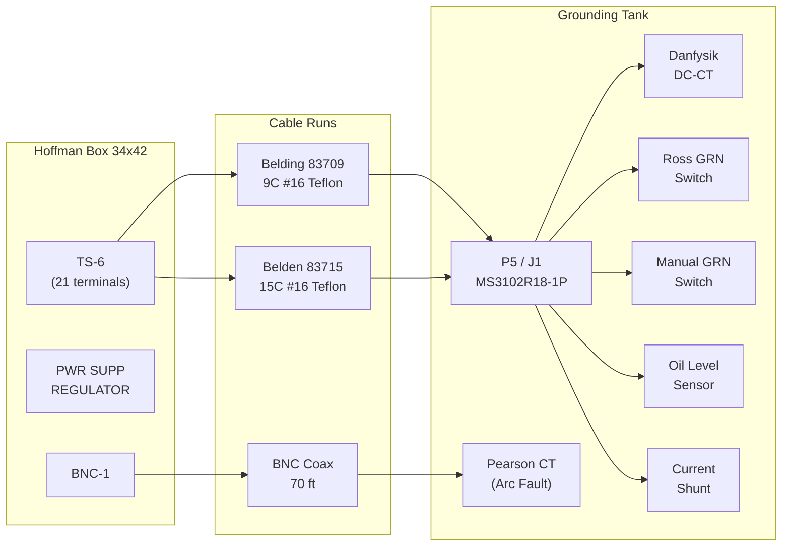
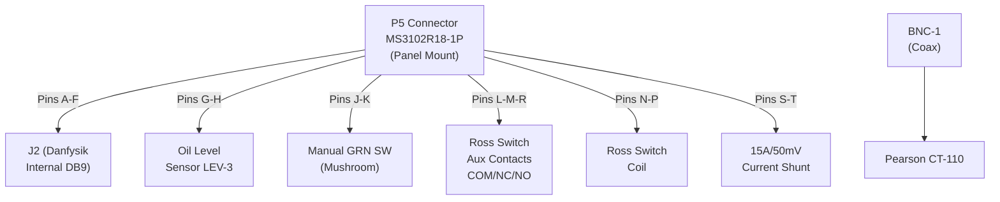

# WD-730-794-06-C0 — Interconnection: B118 Controller ↔ Termination Tank

> **Drawing**: `wd7307940600.pdf`
> **Title**: PEP-II 2MW Klystron — Test Stand Power Supply — Grounding Tank Wiring
> **Scope**: Detailed wiring between Hoffman Box TS-6 and Grounding Tank J1/P5

---

## Interconnection Overview



---

## Detailed Terminal-to-Pin Wiring Map

```
┌─────────────────────────────────────────────────────────────────────────────────┐
│                    TS-6 (HOFFMAN BOX) ←──→ GROUNDING TANK                       │
├──────────┬────────────────┬──────────────┬───────────┬──────────────────────────┤
│ TS-6 Pin │ Hoffman Func   │ Wire Color   │ Tank Conn │ Tank Function            │
╞══════════╪════════════════╪══════════════╪═══════════╪══════════════════════════╡
│          │                │              │           │ *** DANFYSIK DC-CT ***   │
│    1     │ Danfysik Out + │              │ J2-A      │ Analog Output (+)        │
│          │ → Slot-9 NI4   │              │           │ (10A/V)                  │
│          │   Input 3 (+)  │              │           │                          │
│          │ → PS Monitor BD│              │           │                          │
│    2     │ Danfysik Out - │              │ J2-B      │ Analog Output (-)        │
│          │ → Slot-9 NI4   │              │           │                          │
│          │   Input 3 (-)  │              │           │                          │
│    3     │ +V Supply      │              │ J2-C      │ Danfysik +V             │
│    4     │ -V Supply      │              │ J2-D      │ Danfysik -V             │
│    5     │ +15V (SOLA)    │              │ J2-E      │ Danfysik +15V           │
│    6     │ -15V (SOLA)    │ GRN-BLK      │ J2-F      │ Danfysik -15V           │
│          │                │ + SHIELD     │           │                          │
╞══════════╪════════════════╪══════════════╪═══════════╪══════════════════════════╡
│          │                │              │           │ *** OIL LEVEL ***        │
│    7     │ 12VDC Source   │              │ P5-G      │ Oil Level NC (+)         │
│    8     │ → Slot-6 IN8   │              │ P5-H      │ Oil Level NC COM         │
│          │                │              │           │ Oil OK=ON, Low=OFF       │
╞══════════╪════════════════╪══════════════╪═══════════╪══════════════════════════╡
│          │                │              │           │ *** MANUAL GRN SWITCH ** │
│    9     │ Man SW Status  │ RED          │ P5-J      │ Manual GRN SW NO/NC (⚠️)│
│          │ → Slot-6 IN9   │              │           │                          │
│   10     │ Man SW COM     │              │ P5-K      │ Manual GRN SW COM        │
│          │ 12VDC Source   │              │           │                          │
╞══════════╪════════════════╪══════════════╪═══════════╪══════════════════════════╡
│          │                │              │           │ *** ROSS GRN SWITCH ***  │
│   11     │ Ross Aux COM   │ GRN/BLK      │ P5-L      │ Ross Switch Aux COM      │
│          │ → GOB Pin D    │              │           │ (PPS Readback)           │
│   12     │ Ross Aux NC    │              │ P5-M      │ Ross Switch Aux NC       │
│          │ → GOB Pin C    │              │           │ (PPS Readback)           │
│   13     │ Ross Coil +    │              │ P5-N      │ Ross Coil (+)            │
│          │ ← Slot-2 OUT3  │              │           │ (Energize to open)       │
│   14     │ Ross Coil -    │              │ P5-P      │ Ross Coil (-)            │
│          │ ← Slot-2 COM   │              │           │                          │
╞══════════╪════════════════╪══════════════╪═══════════╪══════════════════════════╡
│          │                │              │           │ *** SCR OIL LEVELS ***   │
│   15     │ SCR Phase Oil  │              │ SCR Tank  │ Phase Tank Oil NC        │
│   16     │ SCR Phase Oil  │              │ SCR Tank  │ Phase Tank Oil COM       │
│   17     │ Crowbar Oil    │              │ Crow Tank │ Crowbar Tank Oil NC      │
│   18     │ Crowbar Oil    │              │ Crow Tank │ Crowbar Tank Oil COM     │
╞══════════╪════════════════╪══════════════╪═══════════╪══════════════════════════╡
│          │                │              │           │ *** ROSS AUX + SHUNT *** │
│   19     │ Ross Aux NO    │ GRN/WHT      │ P5-R      │ Ross Switch Aux NO       │
│   20     │ Shunt (+)      │ BLU/WHT      │ P5-S      │ Current Shunt (+)        │
│   21     │ Shunt (-)      │ RED/BLK      │ P5-T      │ Current Shunt (-)        │
│          │ SHUNT COM      │ + SHIELD     │           │ = Earth of GRN Tank      │
╞══════════╪════════════════╪══════════════╪═══════════╪══════════════════════════╡
│          │                │              │           │ *** ARC FAULT ***        │
│ BNC-1    │ Arc Fault In   │ Coax, 70 ft  │ BNC-1     │ Pearson CT-110 output    │
│          │ → Left Trigger │              │           │ (Not PPS, crowbar trig)  │
│          │   Interconnect │              │           │                          │
└──────────┴────────────────┴──────────────┴───────────┴──────────────────────────┘

⚠️  DOCUMENTATION INCONSISTENCY on Manual GRN Switch:
    WD-730-794-06-C0 shows this as NO contact
    SD-730-790-05-C1 shows this as NC contact
    FIELD VERIFICATION REQUIRED
```

---

## Wire Color Code Map

```
┌──────────────┬──────────────────────────┐
│ Wire Color   │ Signal / Destination     │
├──────────────┼──────────────────────────┤
│ RED          │ Manual GRN SW status     │
│ GRN-BLK     │ Danfysik -15V / Shield   │
│ GRN/BLK     │ Ross Aux COM             │
│ GRN/WHT     │ Ross Aux NO              │
│ BLU/WHT     │ Current Shunt (+)        │
│ RED/BLK     │ Current Shunt (-) /Shield│
│ SHIELD      │ Cable shield (ground)    │
└──────────────┴──────────────────────────┘
```

---

## Grounding Tank Internal Routing



---

## Signal Summary Table

| Signal | Source | TS-6 | Cable | Tank | Destination | PLC I/O |
|--------|--------|------|-------|------|-------------|---------|
| Danfysik Analog | Danfysik DC-CT | 1-2 | Belding 83709 | J2 A-B | Slot-9 NI4 IN3 + Monitor BD | Analog In |
| Danfysik Power | SOLA PS | 3-6 | Belding 83709 | J2 C-F | Danfysik supply | — |
| Oil Level | 12VDC / LEV-3 | 7-8 | Belding 83709 | P5 G-H | Slot-6 IB16 IN8 | Digital In |
| Manual SW Status | 12VDC / Man SW | 9-10 | Cable | P5 J-K | Slot-6 IB16 IN9 | Digital In |
| Ross PPS Readback | Ross Aux NC/COM | 11-12 | Cable | P5 L-M | GOB12-88PNE C-D | To PPS Chassis |
| Ross Coil Drive | Slot-2 IO8 OUT3 | 13-14 | Cable | P5 N-P | Ross coil | Digital Out |
| SCR Phase Oil | NC contact | 15-16 | Cable | SCR Tank | Slot-6 IB16 | Digital In |
| Crowbar Oil | NC contact | 17-18 | Cable | Crow Tank | Slot-6 IB16 | Digital In |
| Ross Aux NO | Ross Aux NO | 19 | Cable | P5 R | (monitoring) | — |
| Return Current | Shunt | 20-21 | Cable | P5 S-T | (monitoring) | Analog |
| Arc Fault | Pearson CT-110 | BNC-1 | Coax 70ft | BNC-1 | Left Trig Interconnect | — |

