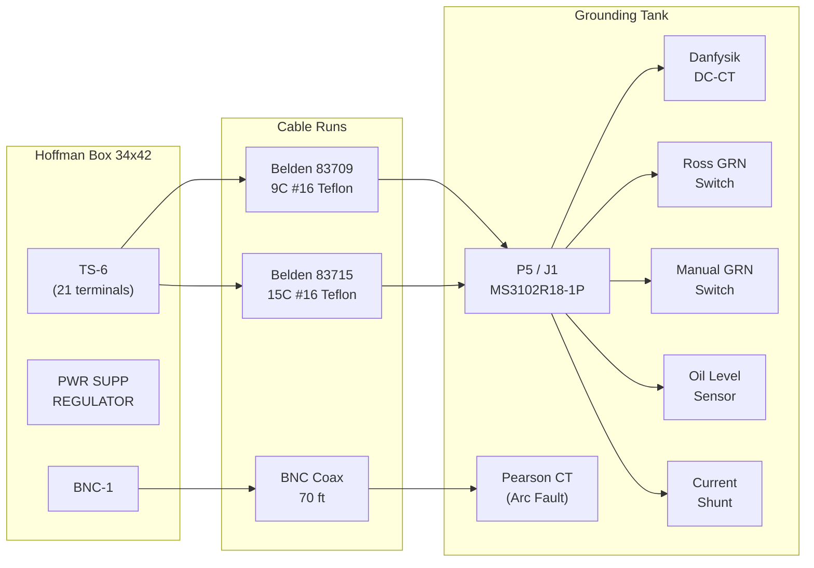

# WD-730-794-06-C0 — Interconnection: B118 Controller ↔ Grounding Tank

> **Drawing**: `wd7307940600.pdf`
> **Title**: PEPII 2MW KLYSTRON **TEST STAND** POWER SUPPLY — GROUNDING TANK WIRING
> **CAD file**: 73079406.WD0, sheet 1 of 1
> **Engineer**: R. Cassel · **Drafter**: W. Gorecki, 03/03/2000 · **Checker**: S. Lowe, 4/3/00
> **Revision block**: empty — original issue, no revisions recorded
> **Scope**: Wiring between the Hoffman Box (PWR SUPP REGULATOR, 34×42) terminal strip TS-6 and the Grounding Tank
>
> **Verification status: VERIFIED (3 September 2026)** — read directly from the scanned drawing rendered to image.

> ### ⚠ Provenance caveat
>
> The title block reads "**TEST STAND** POWER SUPPLY". This drawing documents the klystron **test stand** configuration, not necessarily the installed SPEAR3 system, and it carries **no revision entries** — so it has never been formally updated. Where it disagrees with J. Sebek's field trace in `pps/HoffmanBoxPPSWiring.docx`, prefer the field trace, and confirm before rewiring.
>
> One known consequence: this drawing wires the **NO** contact of the manual grounding switch (TS-6 label "NO MANUAL GRN SW"), whereas the Grounding Tank schematic SD-730-790-05-C1 shows SW1 with **both NC and NO** contacts available. Which one is actually landed at SPEAR3 is an open field-verification item.

---

## Interconnection Overview


```mermaid
flowchart LR
    subgraph HOFFMAN["Hoffman Box 34x42"]
        TS6["TS-6<br/>(21 terminals)"]
        PS_REG["PWR SUPP<br/>REGULATOR"]
        BNC1_H["BNC-1"]
    end

    subgraph CABLES["Cable Runs"]
        CABLE1["Belden 83709<br/>9C #16 Teflon"]
        CABLE2["Belden 83715<br/>15C #16 Teflon"]  
        COAX_70["BNC Coax<br/>70 ft"]
    end

    subgraph TANK["Grounding Tank"]
        P5["P5 / J1<br/>MS3102R18-1P"]
        DANFYSIK_C["Danfysik<br/>DC-CT"]
        ROSS_C["Ross GRN<br/>Switch"]
        MANUAL_C["Manual GRN<br/>Switch"]
        OIL_C["Oil Level<br/>Sensor"]
        SHUNT_C["Current<br/>Shunt"]
        CT_C["Pearson CT<br/>(Arc Fault)"]
    end

    TS6 --> CABLE1 --> P5
    TS6 --> CABLE2 --> P5
    BNC1_H --> COAX_70 --> CT_C
    P5 --> DANFYSIK_C & ROSS_C & MANUAL_C & OIL_C & SHUNT_C
```

---

## Detailed Terminal-to-Pin Wiring Map

```
┌─────────────────────────────────────────────────────────────────────────────────┐
│                    TS-6 (HOFFMAN BOX) ←──→ GROUNDING TANK                       │
├──────────┬────────────────┬──────────────┬───────────┬──────────────────────────┤
│ TS-6 Pin │ Hoffman Func   │ Wire Color   │ Tank Conn │ Tank Function            │
╞══════════╪════════════════╪══════════════╪═══════════╪══════════════════════════╡
│          │                │              │           │ *** DANFYSIK DC-CT ***   │
│    1     │ Danfysik Out + │              │ J2-A      │ Analog Output (+)        │
│          │ → Slot-9 NI4   │              │           │ (10A/V)                  │
│          │   Input 3 (+)  │              │           │                          │
│          │ → PS Monitor BD│              │           │                          │
│    2     │ Danfysik Out - │              │ J2-B      │ Analog Output (-)        │
│          │ → Slot-9 NI4   │              │           │                          │
│          │   Input 3 (-)  │              │           │                          │
│    3     │ +V Supply      │              │ J2-C      │ Danfysik +V             │
│    4     │ -V Supply      │              │ J2-D      │ Danfysik -V             │
│    5     │ +15V (SOLA)    │              │ J2-E      │ Danfysik +15V           │
│    6     │ -15V (SOLA)    │ GRN-BLK      │ J2-F      │ Danfysik -15V           │
│          │                │ + SHIELD     │           │                          │
╞══════════╪════════════════╪══════════════╪═══════════╪══════════════════════════╡
│          │                │              │           │ *** OIL LEVEL ***        │
│    7     │ 12VDC Source   │              │ P5-G      │ Oil Level NC (+)         │
│    8     │ → Slot-6 IN8   │              │ P5-H      │ Oil Level NC COM         │
│          │                │              │           │ Oil OK=ON, Low=OFF       │
╞══════════╪════════════════╪══════════════╪═══════════╪══════════════════════════╡
│          │                │              │           │ *** MANUAL GRN SWITCH ** │
│    9     │ Man SW Status  │ RED          │ P5-J      │ Manual GRN SW NO/NC (⚠️)│
│          │ → Slot-6 IN9   │              │           │                          │
│   10     │ Man SW COM     │              │ P5-K      │ Manual GRN SW COM        │
│          │ 12VDC Source   │              │           │                          │
╞══════════╪════════════════╪══════════════╪═══════════╪══════════════════════════╡
│          │                │              │           │ *** ROSS GRN SWITCH ***  │
│   11     │ Ross Aux COM   │ GRN/BLK      │ P5-L      │ Ross Switch Aux COM      │
│          │ → GOB Pin D    │              │           │ (PPS Readback)           │
│   12     │ Ross Aux NC    │              │ P5-M      │ Ross Switch Aux NC       │
│          │ → GOB Pin C    │              │           │ (PPS Readback)           │
│   13     │ Ross Coil +    │              │ P5-N      │ Ross Coil (+)            │
│          │ ← Slot-2 OUT3  │              │           │ (Energize to open)       │
│   14     │ Ross Coil -    │              │ P5-P      │ Ross Coil (-)            │
│          │ ← Slot-2 COM   │              │           │                          │
╞══════════╪════════════════╪══════════════╪═══════════╪══════════════════════════╡
│          │                │              │           │ *** SCR OIL LEVELS ***   │
│   15     │ SCR Phase Oil  │              │ SCR Tank  │ Phase Tank Oil NC        │
│   16     │ SCR Phase Oil  │              │ SCR Tank  │ Phase Tank Oil COM       │
│   17     │ Crowbar Oil    │              │ Crow Tank │ Crowbar Tank Oil NC      │
│   18     │ Crowbar Oil    │              │ Crow Tank │ Crowbar Tank Oil COM     │
╞══════════╪════════════════╪══════════════╪═══════════╪══════════════════════════╡
│          │                │              │           │ *** ROSS AUX + SHUNT *** │
│   19     │ Ross Aux NO    │ GRN/WHT      │ P5-R      │ Ross Switch Aux NO       │
│   20     │ Shunt (+)      │ BLU/WHT      │ P5-S      │ Current Shunt (+)        │
│   21     │ Shunt (-)      │ RED/BLK      │ P5-T      │ Current Shunt (-)        │
│          │ SHUNT COM      │ + SHIELD     │           │ = Earth of GRN Tank      │
╞══════════╪════════════════╪══════════════╪═══════════╪══════════════════════════╡
│          │                │              │           │ *** ARC FAULT ***        │
│ BNC-1    │ Arc Fault In   │ Coax, 70 ft  │ BNC-1     │ Pearson CT-110 output    │
│          │ → Left Trigger │              │           │ (Not PPS, crowbar trig)  │
│          │   Interconnect │              │           │                          │
└──────────┴────────────────┴──────────────┴───────────┴──────────────────────────┘

⚠️  DOCUMENTATION INCONSISTENCY on Manual GRN Switch:
    WD-730-794-06-C0 shows this as NO contact
    SD-730-790-05-C1 shows this as NC contact
    FIELD VERIFICATION REQUIRED
```

---

## Wire Color Code Map

```
┌──────────────┬──────────────────────────┐
│ Wire Color   │ Signal / Destination     │
├──────────────┼──────────────────────────┤
│ RED          │ Manual GRN SW status     │
│ GRN-BLK     │ Danfysik -15V / Shield   │
│ GRN/BLK     │ Ross Aux COM             │
│ GRN/WHT     │ Ross Aux NO              │
│ BLU/WHT     │ Current Shunt (+)        │
│ RED/BLK     │ Current Shunt (-) /Shield│
│ SHIELD      │ Cable shield (ground)    │
└──────────────┴──────────────────────────┘
```

---

## Grounding Tank Connectors — transcribed from the drawing

> **Verified 3 September 2026** by reading the scanned drawing directly.
>
> **Note**: the drawing shows **three physically separate cable runs**. P5 carries **only** the shunt and ground-switch circuits; the oil-level sensor and the Danfysik are on their own cables.

### Three cable runs, all 70 ft

| Cable | Type as drawn | From (Hoffman Box) | To (Grounding Tank) |
|---|---|---|---|
| 1 | TWISTED SHIELDED 8761 | TS-6 (upper) | **LEV-3 "OIL-LEVEL"**, pins 1 and 2 |
| 2 | BELDEN 83709 9C #16 TEF | TS-6 (middle) | **P5** — MS3102R18-1P |
| 3 | BELDEN 83709 9C #16 TEF | TS-6 (lower) | **J2 / CON9** |
| 4 | COAX RG-58 | BNC-1 "FAULT" | BNC1 "ARC FAULT" |

### P5 — MS3102R18-1P (shunt and ground switch only)

| Pin | Signal | Wire |
|---|---|---|
| A | SHUNT− | RED |
| B | SHUNT COM | WT |
| C | NO MANUAL GRN SW | BK |
| D | COM MANUAL GRN SW | WT-BLK |
| E | GRN RELAY COIL | GRN |
| F | GRN RELAY COIL | BLU |
| G | NC GRN RELAY | — |
| H | NC GRN RELAY | RED-BLK |
| I | NO GRN RELAY | GRN-BLK |
| J | COM GRN RELAY | ORG |

> This connector matches **J1 (MS3102R18-1P)** shown on the Grounding Tank schematic SD-730-790-05-C1.

### J2 / CON9 — Danfysik DC-CT

| Pin | Signal | Wire |
|---|---|---|
| 1 | NOT USED | RED-BLK |
| 2 | TEST | ORG |
| 3 | STATUS− | GRN-BLK |
| 4 | GRD | GRN |
| 5 | −15 V | BLU |
| 6 | OUTPUT | BK |
| 7 | NOT USED | WT-BLK |
| 8 | STATUS+ | WT |
| 9 | +15 V | RED |

### BNC coax run

**BNC1 "ARC FAULT"** at the tank is annotated **"10A/V PERSON CT TYPE 110"** — i.e. a Pearson model 110 current transformer at 10 A/V. It runs 70 ft of RG-58 to **BNC-1 "FAULT"** in the Hoffman Box.

---

## Signal Summary Table

| Signal | Source | TS-6 | Cable | Tank connector | Destination | PLC I/O |
|--------|--------|------|-------|------|-------------|---------|
| Danfysik output | Danfysik DC-CT | 1-2 | Belden 83709 | J2-6 / J2-4 | Slot-9 NI4 IN3 + Monitor Bd | Analog In |
| Danfysik supply ±15 V | SOLA PS | 3-4 | Belden 83709 | J2-9 / J2-5 | Danfysik supply | — |
| Danfysik status | Danfysik DC-CT | 5-6 | Belden 83709 | J2-8 / J2-3 | Status readback | — |
| Grounding tank oil level | LEV-3 | 7-8 | **Twisted shielded 8761** | **LEV-3 pins 1, 2** | Slot-6 IB16 IN8 | Digital In |
| Manual GRN SW | Manual (mushroom) switch | 9-10 | Belden 83709 | **P5-D (COM), P5-C (NO)** | Slot-6 IB16 IN9 | Digital In |
| Ground relay NC | Ross aux | 11-12 | Belden 83709 | **P5-G / P5-H** | GOB1208PNE C-D | To PPS chassis |
| Ross coil drive | Slot-2 IO8 OUT3 | 13-14 | Belden 83709 | **P5-E / P5-F** | Ross coil | Digital Out |
| Crowbar tank oil | NC contact | 15-16 | Cable | Crowbar tank | Slot-6 IB16 IN10 | Digital In |
| SCR tank oil | NC contact | 17-18 | Cable | SCR tank | Slot-6 IB16 IN11 | Digital In |
| Ground relay NO | Ross aux | 19 | Belden 83709 | **P5-I** | Slot-7 IV16 IN13 | Digital In |
| Return current shunt | 15 A / 50 mV shunt | 20-21 | Belden 83709 | **P5-A / P5-B** | BNC-12 | Analog |
| Arc fault | **Pearson CT type 110, 10 A/V** | BNC-1 | Coax RG-58, 70 ft | BNC1 | Left Trigger Interconnect Bd | — |

> TS-6 terminal numbers above follow J. Sebek's field trace in `pps/HoffmanBoxPPSWiring.docx`; the tank-side connector pins follow this drawing. The two agree on grouping but the drawing's TS-6 labels sit between terminal numbers in places, so individual odd/even assignments within a pair should be confirmed before rewiring.

