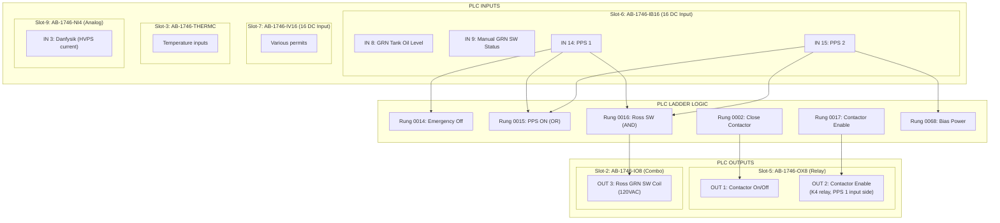

# PLC Code Logic — Allen-Bradley SLC-500 PPS Rungs

> **Source**: HoffmanBoxPPSWiring.docx analysis of PLC ladder logic
> **Controller**: Allen-Bradley SLC-500 (Slot-1: AB-1747-DCM scanner)
> **Processor**: AB-1747-L532

---

## PLC Rung Diagram — PPS-Related Rungs

### Rung 0014: Emergency Off Bits

```
     ┌──────────────────────────────────────────────┐
     │  RUNG 0014 — Set Emergency Off Bits          │
     │                                               │
     │  ──┤ I:6/14 ├──────────────── (SET B3:x)     │
     │     PPS 1                    Emergency Off    │
     │     Slot-6 IN14              Bit              │
     │                                               │
     │  Purpose: PPS 1 input sets emergency off      │
     │  status bits in the PLC data table            │
     └──────────────────────────────────────────────┘
```

### Rung 0015: PPS ON Status

```
     ┌──────────────────────────────────────────────┐
     │  RUNG 0015 — Set B3:1 for PPS ON             │
     │                                               │
     │       ┌── I:6/14 ──┐                         │
     │  ─────┤            ├────────── (SET B3:1)    │
     │       └── I:6/15 ──┘           PPS ON        │
     │           PPS 1                               │
     │           OR                                  │
     │           PPS 2                               │
     │                                               │
     │  Logic: PPS 1 (IN14) OR PPS 2 (IN15) → B3:1  │
     │  Either PPS input sets PPS ON status          │
     └──────────────────────────────────────────────┘
```

### Rung 0016: Ross Ground Switch Relay Coil

```
     ┌─────────────────────────────────────────────────────┐
     │  RUNG 0016 — Energize Ross Ground Switch Relay      │
     │                                                      │
     │  ──┤ I:6/14 ├──┤ I:6/15 ├──┤ others ├── (O:2/3)   │
     │     PPS 1       PPS 2       (permits)    Slot-2     │
     │     Slot-6      Slot-6                   IO8 OUT3   │
     │     IN14        IN15                     Ross Coil  │
     │                                          120 VAC    │
     │                                                      │
     │  Logic: PPS 1 AND PPS 2 AND (other permits)         │
     │         → Energize Ross Ground Switch Relay Coil    │
     │                                                      │
     │  ⚠️  SAFETY CONCERN:                                │
     │  If PLC fails, it could source 120VAC to the Ross   │
     │  coil without PPS command. The PLC is in the PPS    │
     │  safety chain for this function.                     │
     └─────────────────────────────────────────────────────┘
```

### Rung 0017: Contactor Enable (Labeled as "Crowbar On" — MISLABELED)

```
     ┌─────────────────────────────────────────────────────────┐
     │  RUNG 0017 — Contactor Enable                           │
     │  ⚠️ Drawing labels this as "Crowbar On" — INCORRECT    │
     │                                                          │
     │  ──┤ Touch Panel Enable ├──┤ Emergency Off Clear ├──    │
     │                                                          │
     │                                          (O:5/2)        │
     │                                          Slot-5         │
     │                                          OX8 OUT 2      │
     │                                          "Contactor     │
     │                                           Enable"       │
     │                                                          │
     │  Logic: Touch Panel Enable AND Emergency Off Clear      │
     │         → Activate OX8 OUT 2 relay                      │
     │                                                          │
     │  NOTE: OX8 OUT 2 relay contacts have:                   │
     │    Input side  = PPS 1 signal (24VDC from GOB connector)│
     │    Output side = Wire to K4 relay coil                  │
     │                                                          │
     │  FAIL-SAFE: Even if PLC closes this relay, K4 cannot   │
     │  be energized without PPS 1 24VDC present on input side │
     └─────────────────────────────────────────────────────────┘
```

### Rung 0002: Close Contactor

```
     ┌──────────────────────────────────────────────────────┐
     │  RUNG 0002 — Close Contactor                         │
     │                                                       │
     │  ──┤ Master Ready ├──────────── (O:5/1)              │
     │                                  Slot-5 OX8 OUT 1    │
     │                                  Close Contactor      │
     │                                                       │
     │  Logic: Master Ready → Contactor On/Off command       │
     │                                                       │
     │  NOTE: This may be Contactor On/Off vs Enable.        │
     │  Rung 0017 is the actual Contactor Enable that        │
     │  energizes K4 relay coil.                             │
     └──────────────────────────────────────────────────────┘
```

### Rung 0068: Bias Power Enable

```
     ┌──────────────────────────────────────────────────────┐
     │  RUNG 0068 — Bias Power (Kepko Power Supplies)       │
     │                                                       │
     │  ──┤ I:6/15 ├──┤ Touch Panel Key Enable ├──         │
     │     PPS 2                                             │
     │     Slot-6                                            │
     │     IN15                       (Enable Bias Power)    │
     │                                120 VAC to Kepko PS    │
     │                                                       │
     │  Logic: PPS 2 AND Touch Panel Key Enable              │
     │         → Enable bias power (120VAC to Kepko PS)      │
     └──────────────────────────────────────────────────────┘
```

---

## Complete PLC I/O Summary



---

## PPS Fault Scenarios

### Scenario 1: PPS 1 Removed (Pin E-F de-energized)

```
1. Slot-6 IN14 goes OFF
2. Rung 0014: Emergency Off bits SET
3. Rung 0015: B3:1 may stay ON if PPS 2 still present
4. Rung 0016: Ross SW condition FAILS (PPS1 AND PPS2)
   → IO8 OUT3 de-energizes → Ross coil de-energizes → Switch CLOSES (grounds)
5. OX8 OUT2 input side: 24VDC from PPS1 REMOVED
   → Even if PLC keeps OX8 relay closed, K4 CANNOT be energized
   → K4 de-energizes → MX de-energizes → L1 drops out → Contactor OPENS
6. S5 NC contact CLOSES → Readback A-B shows SAFE
7. Ross NC contact CLOSES → Readback C-D shows SAFE
```

### Scenario 2: PPS 2 Removed (Pin G-H de-energized)

```
1. Slot-6 IN15 goes OFF
2. Rung 0015: B3:1 may stay ON if PPS 1 still present
3. Rung 0016: Ross SW condition FAILS
   → Ross switch CLOSES (grounds)
4. Rung 0068: Bias power DISABLED
5. Contactor Enable (Rung 0017) may still be active
   BUT: OX8 OUT2 input is PPS 1 (still present)
   → K4 may remain energized if only PPS 2 is removed
   
⚠️  CONCERN: Removing only PPS 2 may not open the contactor!
    The contactor depends on PPS 1 (hardware path through OX8).
    PPS 2 only affects Ross Switch and Bias Power in the PLC code.
```

### Scenario 3: PLC Failure (Processor fault)

```
1. All PLC outputs go to default state (typically de-energized)
2. OX8 OUT2 relay OPENS → But input side still has PPS 1 24VDC
   → K4 de-energizes regardless (OX8 relay open = no path)
   → Contactor OPENS ✓

3. IO8 OUT3 relay OPENS → Ross coil de-energizes
   → Ross switch CLOSES (grounds) ✓

⚠️  ALTERNATE FAILURE MODE:
    If PLC fails with outputs STUCK ON:
    - OX8 OUT2 stuck closed + PPS1 present → K4 stays energized (BAD)
    - IO8 OUT3 stuck closed → Ross switch stays energized/open (BAD)
    This is a known concern documented in the analysis.
```

