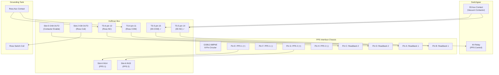

# Corrected Hand Drawing — PPS Interface Connections

> **Source**: Figure 1 from HoffmanBoxPPSWiring.docx (with corrections applied)
> **Original Error**: Pin A connected to TS-4 pin 14, Pin B to TS-4 pin 15
> **Correction**: Pin A should connect to TS-5 pin 15, Pin B to TS-5 pin 14

---

## Corrected PPS Interface Diagram

```
                    PPS INTERFACE CHASSIS
                    ┌─────────────────────┐
                    │  GOB12-88PNE        │
                    │  8-Pin Circular     │
                    │  (Burndy/Souriau)   │
                    │                     │
                    │  E ●────────────────┼──→ PPS 1 Enable (24VDC)
                    │  F ●────────────────┼──→ PPS 1 Return
                    │  G ●────────────────┼──→ PPS 2 Enable (24VDC)  
                    │  H ●────────────────┼──→ PPS 2 Return
                    │                     │
                    │  A ●←───────────────┼──← PPS Readback 1 (S5 COM)
                    │  B ●←───────────────┼──← PPS Readback 1 (S5 NC)
                    │  C ●←───────────────┼──← PPS Readback 2 (Ross NC)
                    │  D ●←───────────────┼──← PPS Readback 2 (Ross COM)
                    └─────────────────────┘
                              │
                              ▼
                    ┌─────────────────────┐
                    │   HOFFMAN BOX       │
                    │   (B118 Controller) │
                    │                     │
    PPS 1 ──────────┼──→ Slot-6 IN14     │
    PPS 2 ──────────┼──→ Slot-6 IN15     │
                    │                     │
                    │   PLC LOGIC:        │
                    │   Rung 0015: PPS ON │
                    │   Rung 0016: Ross   │
                    │   Rung 0017: K4 En  │
                    │                     │
    Slot-5 OUT2 ────┼──→ TS-5 pin 4      │ ──→ K4 Relay Coil
    (Contactor En)  │    (Contactor En)   │     (Switchgear)
                    │                     │
    Slot-2 OUT3 ────┼──→ TS-6 pin 13     │ ──→ Ross Switch Coil
    (Ross Coil)     │    (Ross Coil)      │     (Grounding Tank)
                    │                     │
    TS-5 pin 15 ────┼──← S5 COM ←────────┼──── Vacuum Contactor
    TS-5 pin 14 ────┼──← S5 NC  ←────────┼──── S5 Aux Contact
                    │                     │
    TS-6 pin 11 ────┼──← Ross COM ←──────┼──── Ross Switch
    TS-6 pin 12 ────┼──← Ross NC  ←──────┼──── Ross Aux Contact
                    └─────────────────────┘
```

---

## Corrected ASCII Wiring Table

```
┌─────────────────────────────────────────────────────────────────────────────┐
│                    CORRECTED PPS INTERFACE WIRING                           │
├──────────┬──────────────┬─────────────────┬──────────────────────────────────┤
│ GOB Pin  │ Wire Color   │ Hoffman Term    │ Function                         │
├──────────┼──────────────┼─────────────────┼──────────────────────────────────┤
│    E     │ Green        │ Slot-6 IN14     │ PPS 1 Enable (24VDC source)     │
│    F     │ Black        │ TS-5 pin 3      │ PPS 1 Return / PPS Common        │
│    G     │ Blue         │ Slot-6 IN15     │ PPS 2 Enable (24VDC source)     │
│    H     │ White        │ TS-8 pin 6      │ PPS 2 Return / Permits Common    │
├──────────┼──────────────┼─────────────────┼──────────────────────────────────┤
│    A     │ Red/Black    │ TS-5 pin 15 ✓   │ PPS Readback 1 (S5 COM)         │
│    B     │ Red          │ TS-5 pin 14 ✓   │ PPS Readback 1 (S5 NC)          │
│    C     │ Orange       │ TS-6 pin 12     │ PPS Readback 2 (Ross NC)        │
│    D     │ Green/Black  │ TS-6 pin 11     │ PPS Readback 2 (Ross COM)       │
└──────────┴──────────────┴─────────────────┴──────────────────────────────────┘

✓ CORRECTION APPLIED: Original hand drawing showed A→TS-4 pin 14, B→TS-4 pin 15
  Corrected to: A→TS-5 pin 15, B→TS-5 pin 14 (per docx analysis)
```

---

## PPS Signal Flow — Corrected



---

## Key Corrections Applied

1. **Hand Drawing Error Fixed**: 
   - **Original**: Pin A → TS-4 pin 14, Pin B → TS-4 pin 15
   - **Corrected**: Pin A → TS-5 pin 15, Pin B → TS-5 pin 14

2. **Verified Against Tables**: Cross-referenced with Tables 1-5 from docx analysis

3. **Confirmed Signal Paths**:
   - PPS 1 readback comes from S5 auxiliary contact on vacuum contactor
   - PPS 2 readback comes from Ross switch auxiliary contact
   - Both readbacks use NC (normally closed) contacts for fail-safe operation

4. **Hardware Fail-Safe Confirmed**: 
   - Slot-5 OX8 OUT2 relay input side uses PPS 1 signal (24VDC)
   - Even if PLC fails, K4 cannot be energized without PPS enable

---

## Original Hand Drawing Reference

The original hand drawing (Figure 1) from the docx document is available at:
[Hand Drawing PNG](https://github.com/fayaw/spearlegacyLLRF/blob/codegen-artifacts-store/pps-analysis/hand_drawing_figure1.png?raw=true)

**Note**: The original drawing contains the TS-4 error mentioned above. This corrected version reflects the actual wiring per the engineering analysis.

