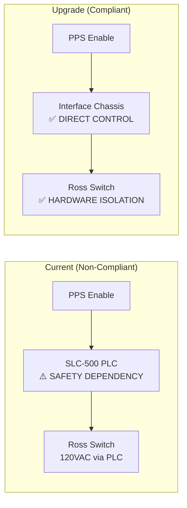

# SPEAR HVPS PPS Upgrade Implementation Plan

> **Source**: Design documents + Jim Sebek's upgrade requirements + legacy system analysis
> **Purpose**: Detailed implementation roadmap for PPS system upgrade
> **Focus**: Addressing PPS compliance issues and hardware obsolescence

---

## Executive Summary

The SPEAR HVPS PPS upgrade addresses critical safety compliance issues identified in Jim Sebek's 2022 analysis while modernizing obsolete hardware. The upgrade eliminates PLC dependency in the PPS safety chain and provides proper isolation through a new Interface Chassis.

---

## Critical Issues Being Addressed

### 1. PPS Compliance Issues (High Priority)

**Current Problem**: 
- Ross relay command flows through Allen-Bradley SLC-500 PLC
- PLC becomes part of PPS safety chain (less fail-safe than direct control)
- Doesn't meet current PPS standards

**Upgrade Solution**:


### 2. PPS Wiring Exposure (Medium Priority)

**Current Problem**:
- PPS wires pass through HVPS controller (Hoffman Box)
- Wires terminate on TS-5 and TS-6 terminal strips
- Exposed PPS wiring inside other electrical boxes
- May require radiation safety work control form when opening controller

**Upgrade Solution**:
- New Interface Chassis provides isolated PPS interface
- No PPS wiring inside HVPS controller
- Optocoupler and fiber-optic isolation for all signals

### 3. Hardware Obsolescence (Medium Priority)

**Current Problem**:
- SLC-500 PLC platform (obsolete)
- 1746-HSTP1 stepper controller (obsolete)
- SS2000MD4-M stepper drivers (obsolete)
- VXI-based LLRF system (obsolete)

**Upgrade Solution**:
- CompactLogix PLC platform (modern, supported)
- Modern 4-axis motion controller (TBD: Galil DMC-4143 or alternatives)
- LLRF9 controllers (modern, purpose-built for accelerators)

---

## Upgrade Architecture Overview

### New Interface Chassis (Critical Component)

```
┌─────────────────────────────────────────────────────────────────┐
│                    INTERFACE CHASSIS                            │
│  First-Fault Detection | Fault Latching | Optocoupler Isolation │
├─────────────────────────────────────────────────────────────────┤
│                                                                 │
│  INPUTS (Optocoupler Isolated):                                │
│  • LLRF9 Status (5V from LLRF9)                               │
│  • HVPS Status (fiber-optic from HVPS)                        │
│  • SPEAR MPS Permit (24V from SPEAR)                          │
│  • Orbit Interlock (24V from orbit system)                    │
│  • Arc Detection (dry contacts from Microstep-MIS)            │
│  • Expansion Ports (TTL/24V for future use)                   │
│                                                                 │
│  OUTPUTS (Isolated):                                           │
│  • LLRF9 Enable (3.2V @ 8mA to LLRF9)                        │
│  • HVPS SCR ENABLE (fiber-optic to HVPS)                      │
│  • HVPS KLYSTRON CROWBAR (fiber-optic to HVPS)               │
│  • Digital Status Lines (to RF MPS PLC)                       │
│                                                                 │
│  FEATURES:                                                      │
│  • Hardware first-fault register (<1 μs response)             │
│  • Fault latching with external reset capability              │
│  • Complete electrical isolation between PPS and HVPS         │
└─────────────────────────────────────────────────────────────────┘
```

### Signal Flow — Upgrade vs. Current

**Current Legacy Flow (Non-Compliant)**:
```
PPS Enable → SLC-500 PLC → PLC Logic → Ross Switch
                ↑
        ⚠️ PLC DEPENDENCY
```

**Upgrade Flow (Compliant)**:
```
PPS Enable → Interface Chassis → Direct Hardware Control → Ross Switch
                     ↑
            ✅ NO PLC DEPENDENCY
```

---

## Implementation Phases

### Phase 1: Interface Chassis Development (Critical Path)

**Deliverables**:
- Interface Chassis hardware design
- PCB design and fabrication
- Optocoupler isolation circuits (ACSL-6xx0 family)
- Fiber-optic drivers (HFBR-2412/1412)
- First-fault detection logic
- Hardware testing and validation

**Timeline**: 6-9 months (critical path item)

**Dependencies**: 
- Final PPS interface specifications
- HVPS fiber-optic interface design
- MPS integration requirements

### Phase 2: HVPS Controller Upgrade

**Deliverables**:
- CompactLogix PLC hardware installation
- SLC-500 code reverse-engineering
- CompactLogix code development and testing
- HVPS voltage regulation loop migration
- Contactor sequencing logic
- Over-current protection implementation
- Fiber-optic interface implementation

**Timeline**: 4-6 months (parallel with Phase 1)

**Dependencies**:
- Interface Chassis specifications
- CompactLogix hardware procurement

### Phase 3: LLRF9 Integration

**Deliverables**:
- LLRF9 Unit #1 configuration (Field Control + Tuner)
- LLRF9 Unit #2 configuration (Monitor + Interlock)
- EPICS IOC integration
- RF channel mapping and calibration
- Interlock system integration
- Performance validation

**Timeline**: 3-4 months

**Dependencies**:
- Interface Chassis completion
- HVPS controller upgrade completion

### Phase 4: Motion Control System

**Deliverables**:
- Motion controller selection and procurement
- 4-axis stepper motor integration
- EPICS motor record interface
- Tuner control algorithm implementation
- Position feedback integration
- Safety limit implementation

**Timeline**: 3-4 months

**Dependencies**:
- Motion controller selection decision
- LLRF9 integration completion

### Phase 5: Waveform Buffer System

**Deliverables**:
- 8 RF channel monitoring system
- 4 HVPS channel monitoring system
- Hardware trip capability
- Klystron collector power protection
- Waveform capture and storage
- EPICS interface

**Timeline**: 4-5 months

**Dependencies**:
- RF signal conditioning design
- HVPS signal interface design

### Phase 6: Python/EPICS Coordinator

**Deliverables**:
- Station state machine implementation
- HVPS supervisory control loop
- Tuner supervisory control
- Fault management and diagnostics
- EPICS process variable architecture
- Operator interface (EDM panels)

**Timeline**: 3-4 months

**Dependencies**:
- All hardware subsystems operational
- EPICS IOC integration complete

### Phase 7: System Integration & Testing

**Deliverables**:
- Complete system integration
- Comprehensive testing without beam
- Performance validation
- Safety system validation
- Documentation completion
- Operator training

**Timeline**: 2-3 months

**Dependencies**:
- All subsystems complete
- Test procedures developed

### Phase 8: Commissioning & Cutover

**Deliverables**:
- Parallel operation with legacy system
- Gradual cutover procedures
- Performance verification with beam
- Legacy system decommissioning
- Final documentation

**Timeline**: 1-2 months

**Dependencies**:
- System integration complete
- Beam time availability

---

## Critical Design Decisions Required

### 1. Motion Controller Selection **[TBD]**

| Option | Pros | Cons | Recommendation |
|--------|------|------|----------------|
| **Galil DMC-4143** | Industry standard, robust EPICS driver | Cost, may be over-specified | ✅ **Recommended** |
| Domenico/Dunning design | Custom for accelerators | Previous reliability issues | ⚠️ Evaluate carefully |
| Danh's design | Custom for this application | Needs evaluation | ⚠️ Requires assessment |
| MDrive Plus | Integrated motor/driver | Less common at SLAC | ⚠️ Consider as backup |

### 2. Interface Chassis Implementation **[CRITICAL]**

**Key Requirements**:
- Hardware first-fault detection (<1 μs)
- Complete electrical isolation (optocouplers + fiber-optic)
- Fault latching with external reset
- Integration with existing MPS

**Design Considerations**:
- PCB layout for noise immunity
- Thermal management for reliability
- Mechanical packaging for rack mounting
- Test points for troubleshooting

### 3. PPS Interface Standards Compliance **[CRITICAL]**

**Requirements**:
- Direct hardware control (no PLC dependency)
- Proper isolation between PPS and controlled systems
- First-fault detection and reporting
- Fail-safe operation on power loss

**Validation**:
- Review with SSRL protections managers (Matt Cyterski, Tracy Yott)
- Compliance verification before implementation
- Documentation of safety analysis

---

## Risk Assessment & Mitigation

### High Risk Items

1. **Interface Chassis Development Delay**
   - **Risk**: Critical path item, complex design
   - **Mitigation**: Early start, experienced PCB designer, prototype testing

2. **PPS Compliance Approval**
   - **Risk**: Design may not meet current standards
   - **Mitigation**: Early review with protections managers, iterative design

3. **Legacy System Documentation Gaps**
   - **Risk**: Incomplete understanding of current system
   - **Mitigation**: Field verification with electricians, comprehensive testing

### Medium Risk Items

1. **Motion Controller Integration**
   - **Risk**: EPICS driver compatibility, performance issues
   - **Mitigation**: Prototype testing, vendor support, backup options

2. **LLRF9 Learning Curve**
   - **Risk**: New technology, limited local experience
   - **Mitigation**: Vendor training, documentation, gradual implementation

3. **System Integration Complexity**
   - **Risk**: Multiple subsystems, timing dependencies
   - **Mitigation**: Phased approach, comprehensive testing, parallel development

### Low Risk Items

1. **CompactLogix PLC Migration**
   - **Risk**: Code conversion issues
   - **Mitigation**: Rockwell conversion tools, experienced programmers

2. **Waveform Buffer System**
   - **Risk**: Custom design complexity
   - **Mitigation**: Proven design patterns, modular approach

---

## Success Criteria

### Technical Success Criteria

1. **PPS Compliance**: System meets current PPS standards with direct hardware control
2. **Performance**: Maintains or improves RF system performance
3. **Reliability**: Reduces unplanned downtime compared to legacy system
4. **Maintainability**: Improved documentation and modern hardware support

### Operational Success Criteria

1. **Operator Acceptance**: Smooth transition with minimal retraining
2. **Maintenance Efficiency**: Reduced maintenance time and complexity
3. **Fault Diagnosis**: Improved fault detection and diagnosis capabilities
4. **Documentation Quality**: Complete, accurate technical documentation

### Project Success Criteria

1. **Schedule**: Complete within planned timeline
2. **Budget**: Stay within allocated budget
3. **Safety**: No safety incidents during implementation
4. **Knowledge Transfer**: Successful training of operations and maintenance staff

---

## Resource Requirements

### Engineering Resources
- **Lead Engineer**: Project management and system integration
- **Controls Engineer**: PLC programming and EPICS development
- **RF Engineer**: LLRF9 configuration and RF system integration
- **PCB Designer**: Interface Chassis and Waveform Buffer design
- **Software Developer**: Python/EPICS coordinator development

### Support Resources
- **Electricians**: Installation and field verification
- **Technicians**: Testing and commissioning support
- **Documentation Specialist**: Technical documentation and procedures
- **Training Coordinator**: Operator and maintenance training

### Equipment & Materials
- Interface Chassis components and fabrication
- CompactLogix PLC hardware
- Motion controller and associated hardware
- Waveform Buffer system components
- Test equipment and tools

---

## Conclusion

The SPEAR HVPS PPS upgrade addresses critical safety compliance issues while modernizing obsolete hardware. The key to success is the Interface Chassis development, which provides the necessary isolation and direct hardware control to meet current PPS standards. The phased implementation approach allows for parallel development and reduces risk while maintaining system availability.

