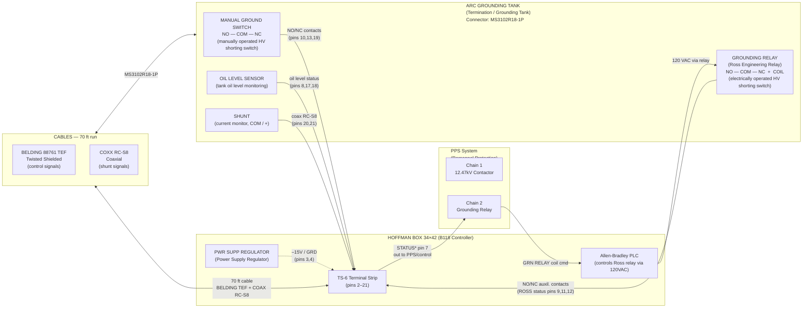

# WD-730-794-06-CO — B118 ↔ Arc Grounding Tank Interconnection

**Title:** PEPII 2MW Klystron Test Stand Power Supply Grounding Tank Wiring  
**CAD File:** 73079406.WDO  
**Drawing No.:** WD-730-794-06-CO  
**Date:** 03/03/2000  
**Organization:** SLAC / Stanford Linear Accelerator Center — U.S. Dept. of Energy  
**Sheet:** 1 of 1

---

## System Block Diagram (Mermaid)



---

## Pin-by-Pin Wiring Interconnection (ASCII)

```
  HOFFMAN BOX 34×42                  CABLES (70 ft)                    ARC GROUNDING TANK
  B118 Controller                                                       Connector MS3102R18-1P
  Terminal Strip TS-6                                              ┌──────────────────────────────┐
  (PWR SUPP REGULATOR inside)                                      │  MANUAL GROUND SWITCH (MGS)  │
                                                                   │  NO ──── COM ──── NC         │
 ┌────────────────────────┐                                        │                              │
 │ Pin  Signal Name       │                                        │  GROUNDING RELAY (Ross)      │
 │ ─── ─────────────────  │  BELDING 88761 TEF Twisted Shielded   │  COIL ── NO ── COM ── NC     │
 │  2   OUT PCT           ├──────────────────────────────────────►│  (Electrically operated HV   │
 │  3   GRD               ├──────────────────────────────────────►│   shorting switch)            │
 │  4   –15V              ├──────────────────────────────────────►│                              │
 │  5   (NOT USED)        │                                        │  OIL LEVEL SENSOR            │
 │  6   TEST              ├──────────────────────────────────────►│  (tank oil level monitoring) │
 │  7   STATUS*           ◄──────────────────────────────────────┤│                              │
 │  8   GRN TANK OIL LVL  ◄──────────────────────────────────────┤│  SHUNT (current monitor)     │
 │      STATUS            │                                        │  COM ── +                    │
 │  9   NO GRN RELAY      ◄──────────────────────────────────────┤│                              │
 │ 10   NC MANUAL GRN SW  ◄──────────────────────────────────────┤└──────────────────────────────┘
 │ 11   COM GRN RELAY     ◄──────────────────────────────────────┤
 │ 12   NC GRN RELAY      ◄──────────────────────────────────────┤  GRN RELAY contacts:
 │ 13   COM GRN SW        ◄──────────────────────────────────────┤   pin  9 = NO  (normally open)
 │ 14   (NOT USED)        │                                        │   pin 11 = COM (common)
 │ 15   GRN RELAY COIL +  ├──────────────────────────────────────►│   pin 12 = NC  (normally closed)
 │ 16   GRN RELAY COIL –  ├──────────────────────────────────────►│   pins 15,16 = COIL
 │ 17   CROWBAR OIL LEVEL ◄──────────────────────────────────────┤
 │ 18   SCR OIL LEVEL     ◄──────────────────────────────────────┤  MANUAL GRN SW contacts:
 │ 19   NO MANUAL GRN SW  ◄──────────────────────────────────────┤   pin 10 = NC  (normally closed)
 │      (SHIELD)          ├──────────────────────────────────────►│   pin 13 = COM (common)
 │                        │  COXX RC-S8 Coaxial (shunt signals)   │   pin 19 = NO  (normally open)
 │ 20   SHUNT +           ├══════════════════════════════════════►│
 │ 21   SHUNT COM         ├══════════════════════════════════════►│  Wire colors on cable:
 │      SHIELD            ├──────────────────────────────────────►│   GRN, RED-BLK, GRN-BLK,
 └────────────────────────┘                                        │   ORG, VT, WT-BLK, BLU,
        │                                                               VT-BLK, RED, SHIELD
        │ Allen-Bradley PLC (inside Hoffman Box)
        │  PPS Chain 2 cmd ──► PLC ──► 120VAC relay ──────────────► GRN RELAY COIL (pins 15,16)
        │  STATUS* (pin 7)  ◄──────────────────────────────────────  tank status back to PPS

 LEGEND:
  ────►  Twisted shielded signal wire (BELDING TEF)
  ════►  Coaxial cable (RC-S8)
  NO   = Normally Open contact
  NC   = Normally Closed contact
  COM  = Common
  GRN RELAY = Grounding Relay = Ross Engineering HV Shorting Switch
  MGS  = Manual Ground Switch (mechanically operated HV short)
  SHUNT = current measurement shunt at HV output
  OUT PCT = Output Percent (control signal to power supply regulator)
```

---

## Signal Table

| TS-6 Pin | Signal Name         | Direction      | Connected To (Tank)             | Purpose                                      |
|----------|---------------------|----------------|---------------------------------|----------------------------------------------|
| 2        | OUT PCT             | B118 → Tank    | PS Regulator input              | Output percent control to power supply       |
| 3        | GRD                 | B118 → Tank    | Ground                          | Ground reference                             |
| 4        | –15V                | B118 → Tank    | Power rail                      | –15V supply to instrumentation               |
| 5        | (NOT USED)          | —              | —                               | Spare                                        |
| 6        | TEST                | B118 → Tank    | Test point                      | Test signal injection                        |
| 7        | STATUS*             | Tank → B118    | PPS / control system            | Grounding relay / tank aggregate status      |
| 8        | GRN TANK OIL LEVEL  | Tank → B118    | OIL LEVEL sensor                | Grounding tank oil level status              |
| 9        | NO GRN RELAY        | Tank → B118    | Ross relay NO contact           | Grounding relay — Normally Open aux. contact |
| 10       | NC MANUAL GRN SW    | Tank → B118    | Manual switch NC contact        | Manual ground switch — NC contact            |
| 11       | COM GRN RELAY       | Tank → B118    | Ross relay COM contact          | Grounding relay — Common                     |
| 12       | NC GRN RELAY        | Tank → B118    | Ross relay NC contact           | Grounding relay — Normally Closed contact    |
| 13       | COM GRN SW          | Tank → B118    | Manual switch COM contact       | Manual ground switch — Common                |
| 14       | (NOT USED)          | —              | —                               | Spare                                        |
| 15       | GRN RELAY COIL +    | B118 → Tank    | Ross relay coil (+)             | Coil drive positive (from PLC relay)         |
| 16       | GRN RELAY COIL –    | B118 → Tank    | Ross relay coil (–)             | Coil drive negative (return)                 |
| 17       | CROWBAR OIL LEVEL   | Tank → B118    | Crowbar section OIL LEVEL       | Crowbar tank oil level alarm                 |
| 18       | SCR OIL LEVEL       | Tank → B118    | SCR section OIL LEVEL           | SCR power supply oil level alarm             |
| 19       | NO MANUAL GRN SW    | Tank → B118    | Manual switch NO contact        | Manual ground switch — NO contact            |
| SHIELD   | Cable shield        | Both           | Shield drain                    | EMI shield for twisted-pair cable            |
| 20       | SHUNT +             | Tank → B118    | Current shunt + (via coax)      | HV output current measurement (coax RC-S8)  |
| 21       | SHUNT COM           | Tank → B118    | Current shunt COM (via coax)    | HV output current measurement return        |

---

## Cable / Hardware Details

| Item | Part / Spec | Notes |
|------|------------|-------|
| Control cable | BELDING 88761 TEF, Twisted Shielded | 70 ft run, B118 ↔ Grounding Tank |
| Coaxial cable | COXX RC-S8 | 70 ft run, shunt signal (pins 20, 21) |
| Tank connector | MS3102R18-1P | Military-spec circular connector on Grounding Tank |
| Controller enclosure | Hoffman Box 34×42 | Located in B118 |
| Grounding relay | Ross Engineering relay | Electrically operated HV shorting switch |
| OCR source | Windows OCR on wd7307940600.pdf | Extracted 03/03/2026 |
